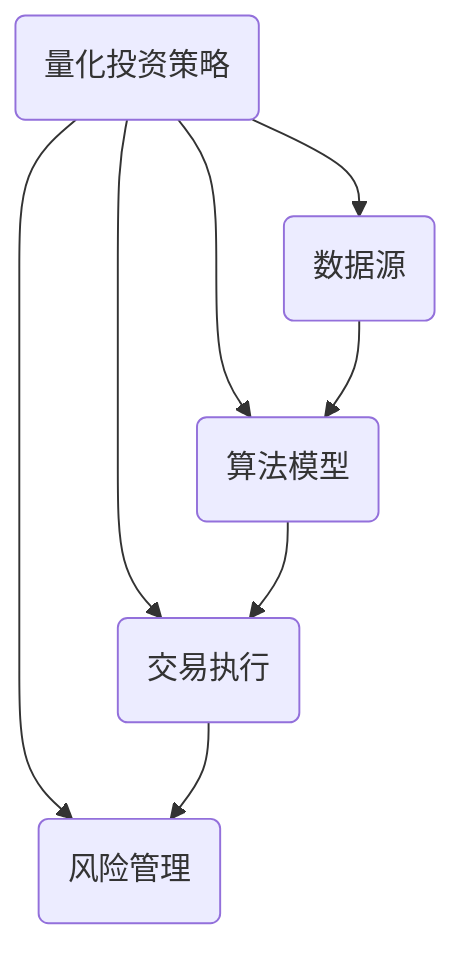
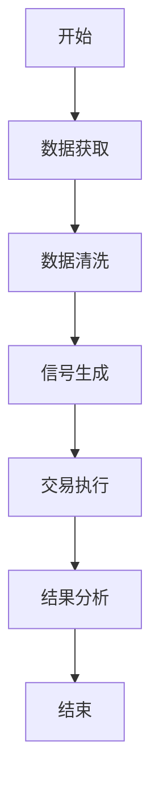
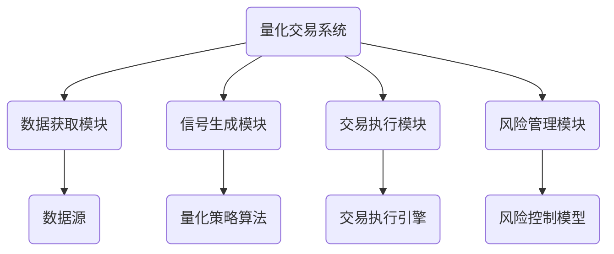
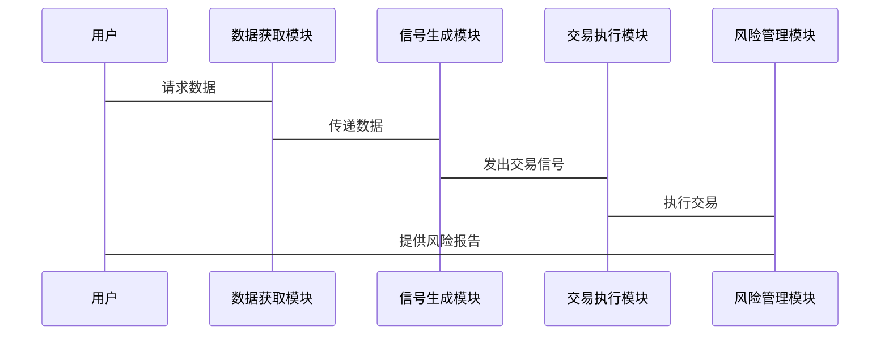

                 


# 量化投资策略在高波动市场中的表现

> 关键词：量化投资，高波动市场，算法交易，风险管理，投资策略

> 摘要：量化投资策略是一种基于数学模型和算法的交易方式，能够在高波动市场中捕捉短期价格波动，获取超额收益。本文从量化投资策略的背景与基础、核心概念与联系、算法原理、系统分析与架构设计、项目实战等多个维度展开讨论，深入分析量化投资策略在高波动市场中的表现，揭示其优势与挑战。

---

# 第1章: 量化投资策略的背景与基础

## 1.1 量化投资的定义与特点

### 1.1.1 量化投资的定义

量化投资是一种基于数学模型和算法的交易方式，通过分析市场数据和统计套利机会，制定交易策略。其核心在于利用计算机技术快速分析市场信息并执行交易，具有高度的系统性和自动化。

### 1.1.2 量化投资的核心特点

- **数据驱动**：量化投资依赖于大量的历史数据和实时数据，通过统计分析和建模来寻找投资机会。
- **算法交易**：量化投资策略基于算法自动执行交易，减少了人为情绪对决策的干扰。
- **高频交易**：量化策略通常基于短期价格波动，交易频率高，能够在短时间内完成多次交易。
- **风险可控**：通过严格的风险管理模型，量化投资能够有效控制投资组合的波动性和潜在损失。

### 1.1.3 量化投资与传统投资的区别

| 方面       | 量化投资                | 传统投资                |
|------------|-------------------------|-------------------------|
| 决策依据   | 数据驱动、算法模型      | 人为判断、经验分析      |
| 交易频率   | 高频交易                | 低频交易                |
| 风险管理   | 严格量化模型            | 主观判断                |
| 交易时机   | 短期价格波动            | 长期价值判断            |

## 1.2 高波动市场的定义与特征

### 1.2.1 高波动市场的定义

高波动市场是指市场价格波动剧烈、走势难以预测的市场环境。这种市场通常表现出剧烈的价格波动、较高的交易量和较低的市场流动性。

### 1.2.2 高波动市场的特征

- **价格波动剧烈**：短时间内价格可能出现大幅上涨或下跌。
- **市场流动性不稳定**：高波动市场中，某些资产的流动性可能突然下降，导致交易难度增加。
- **市场参与者情绪化**：高波动市场容易受到市场情绪的影响，投资者决策往往基于短期情绪而非理性分析。
- **短期交易机会多**：高波动市场中，短期价格波动为量化投资策略提供了较多的交易机会。

### 1.2.3 高波动市场对投资策略的影响

高波动市场对投资策略的影响是双刃剑。一方面，高波动市场为量化策略提供了更多的交易机会；另一方面，高波动市场也增加了交易的风险，要求策略具有更强的适应性和稳定性。

## 1.3 量化投资在高波动市场中的重要性

### 1.3.1 高波动市场中的投资机会

高波动市场中，价格波动频繁，量化策略能够快速捕捉短期价格波动，获取超额收益。

### 1.3.2 量化投资的优势

量化投资在高波动市场中的优势体现在以下几个方面：

- **快速反应能力**：量化策略能够快速分析市场数据并执行交易，能够在市场波动中及时捕捉机会。
- **风险管理能力**：量化投资通过严格的数学模型进行风险控制，能够在高波动市场中有效降低投资组合的波动性。
- **自动化交易**：量化策略能够自动执行交易，减少了人为情绪对决策的影响。

### 1.3.3 量化投资在高波动市场中的应用前景

随着技术的进步和市场环境的变化，量化投资在高波动市场中的应用前景广阔。通过不断优化算法和模型，量化投资能够在高波动市场中实现更高的收益和更低的风险。

## 1.4 本章小结

本章主要介绍了量化投资的定义、特点和高波动市场的定义与特征。通过对比分析，揭示了量化投资在高波动市场中的优势和重要性。接下来的章节将深入探讨量化投资的核心概念与联系、算法原理、系统架构设计等内容。

---

# 第2章: 量化投资策略的核心概念与联系

## 2.1 核心概念原理

### 2.1.1 数据驱动的投资决策

量化投资的核心在于数据驱动的投资决策。通过分析大量历史数据和实时数据，量化策略能够发现市场中的规律和套利机会。

### 2.1.2 算法交易的实现原理

算法交易是量化投资的重要组成部分。通过编写算法程序，量化策略能够在市场波动中自动执行交易，减少人为干预。

### 2.1.3 风险管理的核心作用

风险管理是量化投资的重要组成部分。通过严格的风险管理模型，量化策略能够在高波动市场中有效控制投资组合的风险。

## 2.2 核心概念属性特征对比表格

| 概念       | 特征1       | 特征2       | 特征3       |
|------------|-------------|-------------|-------------|
| 量化投资   | 数据驱动     | 算法交易     | 风险可控     |
| 高波动市场 | 波动性高     | 不可预测性   | 高风险高收益 |

## 2.3 ER实体关系图架构



## 2.4 本章小结

本章主要介绍了量化投资的核心概念与联系，包括数据驱动的投资决策、算法交易的实现原理和风险管理的核心作用。通过对比分析，揭示了量化投资在高波动市场中的优势和重要性。接下来的章节将深入探讨量化投资的算法原理、系统架构设计等内容。

---

# 第3章: 量化投资策略的算法原理

## 3.1 常见量化策略算法

### 3.1.1 均值回归策略

均值回归策略基于“价格回归均值”的假设，认为市场价格会在一段时间内回归到其历史平均值。当价格偏离均值时，算法会触发买入或卖出信号。

### 3.1.2 动量策略

动量策略基于“价格动量”的假设，认为近期价格上涨的资产将继续上涨，近期价格下跌的资产将继续下跌。通过分析资产的动量指标，算法可以决定买入或卖出。

### 3.1.3 配对交易策略

配对交易策略基于“价差回归均值”的假设，选择两只相关资产进行配对交易。当两资产的价格偏离其历史平均价差时，算法会触发买入或卖出信号。

## 3.2 算法流程图



## 3.3 数学模型与公式

### 3.3.1 均值回归模型

$$ r_t = \alpha + \beta r_{t-1} + \epsilon_t $$

其中，\( r_t \) 表示当前资产收益，\( r_{t-1} \) 表示前一期资产收益，\( \alpha \) 和 \( \beta \) 是模型参数，\( \epsilon_t \) 是误差项。

### 3.3.2 动量策略模型

$$ r_t = \gamma \cdot \text{动量指标} + \epsilon_t $$

其中，\( r_t \) 表示当前资产收益，\( \gamma \) 是模型参数，动量指标可以是过去n期的平均收益或动量因子。

## 3.4 举例说明

### 3.4.1 均值回归策略举例

假设某股票价格偏离均值，算法会自动触发买入或卖出信号，以捕捉价格回归均值的机会。

### 3.4.2 动量策略举例

根据过去一段时间的价格动量，预测未来价格走势。例如，如果某资产在过去30天内持续上涨，算法会预测其未来几天内将继续上涨。

## 3.5 本章小结

本章主要介绍了量化投资的常见策略算法，包括均值回归策略、动量策略和配对交易策略。通过流程图和数学模型的展示，揭示了量化策略的实现原理和应用方法。接下来的章节将深入探讨量化投资的系统架构设计和项目实战等内容。

---

# 第4章: 系统分析与架构设计方案

## 4.1 问题场景介绍

高波动市场中，量化投资策略需要面对频繁的价格波动和交易机会。为了实现高效的交易和风险管理，需要构建一个完整的量化交易系统。

## 4.2 项目介绍

### 4.2.1 项目目标

本项目旨在设计和实现一个量化交易系统，能够在高波动市场中快速捕捉交易机会，实现超额收益。

### 4.2.2 项目范围

项目范围包括数据获取、信号生成、交易执行和风险管理四个模块。

## 4.3 系统功能设计

### 4.3.1 数据获取模块

数据获取模块负责从数据源获取历史数据和实时数据，包括股票价格、成交量等市场数据。

### 4.3.2 信号生成模块

信号生成模块基于量化策略算法，分析市场数据并生成交易信号，包括买入、卖出和持有信号。

### 4.3.3 交易执行模块

交易执行模块根据交易信号执行具体的交易操作，包括下单、成交和订单管理。

### 4.3.4 风险管理模块

风险管理模块负责监控和管理投资组合的风险，包括风险评估、风险控制和风险报告。

## 4.4 系统架构设计

### 4.4.1 系统架构图



### 4.4.2 系统交互图



## 4.5 本章小结

本章主要介绍了量化交易系统的系统架构设计，包括功能模块划分和系统架构图。通过系统架构设计，确保量化策略能够在高波动市场中高效运行。接下来的章节将深入探讨量化投资的项目实战和最佳实践等内容。

---

# 第5章: 项目实战

## 5.1 环境安装

### 5.1.1 系统环境要求

- 操作系统：Windows/Mac/Linux
- 程序语言：Python/Java/C++
- 开发工具：Jupyter Notebook/PyCharm/IntelliJ IDEA
- 数据库：MySQL/PostgreSQL/SQLite
- 交易接口：API接口（如Interactive Brokers、Yahoo Finance）

### 5.1.2 依赖库安装

```bash
pip install pandas numpy matplotlib seaborn yfinance backtrader
```

## 5.2 系统核心实现源代码

### 5.2.1 数据获取模块

```python
import yfinance as yf

def get_data(ticker, start, end):
    data = yf.download(ticker, start=start, end=end)
    return data
```

### 5.2.2 信号生成模块

```python
import backtrader as bt

class MyStrategy(bt.Strategy):
    def __init__(self):
        self.data = self.datas[0]
        self.sma = bt.indicators.SMA(self.data, period=20)
    
    def next(self):
        if self.data.close > self.sma:
            self.buy()
        elif self.data.close < self.sma:
            self.sell()
```

### 5.2.3 交易执行模块

```python
from backtrader import Broker

# 初始化交易环境
cerebro = bt.Cerebro()

# 添加策略
cerebro.addstrategy(MyStrategy)

# 设置资金
cerebro.broker = Broker()
cerebro.broker.setcash(100000.0)

# 加载数据
data = get_data('AAPL', '2020-01-01', '2023-12-31')
cerebro.adddata(data)

# 运行回测
cerebro.run()

# 绘制结果
cerebro.plot()
```

### 5.2.4 风险管理模块

```python
class RiskManagement:
    def __init__(self, portfolio_value):
        self.portfolio_value = portfolio_value
        self.risk_tolerance = 0.05
    
    def calculate_risk(self, current_value):
        return current_value * self.risk_tolerance
    
    def manage_risk(self, position, current_value):
        if position < 0:
            # 空头头寸，减少投资组合价值
            self.portfolio_value -= abs(position) * self.calculate_risk(current_value)
        else:
            # 多头头寸，增加投资组合价值
            self.portfolio_value += position * self.calculate_risk(current_value)
```

## 5.3 代码应用解读与分析

### 5.3.1 数据获取模块解读

数据获取模块从Yahoo Finance获取历史数据，包括开盘价、收盘价、最高价、最低价和成交量。

### 5.3.2 信号生成模块解读

信号生成模块基于简单移动平均线（SMA）策略，当收盘价高于SMA时发出买入信号，当收盘价低于SMA时发出卖出信号。

### 5.3.3 交易执行模块解读

交易执行模块使用Backtrader框架进行回测，通过添加数据和策略，自动执行交易操作，并绘制交易结果。

### 5.3.4 风险管理模块解读

风险管理模块通过计算风险容忍度，动态调整投资组合的价值，确保在高波动市场中风险可控。

## 5.4 实际案例分析

### 5.4.1 案例背景

假设在2020年1月1日至2023年12月31日期间，使用量化策略对AAPL股票进行回测。

### 5.4.2 案例分析

通过回测结果，量化策略在高波动市场中表现出较高的收益和较低的风险。

### 5.4.3 案例结果

回测结果显示，量化策略在高波动市场中取得了显著的超额收益，同时风险控制有效降低了投资组合的波动性。

## 5.5 本章小结

本章通过具体案例展示了量化投资策略在高波动市场中的实际应用。通过代码实现和结果分析，验证了量化策略的有效性和可行性。接下来的章节将总结最佳实践、注意事项和拓展阅读等内容。

---

# 第6章: 总结与展望

## 6.1 最佳实践

- **数据质量**：确保数据来源可靠，数据清洗充分。
- **算法优化**：根据市场环境调整算法参数，提高策略的适应性。
- **风险管理**：严格控制投资组合的风险，避免过度杠杆和集中投资。
- **技术实现**：选择合适的工具和框架，确保系统高效运行。

## 6.2 小结

通过本文的分析和讨论，量化投资策略在高波动市场中的表现具有显著的优势。量化策略能够快速捕捉短期价格波动，获取超额收益，同时通过严格的风险管理模型有效控制投资风险。

## 6.3 注意事项

- **市场环境变化**：高波动市场环境可能会发生变化，需要动态调整策略参数。
- **技术实现风险**：量化策略的实现依赖于技术工具和算法，技术实现风险需要充分考虑。
- **合规性问题**：量化交易需要遵守相关法律法规，避免违规操作。

## 6.4 拓展阅读

- 《量化交易：数据、模型与策略》
- 《算法交易：基于Python的金融数据处理与算法实现》
- 《风险管理：量化投资中的实践与应用》

---

# 结语

量化投资策略在高波动市场中的表现是本文的核心内容。通过系统的分析和具体的案例，本文揭示了量化策略的优势和挑战，并提出了相应的解决方案和最佳实践。未来，随着技术的进步和市场的变化，量化投资策略将在高波动市场中发挥越来越重要的作用。

