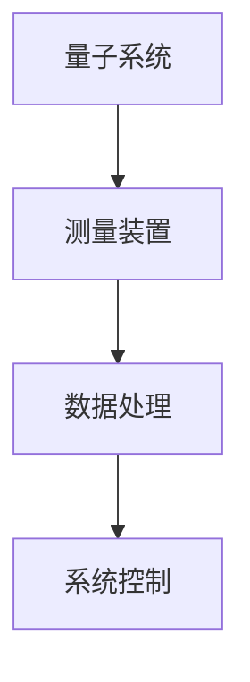

                 


---

# 量子传感器技术的发展与精密仪器投资

> 关键词：量子传感器，精密仪器，量子技术，传感器技术，投资分析

> 摘要：本文系统阐述了量子传感器技术的发展历程、核心原理及其在精密仪器中的应用，并结合投资分析，探讨其在精密仪器领域的投资价值和潜力。文章从基础理论到实际应用，结合算法原理、系统架构设计和项目实战，为读者提供了全面而深入的分析。

---

## 第1章: 量子传感器技术的背景与概述

### 1.1 量子传感器的基本概念

#### 1.1.1 量子传感器的定义

量子传感器是一种基于量子力学原理设计的传感器，能够以极高的精度测量物理量，如磁场、重力、振动等。与传统传感器相比，量子传感器利用量子叠加和纠缠等特性，能够在更小的空间尺度和更高的频率下进行测量。

#### 1.1.2 量子传感器的核心原理

量子传感器的核心在于其基于量子系统的测量能力。量子系统（如原子、光子、超导电路等）在微观尺度上表现出独特的量子特性，这些特性被用来对物理量进行高精度测量。

#### 1.1.3 量子传感器的分类与特点

量子传感器的分类主要依据其测量的物理量和所采用的量子系统类型。常见的类型包括：

- **磁力计**：基于量子纠缠的超冷原子或光子，用于测量极弱的磁场。
- **重力仪**：利用量子系统的重力敏感性，实现高精度重力测量。
- **振动传感器**：基于量子系统的机械振动特性，用于检测微小振动。

### 1.2 量子传感器技术的发展历程

#### 1.2.1 量子传感器技术的历史演变

量子传感器技术的发展可以追溯到20世纪初的量子力学研究。随着量子力学理论的完善，科学家们开始尝试将量子系统应用于实际测量中。20世纪90年代，量子传感器技术开始逐步从理论研究走向实际应用。

#### 1.2.2 量子传感器技术的现状

当前，量子传感器技术已经取得了一系列重要进展。例如，基于超冷原子的量子磁力计已经在磁场测量中展现出超越传统传感器的性能。此外，基于光子的量子传感器在通信和导航领域也展现出巨大潜力。

#### 1.2.3 量子传感器技术的未来趋势

未来，量子传感器技术的发展将朝着更高精度、更广泛应用的方向发展。随着量子计算和量子通信技术的不断进步，量子传感器的应用场景将进一步拓展。

---

## 第2章: 量子传感器技术的核心原理

### 2.1 量子力学基础

#### 2.1.1 量子力学的基本概念

量子力学是研究微观粒子运动规律的物理学分支。其核心概念包括波函数、概率幅、态叠加、纠缠等。

#### 2.1.2 量子叠加与量子纠缠

- **量子叠加**：一个量子系统可以同时处于多个状态的叠加态。
- **量子纠缠**：两个或多个量子系统之间形成的一种特殊关联，使得其中一个系统的状态会直接影响另一个系统。

#### 2.1.3 量子态的测量与操控

量子态的测量需要通过特定的操作来实现，例如利用激光冷却技术将原子冷却到超冷状态，从而使其量子态更容易操控。

### 2.2 量子传感器的物理机制

#### 2.2.1 量子传感器的敏感性

量子传感器的敏感性来源于其对微扰的高灵敏度响应。例如，超冷原子的磁场传感器可以检测到极其微弱的磁场变化。

#### 2.2.2 量子传感器的信号处理

量子传感器的信号处理需要结合量子力学原理和经典信号处理技术。例如，通过测量量子系统的退相干时间来评估外部磁场的变化。

#### 2.2.3 量子传感器的精度极限

量子传感器的精度极限由量子测量理论决定，通常远高于经典传感器的精度极限。

---

## 第3章: 量子传感器技术的关键算法

### 3.1 量子传感器的数据处理算法

#### 3.1.1 量子滤波算法

量子滤波算法用于消除量子传感器测量中的噪声，提高测量精度。其基本思想是通过量子态的叠加和干涉来实现。

#### 3.1.2 量子测量算法

量子测量算法用于对量子系统的状态进行精确测量。例如，利用量子测量技术对超冷原子的磁场进行测量。

#### 3.1.3 量子传感器的优化算法

优化算法用于提高量子传感器的测量效率和精度。例如，通过优化量子传感器的参数设置，使其在特定条件下达到最佳性能。

### 3.2 量子传感器的数学模型

#### 3.2.1 量子传感器的数学表达

量子传感器的数学模型可以表示为：

$$
\psi(x, y, z) = \sum_{i=1}^{n} a_i x_i + b_i y_i + c_i z_i
$$

其中，\( x, y, z \) 表示测量的物理量，\( a_i, b_i, c_i \) 是对应的系数。

#### 3.2.2 量子传感器的信号处理模型

信号处理模型可以表示为：

$$
s(t) = \sum_{k=1}^{m} w_k \psi_k(t)
$$

其中，\( s(t) \) 是处理后的信号，\( w_k \) 是权重系数，\( \psi_k(t) \) 是原始信号。

#### 3.2.3 量子传感器的误差分析

误差分析模型可以表示为：

$$
\epsilon = \frac{\sigma}{\sqrt{n}}
$$

其中，\( \sigma \) 是测量误差的标准差，\( n \) 是测量次数。

---

## 第4章: 量子传感器的系统架构与设计

### 4.1 量子传感器系统的组成

#### 4.1.1 量子传感器的硬件部分

硬件部分包括量子系统、测量装置、控制电路等。

#### 4.1.2 量子传感器的软件部分

软件部分包括数据处理算法、系统控制软件等。

#### 4.1.3 量子传感器的接口设计

接口设计用于与其他系统（如计算机、通信设备）进行数据交互。

### 4.2 量子传感器的系统架构图

以下是一个量子传感器系统的Mermaid图：



---

## 第5章: 量子传感器技术在精密仪器中的应用

### 5.1 量子传感器在精密测量中的应用

#### 5.1.1 高精度测量的实现

量子传感器可以实现高精度的磁场、重力和振动测量。

#### 5.1.2 量子传感器在精密仪器中的优势

量子传感器的优势包括高灵敏度、高精度和小型化。

#### 5.1.3 量子传感器的实际案例分析

例如，基于超冷原子的量子磁力计已经在地球物理勘探中得到应用。

### 5.2 量子传感器在精密仪器中的投资价值

#### 5.2.1 量子传感器的投资前景

随着技术的成熟，量子传感器将在更多领域得到应用。

#### 5.2.2 量子传感器的投资风险

技术门槛高、研发周期长是主要风险。

#### 5.2.3 量子传感器的投资策略

建议关注具有技术优势的企业和研究机构。

---

## 第6章: 量子传感器技术的项目实战

### 6.1 量子传感器项目的环境搭建

#### 6.1.1 开发环境的安装

需要安装量子传感器相关的软件和硬件环境。

#### 6.1.2 开发工具的配置

配置量子传感器开发工具，如量子计算机模拟器等。

### 6.2 量子传感器的核心实现

以下是一个量子传感器的核心算法实现代码示例：

```python
import numpy as np

def quantum_sensor_algorithm(data):
    # 数据预处理
    processed_data = np.array(data)
    # 量子滤波
    filtered_data = np.convolve(processed_data, np.ones(3) / 3, mode='same')
    # 量子测量
    measured_value = np.mean(filtered_data)
    return measured_value

# 示例数据
data = [1, 2, 3, 4, 5]
result = quantum_sensor_algorithm(data)
print(result)
```

---

## 第7章: 总结与展望

### 7.1 总结

量子传感器技术是一项具有巨大潜力的新兴技术，其在精密测量和投资领域都具有重要意义。

### 7.2 展望

未来，量子传感器技术将在更多领域得到应用，推动技术进步和经济发展。

---

通过以上章节的详细阐述，本文为读者提供了关于量子传感器技术的全面分析，包括其发展、原理、应用和投资价值等方面。

