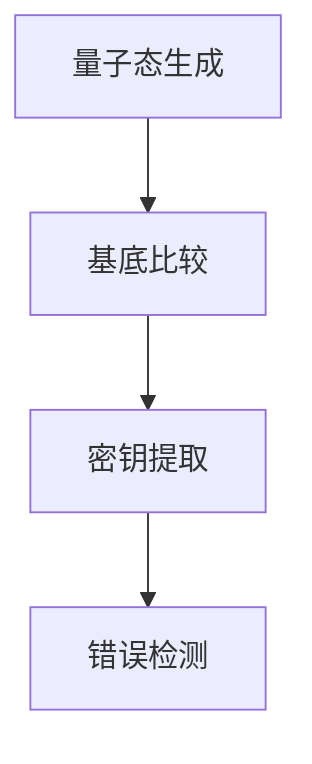
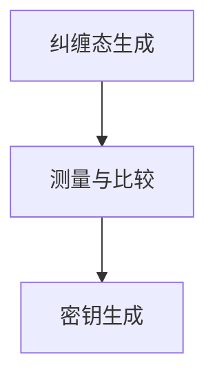
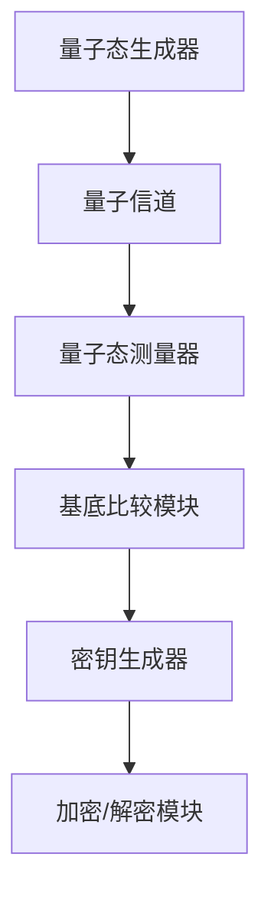

                 


# 量子密码技术的进步与网络安全投资机会

> 关键词：量子密码技术、网络安全、量子计算、密码学、投资机会、加密技术

> 摘要：量子密码技术作为信息安全领域的一项颠覆性技术，正在迅速改变传统密码学的格局。本文从量子密码技术的基本概念出发，深入分析其核心原理，探讨其在网络安全领域的应用前景，并结合实际案例，分析量子密码技术的投资机会与挑战。文章内容涵盖量子密码技术的系统架构设计、协议实现、数学模型、实际应用以及投资策略，旨在为读者提供全面的视角，帮助其理解量子密码技术的进步与网络安全投资机会。

---

## 第1章: 量子密码技术的背景与概述

### 1.1 量子密码技术的定义与核心概念

量子密码技术是基于量子力学原理的一种新型加密技术，其核心在于利用量子态的不可克隆性和测量干扰性来实现信息的安全传输。与传统密码学不同，量子密码技术不依赖于数学难题的计算复杂性，而是通过物理定律来确保加密的安全性。

#### 1.1.1 量子密码技术的基本概念

- **量子态**：量子信息的基本单位是量子比特（qubit），与经典比特不同，量子比特具有叠加态和纠缠态的特性。
- **不可克隆性**：量子态无法被精确复制，这是量子密码技术的核心原理之一。
- **测量干扰性**：对量子态的测量会破坏其状态，从而暴露任何未经授权的窃听行为。

#### 1.1.2 量子密码技术的核心属性与特征

- **安全性**：基于物理定律的安全性，而非数学假设。
- **抗量子计算攻击**：传统加密算法（如RSA、AES）可能在量子计算时代被破解，而量子密码技术能够抵抗量子计算的攻击。
- **不可被中间人攻击**：任何未经授权的窃听都会被检测到。

#### 1.1.3 量子密码技术与经典密码学的对比

| 特性               | 量子密码技术                     | 经典密码技术                     |
|--------------------|----------------------------------|----------------------------------|
| 安全基础           | 物理定律                         | 数学复杂性                       |
| 抗量子计算攻击     | 是                              | 否                              |
| 适用场景           | 高安全性需求的领域（如金融、国防） | 广泛应用于互联网、通信等          |
| 代表协议           | BB84协议、EPR协议               | RSA、AES、Diffie-Hellman         |

### 1.2 量子密码技术的发展历程

#### 1.2.1 量子密码技术的起源与演变

量子密码技术的起源可以追溯到20世纪80年代，其标志性事件是1984年C. H. Bennett和G. Brassard提出的BB84协议。这一协议奠定了量子密钥分发（QKD）的基础。

#### 1.2.2 量子密码技术的关键里程碑

- **1984年**：BB84协议提出，开创了量子密钥分发的先河。
- **1991年**：E. K. B. B92协议提出，简化了BB84协议的部分步骤。
- **1995年**：量子纠缠态（EPR协议）被提出，进一步完善了量子密码技术。
- **2000年代**：量子密码技术进入实验阶段，实现了一些初步的实际应用。

#### 1.2.3 量子密码技术的现状与趋势

目前，量子密码技术已经在一些特定领域得到了实际应用，例如金融、国防和通信等。随着量子计算技术的发展，量子密码技术的研究和应用正在加速。

---

## 第2章: 量子密码技术的核心原理

### 2.1 量子密钥分发（QKD）的基本原理

#### 2.1.1 QKD的基本概念

量子密钥分发是一种通过量子通信技术生成共享密钥的协议。其核心思想是利用量子态的不可克隆性和测量干扰性，确保密钥的安全传输。

#### 2.1.2 QKD的数学模型与公式

在量子密钥分发中，通常使用量子态的正交性来表示不同的密钥值。例如，在BB84协议中，使用正交基$\{|0\rangle, |1\rangle\}$和$\{|+\rangle, |-\rangle\}$来表示二进制密钥。

数学上，密钥生成过程可以表示为：

$$
\text{Alice} \rightarrow \text{Bob}: \quad \text{量子态} \quad |q\rangle
$$

其中，$|q\rangle$是由Alice生成的量子态，Bob通过测量来获取密钥信息。

#### 2.1.3 QKD的安全性证明

量子密钥分发的安全性基于量子态的不可克隆性和测量干扰性。任何未经授权的窃听都会破坏量子态的测量结果，从而暴露窃听行为。数学上，可以通过纠缠态的保真度来证明密钥的安全性。

---

## 第3章: 量子密钥分发（QKD）的实现与应用

### 3.1 量子密钥分发的经典协议

#### 3.1.1 BB84协议

BB84协议是量子密钥分发的经典协议之一。其主要步骤如下：

1. **密钥生成**：Alice和Bob分别生成随机的量子态，并通过量子信道传输。
2. **基底比较**：Alice和Bob在公共信道上比较使用的基底，只有基底相同的情况下，才能得到相同的密钥。
3. **错误检测**：通过经典通信对测量结果进行比对，检测是否存在窃听行为。

mermaid流程图如下：



#### 3.1.2 EPR协议

EPR协议基于量子纠缠态，通过Alice和Bob共享的纠缠态来生成密钥。其主要步骤如下：

1. **纠缠态生成**：Alice和Bob生成共享的纠缠态。
2. **测量与比较**：Alice和Bob分别对纠缠态进行测量，并在公共信道上比较测量结果。
3. **密钥生成**：如果测量结果相同，则生成密钥；否则，密钥需要重新生成。

mermaid流程图如下：



---

## 第4章: 量子密码技术的系统架构设计

### 4.1 量子密码系统的整体架构

#### 4.1.1 量子密码系统的组成模块

- **量子信道**：用于传输量子态。
- **经典信道**：用于传输控制信息和密钥。
- **量子态生成器**：生成量子态。
- **量子态测量器**：测量量子态。
- **基底比较模块**：比较基底并提取密钥。

#### 4.1.2 量子密码系统的功能设计

- **密钥生成**：通过量子通信生成共享密钥。
- **加密与解密**：基于生成的密钥对明文进行加密或解密。
- **安全性检测**：检测是否存在窃听行为。

mermaid系统架构图如下：



---

## 第5章: 网络安全的投资机会分析

### 5.1 量子密码技术的市场前景

随着量子计算技术的快速发展，传统加密算法的安全性岌岌可危。量子密码技术作为抗量子计算攻击的核心技术，其市场需求正在快速增长。

---

### 5.2 量子密码技术的投资策略

1. **技术研究**：加大对量子密码技术的研发投入，特别是在量子密钥分发和抗量子加密算法领域的研究。
2. **产业化应用**：推动量子密码技术在金融、通信、国防等领域的实际应用。
3. **国际合作**：积极参与国际量子密码技术的研究与标准制定。

---

## 第6章: 量子密码技术的项目实战

### 6.1 量子密钥分发系统的设计与实现

#### 6.1.1 环境配置

- **量子通信平台**：需要支持量子态传输和测量的实验环境。
- **经典通信网络**：用于基底比较和密钥管理的经典信道。

#### 6.1.2 核心代码实现

以下是一个简单的量子密钥分发协议的Python实现示例：

```python
import random

def generate_key():
    key = []
    for _ in range(10):
        basis = random.choice(['Z', 'X'])
        key.append(basis)
    return key

def compare_basis(alice_basis, bob_basis):
    if all(a == b for a, b in zip(alice_basis, bob_basis)):
        return True
    else:
        return False

# 示例代码
alice_basis = generate_key()
bob_basis = generate_key()
if compare_basis(alice_basis, bob_basis):
    print("Basis match, key can be extracted.")
else:
    print("Basis mismatch, key cannot be extracted.")
```

---

## 第7章: 总结与展望

### 7.1 量子密码技术的总结

量子密码技术作为一种新兴的信息安全技术，其基于物理定律的安全性使其在抗量子计算攻击方面具有独特的优势。随着技术的不断进步，量子密码技术将在更多的领域得到广泛应用。

### 7.2 量子密码技术的未来展望

未来，量子密码技术的研究将更加注重实际应用和产业化发展。同时，随着量子计算技术的进一步发展，量子密码技术也将面临新的挑战和机遇。

---

## 致谢

感谢您阅读本文，希望本文能为您提供有价值的信息，帮助您更好地理解量子密码技术的进步与网络安全投资机会。

--- 

以上是一个详细的技术博客文章的大纲和内容，涵盖量子密码技术的核心原理、实际应用、系统设计以及投资机会分析。希望对您有所帮助！

