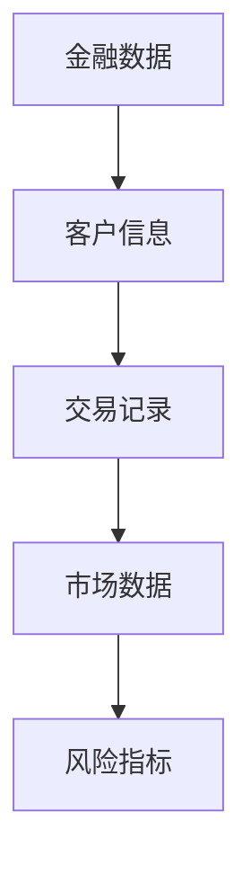
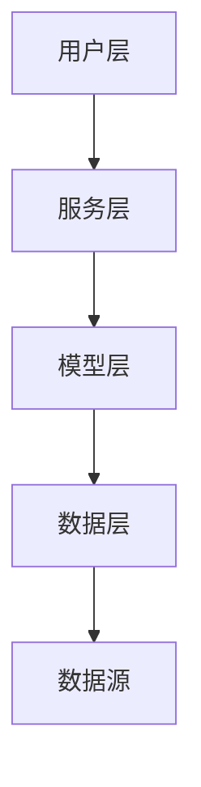
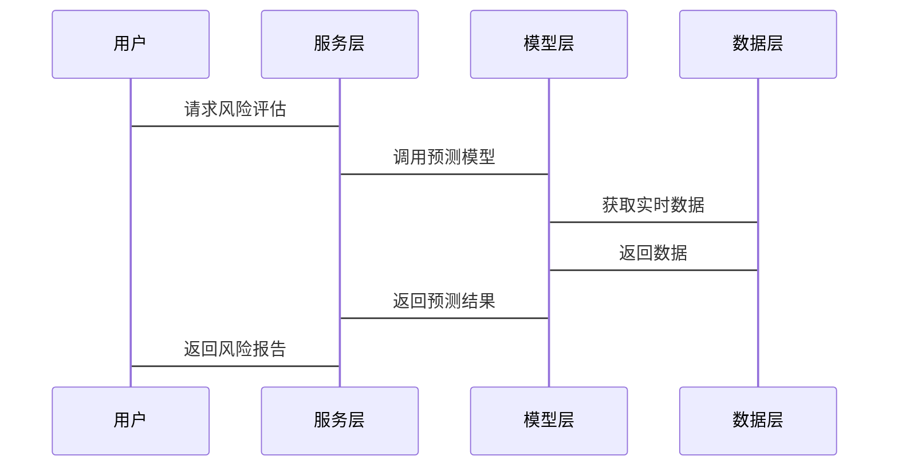

                 


# 《金融AI Agent：风险评估与决策支持》

**关键词**：金融AI Agent，风险评估，决策支持，机器学习，自然语言处理

**摘要**：  
随着金融市场的日益复杂化，传统的风险评估和决策方法已难以应对现代金融环境的挑战。本文深入探讨了金融AI Agent在风险评估与决策支持中的应用，结合实际案例，分析了AI Agent的核心概念、算法原理、系统架构及项目实现。通过详细的技术分析和实践指导，展示了如何利用AI技术提升金融领域的风险管理和决策效率，为读者提供了从理论到实践的全面指南。

---

## 第1章: 金融行业面临的挑战与AI Agent的引入

### 1.1 金融行业的复杂性与风险  
金融行业作为现代经济的核心，面临着数据复杂性高、风险种类多、市场波动大等挑战。传统的风险评估方法依赖于历史数据和统计模型，但在面对非线性关系、实时数据流和复杂市场行为时显得力不从心。例如，金融危机的爆发往往由于传统模型未能捕捉到潜在的风险信号。

### 1.2 AI Agent在金融领域的应用前景  
AI Agent（智能代理）是一种能够感知环境、自主决策并执行任务的智能系统。在金融领域，AI Agent可以通过实时数据分析、模式识别和预测建模，帮助金融机构实现自动化风险评估和决策支持。例如，AI Agent可以实时监控市场动态，识别潜在的欺诈行为，并提供个性化的投资建议。

### 1.3 本章小结  
本章通过分析金融行业的复杂性与传统风险评估方法的局限性，引出了AI Agent在金融领域的应用价值，为后续内容奠定了基础。

---

## 第2章: 金融AI Agent的核心概念与联系

### 2.1 金融AI Agent的原理  
金融AI Agent的核心在于其强大的数据处理能力、模型选择能力和风险评估能力。例如，AI Agent可以通过自然语言处理技术（NLP）分析新闻数据，提取市场情绪指标；通过机器学习模型预测股票价格走势；通过时间序列分析识别市场周期。

#### 2.1.1 数据处理与特征提取  
数据处理是AI Agent的第一步，包括数据清洗、特征提取和数据增强。例如，可以通过主成分分析（PCA）降低数据维度，提取关键特征。

#### 2.1.2 模型选择与训练  
根据具体问题选择合适的模型是AI Agent的关键。例如，对于分类问题，可以选择随机森林或支持向量机（SVM）；对于时间序列预测，可以选择LSTM或ARIMA模型。

#### 2.1.3 风险评估与决策支持  
AI Agent通过构建风险评估模型，将输入数据映射到风险等级（如低、中、高）。例如，可以使用XGBoost模型对客户信用风险进行分类。

### 2.2 核心概念对比分析  
通过对比分析，可以更好地理解AI Agent的核心优势。例如，AI Agent在精确性、实时性和可解释性方面具有显著优势。

| 比较维度 | AI Agent | 传统方法 |
|----------|-----------|-----------|
| 精确性   | 高         | 中         |
| 实时性   | 高         | 低         |
| 可解释性 | 中         | 高         |

### 2.3 ER实体关系图  
以下是金融AI Agent的实体关系图：



### 2.4 本章小结  
本章详细介绍了金融AI Agent的核心概念和原理，并通过对比分析和实体关系图，帮助读者更好地理解其工作原理。

---

## 第3章: 金融AI Agent的算法原理

### 3.1 机器学习模型  
机器学习是AI Agent的核心技术之一。以下是几种常用的机器学习模型及其应用场景：

#### 3.1.1 线性回归模型  
线性回归是一种简单且经典的回归模型，适用于线性关系的预测。其数学模型如下：

$$ y = \beta_0 + \beta_1x + \epsilon $$

其中，$y$是目标变量，$x$是自变量，$\beta_0$和$\beta_1$是模型参数，$\epsilon$是误差项。

#### 3.1.2 支持向量机模型（SVM）  
SVM适用于分类问题，通过构建超平面将数据点分为不同类别。其数学模型如下：

$$ \text{目标：} \min_{\beta, \beta_0} \frac{1}{2}||\beta||^2 + C \sum_{i=1}^n \xi_i $$  
$$ \text{约束：} y_i(\beta^T x_i + \beta_0) \geq 1 - \xi_i, \xi_i \geq 0 $$

其中，$C$是惩罚系数，$\xi_i$是松弛变量。

#### 3.1.3 随机森林模型  
随机森林是一种基于决策树的集成学习方法，适用于分类和回归问题。其核心思想是通过随机采样和投票机制提高模型的泛化能力。

### 3.2 时间序列分析  
时间序列分析适用于预测金融市场走势。以下是几种常用的时间序列模型：

#### 3.2.1 ARIMA模型  
ARIMA（自回归积分滑动平均模型）适用于线性时间序列预测。其数学模型如下：

$$ \phi(B) (1 - B)^d X_t = \theta(B) \epsilon_t $$

其中，$B$是延迟算子，$d$是差分阶数，$\phi(B)$和$\theta(B)$分别是自回归和滑动平均多项式。

#### 3.2.2 LSTM模型  
LSTM（长短期记忆网络）适用于非线性时间序列预测。其核心思想是通过门控机制保存长期信息。

#### 3.2.3 Prophet模型  
Prophet是一种基于时间序列分解的预测模型，适用于具有明确趋势和季节性的数据。

### 3.3 自然语言处理技术  
NLP技术适用于分析非结构化数据，如新闻、社交媒体评论等。以下是几种常用的技术：

#### 3.3.1 分词与实体识别  
分词是将文本分割成词语，实体识别是识别文本中的命名实体（如人名、地名、机构名）。

#### 3.3.2 情感分析  
情感分析是判断文本的情感倾向（如正面、负面、中性）。

### 3.4 本章小结  
本章详细介绍了金融AI Agent中常用的机器学习模型、时间序列模型和NLP技术，并通过数学公式和流程图展示了其工作原理。

---

## 第4章: 金融AI Agent的系统分析与架构设计

### 4.1 项目背景  
本项目旨在开发一个基于AI Agent的金融风险评估与决策支持系统，帮助金融机构实时监控市场动态、识别潜在风险并优化投资决策。

### 4.2 系统功能设计  
以下是系统的功能模块：

- 数据采集模块：实时采集金融数据，包括市场数据、交易数据、新闻数据等。
- 特征工程模块：对数据进行清洗、特征提取和数据增强。
- 模型训练模块：训练机器学习模型，包括分类、回归和时间序列预测模型。
- 风险评估模块：根据模型输出结果，生成风险评估报告。
- 决策支持模块：提供个性化的投资建议和风险对冲策略。

### 4.3 系统架构设计  
以下是系统的分层架构：



### 4.4 系统接口设计  
系统接口设计包括数据接口、模型接口和用户接口。例如，数据接口可以通过API获取实时数据，模型接口可以通过RESTful API提供预测服务。

### 4.5 系统交互设计  
以下是系统的交互流程：



### 4.6 本章小结  
本章通过系统分析和架构设计，展示了如何构建一个基于AI Agent的金融风险评估与决策支持系统。

---

## 第5章: 金融AI Agent的项目实战

### 5.1 环境安装  
以下是项目所需的环境和工具：

- Python 3.8+
- TensorFlow 2.0+
- Scikit-learn 1.0+
- Pandas 1.0+
- Jupyter Notebook

### 5.2 核心代码实现  
以下是项目的Python代码实现：

```python
# 数据预处理
import pandas as pd
import numpy as np
from sklearn.model_selection import train_test_split
from sklearn.ensemble import RandomForestClassifier
from sklearn.metrics import accuracy_score

# 加载数据
data = pd.read_csv('financial_data.csv')
X = data.drop('label', axis=1)
y = data['label']

# 划分训练集和测试集
X_train, X_test, y_train, y_test = train_test_split(X, y, test_size=0.2, random_state=42)

# 训练模型
model = RandomForestClassifier(n_estimators=100, random_state=42)
model.fit(X_train, y_train)

# 模型评估
y_pred = model.predict(X_test)
print("Accuracy:", accuracy_score(y_test, y_pred))
```

### 5.3 代码解读与分析  
上述代码展示了如何使用随机森林模型进行金融数据分类。通过数据预处理、模型训练和评估，我们可以实现对客户信用风险的分类。

### 5.4 实际案例分析  
以股票价格预测为例，以下是LSTM模型的代码实现：

```python
import numpy as np
from tensorflow.keras.models import Sequential
from tensorflow.keras.layers import LSTM, Dense

# 数据预处理
data = np.array(...)
X = data[:-1]
y = data[1:]

# 构建模型
model = Sequential()
model.add(LSTM(64, input_shape=(1, 1)))
model.add(Dense(1))
model.compile(loss='mean_squared_error', optimizer='adam')

# 训练模型
model.fit(X, y, epochs=100, batch_size=32)
```

### 5.5 本章小结  
本章通过实际案例分析和代码实现，展示了如何在金融领域应用AI Agent进行风险评估和决策支持。

---

## 第6章: 金融AI Agent的最佳实践

### 6.1 小结  
通过本篇文章的介绍，我们详细探讨了金融AI Agent的核心概念、算法原理、系统架构及项目实现。AI Agent在金融领域的应用前景广阔，能够显著提升风险管理和决策效率。

### 6.2 注意事项  
在实际应用中，需要注意数据隐私、模型解释性和系统稳定性等问题。例如，应确保数据的合规性，避免隐私泄露；模型应具有可解释性，便于监管审查；系统应具备高可用性，确保实时性。

### 6.3 拓展阅读  
推荐读者阅读以下书籍和论文：
- 《Hands-On Machine Learning with Scikit-Learn, Keras, and TensorFlow》
- 《Deep Learning for Time Series Forecasting》
- 《Natural Language Processing in Python》

### 6.4 本章小结  
本章通过小结、注意事项和拓展阅读，帮助读者进一步巩固所学内容，并引导读者深入学习AI Agent在金融领域的应用。

---

## 结语  
金融AI Agent作为人工智能技术的重要应用之一，正在逐步改变金融行业的风险评估和决策支持方式。通过本文的详细介绍，读者可以深入了解其核心原理和实际应用，为未来的实践打下坚实的基础。

