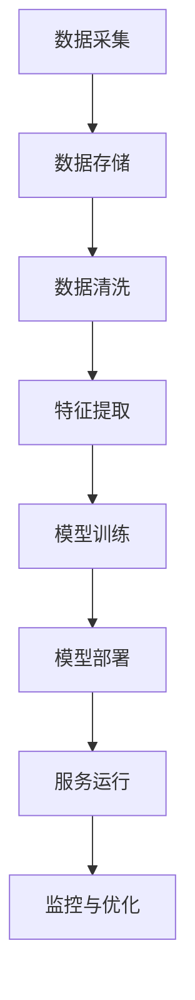

                 


# 《金融AI应用的DevOps流程设计与实施》

---

## 关键词：  
金融AI、DevOps、CI/CD、容器化、机器学习、量化交易、风险管理  

---

## 摘要：  
本文详细探讨了金融AI应用的DevOps流程设计与实施。首先介绍了金融行业数字化转型的背景和AI技术在金融领域的广泛应用，接着深入分析了DevOps在金融AI中的核心作用。通过结合金融AI应用的核心概念与技术基础，详细设计了金融AI应用的DevOps流程，包括CI/CD、容器化与微服务架构的实现。最后，通过实际案例展示了金融AI应用的系统架构与项目实战，并总结了最佳实践和未来发展方向。

---

## 正文：

### 第一部分：金融AI应用与DevOps概述

#### 第1章：金融AI应用的背景与现状

##### 1.1 金融行业的数字化转型  
近年来，金融行业正经历着深刻的数字化转型。传统金融业务面临着效率低下、成本高昂、用户体验差等痛点。与此同时，AI技术的快速发展为金融行业带来了新的机遇。通过AI技术，金融机构可以实现智能化投资、自动化风险控制、精准营销等目标，从而提升竞争力。  

##### 1.2 DevOps的定义与特点  
DevOps是一种结合了软件开发（Development）和运维（Operations）的实践方法论。它通过自动化工具和流程，实现了开发、测试、部署和监控的高效协作。DevOps的核心特点包括：  
- **自动化**：通过工具链实现CI/CD（持续集成/持续交付）、容器化部署等流程。  
- **协作性**：强调开发团队与运维团队的紧密合作。  
- **迭代性**：通过短迭代周期快速交付价值。  

##### 1.3 金融AI应用与DevOps的结合  
金融AI应用的开发和部署需要高效的DevOps流程支持。通过DevOps，金融机构可以快速迭代AI模型，确保模型的稳定性和可靠性。例如，在量化交易场景中，AI模型需要实时更新，而DevOps流程可以确保模型的快速部署和回滚。  

---

#### 第2章：金融AI应用的核心概念与技术基础

##### 2.1 金融领域的AI应用场景  
AI技术在金融领域的应用非常广泛，主要包括：  
- **智能投顾**：通过AI算法为用户提供个性化的投资建议。  
- **风险管理**：利用AI进行信用评估、市场风险预测等。  
- **量化交易**：基于AI算法进行高频交易。  

##### 2.2 AI技术在金融中的应用原理  
AI技术的核心在于算法和数据。在金融领域，机器学习和深度学习算法被广泛应用：  
- **机器学习**：通过训练数据，模型可以预测股票价格、识别市场趋势等。  
- **深度学习**：用于处理非结构化数据，如自然语言处理（NLP）分析新闻文本，预测市场情绪。  

##### 2.3 DevOps在金融AI中的技术基础  
- **CI/CD**：通过自动化构建、测试和部署，确保AI模型的快速迭代。  
- **容器化**：使用Docker等技术实现AI服务的快速部署和扩展。  
- **微服务架构**：通过微服务化设计，提升系统的灵活性和可扩展性。  

---

### 第二部分：金融AI应用的DevOps流程设计

#### 第3章：金融AI应用的DevOps流程设计

##### 3.1 DevOps在金融AI中的流程概述  
金融AI应用的DevOps流程包括以下几个阶段：  
1. **需求分析**：明确业务目标和AI模型的需求。  
2. **开发**：编写AI算法代码，实现模型训练。  
3. **测试**：通过自动化测试确保模型的稳定性和准确性。  
4. **部署**：将AI服务部署到生产环境。  
5. **监控与反馈**：实时监控服务运行状态，并根据反馈优化模型。  

##### 3.2 金融AI应用中的CI/CD流程  
CI/CD流程是DevOps的核心，以下是其实现步骤：  
1. **代码提交**：开发人员将代码提交到版本控制系统（如Git）。  
2. **持续集成**：通过CI工具（如Jenkins、GitHub Actions）自动构建和测试代码。  
3. **持续交付**：将通过测试的代码部署到生产环境。  
4. **回滚机制**：如果出现故障，可以快速回滚到上一个稳定版本。  

##### 3.3 金融AI应用中的容器化与微服务设计  
- **容器化**：使用Docker将AI服务打包为容器，确保环境一致性。  
- **微服务架构**：将AI服务拆分为多个微服务，通过API进行通信，提升系统的灵活性和扩展性。  

---

### 第三部分：金融AI应用的系统架构与设计

#### 第4章：金融AI应用的系统架构与设计

##### 4.1 金融AI应用的系统架构  
金融AI应用的系统架构可以分为以下几个模块：  
- **数据采集模块**：从多种数据源获取金融数据（如股票价格、新闻等）。  
- **模型训练模块**：对数据进行清洗、特征提取和模型训练。  
- **服务部署模块**：将训练好的模型部署到生产环境。  
- **监控与优化模块**：实时监控服务运行状态，并根据反馈优化模型。  

##### 4.2 金融AI应用的系统架构设计  
以下是金融AI应用的系统架构图：  



---

### 第四部分：金融AI应用的项目实战

#### 第5章：金融AI应用的项目实战

##### 5.1 项目规划与环境搭建  
- **项目目标**：实现一个基于机器学习的量化交易系统。  
- **环境搭建**：安装Python、Jupyter、Docker、Jenkins等工具。  

##### 5.2 核心代码实现与解读  
以下是量化交易系统的Python代码示例：  

```python
# 简单的量化交易策略示例
import pandas as pd
import numpy as np

# 数据加载
data = pd.read_csv('stock_prices.csv')

# 计算移动平均线
data['MA5'] = data['close'].rolling(5).mean()
data['MA10'] = data['close'].rolling(10).mean()

# 策略逻辑
data['signal'] = 0
data['signal'][data['MA5'] > data['MA10']] = 1
data['signal'][data['MA5'] < data['MA10']] = -1

# 计算收益
data['return'] = data['close'].pct_change() * data['signal'].shift(1)

print(data.head())
```

##### 5.3 项目测试与部署  
- **单元测试**：通过自动化测试确保每个模块的功能正常。  
- **部署上线**：使用Docker将量化交易系统部署到云服务器。  

---

### 第五部分：最佳实践与未来展望

#### 第6章：最佳实践与未来展望

##### 6.1 实施中的注意事项  
- **数据安全**：金融数据涉及敏感信息，需严格控制数据访问权限。  
- **模型迭代**：定期更新AI模型，确保其准确性和适应性。  

##### 6.2 未来展望  
随着AI技术的不断发展，金融AI应用的DevOps流程将更加智能化和自动化。未来，AI与DevOps的结合将进一步深化，推动金融行业的数字化转型。

---

## 总结：  
本文详细探讨了金融AI应用的DevOps流程设计与实施。通过结合金融行业的实际需求和技术发展趋势，提出了系统的解决方案和最佳实践。希望本文能为金融行业的技术从业者提供有价值的参考。

