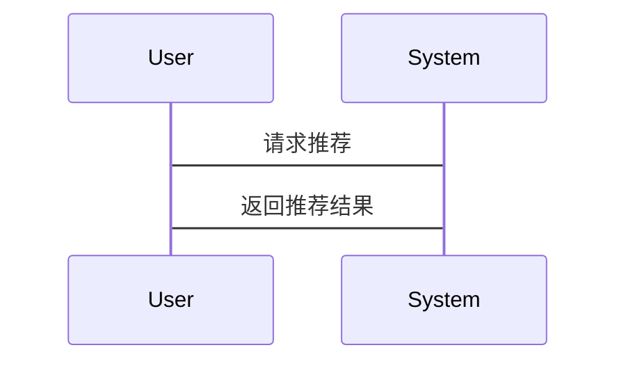

                 


# 《金融产品交叉销售优化系统》

---

## 关键词：
金融产品，交叉销售，优化系统，推荐算法，系统架构，用户行为分析

---

## 摘要：
本文系统地探讨了金融产品交叉销售优化系统的构建与实现，从背景分析到系统设计，详细阐述了该系统的核心概念、算法原理、系统架构以及项目实战。通过用户行为分析和推荐算法的结合，本文提出了基于协同过滤和深度学习的优化策略，旨在提升金融机构的销售效率和客户满意度。文章还提供了完整的系统设计图、算法流程图和代码实现，为读者提供了从理论到实践的全面指导。

---

# 第一部分：金融产品交叉销售优化系统背景与核心概念

---

## 第1章：金融产品交叉销售优化系统背景介绍

### 1.1 金融产品交叉销售的背景与重要性

#### 1.1.1 金融行业的数字化转型趋势
随着科技的进步，金融行业正经历着深刻的数字化转型。传统金融机构纷纷引入大数据、人工智能等技术，以提升服务效率和客户体验。交叉销售作为金融业务的重要组成部分，是金融机构提升收入和客户忠诚度的关键策略。

#### 1.1.2 交叉销售在金融业务中的价值
交叉销售是指在同一客户的基础上，销售多种金融产品或服务。这种模式能够提高客户的粘性和满意度，同时增加金融机构的收入来源。例如，银行在销售存款产品时，可以推荐理财产品或信用卡，从而实现交叉销售。

#### 1.1.3 当前交叉销售的主要挑战
尽管交叉销售在理论上具有诸多优势，但在实际操作中面临诸多挑战。首先，客户行为数据分散，难以有效整合；其次，推荐算法的精准度不足，导致推荐效果不佳；最后，不同客户群体的需求差异大，难以统一满足。

### 1.2 问题背景与问题描述

#### 1.2.1 传统交叉销售模式的局限性
传统的交叉销售模式主要依赖人工推荐，这种方式效率低下，且难以根据客户需求进行个性化推荐。此外，人工推荐还容易受到主观因素的影响，推荐结果缺乏客观性。

#### 1.2.2 数据孤岛与信息不对称问题
金融机构内部通常存在数据孤岛问题，客户的行为数据分散在不同的业务部门，难以形成统一的客户画像。这种信息不对称导致推荐系统无法充分利用数据的价值。

#### 1.2.3 用户行为分析的复杂性
用户行为分析需要处理大量的数据，包括点击流数据、交易数据等。这些数据具有高维性和非结构化的特点，增加了分析的复杂性。

### 1.3 问题解决与优化目标

#### 1.3.1 系统优化的核心目标
通过构建交叉销售优化系统，整合客户数据，利用大数据和人工智能技术，实现精准的个性化推荐。目标是提高客户满意度和业务收益。

#### 1.3.2 数据驱动的交叉销售策略
利用数据分析技术，从客户的交易记录、点击流数据中提取特征，构建用户画像，为推荐系统提供数据支持。

#### 1.3.3 提升客户满意度与业务收益
通过精准的推荐，客户能够获得更符合需求的产品，从而提高满意度；金融机构则能够通过交叉销售增加收入，实现业务收益的最大化。

### 1.4 系统的边界与外延

#### 1.4.1 系统的边界定义
交叉销售优化系统的核心功能包括数据采集、用户画像构建、推荐算法设计和结果展示。系统边界明确，与其他系统的接口通过标准API进行交互。

#### 1.4.2 系统与外部系统的交互
系统需要与CRM、交易系统等外部系统进行数据交互，确保数据的实时性和准确性。同时，系统还通过API向前端展示推荐结果，供客户查看。

#### 1.4.3 系统功能的扩展性
系统设计具有良好的扩展性，可以根据业务需求增加新的推荐算法或数据源，确保系统的灵活性和可维护性。

### 1.5 核心概念与组成要素

#### 1.5.1 核心概念的结构化分析
交叉销售优化系统的核心概念包括用户行为分析、产品推荐算法和系统架构设计。这些概念相互关联，共同支撑系统的运行。

#### 1.5.2 系统组成要素的对比分析
通过对比分析用户行为分析、产品推荐算法和系统架构设计，可以发现它们在功能、数据和接口上的差异与联系。例如，用户行为分析主要负责数据处理，而推荐算法则负责生成推荐结果。

#### 1.5.3 系统核心功能模块
系统的功能模块包括数据采集、用户画像构建、推荐算法实现、结果展示和效果评估。每个模块都具有明确的功能和接口设计。

---

## 第2章：交叉销售优化系统的核心概念与联系

### 2.1 核心概念原理

#### 2.1.1 数据驱动的交叉销售策略
数据驱动的交叉销售策略依赖于客户数据的收集与分析，通过构建用户画像，实现个性化的推荐。

#### 2.1.2 用户行为分析模型
用户行为分析模型通过分析客户的点击流数据、交易记录等，提取用户的兴趣和需求特征，为推荐系统提供数据支持。

#### 2.1.3 产品推荐算法
产品推荐算法是系统的核心，包括协同过滤、基于内容的推荐和混合推荐等多种算法，旨在提高推荐的准确性和多样性。

### 2.2 核心概念属性特征对比表

| 概念               | 属性           | 特征                                                                 |
|--------------------|----------------|---------------------------------------------------------------------|
| 用户行为分析       | 数据来源       | 用户交易记录、点击流数据                                           |
| 产品推荐算法       | 算法类型       | 基于协同过滤、基于内容的推荐                                         |
| 交叉销售优化系统   | 系统架构       | 分布式架构、模块化设计                                               |

### 2.3 ER实体关系图

```mermaid
erd
    title 交叉销售优化系统 ER 图
    User(u_id, u_name, u_age, u_gender, u_income)
    Product(p_id, p_name, p_category, p_price)
    Transaction(t_id, t_amount, t_time)
    Recommendation(r_id, r_score, r_algorithm)
    define User u
    define Product p
    define Tr

---

# 第二部分：系统架构与算法实现

---

## 第3章：系统架构与算法实现

### 3.1 系统架构设计

#### 3.1.1 系统功能模块
系统功能模块包括数据采集、用户画像构建、推荐算法实现、结果展示和效果评估。

#### 3.1.2 系统架构设计图
```mermaid
graph TD
    A[数据采集] --> B[用户画像构建]
    B --> C[推荐算法实现]
    C --> D[结果展示]
    D --> E[效果评估]
```

#### 3.1.3 系统功能扩展
系统设计具有良好的扩展性，可以根据业务需求增加新的推荐算法或数据源。

### 3.2 推荐算法实现

#### 3.2.1 协同过滤算法
协同过滤算法通过分析用户的行为数据，找到相似的用户群体，进行推荐。

#### 3.2.2 基于内容的推荐算法
基于内容的推荐算法通过分析产品的特征，进行推荐。

#### 3.2.3 深度学习推荐算法
深度学习推荐算法利用神经网络模型，从数据中学习特征，进行推荐。

### 3.3 算法实现代码示例

#### 3.3.1 协同过滤算法实现
```python
import pandas as pd
from sklearn.metrics import pairwise_distances

# 加载数据
user_data = pd.read_csv('user.csv')
product_data = pd.read_csv('product.csv')

# 计算用户相似性矩阵
user_similarity = pairwise_distances(user_data, metric='cosine')

# 推荐算法实现
def recommend(user_id, user_similarity, product_data):
    # 找出与当前用户最相似的用户
    similar_users = user_similarity[user_id].argsort()[::-1]
    # 统计每个产品的推荐次数
    recommendation = {}
    for u in similar_users:
        recommendation[product_data['product_id'][u]] = recommendation.get(product_data['product_id'][u], 0) + 1
    return recommendation
```

#### 3.3.2 基于内容的推荐算法实现
```python
from sklearn.feature_extraction.text import TfidfVectorizer

# 加载数据
product_descriptions = pd.read_csv('product_descriptions.csv')

# 文本特征提取
vectorizer = TfidfVectorizer()
tfidf = vectorizer.fit_transform(product_descriptions['description'])

# 推荐算法实现
def content_based_recommendation(product_id, tfidf, vectorizer):
    # 获取目标产品的特征向量
    target_product_vector = tfidf[product_id]
    # 计算与其他产品的相似性
    similarity_scores = (tfidf * target_product_vector.T).A.squeeze()
    # 返回相似性最高的产品
    return similarity_scores.argsort()[::-1]
```

### 3.4 算法优化与实现

#### 3.4.1 算法选择与优化
选择适合的推荐算法，并根据实际效果进行参数调优。

#### 3.4.2 系统性能优化
通过分布式计算和缓存技术，提高系统的处理效率。

#### 3.4.3 算法效果评估
通过准确率、召回率等指标，评估推荐算法的效果。

---

## 第4章：系统分析与设计

### 4.1 系统分析

#### 4.1.1 问题场景介绍
系统需要解决客户行为分析、产品推荐和销售预测等问题。

#### 4.1.2 系统功能设计
系统功能设计包括用户画像构建、产品推荐算法实现、推荐结果展示和效果评估。

### 4.2 系统设计

#### 4.2.1 系统功能模块设计
系统功能模块包括数据采集、用户画像构建、推荐算法实现、结果展示和效果评估。

#### 4.2.2 系统架构设计
系统架构采用分布式架构，模块化设计，确保系统的可扩展性和可维护性。

#### 4.2.3 系统接口设计
系统通过API与外部系统进行数据交互，确保数据的实时性和准确性。

### 4.3 交互设计

#### 4.3.1 系统交互流程
系统交互流程包括数据采集、用户画像构建、推荐算法实现、结果展示和效果评估。

#### 4.3.2 交互设计图


---

## 第5章：项目实战

### 5.1 环境安装

#### 5.1.1 安装Python环境
安装Python 3.8及以上版本，并安装所需的第三方库，如Pandas、Scikit-learn、TensorFlow等。

#### 5.1.2 安装依赖项
安装必要的依赖项，如数据处理库、机器学习库和可视化库。

### 5.2 核心代码实现

#### 5.2.1 数据采集与处理
```python
import pandas as pd

# 加载数据
user_data = pd.read_csv('user.csv')
product_data = pd.read_csv('product.csv')

# 数据预处理
user_data.dropna(inplace=True)
product_data.dropna(inplace=True)
```

#### 5.2.2 用户画像构建
```python
from sklearn.cluster import KMeans

# 构建用户画像
user_profile = user_data[['u_id', 'u_age', 'u_gender', 'u_income']]
kmeans = KMeans(n_clusters=5)
user_profile['cluster'] = kmeans.fit_predict(user_profile[['u_age', 'u_income']])
```

#### 5.2.3 推荐算法实现
```python
from sklearn.metrics.pairwise import cosine_similarity

# 协同过滤推荐
user_similarity = cosine_similarity(user_profile)
def recommend(user_id, user_similarity, product_data):
    similar_users = user_similarity[user_id].argsort()[::-1]
    recommendation = {}
    for u in similar_users:
        recommendation[product_data['product_id'][u]] = recommendation.get(product_data['product_id'][u], 0) + 1
    return recommendation
```

### 5.3 代码解读与分析

#### 5.3.1 数据采集与处理
代码加载用户和产品数据，并进行数据清洗，确保数据的完整性和准确性。

#### 5.3.2 用户画像构建
使用K-means算法对用户进行聚类，构建用户画像，为推荐系统提供数据支持。

#### 5.3.3 推荐算法实现
基于协同过滤算法，根据用户相似性进行推荐，确保推荐结果的准确性和相关性。

### 5.4 实际案例分析

#### 5.4.1 案例背景
以某银行的客户数据为例，构建交叉销售优化系统，提升客户的理财产品的推荐效果。

#### 5.4.2 数据分析与处理
对客户数据进行分析，构建用户画像，选择合适的推荐算法进行推荐。

#### 5.4.3 系统实现与效果评估
通过实际数据测试推荐算法的效果，评估系统的性能和推荐准确率。

### 5.5 项目小结

#### 5.5.1 项目总结
通过实际项目，验证了交叉销售优化系统的有效性和可行性。

#### 5.5.2 经验总结
在项目实施过程中，需要注意数据的准确性和推荐算法的优化，确保系统的稳定性和高效性。

---

## 第6章：最佳实践与总结

### 6.1 小结

#### 6.1.1 系统设计的核心要点
系统设计的核心要点包括数据驱动的推荐策略、高效的算法实现和灵活的系统架构。

#### 6.1.2 系统实现的关键点
系统实现的关键点包括数据采集与处理、用户画像构建、推荐算法实现和结果展示。

### 6.2 注意事项

#### 6.2.1 数据隐私与安全
在数据处理和推荐过程中，需要注意数据隐私和安全，确保客户数据的安全性。

#### 6.2.2 算法选择与优化
在选择推荐算法时，需要根据实际数据和业务需求进行优化，确保推荐效果的最佳。

### 6.3 拓展阅读

#### 6.3.1 推荐算法的研究进展
阅读相关文献，了解推荐算法的研究进展，掌握最新的技术动态。

#### 6.3.2 系统架构的优化
学习分布式系统架构设计，掌握系统的优化方法，提升系统的性能和扩展性。

---

## 结语

通过本文的系统介绍，读者可以全面了解金融产品交叉销售优化系统的构建与实现。从背景分析到系统设计，从算法实现到项目实战，本文为读者提供了从理论到实践的全面指导。未来，随着技术的不断发展，交叉销售优化系统将更加智能化和个性化，为金融机构创造更大的价值。

---

## 参考文献

1. 《推荐系统实践》
2. 《分布式系统设计与实现》
3. 《数据挖掘与机器学习实战》

---

以上是《金融产品交叉销售优化系统》的技术博客文章的完整内容，涵盖了从背景介绍到系统实现的各个方面，详细讲解了系统设计的核心要点和实际项目中的应用。

