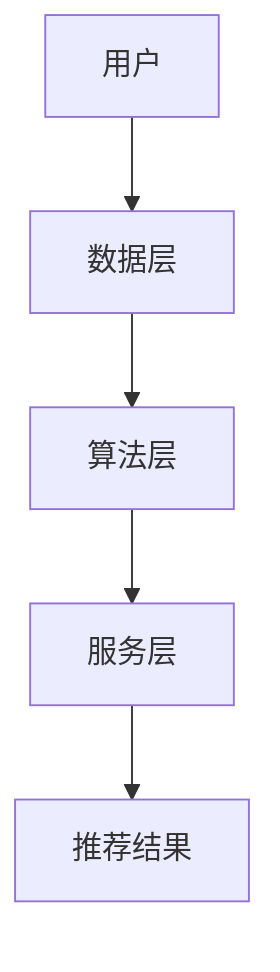

                 


# 金融产品交叉销售推荐引擎优化

> 关键词：交叉销售，推荐引擎，金融产品，协同过滤，深度学习

> 摘要：本文详细探讨了金融产品交叉销售推荐引擎的优化策略，从背景介绍到系统架构设计，再到实际项目案例分析，全面解析了如何通过技术手段提升推荐效率和精准度。文章结合协同过滤、矩阵分解等算法，深入分析了金融推荐系统的优化方向，并通过实际案例展示了优化效果。

---

## 第一部分: 金融产品交叉销售推荐引擎优化背景与概念

### 第1章: 金融产品交叉销售概述

#### 1.1 交叉销售的定义与特点
交叉销售是指在同一交易过程中，向客户推荐多种相关产品或服务，以增加销售额和客户满意度的一种销售策略。其核心特点包括：
- **关联性**：推荐的产品与当前产品密切相关。
- **精准性**：基于客户行为和偏好进行推荐。
- **实时性**：推荐过程快速响应客户需求。

#### 1.2 金融产品的特点与分类
金融产品种类繁多，主要包括存款、贷款、保险、基金、股票、债券等。这些产品的共同特点包括高风险、高收益、合规性要求严格。

#### 1.3 交叉销售的核心概念与背景
在金融行业，交叉销售不仅能够提升客户满意度，还能降低营销成本。然而，金融产品的复杂性和客户风险承受能力的差异使得推荐引擎的设计更加复杂。

### 第2章: 推荐引擎的基本原理

#### 2.1 推荐引擎的定义与分类
推荐引擎是一种基于用户行为和产品特征，自动向用户推荐相关内容的技术。其分类包括基于协同过滤、基于内容的推荐以及混合推荐模型。

#### 2.2 金融产品推荐引擎的特殊性
金融推荐引擎需要考虑合规性、风险控制等因素，推荐过程需要结合实时市场数据和用户信用评估。

#### 2.3 交叉销售推荐引擎的目标与价值
通过推荐引擎实现精准推荐，提升客户转化率和满意度，同时优化资源配置。

---

## 第二部分: 交叉销售推荐引擎的核心概念与联系

### 第3章: 核心概念与原理

#### 3.1 推荐引擎的核心概念
- **用户行为分析**：通过用户的历史行为数据，挖掘用户的兴趣和偏好。
- **产品相似度计算**：基于产品属性或用户行为数据，计算产品的相似性。

#### 3.2 交叉销售的核心原理
- **协同过滤**：基于用户行为数据，寻找相似用户或产品的推荐。
- **内容推荐**：基于产品本身的特征进行推荐。

#### 3.3 金融产品推荐的核心要素
- **用户画像**：通过数据挖掘构建用户的详细画像。
- **产品关联规则**：利用关联规则挖掘相关产品组合。

### 第4章: 核心概念与联系的数学模型

#### 4.1 协同过滤模型
基于用户的协同过滤推荐公式：
$$ sim(u, v) = \frac{\sum_{i} (r_{u,i} - \bar{r}_u)(r_{v,i} - \bar{r}_v)}{\sqrt{\sum_{i} (r_{u,i} - \bar{r}_u)^2} \sqrt{\sum_{i} (r_{v,i} - \bar{r}_v)^2}} $$

---

## 第三部分: 算法原理与优化

### 第5章: 算法原理与优化策略

#### 5.1 矩阵分解算法
矩阵分解是一种常用的推荐算法，其核心思想是将用户-产品评分矩阵分解为两个低维矩阵。例如，使用交替最小二乘法（ALS）进行分解：
$$ X = P \cdot Q^T $$

#### 5.2 深度学习模型
基于神经网络的推荐模型，如深度协同过滤（DCN），能够更好地捕捉用户和产品之间的复杂关系。

---

## 第四部分: 系统架构与实现

### 第6章: 系统架构设计

#### 6.1 系统功能设计
- 数据层：存储用户行为数据、产品信息。
- 算法层：实现推荐算法。
- 服务层：提供推荐结果接口。

#### 6.2 系统架构图


---

## 第五部分: 项目实战与优化

### 第7章: 项目实战与优化

#### 7.1 环境安装
安装Python和相关库：
```bash
pip install numpy pandas scikit-learn
```

#### 7.2 核心代码实现
```python
from sklearn.decomposition import NMF

# 初始化模型
model = NMF(n_components=5, random_state=42)
```

#### 7.3 优化与调优
通过交叉验证选择最优参数，例如：
```python
from sklearn.model_selection import GridSearchCV

param_grid = {'n_components': [5, 10, 15]}
grid = GridSearchCV(NMF(), param_grid)
grid.fit(X)
```

---

## 第六部分: 总结与展望

### 第8章: 总结与展望

#### 8.1 总结
通过优化推荐引擎，可以显著提升金融产品的交叉销售效果，降低风险。

#### 8.2 未来展望
未来将结合实时数据和更复杂的深度学习模型，进一步提升推荐的精准度。

---

通过以上结构，我们可以系统地优化金融产品交叉销售推荐引擎，提升用户体验和销售效率。

