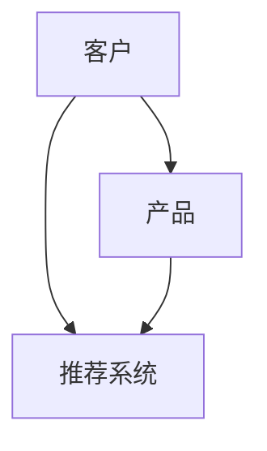
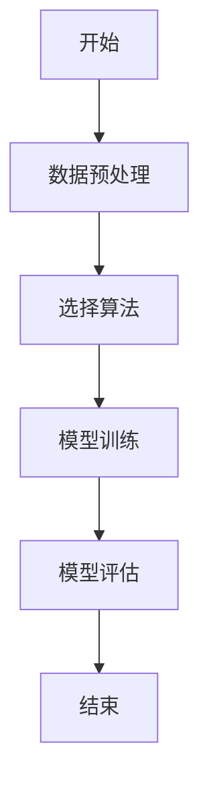
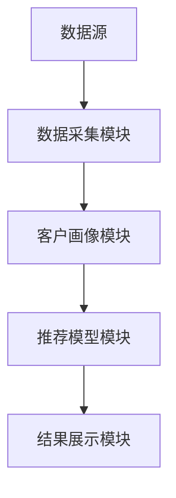

                 


# 金融产品交叉销售机会识别与个性化推荐

## 关键词：金融产品，交叉销售，个性化推荐，机器学习，客户行为分析

## 摘要：本文探讨了金融产品交叉销售机会识别与个性化推荐的方法，结合背景介绍、核心概念、算法原理、系统架构和项目实战，深入分析了如何利用机器学习和大数据技术提升金融推荐系统的效率和精准度，为金融行业提供有效的解决方案。

---

## 第一部分：背景介绍

### 第1章：问题背景与核心概念

#### 1.1 问题背景
金融行业竞争日益激烈，客户对个性化服务的需求增加，金融机构需要通过交叉销售提升客户满意度和收入。然而，传统推荐系统存在推荐精准度低、计算效率慢等问题，难以满足实时性和个性化要求。

#### 1.2 核心概念与问题描述
- **交叉销售机会识别**：通过分析客户行为和产品属性，识别潜在的销售机会。
- **个性化推荐**：基于客户特征和产品信息，提供定制化的产品推荐。
- **问题解决方法**：采用协同过滤、基于内容的推荐和深度学习模型，结合大数据技术提升推荐精准度。
- **边界与外延**：限定在特定金融产品和客户群体，扩展至多产品推荐和实时推荐。

#### 1.3 核心要素组成
- 客户信息：包括客户属性、购买历史和行为数据。
- 产品信息：涵盖产品类型、风险等级和收益情况。
- 推荐系统：整合分析模型和推荐策略。

---

## 第二部分：核心概念与联系

### 第2章：核心概念与联系

#### 2.1 核心概念原理
- **客户行为分析**：通过分析客户的购买历史和互动行为，识别潜在需求。
- **产品属性分析**：基于产品的特性，如风险等级和收益，进行推荐。
- **推荐算法原理**：协同过滤、基于内容的推荐和深度学习模型。

#### 2.2 概念属性特征对比
| 概念 | 属性特征 |
|------|----------|
| 客户行为 | 购买频率、互动时长、购买金额 |
| 产品属性 | 风险等级、收益、产品类型 |
| 推荐算法 | 精准度、计算效率、可解释性 |

#### 2.3 ER实体关系图


---

## 第三部分：算法原理讲解

### 第3章：推荐算法原理

#### 3.1 协同过滤算法
- **基于用户的协同过滤**：通过相似用户的行为推荐产品。
- **基于物品的协同过滤**：根据客户购买的物品推荐相似产品。
- **混合协同过滤**：结合用户和物品的特征，提升推荐准确性。

#### 3.2 基于内容的推荐算法
- **基于产品特征的推荐**：分析产品特征，如收益率和风险等级，推荐相似产品。
- **基于客户特征的推荐**：分析客户的财务状况和风险偏好，推荐合适产品。

#### 3.3 深度学习推荐模型
- **基于神经网络的推荐系统**：利用深度学习模型捕捉复杂特征。
- **基于注意力机制的推荐**：通过注意力机制聚焦关键特征。

#### 3.4 算法流程图


### 第4章：算法实现与数学模型

#### 4.1 协同过滤算法实现
```python
import numpy as np
from sklearn.metrics.pairwise import cosine_similarity

# 数据预处理
user_item_matrix = ...  # 用户-产品矩阵

# 计算相似度
similarity_matrix = cosine_similarity(user_item_matrix)

# 推荐算法
def recommend(users, items):
    # 计算相似度并排序
    sorted_items = np.argsort(similarity_matrix, axis=1)
    return sorted_items[:, -5:]  # 推荐前5个产品
```

#### 4.2 协同过滤数学模型
- 相似度计算公式：
  $$\text{相似度} = \frac{\sum_{i=1}^{n} (r_{ui} - \bar{r})}{\sqrt{\sum_{i=1}^{n} (r_{ui} - \bar{r})^2} \cdot \sqrt{\sum_{i=1}^{n} (r_{uj} - \bar{r})^2}}$$
- 矩阵分解模型：
  $$P \times Q^T = R$$

---

## 第四部分：系统分析与架构设计

### 第5章：系统分析与架构设计

#### 5.1 问题场景介绍
银行希望通过分析客户数据，推荐合适的理财产品，提升销售机会。

#### 5.2 系统功能设计
- **数据采集模块**：收集客户和产品数据。
- **客户画像模块**：分析客户行为和特征。
- **推荐模型模块**：应用算法生成推荐列表。
- **结果展示模块**：以用户友好的方式展示推荐结果。

#### 5.3 系统架构图


---

## 第五部分：项目实战

### 第6章：项目实战

#### 6.1 环境安装
安装Python、机器学习库（如scikit-learn、TensorFlow）和数据处理工具（如Pandas）。

#### 6.2 核心代码实现
```python
# 数据预处理
import pandas as pd
data = pd.read_csv('customer_data.csv')

# 协同过滤实现
from sklearn.metrics.pairwise import cosine_similarity
user_item_matrix = data.pivot('user_id', 'product_id', 'rating').fillna(0)

# 计算相似度
similarity = cosine_similarity(user_item_matrix)
```

#### 6.3 代码解读与分析
- **数据预处理**：将数据转换为用户-产品矩阵，处理缺失值。
- **协同过滤计算**：使用余弦相似度计算用户相似度，生成推荐列表。

#### 6.4 案例分析
以具体案例为例，分析推荐系统的应用效果，展示推荐结果和客户满意度提升。

#### 6.5 项目小结
总结项目成果，强调算法优势和实际应用价值。

---

## 第六部分：最佳实践与小结

### 第7章：最佳实践与小结

#### 7.1 最佳实践
- 数据质量：确保数据准确性和完整性。
- 模型选择：根据业务需求选择合适算法。
- 实时性：优化推荐系统，实现实时推荐。
- 伦理合规：遵守数据隐私和金融监管规定。

#### 7.2 小结
本文详细探讨了金融产品交叉销售机会识别与个性化推荐的方法，结合算法和系统设计，展示了如何利用技术提升金融服务的效率和精准度。

#### 7.3 注意事项
- 数据隐私保护
- 模型解释性
- 系统可扩展性

#### 7.4 拓展阅读
推荐相关书籍和论文，如《集体智慧编程》和《深度学习》。

---

通过以上结构，文章系统地介绍了金融产品交叉销售机会识别与个性化推荐的各个方面，结合实际案例和代码实现，帮助读者全面理解和应用相关技术。

