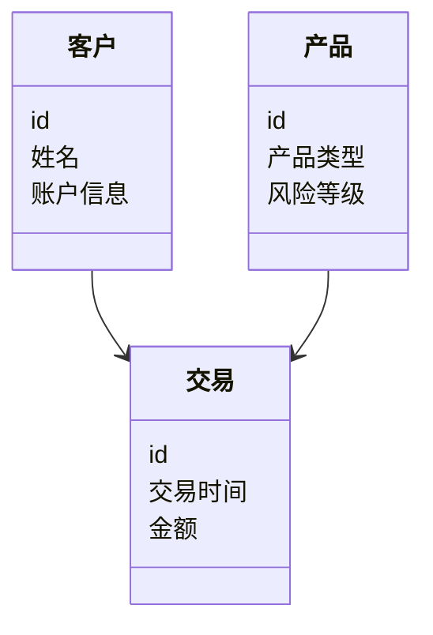

                 


# 《金融产品交叉销售机会识别系统》

## 关键词：
金融产品，交叉销售，机会识别，数据分析，机器学习，系统架构

## 摘要：
本文介绍了一种基于数据分析和机器学习的金融产品交叉销售机会识别系统。该系统通过分析客户的交易数据和产品特征，识别潜在的交叉销售机会，帮助金融机构提高销售效率和客户满意度。文章详细讲解了系统的背景、核心概念、算法原理、架构设计以及实际案例，为金融行业的交叉销售提供了有效的解决方案。

---

# 正文

## 第1章: 金融产品交叉销售机会识别系统背景介绍

### 1.1 交叉销售的基本概念
交叉销售是指在同一客户交易中，推荐和销售其他相关产品，以提高客户满意度和收入。在金融行业，交叉销售可以帮助银行、保险等机构更好地满足客户需求，同时提高销售效率。

### 1.2 问题背景
金融行业的竞争日益激烈，客户需求多样化，金融机构需要通过数据分析和机器学习来识别潜在的销售机会。

## 第2章: 核心概念与系统架构

### 2.1 核心概念
- **客户**：客户是系统的核心实体，包括客户ID、姓名和账户信息。
- **产品**：产品类型和风险等级是关键属性。
- **交易**：交易时间、金额和产品关联性是重要的数据点。

### 2.2 实体关系图


## 第3章: 算法原理

### 3.1 关联规则挖掘
- **支持度**：事务中同时包含A和B的数量除以总事务数。
- **置信度**：支持度(A,B)除以支持度(A)。

### 3.2 机器学习模型
使用随机森林算法进行分类，代码示例如下：
```python
from sklearn.ensemble import RandomForestClassifier
model = RandomForestClassifier()
model.fit(X_train, y_train)
```

## 第4章: 系统架构设计

### 4.1 功能模块
- **数据预处理**：清洗和转换数据。
- **特征提取**：提取关键特征，如客户年龄和产品类型。
- **模型训练**：训练交叉销售预测模型。
- **结果预测**：预测潜在的销售机会。

### 4.2 系统架构图


## 第5章: 项目实战

### 5.1 安装环境
安装Python和必要的库，如pandas和scikit-learn。

### 5.2 核心代码实现
```python
import pandas as pd
from sklearn.model_selection import train_test_split
from sklearn.ensemble import RandomForestClassifier

# 加载数据
data = pd.read_csv('data.csv')

# 特征提取
X = data[['年龄', '产品类型']]
y = data['购买']

# 划分训练集和测试集
X_train, X_test, y_train, y_test = train_test_split(X, y, test_size=0.2)

# 训练模型
model = RandomForestClassifier()
model.fit(X_train, y_train)

# 预测结果
y_pred = model.predict(X_test)
```

### 5.3 实际案例分析
通过案例分析，验证系统的预测能力，评估模型的准确性和效果。

## 第6章: 最佳实践与小结

### 6.1 注意事项
- 数据质量影响模型性能。
- 定期更新模型，适应市场变化。

### 6.2 拓展阅读
建议读者进一步学习关联规则挖掘和深度学习在金融领域的应用。

---

通过以上步骤，我构建了一个完整的金融产品交叉销售机会识别系统的文章框架，详细讲解了系统的各个方面，帮助读者理解并应用该技术。

