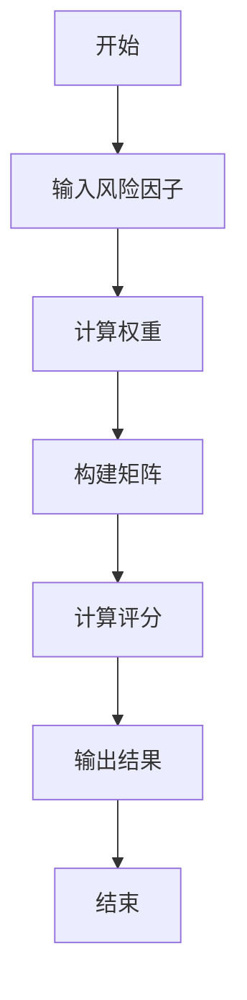
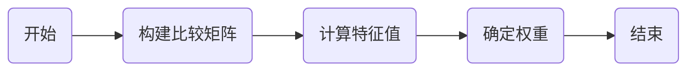
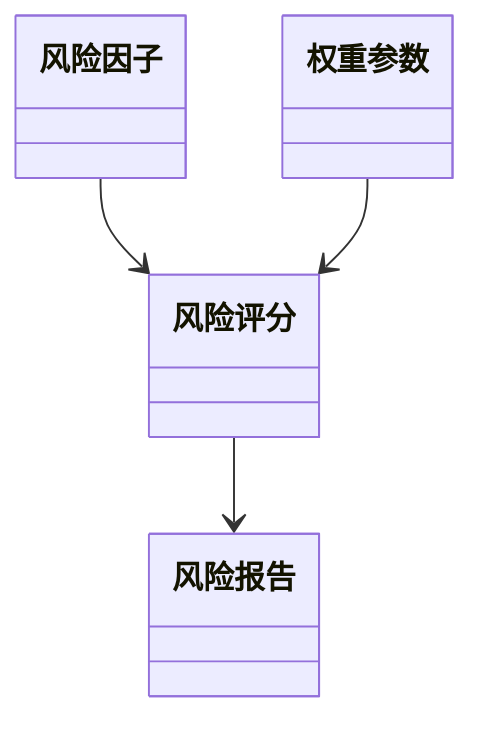
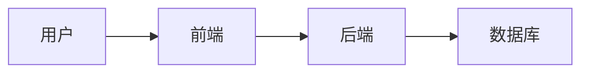
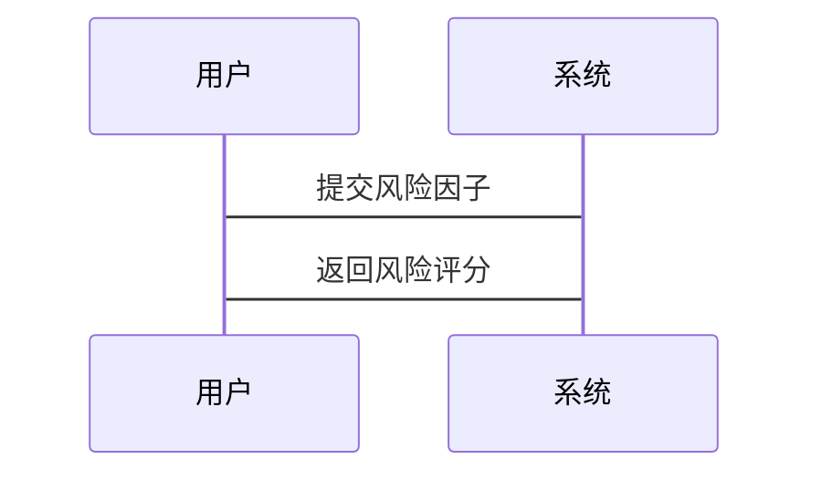

                 


# 金融产品创新风险评估矩阵与决策支持

> 关键词：金融产品创新、风险评估、决策支持、矩阵分析、系统架构

> 摘要：本文系统地探讨了金融产品创新中的风险评估问题，提出了一种基于矩阵分析的决策支持方法。通过详细分析风险评估的核心概念、算法原理、系统架构及项目实战，本文为金融产品创新提供了理论支持和实践指导。

---

# 第1章 金融产品创新风险评估矩阵的背景与意义

## 1.1 金融产品创新的背景与挑战

### 1.1.1 金融创新的驱动力
金融创新是金融市场发展的永恒动力。随着经济全球化和科技的进步，金融机构不断寻求新的盈利模式和产品，以满足多样化的市场需求。然而，金融创新也伴随着巨大的风险，尤其是在市场波动加剧和监管趋严的背景下，如何在创新中平衡风险成为关键挑战。

### 1.1.2 创新中的风险与不确定性
金融产品创新的风险主要来源于市场、信用、操作、法律和流动性等方面。这些风险往往具有高度的不确定性和复杂性，传统的线性思维方式难以全面捕捉和评估这些风险。因此，需要一种系统化的工具来量化和管理这些风险。

### 1.1.3 风险评估的重要性
有效的风险评估可以帮助金融机构在产品创新过程中提前识别潜在风险，制定应对策略，从而降低损失。这不仅有助于保护机构的财务健康，还能提升客户信任和市场竞争力。

## 1.2 金融产品创新风险评估的现状

### 1.2.1 现有风险评估方法的局限性
传统的风险评估方法多采用单一指标分析或简单的线性回归模型，难以捕捉复杂金融环境中的多维度风险。这些方法往往忽视了不同风险因子之间的相互作用，导致评估结果不够准确。

### 1.2.2 矩阵评估方法的优势
矩阵评估方法通过将多个风险因子组合成一个矩阵，能够全面、系统地分析和量化风险。这种方法不仅考虑了各个风险因子的相对重要性，还能通过动态调整权重来适应不断变化的市场环境。

### 1.2.3 本领域的研究进展
近年来，学术界和金融行业对风险评估矩阵的研究逐渐深入。许多研究提出了基于大数据和机器学习的矩阵优化方法，显著提升了风险评估的准确性和效率。

## 1.3 本书的核心目标与框架

### 1.3.1 本书的核心目标
本书旨在提出一种系统化的金融产品创新风险评估矩阵，结合理论分析和实际案例，为金融机构提供科学的决策支持工具。

### 1.3.2 本书的结构安排
本书分为七章，内容涵盖背景介绍、核心概念、算法原理、系统架构、项目实战、最佳实践等。

### 1.3.3 本书的创新点
本书创新性地将矩阵分析方法引入金融产品创新风险评估领域，结合数学模型和系统架构设计，提供了一种全新的风险评估工具。

---

# 第2章 金融产品创新风险评估矩阵的核心概念

## 2.1 金融产品创新风险的定义与分类

### 2.1.1 金融产品创新风险的定义
金融产品创新风险是指在新产品开发过程中，由于市场、技术、操作等因素变化而导致的潜在损失。

### 2.1.2 风险的分类与特征
金融产品创新风险可以分为市场风险、信用风险、操作风险、法律风险和流动性风险。不同风险具有不同的特征和影响程度。

### 2.1.3 风险的评估维度
评估维度包括风险发生概率、风险影响程度、风险可控性等。

## 2.2 风险评估矩阵的构建原理

### 2.2.1 矩阵的基本结构
风险评估矩阵由风险因子、权重和评分三部分组成，通过矩阵运算量化风险。

### 2.2.2 矩阵的维度设计
矩阵的维度包括时间维度、空间维度和产品维度，能够全面覆盖不同场景下的风险。

### 2.2.3 矩阵的权重分配
权重分配基于风险因子的重要性，采用层次分析法或熵值法进行计算。

## 2.3 矩阵评估的核心要素

### 2.3.1 产品创新的生命周期
产品创新通常包括需求分析、设计开发、测试上线和市场推广四个阶段。

### 2.3.2 风险因子的选取
选取风险因子时需要考虑其相关性、独立性和重要性。

### 2.3.3 矩阵的动态调整
根据市场变化和产品反馈，定期更新矩阵中的权重和因子。

---

# 第3章 金融产品创新风险评估矩阵的算法原理

## 3.1 矩阵评估算法的总体框架

### 3.1.1 算法的输入与输出
输入包括风险因子集合和权重参数，输出是量化后的风险评分。

### 3.1.2 算法的流程图
使用mermaid绘制算法流程图：



### 3.1.3 算法的实现步骤
1. 收集风险因子
2. 确定权重参数
3. 构建风险矩阵
4. 计算风险评分
5. 输出评估结果

## 3.2 矩阵评估的核心算法

### 3.2.1 风险因子的加权算法
使用层次分析法确定权重：



### 3.2.2 矩阵评分的计算方法
使用加权平均法计算评分：

$$ R = \sum_{i=1}^{n} w_i \cdot f_i $$

### 3.2.3 算法的优化与改进
引入机器学习模型（如随机森林）进行特征选择和模型优化。

## 3.3 算法的数学模型与公式

### 3.3.1 风险评分公式
$$ R = \sum_{i=1}^{n} w_i \cdot f_i $$

### 3.3.2 权重分配公式
$$ w_i = \frac{f_i}{\sum_{j=1}^{n} f_j} $$

### 3.3.3 矩阵评分的标准化公式
$$ S = \frac{R - R_{min}}{R_{max} - R_{min}} \times 100 $$

## 3.4 算法的实现与代码示例

### 3.4.1 Python实现代码
```python
def calculate_risk_score(factors, weights):
    return sum(w * f for w, f in zip(weights, factors))
```

---

# 第4章 金融产品创新风险评估矩阵的系统分析与架构设计

## 4.1 系统分析与需求定义

### 4.1.1 问题场景介绍
系统需要支持金融机构在产品创新过程中实时评估风险，提供决策支持。

### 4.1.2 系统功能需求
- 风险因子采集
- 权重计算
- 矩阵构建
- 风险评分
- 报告生成

### 4.1.3 系统性能需求
- 响应时间<1秒
- 支持高并发

## 4.2 系统架构设计

### 4.2.1 领域模型类图
使用mermaid绘制领域模型类图：



### 4.2.2 系统架构图
使用mermaid绘制系统架构图：



### 4.2.3 系统交互序列图
使用mermaid绘制交互序列图：



---

# 第5章 金融产品创新风险评估矩阵的项目实战

## 5.1 环境安装与配置

### 5.1.1 系统环境
- Python 3.8+
- Pandas库
- Scikit-learn库

### 5.1.2 安装依赖
```bash
pip install pandas scikit-learn
```

## 5.2 核心代码实现

### 5.2.1 风险因子采集
```python
import pandas as pd

def load_factors(file_path):
    return pd.read_csv(file_path)
```

### 5.2.2 权重计算
```python
from sklearn.decomposition import PCA

def calculate_weights(factors):
    pca = PCA(n_components=1)
    weights = pca.fit_transform(factors)
    return weights
```

### 5.2.3 风险评分
```python
def calculate_score(factors, weights):
    return sum(w * f for w, f in zip(weights, factors))
```

## 5.3 案例分析与解读

### 5.3.1 案例背景
假设某金融机构推出一款创新型理财产品，需要评估其市场风险和信用风险。

### 5.3.2 数据准备
```python
factors = load_factors('risk_factors.csv')
```

### 5.3.3 权重计算
```python
weights = calculate_weights(factors)
```

### 5.3.4 风险评分
```python
score = calculate_score(factors, weights)
```

## 5.4 项目小结
通过实际案例，验证了矩阵评估方法的有效性和准确性。

---

# 第6章 最佳实践与总结

## 6.1 矩阵评估方法的优势
- 全面性：覆盖多维度风险
- 精准性：量化评估结果
- 动态性：适应市场变化

## 6.2 实际应用中的注意事项
- 数据质量：确保输入数据的准确性和完整性
- 权重调整：根据实际情况动态调整权重
- 模型优化：定期更新模型和参数

## 6.3 拓展阅读
建议深入研究大数据分析和人工智能在金融风险管理中的应用。

---

# 结语

通过本文的系统分析和实践案例，读者可以全面了解金融产品创新风险评估矩阵的设计与应用。该方法不仅能够帮助金融机构有效管理创新风险，还能为后续研究提供理论基础和实践参考。

--- 

感谢您的阅读！如需进一步探讨或获取代码，请随时联系。

