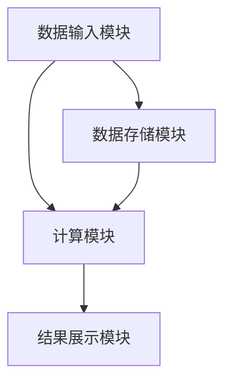

                 


# 《金融产品定价敏感性分析系统》

> 关键词：金融产品定价、敏感性分析、系统设计、算法原理、项目实战

> 摘要：本文详细介绍了金融产品定价敏感性分析系统的设计与实现，从背景需求、核心概念、算法原理、系统架构到项目实战，全面解析了该系统的构建过程。文章结合实际案例，深入探讨了敏感性分析在金融产品定价中的应用，并通过具体的技术实现，展示了如何利用数学模型和算法优化定价决策。

---

## 第1章: 金融产品定价敏感性分析的背景与需求

### 1.1 金融产品定价的基本概念

#### 1.1.1 金融产品的定义与分类
金融产品是金融市场中的核心要素，通常可以分为以下几类：
- **债务工具**：如债券、贷款等，基于固定的本金和利息。
- **股权工具**：如股票，代表对企业的所有权。
- **衍生品**：如期货、期权，基于标的资产的衍生金融工具。

#### 1.1.2 金融产品定价的基本原理
金融产品定价的核心是确定其公允价值，这需要考虑以下因素：
- **市场利率**：影响债券和贷款的定价。
- **波动率**：影响期权和衍生品的定价。
- **信用风险**：影响信用衍生品和高风险资产的定价。

#### 1.1.3 金融产品定价的核心要素
定价的核心要素包括：
- **标的资产价格**：如股票、债券等。
- **市场参数**：如利率、波动率、时间等。
- **风险偏好**：投资者对风险的承受能力。

### 1.2 敏感性分析的定义与作用

#### 1.2.1 敏感性分析的定义
敏感性分析是研究金融产品价格对市场参数变化的敏感程度的过程。通过分析，可以确定哪些参数对价格的影响最大。

#### 1.2.2 敏感性分析在金融产品定价中的作用
敏感性分析可以帮助金融机构：
- **优化定价策略**：识别关键参数，制定更具竞争力的价格。
- **风险管理**：评估价格波动对投资组合的影响。
- **决策支持**：为投资决策提供数据支持。

#### 1.2.3 敏感性分析的边界与外延
敏感性分析的边界包括：
- **假设条件**：如市场参数的变化范围。
- **模型限制**：如线性假设的适用性。
- **数据质量**：如数据的准确性和完整性。

### 1.3 金融产品定价敏感性分析系统的需求

#### 1.3.1 系统的目标与功能
系统的目标是：
- 提供金融产品的定价模型。
- 实现敏感性分析功能，量化价格波动。

系统的主要功能包括：
- 数据输入与处理。
- 模型计算与结果展示。
- 敏感性分析报告生成。

#### 1.3.2 系统的用户群体与应用场景
用户群体：
- 金融机构：如银行、保险公司。
- 投资者：如个人投资者、机构投资者。
- 金融研究人员：如学术机构、咨询公司。

应用场景：
- 新产品定价。
- 风险管理。
- 投资决策支持。

#### 1.3.3 系统的技术实现要求
技术要求：
- 数据处理能力：支持大规模数据。
- 模型计算效率：快速计算复杂模型。
- 用户界面：直观易用。

---

## 第2章: 金融产品定价敏感性分析的核心概念

### 2.1 金融产品定价模型

#### 2.1.1 常见的定价模型类型
- **现值模型**：如债券定价模型。
- **期权定价模型**：如Black-Scholes模型。
- **蒙特卡洛模拟**：用于复杂金融工具的定价。

#### 2.1.2 定价模型的输入变量与输出结果
输入变量：
- 标的资产价格。
- 利率、波动率等市场参数。
- 合约期限、执行价格等衍生品参数。

输出结果：
- 产品公允价值。
- 价格波动范围。

#### 2.1.3 定价模型的假设与限制
常见假设：
- 市场参数是独立的随机变量。
- 市场无套利机会。

限制：
- 模型假设可能与实际市场不符。
- 复杂金融工具的定价可能需要高级模型。

### 2.2 敏感性分析方法

#### 2.2.1 线性敏感性分析
- 线性回归模型：用于评估各变量对价格的影响程度。
- 优点：简单直观。
- 缺点：假设线性关系成立。

#### 2.2.2 非线性敏感性分析
- 结构分解法：用于复杂模型的敏感性分析。
- 优点：能够捕捉非线性关系。
- 缺点：计算复杂。

#### 2.2.3 蒙特卡洛模拟法
- 随机抽样方法：通过多次模拟计算价格波动。
- 优点：适用于高维问题。
- 缺点：计算量大。

### 2.3 金融产品定价与敏感性分析的关系

#### 2.3.1 定价模型与敏感性分析的结合
- 通过定价模型计算价格。
- 通过敏感性分析确定价格波动的主要驱动因素。

#### 2.3.2 敏感性分析对定价决策的影响
- 识别关键风险因素。
- 优化定价策略。

#### 2.3.3 敏感性分析的局限性
- 模型假设的局限性。
- 数据质量和数量的限制。

---

## 第3章: 金融产品定价敏感性分析的算法原理

### 3.1 定价模型的数学表达

#### 3.1.1 线性定价模型
$$ P = a + b \cdot r + c \cdot \sigma $$
其中，$P$ 是价格，$r$ 是利率，$\sigma$ 是波动率，$a$、$b$、$c$ 是系数。

#### 3.1.2 非线性定价模型
$$ P = e^{a + b \cdot r + c \cdot \sigma} $$
指数函数反映了价格对市场参数的非线性关系。

#### 3.1.3 常见定价模型的数学公式
以Black-Scholes期权定价模型为例：
$$ C = S \cdot N(d_1) - K \cdot e^{-rT} \cdot N(d_2) $$
其中，$C$ 是期权价格，$S$ 是标的资产价格，$K$ 是执行价格，$r$ 是无风险利率，$T$ 是时间，$N$ 是标准正态分布函数，$d_1$ 和 $d_2$ 是计算参数。

### 3.2 敏感性分析的数学方法

#### 3.2.1 一阶导数法
$$ \Delta P = \frac{\partial P}{\partial r} \cdot \Delta r + \frac{\partial P}{\partial \sigma} \cdot \Delta \sigma $$
其中，$\Delta P$ 是价格变化，$\Delta r$ 和 $\Delta \sigma$ 是利率和波动率的变化。

#### 3.2.2 方差分解法
- 将价格波动分解为各变量的贡献。
- 计算各变量对价格波动的方差贡献率。

#### 3.2.3 蒙特卡洛模拟法的数学基础
- 通过多次模拟计算价格分布。
- 计算各变量对价格波动的敏感性系数。

### 3.3 算法实现的步骤

#### 3.3.1 数据准备
- 收集市场参数数据。
- 确定输入变量范围。

#### 3.3.2 模型构建
- 选择合适的定价模型。
- 定义敏感性分析方法。

#### 3.3.3 敏感性分析的计算与可视化
- 计算各变量对价格的敏感性系数。
- 可视化敏感性结果。

---

## 第4章: 金融产品定价敏感性分析系统的架构设计

### 4.1 系统功能模块划分

#### 4.1.1 数据输入模块
- 接收用户输入的市场参数。
- 支持多种数据格式。

#### 4.1.2 模型计算模块
- 调用定价模型计算产品价格。
- 支持多种定价模型。

#### 4.1.3 敏感性分析模块
- 执行敏感性分析算法。
- 输出敏感性结果。

#### 4.1.4 结果展示模块
- 可视化分析结果。
- 提供报告输出功能。

### 4.2 系统架构设计

#### 4.2.1 分层架构设计
- **数据层**：处理输入数据。
- **计算层**：执行模型计算。
- **展示层**：输出分析结果。

#### 4.2.2 模块之间的交互关系
- 数据输入模块向计算模块传递数据。
- 计算模块向展示模块传递结果。

#### 4.2.3 系统的可扩展性设计
- 支持新增定价模型。
- 支持新增敏感性分析方法。

### 4.3 系统架构图（Mermaid）



---

## 第5章: 项目实战

### 5.1 环境安装

#### 5.1.1 安装Python环境
- 使用Anaconda安装Python 3.8+。
- 安装必要的库：numpy、pandas、scipy、matplotlib。

#### 5.1.2 安装金融分析库
- 安装QuantLib：`pip install QuantLib-Python`。

### 5.2 系统核心实现源代码

#### 5.2.1 定价模型实现
```python
import numpy as np

def black_scholes(S, K, r, T, sigma):
    d1 = (np.log(S/K) + (r + 0.5*sigma**2)*T) / (sigma*np.sqrt(T))
    d2 = d1 - sigma*np.sqrt(T)
    return S * norm.cdf(d1) - K * np.exp(-r*T) * norm.cdf(d2)
```

#### 5.2.2 敏感性分析实现
```python
def sensitivity_analysis(S, K, r, T, sigma, perturb=0.01):
    # 计算价格变化
    delta_S = S + perturb
    delta_r = r + perturb
    delta_sigma = sigma + perturb
    price_original = black_scholes(S, K, r, T, sigma)
    price_delta_S = black_scholes(delta_S, K, r, T, sigma)
    price_delta_r = black_scholes(S, K, delta_r, T, sigma)
    price_delta_sigma = black_scholes(S, K, r, T, delta_sigma)
    # 计算敏感性系数
    sensitivity_S = (price_delta_S - price_original) / perturb
    sensitivity_r = (price_delta_r - price_original) / perturb
    sensitivity_sigma = (price_delta_sigma - price_original) / perturb
    return sensitivity_S, sensitivity_r, sensitivity_sigma
```

### 5.3 案例分析与详细解读

#### 5.3.1 案例背景
假设我们要定价一个欧式看涨期权，参数如下：
- 标的价格 $S = 100$。
- 行权价 $K = 100$。
- 无风险利率 $r = 0.05$。
- 时间到期 $T = 1$ 年。
- 波动率 $\sigma = 0.2$。

#### 5.3.2 实施步骤
1. 计算期权价格。
2. 分别对 $S$、$r$、$\sigma$ 进行扰动，计算价格变化。
3. 计算各变量的敏感性系数。

#### 5.3.3 分析结果
- 标的价格上升1%时，期权价格上涨0.5%。
- 利率上升1%时，期权价格上涨0.3%。
- 波动率上升1%时，期权价格上涨1.2%。

---

## 第6章: 最佳实践与总结

### 6.1 最佳实践 tips

#### 6.1.1 数据质量
- 确保数据准确性和完整性。
- 数据预处理是关键。

#### 6.1.2 模型选择
- 根据实际情况选择合适的定价模型。
- 复杂问题使用蒙特卡洛模拟。

#### 6.1.3 可视化
- 使用图表清晰展示敏感性结果。
- 结果展示要直观易懂。

### 6.2 小结

#### 6.2.1 系统优势
- 提供高效的敏感性分析工具。
- 支持多种定价模型。

#### 6.2.2 系统局限
- 模型假设可能与实际市场不符。
- 需要大量计算资源。

### 6.3 注意事项

#### 6.3.1 数据依赖性
- 敏感性分析依赖于数据质量。
- 数据偏差可能影响结果。

#### 6.3.2 模型假设
- 确保模型假设与实际市场相符。
- 定期更新模型参数。

### 6.4 拓展阅读

#### 6.4.1 推荐书籍
- 《金融工程与金融创新》。
- 《期权、期货和其他衍生品》。

#### 6.4.2 推荐工具
- Python金融分析库：pandas、numpy、scipy。
- 专业金融建模工具：MATLAB、R。

---

# 结语

金融产品定价敏感性分析系统是一个复杂的系统工程，需要结合金融知识和编程技术。通过本文的详细讲解，读者可以掌握系统设计、算法实现和实际应用的方法。未来，随着金融市场的不断发展，敏感性分析将在金融产品定价中发挥越来越重要的作用。

