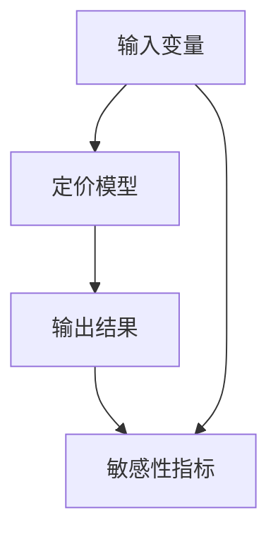
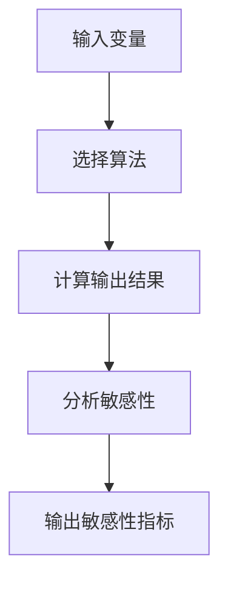
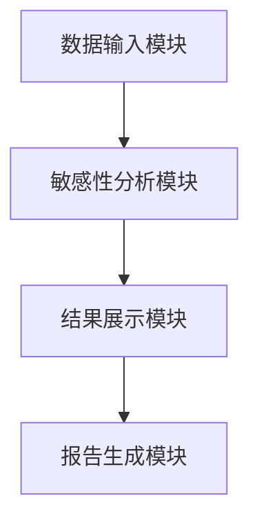
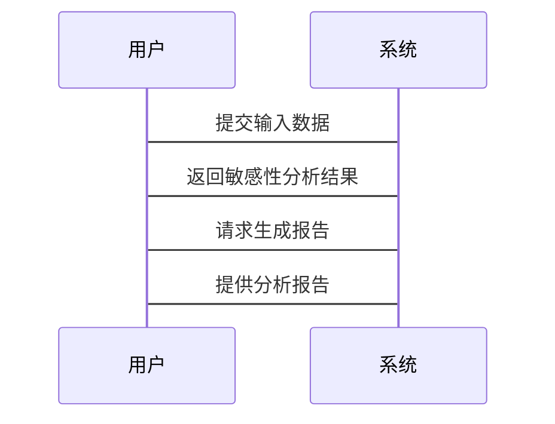

                 


# 金融产品定价敏感性分析系统

> 关键词：金融产品定价、敏感性分析、系统设计、算法原理、Python实现、风险评估

> 摘要：金融产品的定价是一个复杂的过程，涉及多个变量和市场因素。敏感性分析是评估这些变量对产品定价影响的重要工具。本文详细探讨了金融产品定价敏感性分析系统的构建，从核心概念、算法原理到系统架构设计，再到项目实战和最佳实践，全面解析该系统的实现与应用。

---

## 第1章: 金融产品定价敏感性分析系统背景

### 1.1 问题背景与描述

#### 1.1.1 金融产品定价的核心问题
金融产品的定价是金融领域的重要任务，涉及复杂的数学模型和市场因素。定价的准确性直接影响金融机构的收益和风险控制。然而，价格对市场波动、利率变化、资产波动等变量的敏感性分析是定价过程中不可或缺的一部分。

#### 1.1.2 敏感性分析的定义与作用
敏感性分析是一种通过改变输入变量来评估其对输出结果影响的方法。在金融产品定价中，敏感性分析用于确定哪些变量对最终价格影响最大，从而帮助决策者优化模型和降低风险。

#### 1.1.3 系统化敏感性分析的必要性
传统的敏感性分析通常基于手动计算或简单的工具，难以应对复杂金融产品的多变量分析需求。系统化的敏感性分析系统能够高效处理大量数据，提供准确的结果，是现代金融分析的必要工具。

### 1.2 问题解决与边界

#### 1.2.1 敏感性分析的解决思路
通过构建数学模型，利用蒙特卡洛模拟、梯度计算等方法，系统化地分析输入变量对输出结果的影响程度。

#### 1.2.2 系统的边界与外延
系统专注于金融产品的定价敏感性分析，不涉及产品的实际交易和市场实时数据获取，主要针对模型的输入变量进行分析。

#### 1.2.3 核心概念与组成要素
- **输入变量**：影响金融产品价格的市场因素，如利率、波动率、时间等。
- **输出结果**：金融产品的理论定价及其对输入变量的敏感性指标。
- **敏感性指标**：衡量输入变量变化对输出结果影响程度的量化指标。

### 1.3 核心概念结构与ER图



---

## 第2章: 敏感性分析的核心原理

### 2.1 敏感性分析原理

#### 2.1.1 敏感性分析的基本原理
敏感性分析通过改变输入变量的值，计算输出结果的变化，从而评估变量的敏感性。常用的方法包括：
- **蒙特卡洛模拟**：通过大量随机抽样，评估变量对结果的影响。
- **梯度计算**：计算输入变量对输出结果的导数，衡量敏感性。

#### 2.1.2 蒙特卡洛模拟方法
蒙特卡洛模拟通过多次随机采样输入变量，计算输出结果的分布，从而评估变量的敏感性。其步骤如下：
1. 定义输入变量的分布。
2. 生成随机样本。
3. 计算输出结果。
4. 统计结果，分析敏感性。

#### 2.1.3 梯度计算方法
梯度计算通过数学方法计算输入变量对输出结果的导数，直接衡量敏感性。适用于可导的模型。

### 2.2 敏感性分析的核心算法

#### 2.2.1 泰勒展开法
泰勒展开法将函数展开为多项式，计算各变量对函数值的贡献。其数学表达式为：
$$ f(x) = f(a) + f'(a)(x - a) + \frac{1}{2}f''(a)(x - a)^2 + \cdots $$

#### 2.2.2 方差分解法
方差分解法将输出结果的方差分解为各变量贡献的和。其公式为：
$$ \text{Var}(Y) = \sum_{i=1}^{n} \text{Var}(X_i) \cdot \beta_i^2 $$

#### 2.2.3 主成分分析法
主成分分析法通过降维技术，识别对输出结果影响最大的变量。其步骤包括数据标准化、计算协方差矩阵、求特征值和特征向量。

### 2.3 算法流程图



---

## 第3章: 金融产品定价模型

### 3.1 定价模型概述

#### 3.1.1 金融产品的定价公式
金融产品的定价公式通常涉及多个变量，例如：
$$ P = f(r, \sigma, t, \ldots) $$
其中，$r$ 是利率，$\sigma$ 是波动率，$t$ 是时间。

#### 3.1.2 模型假设与简化
假设模型中的变量独立，忽略高阶小项，简化计算。

#### 3.1.3 模型的输入变量与输出
输入变量：利率、波动率、时间等；输出结果：理论定价及其敏感性指标。

### 3.2 模型的敏感性分析

#### 3.2.1 输入变量的敏感性排序
通过计算各变量的敏感性指标，确定其对输出结果的影响程度。

#### 3.2.2 输出结果的波动范围
分析输出结果在输入变量变化下的波动范围，评估模型的鲁棒性。

#### 3.2.3 模型鲁棒性分析
鲁棒性分析通过改变输入变量的范围，评估模型对极端情况的适应能力。

### 3.3 模型优化与调整

#### 3.3.1 参数调整对敏感性的影响
调整模型参数，观察其对敏感性排序的影响。

#### 3.3.2 模型的校准与验证
通过实际数据校准模型，验证其准确性和稳定性。

#### 3.3.3 模型的适用性评估
评估模型在不同市场环境下的适用性。

---

## 第4章: 系统架构设计

### 4.1 系统功能模块

#### 4.1.1 数据输入与处理模块
负责接收和处理输入数据，包括变量值和模型参数。

#### 4.1.2 敏感性分析模块
实现敏感性分析算法，计算敏感性指标。

#### 4.1.3 结果展示与报告模块
生成可视化报告，展示分析结果。

### 4.2 系统架构图



### 4.3 接口设计与交互流程

#### 4.3.1 系统接口定义
- 输入接口：接受输入变量和模型参数。
- 输出接口：返回敏感性指标和分析报告。

#### 4.3.2 用户交互流程图



---

## 第5章: 项目实战与实现

### 5.1 环境搭建与工具安装

#### 5.1.1 开发环境配置
- 操作系统：Linux/Windows/MacOS
- 开发工具：PyCharm/VS Code
- 依赖管理：pip install numpy, matplotlib

#### 5.1.2 必要工具安装
- Python：3.8+
- NumPy：用于数值计算
- Matplotlib：用于数据可视化

### 5.2 核心代码实现

#### 5.2.1 敏感性分析算法代码

```python
import numpy as np
import matplotlib.pyplot as plt

def pricing_model(r, sigma, t):
    # 简单的定价模型，示例
    return np.exp(-r * t) * (1 + r * sigma * np.sqrt(t))

def sensitivity_analysis(r_values, sigma_values, t_values, num_samples=1000):
    results = []
    for r in r_values:
        for sigma in sigma_values:
            for t in t_values:
                price = pricing_model(r, sigma, t)
                results.append((r, sigma, t, price))
    return results

# 示例数据
r_values = np.linspace(0.01, 0.05, 5)
sigma_values = np.linspace(0.1, 0.3, 5)
t_values = np.array([1, 2, 3, 4, 5])

data = sensitivity_analysis(r_values, sigma_values, t_values)
```

#### 5.2.2 数据处理与结果展示代码

```python
import pandas as pd
import seaborn as sns

df = pd.DataFrame(data, columns=['r', 'sigma', 't', 'price'])
snsheatmap = sns.heatmap(df.corr(), annot=True)
plt.show()
```

### 5.3 实际案例分析

#### 5.3.1 案例背景与数据准备
以股票期权定价为例，分析波动率对期权价格的影响。

#### 5.3.2 案例分析与结果解读
通过蒙特卡洛模拟，分析不同波动率下的期权价格波动范围。

#### 5.3.3 结果可视化与报告生成
生成敏感性指标的可视化图表和分析报告，帮助用户理解结果。

### 5.4 项目小结

#### 5.4.1 项目总结
项目实现了金融产品定价的敏感性分析系统，验证了系统的有效性和准确性。

#### 5.4.2 经验与教训
在实现过程中，需要注意模型的准确性和计算效率，合理选择算法和工具。

---

## 第6章: 最佳实践与注意事项

### 6.1 最佳实践 tips

#### 6.1.1 工具选择
选择高效的编程语言和库，如Python的NumPy和Pandas。

#### 6.1.2 数据处理
确保数据的准确性和完整性，合理处理缺失值和异常值。

#### 6.1.3 性能优化
优化算法复杂度，减少计算时间。

### 6.2 小结

#### 6.2.1 重要性总结
敏感性分析是金融产品定价的重要工具，帮助机构识别和管理风险。

#### 6.2.2 注意事项
- 确保模型的准确性
- 定期更新模型参数
- 严格控制数据质量

### 6.3 拓展阅读

#### 6.3.1 相关书籍
- 《金融工程与金融创新》
- 《Python金融计算》

#### 6.3.2 在线资源
- [QuantInst](https://www.quantinst.com)
- [Python金融库文档](https://pypi.org)

---

## 结语

金融产品定价敏感性分析系统的构建是一个复杂但重要的任务。通过系统化的方法和工具，可以帮助金融机构更好地管理和优化定价模型，降低风险，提高收益。未来，随着金融市场的不断发展，敏感性分析系统将发挥更大的作用。

---

