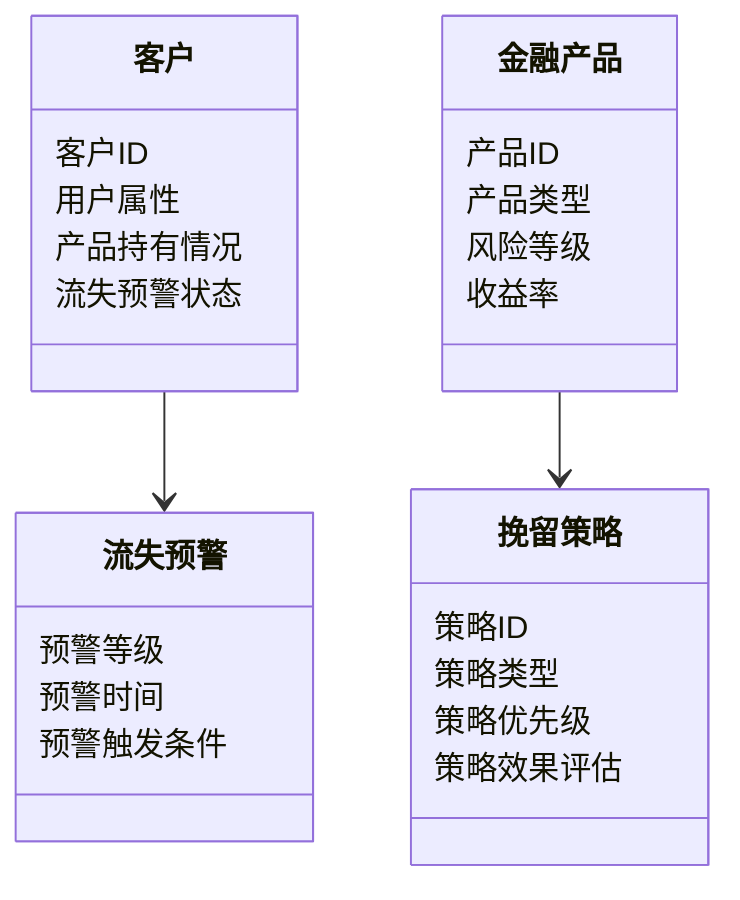
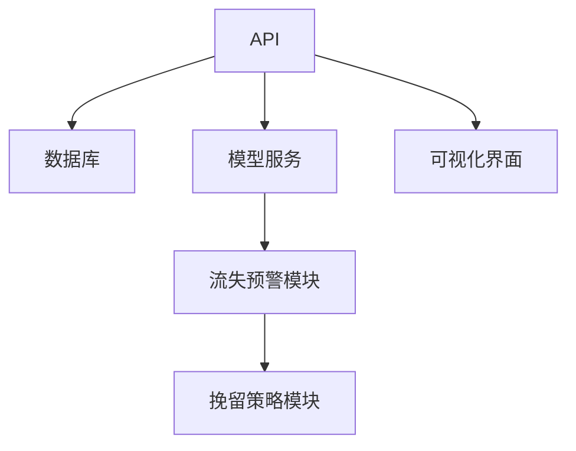
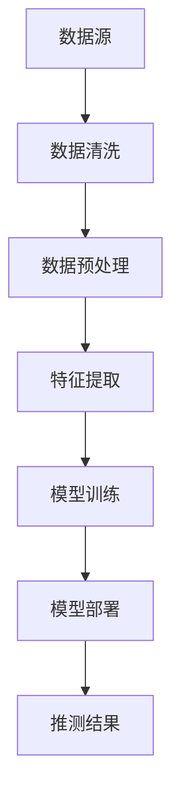
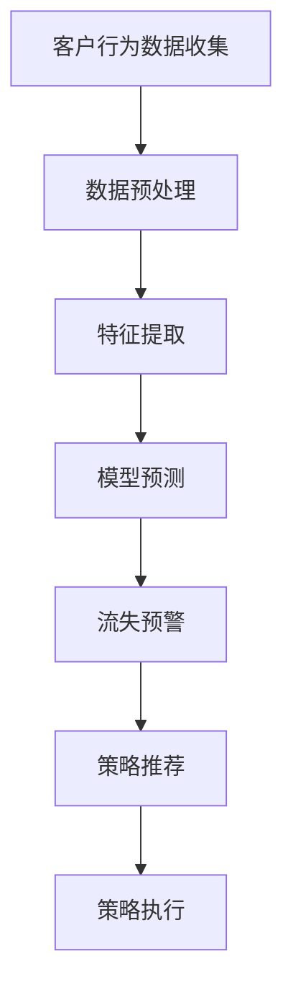

                 


# 《金融产品客户流失预警与挽留策略系统》

> 关键词：客户流失预警、客户挽留策略、机器学习、金融产品、风险管理

> 摘要：本文系统地探讨了金融产品客户流失预警与挽留策略系统的构建与应用。通过分析客户流失的背景与意义，结合机器学习算法，提出了基于逻辑回归与随机森林的客户流失预测模型，并设计了完整的系统架构与实现方案。文章还通过实际案例展示了系统的部署与应用，并提出了风险管理的最佳实践建议。

---

# 第三部分: 金融产品客户流失预警与挽留系统设计

# 第3章: 系统功能设计与架构

## 3.1 系统功能设计
### 3.1.1 客户流失预警模块
### 3.1.2 挽留策略推荐模块
### 3.1.3 数据分析与可视化模块

## 3.2 系统架构设计
### 3.2.1 领域模型类图


### 3.2.2 系统架构图


### 3.2.3 系统接口设计
- API接口定义
- 数据格式规范
- 接口调用流程

### 3.2.4 系统交互序列图
```mermaid
sequenceDiagram
    客户发起请求 --> API网关
    API网关 --> 数据库查询
    数据库返回数据 --> 数据处理层
    数据处理层 --> 模型服务调用
    模型服务返回预测结果 --> API网关
    API网关 --> 可视化界面展示
```

## 3.3 数据流与业务流程设计
### 3.3.1 数据流向图


### 3.3.2 业务流程图


## 3.4 本章小结

---

# 第4章: 系统实现与项目实战

## 4.1 环境配置与工具安装
### 4.1.1 开发环境配置
- Python版本要求
- 依赖库安装（如scikit-learn、pandas、numpy、matplotlib）
- 数据库选择与配置（如MySQL、MongoDB）

### 4.1.2 工具安装与配置
- Jupyter Notebook配置
- 数据可视化工具（如Matplotlib、Seaborn）
- 版本控制工具（如Git）

## 4.2 数据预处理与特征工程
### 4.2.1 数据清洗
- 删除重复数据
- 处理缺失值
- 标准化与归一化处理

### 4.2.2 特征提取
- 重要特征选择
- 特征组合与转换
- 特征降维（如PCA）

## 4.3 模型训练与部署
### 4.3.1 逻辑回归模型实现
```python
from sklearn.linear_model import LogisticRegression
from sklearn.metrics import accuracy_score

# 训练模型
model = LogisticRegression()
model.fit(X_train, y_train)

# 模型预测
y_pred = model.predict(X_test)
print("准确率:", accuracy_score(y_test, y_pred))
```

### 4.3.2 随机森林模型实现
```python
from sklearn.ensemble import RandomForestClassifier

model = RandomForestClassifier(n_estimators=100, max_depth=4, random_state=42)
model.fit(X_train, y_train)
y_pred = model.predict(X_test)
print("准确率:", accuracy_score(y_test, y_pred))
```

### 4.3.3 模型部署
- API接口开发
- 模型持久化
- 接入实时数据流

## 4.4 系统部署与案例分析
### 4.4.1 系统部署流程
- 后端服务部署
- 前端界面搭建
- 数据库优化

### 4.4.2 实际案例分析
- 数据集介绍
- 模型训练与调优
- 实际应用中的效果评估

## 4.5 本章小结

---

# 第5章: 系统总结与未来展望

## 5.1 系统总结
### 5.1.1 系统价值
- 提高客户留存率
- 降低客户流失成本
- 提升客户体验

### 5.1.2 系统优势
- 高准确性预测
- 灵活性策略推荐
- 实时监控能力

## 5.2 系统风险管理
### 5.2.1 数据质量问题
- 数据偏差
- 数据缺失
- 数据污染

### 5.2.2 模型选择风险
- 过度拟合
- 模型解释性差
- 模型泛化能力不足

### 5.2.3 客户隐私与数据安全
- 数据加密
- 权限控制
- 合规性要求

## 5.3 未来展望
### 5.3.1 技术进步方向
- 更先进的算法引入（如深度学习）
- 自适应模型优化
- 多模态数据融合

### 5.3.2 应用场景扩展
- 跨产品客户流失预警
- 跨行业应用
- 智能化决策支持

## 5.4 最佳实践 Tips
### 5.4.1 数据处理
- 确保数据质量
- 处理高维数据
- 管理数据流

### 5.4.2 模型选择
- 根据场景选择模型
- 调参优化
- 验证模型效果

### 5.4.3 策略制定
- 分层策略
- 定期评估
- 动态调整

## 5.5 本章小结

---

# 附录: 代码与图表

## 附录A: 核心代码示例
```python
# 逻辑回归模型训练
import numpy as np
import pandas as pd
from sklearn.linear_model import LogisticRegression
from sklearn.metrics import accuracy_score
from sklearn.model_selection import train_test_split

# 数据加载
data = pd.read_csv('customer_churn.csv')
X = data.drop('churn', axis=1)
y = data['churn']

# 数据分割
X_train, X_test, y_train, y_test = train_test_split(X, y, test_size=0.2, random_state=42)

# 模型训练
model = LogisticRegression()
model.fit(X_train, y_train)

# 模型预测与评估
y_pred = model.predict(X_test)
print("准确率:", accuracy_score(y_test, y_pred))
```

## 附录B: 图表展示
### 图表1: 客户流失预测模型的准确率对比


### 图表2: 客户流失预警等级分布


---

通过以上目录结构，文章系统地介绍了金融产品客户流失预警与挽留策略系统的构建过程，从理论到实践，从算法到系统设计，再到实际案例分析，为读者提供了全面的技术指导和实践参考。

