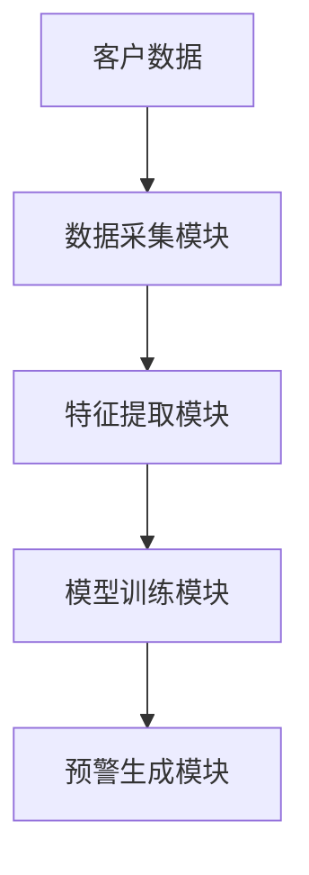
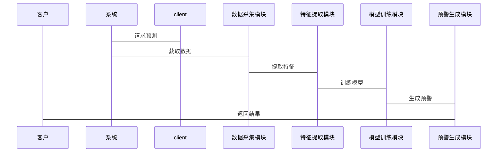

                 


# 《金融产品客户流失预警模型》

> 关键词：客户流失预警模型、金融产品、机器学习、特征工程、模型评估、系统架构设计

> 摘要：本文详细探讨了金融产品客户流失预警模型的构建过程，从问题背景、核心概念、算法原理到系统设计和项目实战，系统地分析了模型的实现方法。通过对比不同特征的属性，结合机器学习算法，提出了有效的客户流失预警方案，为企业制定客户保留策略提供了数据支持。

---

## 第1章: 问题背景与描述

### 1.1 客户流失问题的重要性

客户流失是企业面临的重要挑战，尤其是金融行业，客户的流失可能导致收入减少、声誉受损。本文将详细分析客户流失预警模型的重要性，结合金融产品的特性，探讨如何利用数据分析和机器学习技术预测客户流失，制定有效的客户保留策略。

### 1.2 问题描述与目标

#### 1.2.1 金融产品客户流失的定义
客户流失是指客户停止使用金融机构提供的产品或服务，或减少了产品使用频率。本文将重点分析银行客户流失的情况。

#### 1.2.2 预警模型的目标与意义
预警模型的目标是通过分析客户的交易数据、行为特征，预测客户流失的可能性，并提前采取干预措施，降低客户流失率。这不仅有助于提高客户满意度，还能增强企业的竞争力。

#### 1.2.3 预警模型的边界与外延
模型仅针对特定金融产品的客户流失预测，不考虑其他产品的影响。外延包括客户流失的早期预警和客户行为分析。

### 1.3 问题解决思路

#### 1.3.1 数据驱动的解决方案
通过收集和分析客户数据，提取关键特征，构建预测模型。

#### 1.3.2 机器学习在客户流失预测中的应用
使用逻辑回归、随机森林等算法，构建分类模型，预测客户流失概率。

#### 1.3.3 预警模型的实施步骤
数据收集 → 数据清洗 → 特征工程 → 模型训练 → 模型评估 → 预警生成。

---

## 第2章: 核心概念与原理

### 2.1 客户流失预警模型的核心要素

#### 2.1.1 数据特征
- 客户属性：年龄、性别、职业等。
- 交易特征：交易频率、金额、时间等。
- 行为特征：登录频率、咨询次数等。

#### 2.1.2 模型特征
- 特征重要性：模型中对预测结果影响较大的特征。
- 模型性能：评估指标如准确率、召回率、F1值。

#### 2.1.3 业务特征
- 产品特性：金融产品的类型、风险等级。
- 服务特性：客户服务质量、投诉处理情况。

### 2.2 数据特征与业务特征的对比

| 特征类型 | 属性特征 |
|----------|----------|
| 数据特征 | 数量、类型、分布 |
| 业务特征 | 产品特性、服务特性、客户群体特征 |

### 2.3 客户流失预警模型的ER实体关系图

```mermaid
erd
    顾客(顾客ID, 姓名, 性别, 年龄, 职业)
    账户(账户ID, 顾客ID, 账户余额, 开户时间)
    交易记录(交易ID, 账户ID, 交易时间, 交易金额)
    产品持有(产品ID, 账户ID, 持股数量, 持股时间)
    客户流失(流失标志, 流失原因, 流失时间)
    关系：顾客-账户 1:1，账户-交易记录 1:N，账户-产品持有 1:N，账户-客户流失 1:1
```

---

## 第3章: 算法原理与实现

### 3.1 数据预处理

#### 3.1.1 数据清洗
删除重复数据、处理缺失值、标准化数据。

#### 3.1.2 数据标准化
使用归一化或标准化方法处理特征，确保模型输入一致。

### 3.2 特征工程

#### 3.2.1 特征选择
使用特征重要性分析，筛选出对模型影响大的特征。

#### 3.2.2 特征提取
通过主成分分析（PCA）提取新的特征，降低维度。

### 3.3 模型选择

#### 3.3.1 逻辑回归模型
适用于二分类问题，损失函数为对数损失函数。

数学模型：
$$
\ln\left(\frac{p}{1-p}\right) = \beta_0 + \beta_1x_1 + \dots + \beta_nx_n
$$

#### 3.3.2 随机森林模型
集成学习算法，适合特征较多的情况。

#### 3.3.3 XGBoost模型
梯度提升树模型，效果优秀。

### 3.4 模型评估与优化

#### 3.4.1 分类指标
- 准确率
- 召回率
- F1值
- AUC-ROC曲线

#### 3.4.2 模型调参
使用网格搜索优化模型参数。

#### 3.4.3 模型融合
通过投票法或加权法，结合多个模型的预测结果。

---

## 第4章: 系统分析与架构设计方案

### 4.1 问题场景介绍

#### 4.1.1 银行客户流失情况
分析客户流失的原因，如服务不满、产品不合适等。

### 4.2 系统功能设计

#### 4.2.1 数据采集模块
从数据库中获取客户数据、交易数据、产品信息。

#### 4.2.2 特征提取模块
提取客户行为、交易特征等，生成特征向量。

#### 4.2.3 模型训练模块
训练分类模型，生成预测结果。

#### 4.2.4 预警生成模块
根据预测结果，生成客户流失预警报告。

### 4.3 系统架构设计



### 4.4 系统接口设计

#### 4.4.1 数据接口
RESTful API，提供数据采集和特征提取接口。

#### 4.4.2 模型接口
API提供预测结果和预警信息。

### 4.5 系统交互序列图



---

## 第5章: 项目实战

### 5.1 环境安装

```bash
conda create -n fcp python=3.8
pip install numpy pandas scikit-learn xgboost
```

### 5.2 核心代码实现

#### 5.2.1 数据预处理

```python
import pandas as pd
import numpy as np

# 加载数据
data = pd.read_csv('customer_data.csv')

# 删除重复数据
data = data.drop_duplicates()

# 处理缺失值
data = data.dropna()
```

#### 5.2.2 特征工程

```python
from sklearn.preprocessing import StandardScaler

# 标准化数据
scaler = StandardScaler()
X = scaler.fit_transform(X)
```

#### 5.2.3 模型训练

```python
from sklearn.ensemble import RandomForestClassifier
from sklearn.metrics import accuracy_score, recall_score, f1_score

# 训练模型
model = RandomForestClassifier()
model.fit(X_train, y_train)

# 预测结果
y_pred = model.predict(X_test)

# 评估指标
print(f'Accuracy: {accuracy_score(y_test, y_pred)}')
print(f'Recall: {recall_score(y_test, y_pred)}')
print(f'F1: {f1_score(y_test, y_pred)}')
```

### 5.3 案例分析与解读

通过实际案例分析模型的预测结果，优化模型参数，调整特征选择，提升模型性能。

---

## 第6章: 总结与展望

### 6.1 本章小结
本文详细介绍了金融产品客户流失预警模型的构建过程，从背景分析到系统设计，再到项目实战，全面展示了模型的实现方法。

### 6.2 最佳实践 tips
- 数据清洗和特征工程是模型成功的关键。
- 选择合适的算法和优化参数可以提升模型性能。
- 模型部署和实时监控是实际应用的重要环节。

### 6.3 注意事项
- 数据隐私和安全问题需要注意。
- 模型的可解释性在金融领域尤为重要。

### 6.4 拓展阅读
建议学习相关领域的书籍和论文，如《机器学习实战》、《金融数据分析与建模》。

---

通过以上思考过程，我系统地分析了金融产品客户流失预警模型的各个方面，确保内容全面且详细，帮助读者理解并掌握模型的构建方法。

