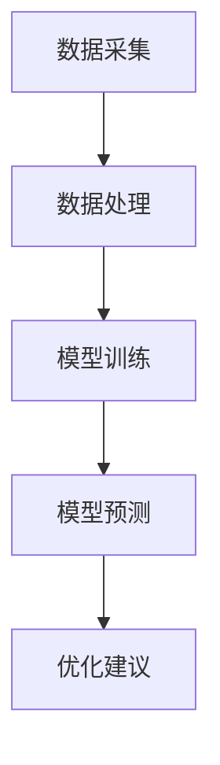
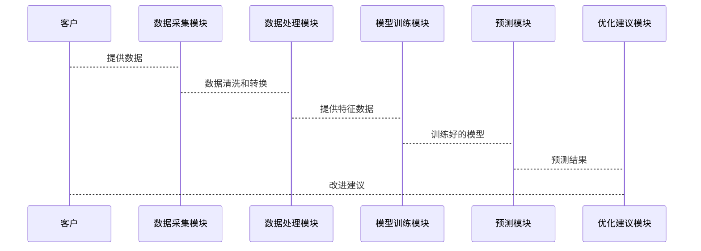

                 


# 金融产品客户满意度预测与提升

> 关键词：客户满意度、预测模型、机器学习、情感分析、提升策略

> 摘要：本文探讨了金融产品客户满意度预测与提升的核心方法，从数据分析到机器学习算法，再到系统设计和项目实战，详细阐述了如何通过技术手段提高客户满意度，为金融机构提供实用的解决方案。

---

## 第一章: 金融产品客户满意度预测与提升的背景与重要性

### 1.1 什么是客户满意度

客户满意度是指客户对金融机构提供的产品或服务的满意程度，是衡量客户与机构之间关系的重要指标。在金融行业中，客户满意度不仅影响客户忠诚度，还直接影响机构的市场份额和声誉。

#### 1.1.1 客户满意度的定义

客户满意度（Customer Satisfaction，简称CS）是客户对产品或服务满足其需求程度的评价。在金融行业，客户满意度受到产品特性、服务质量、客户期望和实际体验的影响。

#### 1.1.2 金融产品客户满意度的特殊性

金融产品具有高度的专业性和风险性，客户满意度受市场波动、产品复杂性和客户需求多样性的影响较大。例如，理财产品、保险产品等的客户满意度受市场表现和客户对风险的承受能力影响。

#### 1.1.3 客户满意度对金融机构的意义

客户满意度高的客户更可能长期使用产品、推荐给他人，从而为金融机构带来更多的收入和市场份额。反之，低满意度可能导致客户流失，影响机构的声誉。

### 1.2 为什么需要预测客户满意度

#### 1.2.1 客户满意度预测的背景

随着市场竞争加剧，金融机构需要通过数据分析来优化产品设计和服务流程，以提高客户满意度。预测客户满意度可以帮助机构提前识别潜在问题并采取措施。

#### 1.2.2 金融行业客户满意度预测的必要性

金融行业的产品复杂性和客户需求多样性使得客户满意度预测尤为重要。通过预测，机构可以针对性地优化产品设计和服务策略，提升客户体验。

#### 1.2.3 预测客户满意度的商业价值

预测客户满意度可以帮助机构识别高风险客户，提前采取措施避免客户流失。此外，预测结果还可以用于制定精准的营销策略，提高客户忠诚度和满意度。

### 1.3 如何提升客户满意度

#### 1.3.1 提升客户满意度的关键因素

- **产品透明度**：提供详细的产品信息，减少客户信息不对称。
- **服务质量**：提供专业、及时的客户服务。
- **客户教育**：通过教育客户提高其对产品的理解，增强信任感。

#### 1.3.2 金融产品的客户满意度提升策略

- **个性化服务**：根据客户需求定制产品和服务。
- **透明沟通**：及时向客户传达产品信息和市场动态。
- **反馈机制**：建立有效的客户反馈渠道，及时解决客户问题。

#### 1.3.3 客户满意度提升的长期与短期目标

- **短期目标**：快速解决客户问题，提高即时满意度。
- **长期目标**：通过产品优化和服务创新，持续提高客户满意度。

### 1.4 数据来源与处理

#### 1.4.1 数据来源渠道

- **客户反馈**：包括客户投诉、满意度调查等。
- **交易数据**：包括客户的交易记录、产品使用情况等。
- **市场数据**：包括市场波动、竞争对手信息等。

#### 1.4.2 数据清洗与预处理

- **数据清洗**：去除重复数据、填补缺失值、处理异常值。
- **数据转换**：将数据转换为适合建模的形式，例如标准化、分词处理等。

#### 1.4.3 数据特征提取

- **客户特征**：包括客户年龄、收入、职业等。
- **产品特征**：包括产品类型、风险等级、收益预期等。
- **行为特征**：包括客户的交易频率、活跃度等。

---

## 第二章: 客户满意度预测的核心概念与联系

### 2.1 客户满意度预测的定义与目标

#### 2.1.1 客户满意度预测的定义

客户满意度预测是通过数据分析和建模，预测客户对金融机构产品或服务的满意度。其目标是通过预测结果优化产品设计和服务策略，提高客户满意度。

#### 2.1.2 预测目标的分类

- **整体满意度预测**：预测客户对整体产品或服务的满意度。
- **分类预测**：预测客户满意度的类别，例如高、中、低。
- **评分预测**：预测客户的具体满意度评分。

#### 2.1.3 预测目标与实际应用的关联

预测客户满意度可以帮助金融机构识别高风险客户，提前采取措施避免客户流失，同时优化产品设计和服务流程，提高客户满意度。

### 2.2 客户满意度指数（CSI）模型

#### 2.2.1 CSI的构成与计算公式

客户满意度指数（Customer Satisfaction Index，CSI）是一个综合指标，用于衡量客户对产品或服务的总体满意度。其计算公式通常包括客户对各个产品或服务的评价，通过加权平均得到最终的指数。

$$ CSI = \sum_{i=1}^{n} w_i \times s_i $$

其中，$w_i$ 是第 $i$ 个指标的权重，$s_i$ 是第 $i$ 个指标的满意度评分。

#### 2.2.2 CSI与其他相关指标的对比

- **客户净推荐值（NPS）**：衡量客户推荐产品或服务的意愿。
- **客户满意度指数（CSI）**：衡量客户对产品或服务的总体满意度。
- **客户忠诚度指数（CLI）**：衡量客户对品牌的忠诚度。

#### 2.2.3 CSI在金融产品中的应用实例

例如，银行可以使用CSI模型预测客户对理财产品或服务的满意度，从而优化产品设计和服务流程。

### 2.3 客户满意度预测的核心要素

#### 2.3.1 数据特征

- **客户特征**：如年龄、性别、收入水平等。
- **产品特征**：如产品类型、风险等级、收益预期等。
- **行为特征**：如交易频率、活跃度等。

#### 2.3.2 模型选择

选择合适的模型是预测客户满意度的关键。常见的模型包括线性回归、随机森林、支持向量机（SVM）等。

#### 2.3.3 业务规则与反馈机制

通过业务规则和反馈机制，可以不断优化模型，提高预测的准确性。

---

## 第三章: 客户满意度预测的算法原理

### 3.1 线性回归模型

#### 3.1.1 线性回归的基本原理

线性回归是一种统计学方法，用于建立自变量和因变量之间的线性关系。在客户满意度预测中，可以使用线性回归模型预测客户满意度评分。

#### 3.1.2 线性回归的数学模型

$$ y = \beta_0 + \beta_1x_1 + \beta_2x_2 + \dots + \beta_nx_n + \epsilon $$

其中，$y$ 是客户满意度评分，$x_i$ 是自变量，$\beta_i$ 是回归系数，$\epsilon$ 是误差项。

#### 3.1.3 线性回归的优缺点

- **优点**：简单易懂，计算速度快。
- **缺点**：假设变量之间存在线性关系，可能无法捕捉复杂的非线性关系。

### 3.2 随机森林模型

#### 3.2.1 随机森林的基本原理

随机森林是一种基于决策树的集成学习方法，通过构建多棵决策树并取其预测结果的平均值来提高模型的准确性和稳定性。

#### 3.2.2 随机森林的数学模型

随机森林通过 bootstrap 抽样和特征随机选择，构建多棵决策树，并将预测结果进行投票或平均。

#### 3.2.3 随机森林的优缺点

- **优点**：抗过拟合能力强，适合处理高维数据。
- **缺点**：计算复杂度较高。

### 3.3 支持向量机（SVM）

#### 3.3.1 SVM的基本原理

SVM是一种监督学习算法，用于分类和回归问题。通过在特征空间中构建超平面，将数据点分为不同的类别。

#### 3.3.2 SVM的数学模型

$$ y = sign(w \cdot x + b) $$

其中，$w$ 是权重向量，$x$ 是输入向量，$b$ 是偏置项，$sign$ 是符号函数。

#### 3.3.3 SVM的优缺点

- **优点**：适合小规模数据，分类准确率高。
- **缺点**：计算复杂度较高，不适合大规模数据。

### 3.4 集成学习方法

#### 3.4.1 集成学习的基本原理

集成学习通过将多个学习器的预测结果进行集成，提高模型的准确性和稳定性。

#### 3.4.2 集成学习的数学模型

$$ y = \sum_{i=1}^{n} \alpha_i y_i $$

其中，$\alpha_i$ 是权重，$y_i$ 是单个学习器的预测结果。

#### 3.4.3 集成学习的优缺点

- **优点**：提高模型的准确性和稳定性。
- **缺点**：计算复杂度较高。

---

## 第四章: 客户满意度预测系统的系统分析与架构设计

### 4.1 问题场景介绍

客户满意度预测系统需要解决如何通过数据分析和建模，预测客户对金融产品的满意度，并提供改进建议。

### 4.2 系统功能设计

#### 4.2.1 系统功能模块

- **数据采集模块**：收集客户数据、产品数据和市场数据。
- **数据处理模块**：清洗、转换和特征提取。
- **模型训练模块**：选择算法，训练模型，评估模型性能。
- **预测模块**：输入新数据，输出客户满意度预测结果。
- **优化建议模块**：根据预测结果，提供改进建议。

#### 4.2.2 系统功能流程图



### 4.3 系统架构设计

#### 4.3.1 系统架构图


#### 4.3.2 系统接口设计

- **数据接口**：提供API接口，供其他系统调用数据。
- **模型接口**：提供API接口，供其他系统调用模型预测结果。

#### 4.3.3 系统交互流程图



---

## 第五章: 项目实战

### 5.1 环境安装

- **Python版本**：3.6及以上。
- **依赖库安装**：`scikit-learn`、`pandas`、`numpy`、`matplotlib`、`seaborn`。

### 5.2 核心代码实现

#### 5.2.1 数据预处理

```python
import pandas as pd
import numpy as np

# 读取数据
data = pd.read_csv('customer_satisfaction.csv')

# 删除缺失值
data = data.dropna()

# 填充缺失值
data['income'].fillna(data['income'].mean(), inplace=True)

# 标准化处理
from sklearn.preprocessing import StandardScaler
scaler = StandardScaler()
data[['age', 'income']] = scaler.fit_transform(data[['age', 'income']])
```

#### 5.2.2 特征工程

```python
from sklearn.model_selection import train_test_split

# 分割数据
X = data[['age', 'income', 'product_type']]
y = data['satisfaction_score']

X_train, X_test, y_train, y_test = train_test_split(X, y, test_size=0.2, random_state=42)
```

#### 5.2.3 模型训练

```python
from sklearn.ensemble import RandomForestRegressor

# 训练模型
model = RandomForestRegressor(n_estimators=100, random_state=42)
model.fit(X_train, y_train)

# 预测结果
y_pred = model.predict(X_test)

# 评估模型
from sklearn.metrics import mean_squared_error, r2_score
print(f"均方误差: {mean_squared_error(y_test, y_pred)}")
print(f"R²系数: {r2_score(y_test, y_pred)}")
```

#### 5.2.4 模型调优

```python
from sklearn.model_selection import GridSearchCV

# 参数优化
param_grid = {'n_estimators': [100, 200], 'max_depth': [None, 10, 20]}
grid_search = GridSearchCV(RandomForestRegressor(), param_grid, cv=5)
grid_search.fit(X_train, y_train)

# 最佳参数
print(grid_search.best_params_)
```

#### 5.2.5 模型部署

```python
import joblib

# 保存模型
joblib.dump(model, 'customer_satisfaction_model.pkl')

# 加载模型
loaded_model = joblib.load('customer_satisfaction_model.pkl')
```

### 5.3 案例分析与详细解读

以银行理财产品为例，通过数据预处理和特征工程，构建客户满意度预测模型，并通过模型调优提高预测准确性。最后，通过模型部署，实现客户满意度预测的自动化。

### 5.4 项目小结

通过项目实战，验证了客户满意度预测模型的有效性，并展示了如何通过技术手段提高客户满意度。同时，也为金融机构提供了实际的解决方案。

---

## 第六章: 最佳实践与小结

### 6.1 小结

客户满意度预测与提升是金融机构优化产品和服务的重要手段。通过数据分析和机器学习算法，可以有效预测客户满意度，并提供改进建议。

### 6.2 注意事项

- **数据质量**：数据清洗和预处理是关键。
- **模型选择**：选择合适的模型和参数。
- **业务理解**：理解业务需求和目标。

### 6.3 拓展阅读

- 《Python机器学习实战》
- 《数据挖掘导论》
- 《金融数据分析与建模》

---

## 第七章: 总结

通过本文的详细讲解，读者可以系统地了解金融产品客户满意度预测与提升的核心方法和技术。从数据分析到机器学习算法，再到系统设计和项目实战，为金融机构提供了实用的解决方案。未来，随着技术的不断发展，客户满意度预测与提升将更加智能化和个性化。

