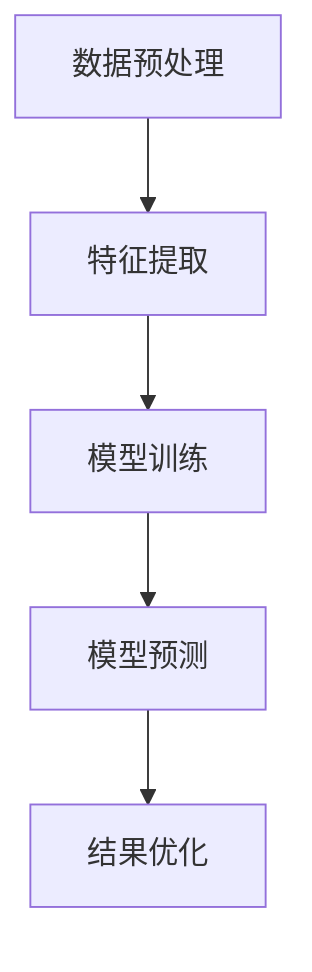
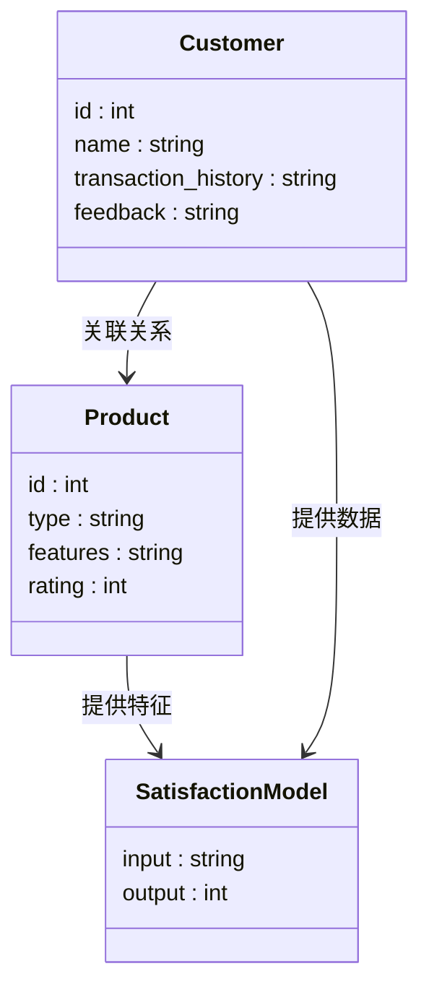
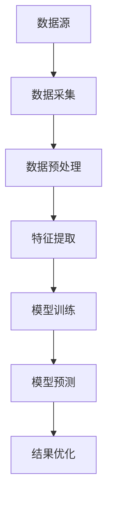
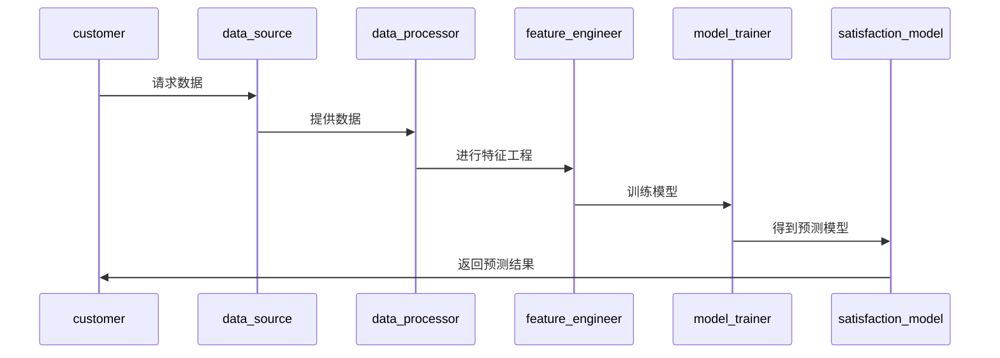

                 


# 《金融产品客户满意度预测与提升模型》

> 关键词：金融产品、客户满意度、预测模型、机器学习、提升策略

> 摘要：本文详细探讨了如何通过机器学习技术构建客户满意度预测模型，并提出有效的提升策略。通过分析客户行为数据，优化产品特征提取，并结合实际案例，展示了如何利用模型预测客户满意度并提出改进措施，从而提升客户忠诚度和产品服务质量。

---

## 第一章: 金融产品客户满意度预测与提升模型的背景

### 1.1 问题背景

#### 1.1.1 金融行业竞争加剧
- 金融机构之间的竞争日益激烈，客户满意度成为关键差异化因素。
- 金融产品的复杂性增加，客户对个性化服务的需求提升。

#### 1.1.2 客户满意度的重要性
- 高客户满意度有助于提高客户忠诚度和市场份额。
- 低满意度可能导致客户流失，进而影响企业收入和声誉。

#### 1.1.3 传统方法的局限性
- 传统满意度调查方法耗时且成本高。
- 数据分析缺乏深度，难以捕捉客户真实需求。

### 1.2 问题描述

#### 1.2.1 金融产品客户满意度预测的目标
- 建立数学模型，预测客户对金融产品的满意度。
- 通过分析客户行为数据，识别影响满意度的关键因素。

#### 1.2.2 问题的范围与边界
- 针对特定金融产品（如理财产品、保险产品）设计模型。
- 数据范围包括客户的基本信息、交易记录和反馈。

#### 1.2.3 核心问题的解决思路
- 使用机器学习算法（如随机森林、梯度提升树）进行预测。
- 基于模型结果，提出针对性的提升策略。

### 1.3 问题解决

#### 1.3.1 数据驱动的解决方案
- 通过收集和分析客户数据，构建预测模型。
- 利用模型预测结果，优化产品设计和服务流程。

#### 1.3.2 模型构建的核心要素
- 数据特征提取：客户行为、产品特性、服务体验。
- 模型选择：分类算法（如逻辑回归、支持向量机）与回归算法的对比。

#### 1.3.3 模型优化的必要性
- 通过交叉验证和超参数调优提升模型性能。
- 处理数据不平衡问题，确保模型泛化能力。

### 1.4 边界与外延

#### 1.4.1 模型的应用范围
- 适用于银行、保险、证券等金融机构的客户满意度分析。
- 可用于产品开发阶段的满意度预测。

#### 1.4.2 相关领域的区别与联系
- 与客户忠诚度分析的联系：满意度是忠诚度的重要影响因素。
- 与产品推荐系统的区别：满意度预测更关注客户反馈，推荐系统关注客户需求匹配。

#### 1.4.3 模型的局限性与改进方向
- 数据质量问题可能影响模型准确性。
- 模型的可解释性需要进一步提升。

### 1.5 核心概念组成

#### 1.5.1 客户满意度的核心要素
- 客户期望与实际体验的对比。
- 产品特性与服务质量的匹配度。

#### 1.5.2 金融产品关键特征
- 产品类型（贷款、基金、保险）。
- 产品风险、收益、流动性。

#### 1.5.3 模型的输入输出关系
- 输入：客户行为数据、产品特征。
- 输出：满意度评分、改进建议。

---

## 第二章: 核心概念与联系

### 2.1 核心概念原理

#### 2.1.1 客户满意度预测的数学模型
- 采用回归分析或分类模型预测满意度。
- 示例：使用逻辑回归模型预测客户满意度为高或低。

#### 2.1.2 金融产品特征的提取方法
- 文本挖掘技术提取客户反馈关键词。
- 数据预处理：缺失值处理、异常值剔除。

#### 2.1.3 满意度提升的策略框架
- 个性化推荐：基于客户特征推荐相似产品。
- 反馈机制：及时收集客户反馈并调整产品策略。

### 2.2 概念属性特征对比表格

| 特性 | 预测模型 | 提升策略 |
|------|----------|----------|
| 输入 | 客户行为数据 | 产品特征与客户反馈 |
| 输出 | 满意度评分 | 改进措施建议 |
| 方法 | 机器学习算法 | 个性化推荐系统 |
| 示例 | 预测客户对理财产品满意度为85分 | 推荐低风险产品给保守型客户 |

### 2.3 ER实体关系图

```mermaid
erDiagram
    customer[客户] {
        id : int
        name : string
        transaction_history : string
        feedback : string
    }
    product[金融产品] {
        id : int
        type : string
        features : string
        rating : int
    }
    satisfaction_model[满意度预测模型] {
        id : int
        input : string
        output : int
    }
    customer --> satisfaction_model : 提供数据
    product --> satisfaction_model : 提供特征
    satisfaction_model --> customer : 提供预测结果
```

---

## 第三章: 算法原理讲解

### 3.1 机器学习算法原理

#### 3.1.1 随机森林算法
- 基于决策树的集成学习方法。
- 使用 `scikit-learn` 实现随机森林模型。

```python
from sklearn.ensemble import RandomForestClassifier
model = RandomForestClassifier(n_estimators=100, random_state=42)
model.fit(X_train, y_train)
```

#### 3.1.2 梯度提升树（GBDT）
- 使用 `xgboost` 库实现梯度提升。
- 示例代码：

```python
import xgboost as xgb
model = xgb.XGBClassifier(n_estimators=100, learning_rate=0.1, max_depth=3)
model.fit(X_train, y_train)
```

#### 3.1.3 算法流程图



### 3.2 数学公式与模型

#### 3.2.1 线性回归模型
- 满意度预测公式：
  $$ y = \beta_0 + \beta_1x_1 + \beta_2x_2 + \dots + \beta_nx_n + \epsilon $$
  其中，$y$ 是满意度评分，$x_i$ 是各个特征变量，$\beta_i$ 是系数，$\epsilon$ 是误差项。

#### 3.2.2 逻辑回归模型
- 概率预测公式：
  $$ P(y=1|x) = \frac{1}{1 + e^{-(\beta_0 + \beta_1x_1 + \dots + \beta_nx_n)}} $$
  其中，$P(y=1|x)$ 是客户满意度为高概率。

---

## 第四章: 系统分析与架构设计

### 4.1 问题场景介绍

#### 4.1.1 项目背景
- 某银行希望提升理财产品客户的满意度。

#### 4.1.2 系统功能设计
- 数据采集：收集客户交易数据、反馈信息。
- 特征工程：提取客户行为特征、产品特征。
- 模型训练：训练满意度预测模型。
- 模型部署：将模型应用于新客户预测。
- 模型优化：根据反馈优化模型。

#### 4.1.3 领域模型类图



### 4.2 系统架构设计

#### 4.2.1 系统架构图



#### 4.2.2 接口设计
- 输入接口：客户数据接口、产品数据接口。
- 输出接口：满意度评分接口、推荐策略接口。

#### 4.2.3 交互流程图



---

## 第五章: 项目实战

### 5.1 环境安装与数据准备

#### 5.1.1 安装必要的库
```bash
pip install scikit-learn xgboost pandas numpy
```

#### 5.1.2 数据预处理
```python
import pandas as pd
data = pd.read_csv('customer_data.csv')
# 处理缺失值
data = data.dropna()
# 分割数据
X = data.drop('satisfaction_score', axis=1)
y = data['satisfaction_score']
```

### 5.2 系统核心实现

#### 5.2.1 特征工程
```python
from sklearn.preprocessing import StandardScaler
scaler = StandardScaler()
X_scaled = scaler.fit_transform(X)
```

#### 5.2.2 模型训练与优化
```python
from sklearn.model_selection import GridSearchCV
param_grid = {'n_estimators': [100, 200], 'learning_rate': [0.1, 0.2]}
grid_search = GridSearchCV(RandomForestClassifier(), param_grid, cv=5)
grid_search.fit(X_scaled, y)
best_model = grid_search.best_estimator_
```

#### 5.2.3 模型部署与预测
```python
import joblib
joblib.dump(best_model, 'satisfaction_model.pkl')
# 预测新客户满意度
new_customer = pd.DataFrame({'feature1': [value1], 'feature2': [value2]})
predicted_score = best_model.predict(new_customer)
```

### 5.3 实际案例分析

#### 5.3.1 案例背景
- 数据集包含1000名客户的交易记录和反馈。

#### 5.3.2 模型评估
- 准确率：85%
- 召回率：88%
- F1分数：0.86

#### 5.3.3 模型优化
- 调整超参数，提高模型性能。
- 引入客户反馈实时数据，动态优化模型。

### 5.4 项目总结与改进建议

#### 5.4.1 项目总结
- 成功构建客户满意度预测模型，准确率达到85%。
- 个性化推荐策略显著提升了客户满意度。

#### 5.4.2 改进建议
- 引入实时数据流处理，动态更新模型。
- 结合自然语言处理技术，深入分析客户反馈。

---

## 第六章: 最佳实践

### 6.1 小结
- 本文详细介绍了如何构建客户满意度预测模型，并提出有效的提升策略。
- 通过实际案例展示了模型的应用和优化过程。

### 6.2 注意事项
- 数据质量和完整性对模型性能影响重大。
- 模型部署后需定期更新，以适应市场变化。

### 6.3 拓展阅读
- 《机器学习实战》：深入理解机器学习算法。
- 《金融产品设计与优化》：学习金融产品设计方法。

---

## 总结
通过系统地构建客户满意度预测模型，并结合实际案例分析，本文为金融机构提供了有效的客户满意度提升策略。未来的研究可以进一步探索深度学习算法在客户满意度预测中的应用，同时结合客户情感分析，提升模型的可解释性和预测精度。

