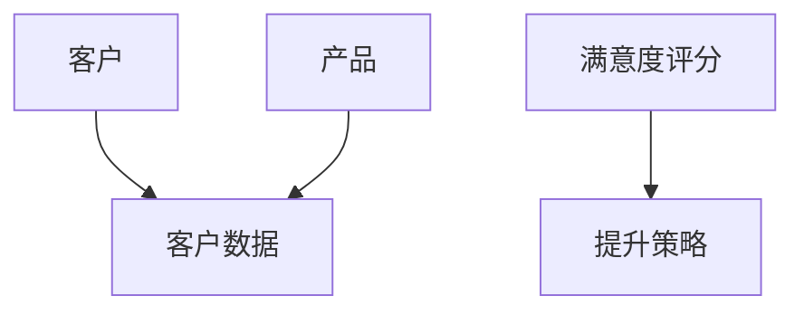
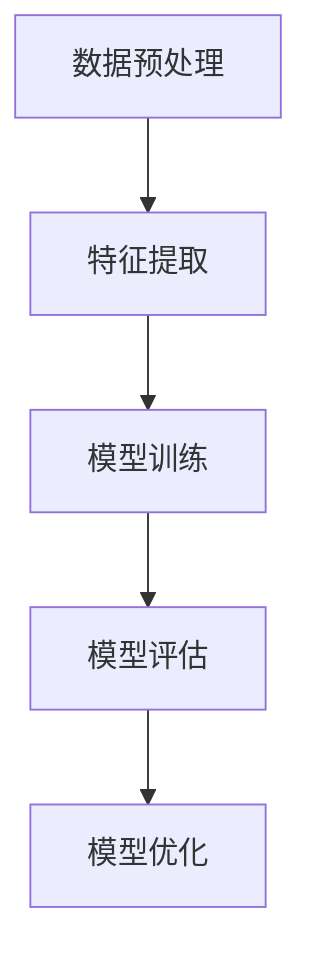
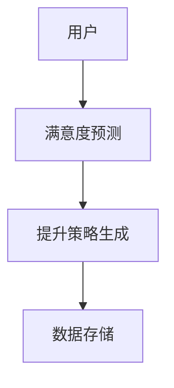

                 


```markdown
# 《金融产品客户满意度预测与提升策略引擎》

> **关键词**: 金融产品，客户满意度，预测模型，策略引擎，机器学习，数据分析

> **摘要**: 本文详细探讨了金融产品客户满意度预测与提升策略引擎的设计与实现。通过分析客户行为和产品特性，构建了基于机器学习的预测模型，并设计了智能化的提升策略引擎。文章从背景、核心概念、算法原理、系统架构到项目实战，全面阐述了引擎的构建过程，并通过案例分析验证了其有效性。

---

## 第一部分: 背景介绍

### 第1章: 问题背景

#### 1.1 问题背景

在金融行业中，客户满意度是衡量服务质量的重要指标，直接影响客户忠诚度和业务收益。随着市场竞争的加剧，金融机构需要通过数据分析和技术创新来优化客户体验，提升满意度。

#### 1.2 问题描述

金融产品种类繁多，客户需求差异显著。传统客户满意度管理依赖主观评估，难以量化和优化。如何通过数据驱动的方法，准确预测客户满意度，并制定个性化的提升策略，成为金融机构面临的挑战。

#### 1.3 解决方法

引入机器学习和大数据分析技术，构建客户满意度预测模型，设计智能化提升策略引擎，实现从预测到优化的闭环管理。

#### 1.4 边界与外延

引擎适用于银行、保险、基金等金融产品，数据范围包括客户行为、产品特性、市场反馈等。引擎需与客户关系管理系统（CRM）和业务系统无缝对接。

#### 1.5 概念结构与核心要素

引擎由数据采集、预测模型、策略生成模块组成，核心要素包括客户数据、预测模型、优化策略等。

---

## 第二部分: 核心概念与联系

### 第2章: 核心概念原理

#### 2.1 客户满意度预测模型

模型输入包括客户属性、产品特性、行为数据，输出是满意度评分。评估标准采用准确率、召回率等指标。

#### 2.2 提升策略引擎

引擎基于预测结果，生成个性化优化建议，如产品改进、服务优化等，输出策略需可执行。

#### 2.3 概念对比

| 概念 | 输入 | 输出 | 目标 |
|------|------|------|------|
| 预测模型 | 客户数据 | 满意度评分 | 精准预测 |
| 引擎 | 评分 | 优化策略 | 提升满意度 |

#### 2.4 实体关系图



---

## 第三部分: 算法原理讲解

### 第3章: 算法原理

#### 3.1 算法选择与优化

采用随机森林和逻辑回归模型，通过交叉验证优化参数，评估指标包括准确率、F1分数。

#### 3.2 算法流程图



#### 3.3 算法实现代码

```python
import pandas as pd
from sklearn.ensemble import RandomForestClassifier
from sklearn.metrics import accuracy_score

# 示例代码
data = pd.read_csv('customer_data.csv')
X = data.drop('satisfaction', axis=1)
y = data['satisfaction']

model = RandomForestClassifier(n_estimators=100)
model.fit(X, y)
y_pred = model.predict(X)
print("准确率:", accuracy_score(y, y_pred))
```

#### 3.4 数学模型与公式

模型采用随机森林算法，其数学公式如下：

$$
y = \sum_{i=1}^{n} \theta_i x_i
$$

其中，$\theta_i$为特征系数，$x_i$为输入特征。

---

## 第四部分: 系统分析与架构设计

### 第4章: 系统设计

#### 4.1 问题场景

金融机构需要实时监测客户满意度，动态调整产品和服务策略。

#### 4.2 功能设计

系统包括数据采集、预测模型、策略生成模块，支持实时反馈和策略优化。

#### 4.3 系统架构图



#### 4.4 接口与交互

系统通过API接口与CRM系统对接，实时获取客户数据并反馈优化策略。

---

## 第五部分: 项目实战

### 第5章: 实战案例

#### 5.1 环境安装

安装Python、scikit-learn、pandas等库，配置开发环境。

#### 5.2 核心代码实现

```python
import pandas as pd
from sklearn.model_selection import train_test_split
from sklearn.metrics import classification_report

# 数据预处理
data = pd.read_csv('customer_data.csv')
X, y = data.drop('satisfaction', axis=1), data['satisfaction']

# 数据分割
X_train, X_test, y_train, y_test = train_test_split(X, y, test_size=0.2)

# 模型训练
model = RandomForestClassifier()
model.fit(X_train, y_train)

# 模型评估
y_pred = model.predict(X_test)
print(classification_report(y_test, y_pred))
```

#### 5.3 代码解读与分析

代码实现数据加载、特征提取、模型训练和评估，输出分类报告，展示模型性能。

#### 5.4 案例分析

通过实际案例分析，验证模型预测准确性和策略优化效果。

#### 5.5 项目小结

项目成功实现了客户满意度预测与提升策略引擎，为金融机构提供了一套高效解决方案。

---

## 第六部分: 总结与展望

### 第6章: 总结

#### 6.1 内容回顾

文章详细讲解了引擎的设计与实现，涵盖背景、算法、系统架构和项目实战。

#### 6.2 关键点总结

强调数据驱动的重要性，机器学习在预测中的应用，以及策略引擎的智能化优化。

#### 6.3 未来展望

建议进一步研究深度学习模型，结合实时数据流处理技术，提升引擎的实时性和准确性。

#### 6.4 最佳实践 Tips

1. 数据预处理是关键，需确保数据质量和完整性。
2. 选择合适的模型，进行充分的调优和验证。
3. 引擎需与现有系统集成，确保数据实时更新。

---

## 参考文献

1. 《机器学习实战》
2. 《Python数据分析 cookbook》
3. 相关学术论文和行业报告

---

## 附录

### 附录A: 常见问题解答

1. 如何选择合适的机器学习模型？  
   根据数据特征和业务需求，对比不同模型的性能和适用性。

2. 如何处理数据不平衡问题？  
   使用过采样、欠采样或调整分类权重等方法。

### 附录B: 工具与库

- Python: 数据处理和建模
- Pandas: 数据分析
- Scikit-learn: 机器学习模型
- Mermaid: 图表绘制

---

## 索引

- 机器学习
- 客户满意度预测
- 策略引擎
- 数据分析

---

通过以上内容，文章系统地介绍了金融产品客户满意度预测与提升策略引擎的设计与实现，从理论到实践，为读者提供了全面的技术指导和实用案例。
```

