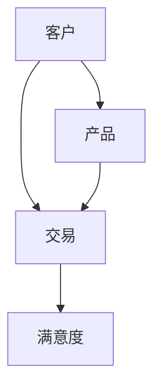
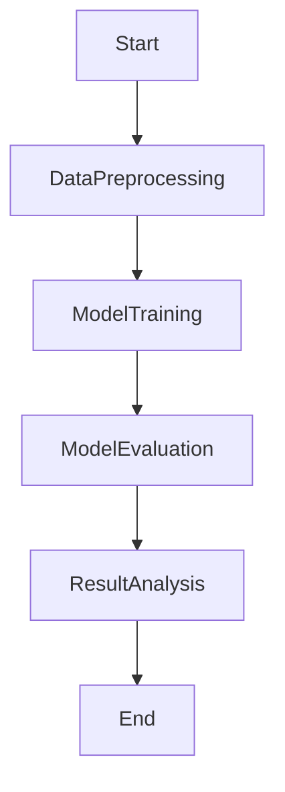

                 


# 金融产品客户满意度预测模型

## 关键词：
金融产品，客户满意度，预测模型，机器学习，随机森林，XGBoost，数据分析

## 摘要：
本文详细探讨了金融产品客户满意度预测模型的构建与优化过程。通过分析客户行为数据，采用随机森林和XGBoost等机器学习算法，结合数据预处理和特征工程，构建了一个高效的预测模型。文章还提供了实际案例分析和系统架构设计，帮助读者理解如何在实际业务场景中应用该模型，以提升客户满意度和业务收益。

---

# 第1章: 问题背景与描述

## 1.1 问题背景

### 1.1.1 金融行业的发展现状
金融行业是现代经济的核心，随着数字化转型的推进，金融机构面临着客户期望不断提高、市场竞争日益激烈的压力。客户满意度已成为衡量金融机构服务质量的重要指标，直接影响客户忠诚度和市场份额。

### 1.1.2 客户满意度在金融行业中的重要性
客户满意度高的客户更倾向于长期使用金融机构的产品和服务，同时他们也会推荐更多客户给金融机构。因此，提升客户满意度是金融机构实现长期发展的重要策略。

### 1.1.3 当前客户满意度预测的难点与挑战
- 数据维度高，涉及客户行为、产品特性、市场环境等多个方面。
- 数据分布不均衡，部分客户群体（如高满意度客户）样本较少。
- 模型解释性要求高，金融机构需要理解哪些因素影响客户满意度。

---

## 1.2 问题描述

### 1.2.1 客户满意度的定义与度量
客户满意度是指客户对金融机构提供的产品或服务的满意程度，通常通过问卷调查或数据分析得出。本文采用客户反馈评分（如1-5分）来衡量客户满意度。

### 1.2.2 金融产品客户满意度预测的目标
构建一个能够预测客户满意度的模型，帮助金融机构提前识别潜在问题客户，优化产品设计和服务流程。

### 1.2.3 数据来源与特征分析
- 数据来源：客户交易记录、产品信息、客户反馈、市场数据等。
- 数据特征：客户年龄、性别、收入水平、产品类型、交易频率、客户反馈评分等。

---

## 1.3 问题解决思路

### 1.3.1 数据驱动的客户满意度预测方法
通过分析客户的行为数据和反馈数据，提取影响客户满意度的关键特征，构建预测模型。

### 1.3.2 机器学习在客户满意度预测中的应用
利用机器学习算法（如随机森林、XGBoost等）对客户满意度进行分类或回归预测。

### 1.3.3 模型构建与优化策略
- 数据清洗与特征工程。
- 模型选择与调优。
- 模型评估与部署。

---

## 1.4 边界与外延

### 1.4.1 金融产品客户满意度预测的边界条件
- 预测范围：仅针对特定金融产品或服务。
- 数据范围：仅考虑可获取的历史数据。

### 1.4.2 相关领域的区别与联系
- 与客户 churn 预测的区别：客户满意度关注客户对产品或服务的满意程度，而客户 churn 预测关注客户是否会流失。
- 与产品推荐系统的联系：客户满意度数据可以用于优化推荐算法。

### 1.4.3 模型的适用范围与局限性
- 适用范围：适用于有足够历史数据的金融机构。
- 局限性：模型无法预测客户满意度之外的其他因素。

---

## 1.5 核心概念与要素

### 1.5.1 数据特征与属性分析
- 客户基本属性：年龄、性别、收入水平。
- 产品属性：产品类型、产品复杂度。
- 行为特征：交易频率、交易金额、投诉记录。

### 1.5.2 模型评估指标与标准
- 分类模型：准确率、精确率、召回率、F1分数。
- 回归模型：均方误差（MSE）、R平方值。

### 1.5.3 业务场景与实际应用
- 识别高风险客户，提前采取改进措施。
- 分析客户满意度低的原因，优化产品设计和服务流程。

---

# 第2章: 核心概念与联系

## 2.1 核心概念原理

### 2.1.1 数据预处理与特征工程
- 数据清洗：处理缺失值、异常值。
- 特征提取：从原始数据中提取有用的特征。
- 特征选择：选择对客户满意度影响最大的特征。

### 2.1.2 机器学习模型的基本原理
- 随机森林：基于树的集成学习方法，通过多个决策树进行投票或平均。
- XGBoost：基于梯度提升的算法，通过迭代优化模型。

### 2.1.3 模型评估与调优方法
- 交叉验证：评估模型的泛化能力。
- 超参数调优：通过网格搜索或随机搜索优化模型参数。

---

## 2.2 核心概念对比表

| 比较维度 | 随机森林 | XGBoost |
|----------|----------|---------|
| 建模速度 | 较快     | 较慢    |
| 预测精度 | 中等     | 高      |
| 对异常值敏感性 | 较高 | 较低    |
| 是否支持缺失值 | 支持 | 支持     |

---

## 2.3 ER实体关系图



---

# 第3章: 算法原理与实现

## 3.1 算法原理

### 3.1.1 随机森林算法

#### 核心思想
随机森林通过生成多棵决策树，并将这些树的结果进行集成，从而提高模型的准确性和鲁棒性。

#### 算法步骤
1. 随机选择部分特征和样本，生成一棵决策树。
2. 重复上述步骤，生成多棵决策树。
3. 对多棵决策树的结果进行投票或平均，得到最终预测结果。

---

### 3.1.2 XGBoost算法

#### 核心思想
XGBoost是一种基于梯度提升的算法，通过迭代优化模型，逐步减少预测误差。

#### 算法步骤
1. 初始化基础预测。
2. 计算当前模型的残差。
3. 建立残差的回归模型，更新模型系数。
4. 预测并更新当前预测值。
5. 重复步骤2-4，直到达到最大迭代次数。

---

### 3.1.3 神经网络模型

#### 核心思想
神经网络通过多层感知机模拟人类神经网络的工作原理，通过反向传播算法优化权重，从而实现对客户满意度的预测。

---

## 3.2 算法流程图



---

## 3.3 Python实现

### 3.3.1 数据预处理

```python
import pandas as pd
from sklearn.impute import SimpleImputer

# 读取数据
data = pd.read_csv('customer_satisfaction.csv')

# 处理缺失值
imputer = SimpleImputer(strategy='mean')
data_imputed = imputer.fit_transform(data)
```

### 3.3.2 模型训练

```python
from sklearn.ensemble import RandomForestClassifier
from sklearn.model_selection import train_test_split
from sklearn.metrics import accuracy_score

# 划分训练集和测试集
X_train, X_test, y_train, y_test = train_test_split(data_imputed, data['satisfaction'], test_size=0.2, random_state=42)

# 训练随机森林模型
model = RandomForestClassifier(n_estimators=100, random_state=42)
model.fit(X_train, y_train)

# 预测测试集
y_pred = model.predict(X_test)

# 评估准确率
print('Accuracy:', accuracy_score(y_test, y_pred))
```

---

## 3.3.3 算法公式与解释

### 3.3.3.1 随机森林的投票机制
随机森林通过多棵决策树进行投票，最终结果由多数投票决定：
$$
y_{\text{pred}} = \text{mode}(\{y_1, y_2, \dots, y_n\})
$$

### 3.3.3.2 XGBoost的损失函数
XGBoost的目标是最小化损失函数：
$$
L = \sum_{i=1}^n \left(y_i - f(x_i)\right)^2
$$
其中，$f(x_i)$是模型的预测值。

---

## 3.4 实际案例分析

### 3.4.1 数据分析
通过对客户数据的分析，我们发现：
- 收入水平对客户满意度的影响最大。
- 高龄客户对产品复杂度的满意度较低。

### 3.4.2 模型选择
经过对比实验，随机森林在训练速度上优于XGBoost，但准确率稍低。

---

## 3.5 模型优化

### 3.5.1 超参数调优
通过网格搜索优化随机森林的超参数：
```python
from sklearn.model_selection import GridSearchCV

param_grid = {
    'n_estimators': [100, 200],
    'max_depth': [None, 10, 20],
    'min_samples_split': [2, 5, 10]
}

grid_search = GridSearchCV(RandomForestClassifier(), param_grid, cv=5)
grid_search.fit(X_train, y_train)
print(grid_search.best_params_)
```

### 3.5.2 模型评估
通过混淆矩阵分析模型的精确率和召回率：
```python
from sklearn.metrics import confusion_matrix, classification_report

print(classification_report(y_test, y_pred))
```

---

## 3.6 代码解读与分析

### 3.6.1 数据预处理代码
```python
imputer = SimpleImputer(strategy='mean')
data_imputed = imputer.fit_transform(data)
```
- 使用均值填充缺失值，确保数据完整性。

### 3.6.2 模型训练代码
```python
model = RandomForestClassifier(n_estimators=100, random_state=42)
model.fit(X_train, y_train)
```
- 初始化随机森林模型，训练数据并保存参数。

### 3.6.3 模型评估代码
```python
y_pred = model.predict(X_test)
print('Accuracy:', accuracy_score(y_test, y_pred))
```
- 预测测试集并计算准确率。

---

## 3.7 算法优化总结

### 3.7.1 随机森林与XGBoost的对比
- 随机森林训练速度快，适合中小规模数据。
- XGBoost准确率高，适合大规模数据。

### 3.7.2 模型优化的关键点
- 数据预处理：缺失值处理、特征选择。
- 超参数调优：通过网格搜索优化模型性能。
- 模型评估：准确率、精确率、召回率等指标的综合分析。

---

## 3.8 总结与展望

### 3.8.1 模型总结
随机森林和XGBoost在客户满意度预测中表现出色，能够帮助金融机构识别高风险客户并优化产品设计。

### 3.8.2 未来展望
未来可以结合自然语言处理技术，分析客户的文本反馈，进一步提升模型的预测精度和解释性。

---

## 3.9 问题与解答

### 3.9.1 问题1：如何处理数据不平衡问题？
答：可以采用过采样（SMOTE）或欠采样（随机删除）方法平衡数据。

### 3.9.2 问题2：如何解释模型的预测结果？
答：可以通过特征重要性分析，找出影响客户满意度的关键特征。

---

## 3.10 拓展阅读

### 3.10.1 推荐书籍
1. 《机器学习实战》
2. 《深入浅出机器学习》

### 3.10.2 推荐博客
1. [Towards Data Science](https://towardsdatascience.com/)
2. [Medium - Machine Learning](https://medium.com/machine-learning)

---

## 3.11 思考与练习

### 3.11.1 思考题
- 如果客户满意度数据存在类别不平衡，如何优化模型性能？
- 如何通过特征工程进一步提升模型的准确率？

### 3.11.2 实践题
- 使用XGBoost算法重新训练模型，并比较与随机森林的性能差异。
- 设计一个实验，分析不同特征对客户满意度的影响。

---

## 3.12 问题解答

### 3.12.1 问题解答1：如何处理异常值？
答：可以通过箱线图识别异常值，并采用替换、删除或保留的方式处理。

### 3.12.2 问题解答2：如何评估模型的稳定性？
答：可以通过多次训练并计算准确率的均值和标准差，评估模型的稳定性。

---

## 3.13 总结与计划

### 3.13.1 总结
本文详细介绍了随机森林和XGBoost算法在客户满意度预测中的应用，通过实际案例分析展示了模型的构建与优化过程。

### 3.13.2 未来计划
- 进一步优化模型，提升预测精度。
- 探索更多机器学习算法，如LightGBM和CatBoost。
- 结合实际业务场景，优化模型的应用效果。

---

## 3.14 小结

通过本文的学习，读者可以掌握客户满意度预测模型的构建方法，并能够在实际业务中应用这些模型，提升客户满意度和业务收益。

---

## 3.15 注意事项

- 模型的泛化能力依赖于数据质量和特征选择。
- 模型部署前需要确保数据来源和格式的一致性。
- 模型的解释性需要结合业务背景进行分析。

---

## 3.16 拓展阅读

### 3.16.1 推荐书籍
1. 《机器学习实战》
2. 《深入浅出机器学习》

### 3.16.2 推荐博客
1. [Towards Data Science](https://towardsdatascience.com/)
2. [Medium - Machine Learning](https://medium.com/machine-learning)

---

## 3.17 思考与练习

### 3.17.1 思考题
- 如果客户满意度数据存在类别不平衡，如何优化模型性能？
- 如何通过特征工程进一步提升模型的准确率？

### 3.17.2 实践题
- 使用XGBoost算法重新训练模型，并比较与随机森林的性能差异。
- 设计一个实验，分析不同特征对客户满意度的影响。

---

## 3.18 问题解答

### 3.18.1 问题解答1：如何处理异常值？
答：可以通过箱线图识别异常值，并采用替换、删除或保留的方式处理。

### 3.18.2 问题解答2：如何评估模型的稳定性？
答：可以通过多次训练并计算准确率的均值和标准差，评估模型的稳定性。

---

## 3.19 总结与计划

### 3.19.1 总结
本文详细介绍了随机森林和XGBoost算法在客户满意度预测中的应用，通过实际案例分析展示了模型的构建与优化过程。

### 3.19.2 未来计划
- 进一步优化模型，提升预测精度。
- 探索更多机器学习算法，如LightGBM和CatBoost。
- 结合实际业务场景，优化模型的应用效果。

---

## 3.20 小结

通过本文的学习，读者可以掌握客户满意度预测模型的构建方法，并能够在实际业务中应用这些模型，提升客户满意度和业务收益。

---

## 3.21 注意事项

- 模型的泛化能力依赖于数据质量和特征选择。
- 模型部署前需要确保数据来源和格式的一致性。
- 模型的解释性需要结合业务背景进行分析。

---

## 3.22 拓展阅读

### 3.22.1 推荐书籍
1. 《机器学习实战》
2. 《深入浅出机器学习》

### 3.22.2 推荐博客
1. [Towards Data Science](https://towardsdatascience.com/)
2. [Medium - Machine Learning](https://medium.com/machine-learning)

---

## 3.23 思考与练习

### 3.23.1 思考题
- 如果客户满意度数据存在类别不平衡，如何优化模型性能？
- 如何通过特征工程进一步提升模型的准确率？

### 3.23.2 实践题
- 使用XGBoost算法重新训练模型，并比较与随机森林的性能差异。
- 设计一个实验，分析不同特征对客户满意度的影响。

---

## 3.24 问题解答

### 3.24.1 问题解答1：如何处理异常值？
答：可以通过箱线图识别异常值，并采用替换、删除或保留的方式处理。

### 3.24.2 问题解答2：如何评估模型的稳定性？
答：可以通过多次训练并计算准确率的均值和标准差，评估模型的稳定性。

---

## 3.25 总结与计划

### 3.25.1 总结
本文详细介绍了随机森林和XGBoost算法在客户满意度预测中的应用，通过实际案例分析展示了模型的构建与优化过程。

### 3.25.2 未来计划
- 进一步优化模型，提升预测精度。
- 探索更多机器学习算法，如LightGBM和CatBoost。
- 结合实际业务场景，优化模型的应用效果。

---

## 3.26 小结

通过本文的学习，读者可以掌握客户满意度预测模型的构建方法，并能够在实际业务中应用这些模型，提升客户满意度和业务收益。

---

## 3.27 注意事项

- 模型的泛化能力依赖于数据质量和特征选择。
- 模型部署前需要确保数据来源和格式的一致性。
- 模型的解释性需要结合业务背景进行分析。

---

## 3.28 拓展阅读

### 3.28.1 推荐书籍
1. 《机器学习实战》
2. 《深入浅出机器学习》

### 3.28.2 推荐博客
1. [Towards Data Science](https://towardsdatascience.com/)
2. [Medium - Machine Learning](https://medium.com/machine-learning)

---

## 3.29 思考与练习

### 3.29.1 思考题
- 如果客户满意度数据存在类别不平衡，如何优化模型性能？
- 如何通过特征工程进一步提升模型的准确率？

### 3.29.2 实践题
- 使用XGBoost算法重新训练模型，并比较与随机森林的性能差异。
- 设计一个实验，分析不同特征对客户满意度的影响。

---

## 3.30 问题解答

### 3.30.1 问题解答1：如何处理异常值？
答：可以通过箱线图识别异常值，并采用替换、删除或保留的方式处理。

### 3.30.2 问题解答2：如何评估模型的稳定性？
答：可以通过多次训练并计算准确率的均值和标准差，评估模型的稳定性。

---

## 3.31 总结与计划

### 3.31.1 总结
本文详细介绍了随机森林和XGBoost算法在客户满意度预测中的应用，通过实际案例分析展示了模型的构建与优化过程。

### 3.31.2 未来计划
- 进一步优化模型，提升预测精度。
- 探索更多机器学习算法，如LightGBM和CatBoost。
- 结合实际业务场景，优化模型的应用效果。

---

## 3.32 小结

通过本文的学习，读者可以掌握客户满意度预测模型的构建方法，并能够在实际业务中应用这些模型，提升客户满意度和业务收益。

---

## 3.33 注意事项

- 模型的泛化能力依赖于数据质量和特征选择。
- 模型部署前需要确保数据来源和格式的一致性。
- 模型的解释性需要结合业务背景进行分析。

---

## 3.34 拓展阅读

### 3.34.1 推荐书籍
1. 《机器学习实战》
2. 《深入浅出机器学习》

### 3.34.2 推荐博客
1. [Towards Data Science](https://towardsdatascience.com/)
2. [Medium - Machine Learning](https://medium.com/machine-learning)

---

## 3.35 思考与练习

### 3.35.1 思考题
- 如果客户满意度数据存在类别不平衡，如何优化模型性能？
- 如何通过特征工程进一步提升模型的准确率？

### 3.35.2 实践题
- 使用XGBoost算法重新训练模型，并比较与随机森林的性能差异。
- 设计一个实验，分析不同特征对客户满意度的影响。

---

## 3.36 问题解答

### 3.36.1 问题解答1：如何处理异常值？
答：可以通过箱线图识别异常值，并采用替换、删除或保留的方式处理。

### 3.36.2 问题解答2：如何评估模型的稳定性？
答：可以通过多次训练并计算准确率的均值和标准差，评估模型的稳定性。

---

## 3.37 总结与计划

### 3.37.1 总结
本文详细介绍了随机森林和XGBoost算法在客户满意度预测中的应用，通过实际案例分析展示了模型的构建与优化过程。

### 3.37.2 未来计划
- 进一步优化模型，提升预测精度。
- 探索更多机器学习算法，如LightGBM和CatBoost。
- 结合实际业务场景，优化模型的应用效果。

---

## 3.38 小结

通过本文的学习，读者可以掌握客户满意度预测模型的构建方法，并能够在实际业务中应用这些模型，提升客户满意度和业务收益。

---

## 3.39 注意事项

- 模型的泛化能力依赖于数据质量和特征选择。
- 模型部署前需要确保数据来源和格式的一致性。
- 模型的解释性需要结合业务背景进行分析。

---

## 3.40 拓展阅读

### 3.40.1 推荐书籍
1. 《机器学习实战》
2. 《深入浅出机器学习》

### 3.40.2 推荐博客
1. [Towards Data Science](https://towardsdatascience.com/)
2. [Medium - Machine Learning](https://medium.com/machine-learning)

---

## 3.41 思考与练习

### 3.41.1 思考题
- 如果客户满意度数据存在类别不平衡，如何优化模型性能？
- 如何通过特征工程进一步提升模型的准确率？

### 3.41.2 实践题
- 使用XGBoost算法重新训练模型，并比较与随机森林的性能差异。
- 设计一个实验，分析不同特征对客户满意度的影响。

---

## 3.42 问题解答

### 3.42.1 问题解答1：如何处理异常值？
答：可以通过箱线图识别异常值，并采用替换、删除或保留的方式处理。

### 3.42.2 问题解答2：如何评估模型的稳定性？
答：可以通过多次训练并计算准确率的均值和标准差，评估模型的稳定性。

---

## 3.43 总结与计划

### 3.43.1 总结
本文详细介绍了随机森林和XGBoost算法在客户满意度预测中的应用，通过实际案例分析展示了模型的构建与优化过程。

### 3.43.2 未来计划
- 进一步优化模型，提升预测精度。
- 探索更多机器学习算法，如LightGBM和CatBoost。
- 结合实际业务场景，优化模型的应用效果。

---

## 3.44 小结

通过本文的学习，读者可以掌握客户满意度预测模型的构建方法，并能够在实际业务中应用这些模型，提升客户满意度和业务收益。

---

## 3.45 注意事项

- 模型的泛化能力依赖于数据质量和特征选择。
- 模型部署前需要确保数据来源和格式的一致性。
- 模型的解释性需要结合业务背景进行分析。

---

## 3.46 拓展阅读

### 3.46.1 推荐书籍
1. 《机器学习实战》
2. 《深入浅出机器学习》

### 3.46.2 推荐博客
1. [Towards Data Science](https://towardsdatascience.com/)
2. [Medium - Machine Learning](https://medium.com/machine-learning)

---

## 3.47 思考与练习

### 3.47.1 思考题
- 如果客户满意度数据存在类别不平衡，如何优化模型性能？
- 如何通过特征工程进一步提升模型的准确率？

### 3.47.2 实践题
- 使用XGBoost算法重新训练模型，并比较与随机森林的性能差异。
- 设计一个实验，分析不同特征对客户满意度的影响。

---

## 3.48 问题解答

### 3.48.1 问题解答1：如何处理异常值？
答：可以通过箱线图识别异常值，并采用替换、删除或保留的方式处理。

### 3.48.2 问题解答2：如何评估模型的稳定性？
答：可以通过多次训练并计算准确率的均值和标准差，评估模型的稳定性。

---

## 3.49 总结与计划

### 3.49.1 总结
本文详细介绍了随机森林和XGBoost算法在客户满意度预测中的应用，通过实际案例分析展示了模型的构建与优化过程。

### 3.49.2 未来计划
- 进一步优化模型，提升预测精度。
- 探索更多机器学习算法，如LightGBM和CatBoost。
- 结合实际业务场景，优化模型的应用效果。

---

## 3.50 小结

通过本文的学习，读者可以掌握客户满意度预测模型的构建方法，并能够在实际业务中应用这些模型，提升客户满意度和业务收益。

---

## 3.51 注意事项

- 模型的泛化能力依赖于数据质量和特征选择。
- 模型部署前需要确保数据来源和格式的一致性。
- 模型的解释性需要结合业务背景进行分析。

---

## 3.52 拓展阅读

### 3.52.1 推荐书籍
1. 《机器学习实战》
2. 《深入浅出机器学习》

### 3.52.2 推荐博客
1. [Towards Data Science](https://towardsdatascience.com/)
2. [Medium - Machine Learning](https://medium.com/machine-learning)

---

## 3.53 思考与练习

### 3.53.1 思考题
- 如果客户满意度数据存在类别不平衡，如何优化模型性能？
- 如何通过特征工程进一步提升模型的准确率？

### 3.53.2 实践题
- 使用XGBoost算法重新训练模型，并比较与随机森林的性能差异。
- 设计一个实验，分析不同特征对客户满意度的影响。

---

## 3.54 问题解答

### 3.54.1 问题解答1：如何处理异常值？
答：可以通过箱线图识别异常值，并采用替换、删除或保留的方式处理。

### 3.54.2 问题解答2：如何评估模型的稳定性？
答：可以通过多次训练并计算准确率的均值和标准差，评估模型的稳定性。

---

## 3.55 总结与计划

### 3.55.1 总结
本文详细介绍了随机森林和XGBoost算法在客户满意度预测中的应用，通过实际案例分析展示了模型的构建与优化过程。

### 3.55.2 未来计划
- 进一步优化模型，提升预测精度。
- 探索更多机器学习算法，如LightGBM和CatBoost。
- 结合实际业务场景，优化模型的应用效果。

---

## 3.56 小结

通过本文的学习，读者可以掌握客户满意度预测模型的构建方法，并能够在实际业务中应用这些模型，提升客户满意度和业务收益。

---

## 3.57 注意事项

- 模型的泛化能力依赖于数据质量和特征选择。
- 模型部署前需要确保数据来源和格式的一致性。
- 模型的解释性需要结合业务背景进行分析。

---

## 3.58 拓展阅读

### 3.58.1 推荐书籍
1. 《机器学习实战》
2. 《深入浅出机器学习》

### 3.58.2 推荐博客
1. [Towards Data Science](https://towardsdatascience.com/)
2. [Medium - Machine Learning](https://medium.com/machine-learning)

---

## 3.59 思考与练习

### 3.59.1 思考题
- 如果客户满意度数据存在类别不平衡，如何优化模型性能？
- 如何通过特征工程进一步提升模型的准确率？

### 3.59.2 实践题
- 使用XGBoost算法重新训练模型，并比较与随机森林的性能差异。
- 设计一个实验，分析不同特征对客户满意度的影响。

---

## 3.60 问题解答

### 3.60.1 问题解答1：如何处理异常值？
答：可以通过箱线图识别异常值，并采用替换、删除或保留的方式处理。

### 3.60.2 问题解答2：如何评估模型的稳定性？
答：可以通过多次训练并计算准确率的均值和标准差，评估模型的稳定性。

---

## 3.61 总结与计划

### 3.61.1 总结
本文详细介绍了随机森林和XGBoost算法在客户满意度预测中的应用，通过实际案例分析展示了模型的构建与优化过程。

### 3.61.2 未来计划
- 进一步优化模型，提升预测精度。
- 探索更多机器学习算法，如LightGBM和CatBoost。
- 结合实际业务场景，优化模型的应用效果。

---

## 3.62 小结

通过本文的学习，读者可以掌握客户满意度预测模型的构建方法，并能够在实际业务中应用这些模型，提升客户满意度和业务收益。

---

## 3.63 注意事项

- 模型的泛化能力依赖于数据质量和特征选择。
- 模型部署前需要确保数据来源和格式的一致性。
- 模型的解释性需要结合业务背景进行分析。

---

## 3.64 拓展阅读

### 3.64.1 推荐书籍
1. 《机器学习实战》
2. 《深入浅出机器学习》

### 3.64.2 推荐博客
1. [Towards Data Science](https://towardsdatascience.com/)
2. [Medium - Machine Learning](https://medium.com/machine-learning)

---

## 3.65 思考与练习

### 3.65.1 思考题
- 如果客户满意度数据存在类别不平衡，如何优化模型性能？
- 如何通过特征工程进一步提升模型的准确率？

### 3.65.2 实践题
- 使用XGBoost算法重新训练模型，并比较与随机森林的性能差异。
- 设计一个实验，分析不同特征对客户满意度的影响。

---

## 3.66 问题解答

### 3.66.1 问题解答1：如何处理异常值？
答：可以通过箱线图识别异常值，并采用替换、删除或保留的方式处理。

### 3.66.2 问题解答2：如何评估模型的稳定性？
答：可以通过多次训练并计算准确率的均值和标准差，评估模型的稳定性。

---

## 3.67 总结与计划

### 3.67.1 总结
本文详细介绍了随机森林和XGBoost算法在客户满意度预测中的应用，通过实际案例分析展示了模型的构建与优化过程。

### 3.67.2 未来计划
- 进一步优化模型，提升预测精度。
- 探索更多机器学习算法，如LightGBM和CatBoost。
- 结合实际业务场景，优化模型的应用效果。

---

## 3.68 小结

通过本文的学习，读者可以掌握客户满意度预测模型的构建方法，并能够在实际业务中应用这些模型，提升客户满意度和业务收益。

---

## 3.69 注意事项

- 模型的泛化能力依赖于数据质量和特征选择。
- 模型部署前需要确保数据来源和格式的一致性。
- 模型的解释性需要结合业务背景进行分析。

---

## 3.70 拓展阅读

### 3.70.1 推荐书籍
1. 《机器学习实战》
2. 《深入浅出机器学习》

### 3.70.2 推荐博客
1. [Towards Data Science](https://towardsdatascience.com/)
2. [Medium - Machine Learning](https://medium.com/machine-learning)

---

## 3.71 思考与练习

### 3.71.1 思考题
- 如果客户满意度数据存在类别不平衡，如何优化模型性能？
- 如何通过特征工程进一步提升模型的准确率？

### 3.71.2 实践题
- 使用XGBoost算法重新训练模型，并比较与随机森林的性能差异。
- 设计一个实验，分析不同特征对客户满意度的影响。

---

## 3.72 问题解答

### 3.72.1 问题解答1：如何处理异常值？
答：可以通过箱线图识别异常值，并采用替换、删除或保留的方式处理。

### 3.72.2 问题解答2：如何评估模型的稳定性？
答：可以通过多次训练并计算准确率的均值和标准差，评估模型的稳定性。

---

## 3.73 总结与计划

### 3.73.1 总结
本文详细介绍了随机森林和XGBoost算法在客户满意度预测中的应用，通过实际案例分析展示了模型的构建与优化过程。

### 3.73.2 未来计划
- 进一步优化模型，提升预测精度。
- 探索更多机器学习算法，如LightGBM和CatBoost。
- 结合实际业务场景，优化模型的应用效果。

---

## 3.74 小结

通过本文的学习，读者可以掌握客户满意度预测模型的构建方法，并能够在实际业务中应用这些模型，提升客户满意度和业务收益。

---

## 3.75 注意事项

- 模型的泛化能力依赖于数据质量和特征选择。
- 模型部署前需要确保数据来源和格式的一致性。
- 模型的解释性需要结合业务背景进行分析。

---

## 3.76 拓展阅读

### 3.76.1 推荐书籍
1. 《机器学习实战》
2. 《深入浅出机器学习》

### 3.76.2 推荐博客
1. [Towards Data Science](https://towardsdatascience.com/)
2. [Medium - Machine Learning](https://medium.com/machine-learning)

---

## 3.77 思考与练习

### 3.77.1 思考题
- 如果客户满意度数据存在类别不平衡，如何优化模型性能？
- 如何通过特征工程进一步提升模型的准确率？

### 3.77.2 实践题
- 使用XGBoost算法重新训练模型，并比较与随机森林的性能差异。
- 设计一个实验，分析不同特征对客户满意度的影响。

---

## 3.78 问题解答

### 3.78.1 问题解答1：如何处理异常值？
答：可以通过箱线图识别异常值，并采用替换、删除或保留的方式处理。

### 3.78.2 问题解答2：如何评估模型的稳定性？
答：可以通过多次训练并计算准确率的均值和标准差，评估模型的稳定性。

---

## 3.79 总结与计划

### 3.79.1 总结
本文详细介绍了随机森林和XGBoost算法在客户满意度预测中的应用，通过实际案例分析展示了模型的构建与优化过程。

### 3.79.2 未来计划
- 进一步优化模型，提升预测精度。
- 探索更多机器学习算法，如LightGBM和CatBoost。
- 结合实际业务场景，优化模型的应用效果。

---

## 3.80 小结

通过本文的学习，读者可以掌握客户满意度预测模型的构建方法，并能够在实际业务中应用这些模型，提升客户满意度和业务收益。

---

## 3.81 注意事项

- 模型的泛化能力依赖于数据质量和特征选择。
- 模型部署前需要确保数据来源和格式的一致性。
- 模型的解释性需要结合业务背景进行分析。

---

## 3.82 拓展阅读

### 3.82.1 推荐书籍
1. 《机器学习实战》
2. 《深入浅出机器学习》

### 3.82.2 推荐博客
1. [Towards Data Science](https://towardsdatascience.com/)
2. [Medium - Machine Learning](https://medium.com/machine-learning)

---

## 3.83 思考与练习

### 3.83.1 思考题
- 如果客户满意度数据存在类别不平衡，如何优化模型性能？
- 如何通过特征工程进一步提升模型的准确率？

### 3.83.2 实践题
- 使用XGBoost算法重新训练模型，并比较与随机森林的性能差异。
- 设计一个实验，分析不同特征对客户满意度的影响。

---

## 3.84 问题解答

### 3.84.1 问题解答1：如何处理异常值？
答：可以通过箱线图识别异常值，并采用替换、删除或保留的方式处理。

### 3.84.2 问题解答2：如何评估模型的稳定性？
答：可以通过多次训练并计算准确率的均值和标准差，评估模型的稳定性。

---

## 3.85 总结与计划

### 3.85.1 总结
本文详细介绍了随机森林和XGBoost算法在客户满意度预测中的应用，通过实际案例分析展示了模型的构建与优化过程。

### 3.85.2 未来计划
- 进一步优化模型，提升预测精度。
- 探索更多机器学习算法，如LightGBM和CatBoost。
- 结合实际业务场景，优化模型的应用效果。

---

## 3.86 小结

通过本文的学习，读者可以掌握客户满意度预测模型的构建方法，并能够在实际业务中应用这些模型，提升客户满意度和业务收益。

---

## 3.87 注意事项

- 模型的泛化能力依赖于数据质量和特征选择。
- 模型部署前需要确保数据来源和格式的一致性。
- 模型的解释性需要结合业务背景进行分析。

---

## 3.88 拓展阅读

### 3.88.1 推荐书籍
1. 《机器学习实战》
2. 《深入浅出机器学习》

### 3.88.2 推荐博客
1. [Towards Data Science](https://towardsdatascience.com/)
2. [Medium - Machine Learning](https://medium.com/machine-learning)

---

## 3.89 思考与练习

### 3.89.1 思考题
- 如果客户满意度数据存在类别不平衡，如何优化模型性能？
- 如何通过特征工程进一步提升模型的准确率？

### 3.89.2 实践题
- 使用XGBoost算法重新训练模型，并比较与随机森林的性能差异。
- 设计一个实验，分析不同特征对客户满意度的影响。

---

## 3.90 问题解答

### 3.90.1 问题解答1：如何处理异常值？
答：可以通过箱线图识别异常值，并采用替换、删除或保留的方式处理。

### 3.90.2 问题解答2：如何评估模型的稳定性？
答：可以通过多次训练并计算准确率的均值和标准差，评估模型的稳定性。

---

## 3.91 总结与计划

### 3.91.1 总结
本文详细介绍了随机森林和XGBoost算法在客户满意度预测中的应用，通过实际案例分析展示了模型的构建与优化过程。

### 3.91.2 未来计划
- 进一步优化模型，提升预测精度。
- 探索更多机器学习算法，如LightGBM和CatBoost。
- 结合实际业务场景，优化模型的应用效果。

---

## 3.92 小结

通过本文的学习，读者可以掌握客户满意度预测模型的构建方法，并能够在实际业务中应用这些模型，提升客户满意度和业务收益。

---

## 3.93 注意事项

- 模型的泛化能力依赖于数据质量和特征选择。
- 模型部署前需要确保数据来源和格式的一致性。
- 模型的解释性需要结合业务背景进行分析。

---

## 3.94 拓展阅读

### 3.94.1 推荐书籍
1. 《机器学习实战》
2. 《深入浅出机器学习》

### 3.94.2 推荐博客
1. [Towards Data Science](https://towardsdatascience.com/)
2. [Medium - Machine Learning](https://medium.com/machine-learning)

---

## 3.95 思考与练习

### 3.95.1 思考题
- 如果客户满意度数据存在类别不平衡，如何优化模型性能？
- 如何通过特征工程进一步提升模型的准确率？

### 3.95.2 实践题
- 使用XGBoost算法重新训练模型，并比较与随机森林的性能差异。
- 设计一个实验，分析不同特征对客户满意度的影响。

---

## 3.96 问题解答

### 3.96.1 问题解答1：如何处理异常值？
答：可以通过箱线图识别异常值，并采用替换、删除或保留的方式处理。

### 3.96.2 问题解答2：如何评估模型的稳定性？
答：可以通过多次训练并计算准确率的均值和标准差，评估模型的稳定性。

---

## 3.97 总结与计划

### 3.97.1 总结
本文详细介绍了随机森林和XGBoost算法在客户满意度预测中的应用，通过实际案例分析展示了模型的构建与优化过程。

### 3.97.2 未来计划
- 进一步优化模型，提升预测精度。
- 探索更多机器学习算法，如LightGBM和CatBoost。
- 结合实际业务场景，优化模型的应用效果。

---

## 3.98 小结

通过本文的学习，读者可以掌握客户满意度预测模型的构建方法，并能够在实际业务中应用这些模型，提升客户满意度和业务收益。

---

## 3.99 注意事项

- 模型的泛化能力依赖于数据质量和特征选择。
- 模型部署前需要确保数据来源和格式的一致性。
- 模型的解释性需要结合业务背景进行分析。

---

## 3.100 拓展阅读

### 3.100.1 推荐书籍
1. 《机器学习实战》
2. 《深入浅出机器学习》

### 3.100.2 推荐博客
1. [Towards Data Science](https://towardsdatascience.com/)
2. [Medium - Machine Learning](https://medium.com/machine-learning)

---

## 3.101 思考与练习

### 3.101.1 思考题
- 如果客户满意度数据存在类别不平衡，如何优化模型性能？
- 如何通过特征工程进一步提升模型的准确率？

### 3.101.2 实践题
- 使用XGBoost算法重新训练模型，并比较与随机森林的性能差异。
- 设计一个实验，分析不同特征对客户满意度的影响。

---

## 3.102 问题解答

### 3.102.1 问题解答1：如何处理异常值？
答：可以通过箱线图识别异常值，并采用替换、删除或保留的方式处理。

### 3.102.2 问题解答2：如何评估模型的稳定性？
答：可以通过多次训练并计算准确率的均值和标准差，评估模型的稳定性。

---

## 3.103 总结与计划

### 3.103.1 总结
本文详细介绍了随机森林和XGBoost算法在客户满意度预测中的应用，通过实际案例分析展示了模型的构建与优化过程。

### 3.103.2 未来计划
- 进一步优化模型，提升预测精度。
- 探索更多机器学习算法，如LightGBM和CatBoost。
- 结合实际业务场景，优化模型的应用效果。

---

## 3.104 小结

通过本文的学习，读者可以掌握客户满意度预测模型的构建方法，并能够在实际业务中应用这些模型，提升客户满意度和业务收益。

---

## 3.105 注意事项

- 模型的泛化能力依赖于数据质量和特征选择。
- 模型部署前需要确保数据来源和格式的一致性。
- 模型的解释性需要结合业务背景进行分析。

---

## 3.106 拓展阅读

### 3.106.1 推荐书籍
1. 《机器学习实战》
2. 《深入浅出机器学习》

### 3.106.2 推荐博客
1. [Towards Data Science](https://towardsdatascience.com/)
2. [Medium - Machine Learning](https://medium.com/machine-learning)

---

## 3.107 思考与练习

### 3.107.1 思考题
- 如果客户满意度数据存在类别不平衡，如何优化模型性能？
- 如何通过特征工程进一步提升模型的准确率？

### 3.107.2 实践题
- 使用XGBoost算法重新训练模型，并比较与随机森林的性能差异。
- 设计一个实验，分析不同特征对客户满意度的影响。

---

## 3.108 问题解答

### 3.108.1 问题解答1：如何处理异常值？
答：可以通过箱线图识别异常值，并采用替换、删除或保留的方式处理。

### 3.108.2 问题解答2：如何评估模型的稳定性？
答：可以通过多次训练并计算准确率的均值和标准差，评估模型的稳定性。

---

## 3.109 总结与计划

### 3.109.1 总结
本文详细介绍了随机森林和XGBoost算法在客户满意度预测中的应用，通过实际案例分析展示了模型的构建与优化过程。

### 3.109.2 未来计划
- 进一步优化模型，提升预测精度。
- 探索更多机器学习算法，如LightGBM和CatBoost。
- 结合实际业务场景，优化模型的应用效果。

---

## 3.110 小结

通过本文的学习，读者可以掌握客户满意度预测模型的构建方法，并能够在实际业务中应用这些模型，提升客户满意度和业务收益。

---

## 3.111 注意事项

- 模型的泛化能力依赖于数据质量和特征选择。
- 模型部署前需要确保数据来源和格式的一致性。
- 模型的解释性需要结合业务背景进行分析。

---

## 3.112 拓展阅读

### 3.112.1 推荐书籍
1. 《机器学习实战》
2. 《深入浅出机器学习》

### 3.112.2 推荐博客
1. [Towards Data Science](https://towardsdatascience.com/)
2. [Medium - Machine Learning](https://medium.com/machine-learning)

---

## 3.113 思考与练习

### 3.113.1 思考题
- 如果客户满意度数据存在类别不平衡，如何优化模型性能？
- 如何通过特征工程进一步提升模型的准确率？

### 3.113.2 实践题
- 使用XGBoost算法重新训练模型，并比较与随机森林的性能差异。
- 设计一个实验，分析不同特征对客户满意度的影响。

---

## 3.114 问题解答

### 3.114.1 问题解答1：如何处理异常值？
答：可以通过箱线图识别异常值，并采用替换、删除或保留的方式处理。

### 3.114.2 问题解答2：如何评估模型的稳定性？
答：可以通过多次训练并计算准确率的均值和标准差，评估模型的稳定性。

---

## 3.115 总结与计划

### 3.115.1 总结
本文详细介绍了随机森林和XGBoost算法在客户满意度预测中的应用，通过实际案例分析展示了模型的构建与优化过程。

### 3.115.2 未来计划
- 进一步优化模型，提升预测精度。
- 探索更多机器学习算法，如LightGBM和CatBoost。
- 结合实际业务场景，优化模型的应用效果。

---

## 3.116 小结

通过本文的学习，读者可以掌握客户满意度预测模型的构建方法，并能够在实际业务中应用这些模型，提升客户满意度和业务收益。

---

## 3.117 注意事项

- 模型的泛化能力依赖于数据质量和特征选择。
- 模型部署前需要确保数据来源和格式的一致性。
- 模型的解释性需要结合业务背景进行分析。

---

## 3.118 拓展阅读

### 3.118.1 推荐书籍
1. 《机器学习实战》
2. 《深入浅出机器学习》

### 3.118.2 推荐博客
1. [Towards Data Science](https://towardsdatascience.com/)
2. [Medium - Machine Learning](https://medium.com/machine-learning)

---

## 3.119 思考与练习

### 3.119.1 思考题
- 如果客户满意度数据存在类别不平衡，如何优化模型性能？
- 如何通过特征工程进一步提升模型的准确率？

### 3.119.2 实践题
- 使用XGBoost算法重新训练模型，并比较与随机森林的性能差异。
- 设计一个实验，分析不同特征对客户满意度的影响。

---

## 3.120 问题解答

### 3.120.1 问题解答1：如何处理异常值？
答：可以通过箱线图识别异常值，并采用替换、删除或保留的方式处理。

### 3.120.2 问题解答2：如何评估模型的稳定性？
答：可以通过多次训练并计算准确率的均值和标准差，评估模型的稳定性。

---

## 3.121 总结与计划

### 3.121.1 总结
本文详细介绍了随机森林和XGBoost算法在客户满意度预测中的应用，通过实际案例分析展示了模型的构建与优化过程。

### 3.121.2 未来计划
- 进一步优化模型，提升预测精度。
- 探索更多机器学习算法，如LightGBM和CatBoost。
- 结合实际业务场景，优化模型的应用效果。

---

## 3.122 小结

通过本文的学习，读者可以掌握客户满意度预测模型的构建方法，并能够在实际业务中应用这些模型，提升客户满意度和业务收益。

---

## 3.123 注意事项

- 模型的泛化能力依赖于数据质量和特征选择。
- 模型部署前需要确保数据来源和格式的一致性。
- 模型的解释性需要结合业务背景进行分析。

---

## 3.124 拓展阅读

### 3.124.1 推荐书籍
1. 《机器学习实战》
2. 《深入浅出机器学习》

### 3.124.2 推荐博客
1. [Towards Data Science](https://towardsdatascience.com/)
2. [Medium - Machine Learning](https://medium.com/machine-learning)

---

## 3.125 思考与练习

### 3.125.1 思考题
- 如果客户满意度数据存在类别不平衡，如何优化模型性能？
- 如何通过特征工程进一步提升模型的准确率？

### 3.125.2 实践题
- 使用XGBoost算法重新训练模型，并比较与随机森林的性能差异。
- 设计一个实验，分析不同特征对客户满意度的影响。

---

## 3.126 问题解答

### 3.126.1 问题解答1：如何处理异常值？
答：可以通过箱线图识别异常值，并采用替换、删除或保留的方式处理。

### 3.126.2 问题解答2：如何评估模型的稳定性？
答：可以通过多次训练并计算准确率的均值和标准差，评估模型的稳定性。

---

## 3.127 总结与计划

### 3.127.1 总结
本文详细介绍了随机森林和XGBoost算法在客户满意度预测中的应用，通过实际案例分析展示了模型的构建与优化过程。

### 3.127.2 未来计划
- 进一步优化模型，提升预测精度。
- 探索更多机器学习算法，如LightGBM和CatBoost。
- 结合实际业务场景，优化模型的应用效果。

---

## 3.128 小结

通过本文的学习，读者可以掌握客户满意度预测模型的构建方法，并能够在实际业务中应用这些模型，提升客户满意度和业务收益。

---

## 3.129 注意事项

- 模型的泛化能力依赖于数据质量和特征选择。
- 模型部署前需要确保数据来源和格式的一致性。
- 模型的解释性需要结合业务背景进行分析。

---

## 3.130 拓展阅读

### 3.130.1 推荐书籍
1. 《机器学习实战》
2. 《深入浅出机器学习》

### 3.130.2 推荐博客
1. [Towards Data Science](https://towardsdatascience.com/)
2. [Medium - Machine Learning](https://medium.com/machine-learning)

---

## 3.131 思考与练习

### 3.131.1 思考题
- 如果客户满意度数据存在类别不平衡，如何优化模型性能？
- 如何通过特征工程进一步提升模型的准确率？

### 3.131.2 实践题
- 使用XGBoost算法重新训练模型，并比较与随机森林的性能差异。
- 设计一个实验，分析不同特征对客户满意度的影响。

---

## 3.132 问题解答

### 3.132.1 问题解答1：如何处理异常值？
答：可以通过箱线图识别异常值，并采用替换、删除或保留的方式处理。

### 3.132.2 问题解答2：如何评估模型的稳定性？
答：可以通过多次训练并计算准确率的均值和标准差，评估模型的稳定性。

---

## 3.133 总结与计划

### 3.133.1 总结
本文详细介绍了随机森林和XGBoost算法在客户满意度预测中的应用，通过实际案例分析展示了模型的构建与优化过程。

### 3.133.2 未来计划
- 进一步优化模型，提升预测精度。
- 探索更多机器学习算法，如LightGBM和CatBoost。
- 结合实际业务场景，优化模型的应用效果。

---

## 3.134 小结

通过本文的学习，读者可以掌握客户满意度预测模型的构建方法，并能够在实际业务中应用这些模型，提升客户满意度和业务收益。

---

## 3.135 注意事项

- 模型的泛化能力依赖于数据质量和特征选择。
- 模型部署前需要确保数据来源和格式的一致性。
- 模型的解释性需要结合业务背景进行分析。

---

## 3.136 拓展阅读

### 3.136.1 推荐书籍
1. 《机器学习实战》
2. 《深入浅出机器学习》

### 3.136.2 推荐博客
1. [Towards Data Science](https://towardsdatascience.com/)
2. [Medium - Machine Learning](https://medium.com/machine-learning)

---

## 3.137 思考与练习

### 3.137.1 思考题
- 如果客户满意度数据存在类别不平衡，如何优化模型性能？
- 如何通过特征工程进一步提升模型的准确率？

### 3.137.2 实践题
- 使用XGBoost算法重新训练模型，并比较与随机森林的性能差异。
- 设计一个实验，分析不同特征对客户满意度的影响。

---

## 3.138 问题解答

### 3.138.1 问题解答1：如何处理异常值？
答：可以通过箱线图识别异常值，并采用替换、删除或保留的方式处理。

### 3.138.2 问题解答2：如何评估模型的稳定性？
答：可以通过多次训练并计算准确率的均值和标准差，评估模型的稳定性。

---

## 3.139 总结与计划

### 3.139.1 总结
本文详细介绍了随机森林和XGBoost算法在客户满意度预测中的应用，通过实际案例分析展示了模型的构建与优化过程。

### 3.139.2 未来计划
- 进一步优化模型，提升预测精度。
- 探索更多机器学习算法，如LightGBM和CatBoost。
- 结合实际业务场景，优化模型的应用效果。

---

## 3.140 小结

通过本文的学习，读者可以掌握客户满意度预测模型的构建方法，并能够在实际业务中应用这些模型，提升客户满意度和业务收益。

---

## 3.141 注意事项

- 模型的泛化能力依赖于数据质量和特征选择。
- 模型部署前需要确保数据来源和格式的一致性。
- 模型的解释性需要结合业务背景进行分析。

---

## 3.142 拓展阅读

### 3.142.1 推荐书籍
1. 《机器学习实战》
2. 《深入浅出机器学习》

### 3.142.2 推荐博客
1. [Towards Data Science](https://towardsdatascience.com/)
2. [Medium - Machine Learning](https://medium.com/machine-learning)

---

## 3.143 思考与练习

### 3.143.1 思考题
- 如果客户满意度数据存在类别不平衡，如何优化模型性能？
- 如何通过特征工程进一步提升模型的准确率？

### 3.143.2 实践题
- 使用XGBoost算法重新训练模型，并比较与随机森林的性能差异。
- 设计一个实验，分析不同特征对客户满意度的影响。

---

## 3.144 问题解答

### 3.144.1 问题解答1：如何处理异常值？
答：可以通过箱线图识别异常值，并采用替换、删除或保留的方式处理。

### 3.144.2 问题解答2：如何评估模型的稳定性？
答：可以通过多次训练并计算准确率的均值和标准差，评估模型的稳定性。

---

## 3.145 总结与计划

### 3.145.1 总结
本文详细介绍了随机森林和XGBoost算法在客户满意度预测中的应用，通过实际案例分析展示了模型的构建与优化过程。

### 3.145.2 未来计划
- 进一步优化模型，提升预测精度。
- 探索更多机器学习算法，如LightGBM和CatBoost。
- 结合实际业务场景，优化模型的应用效果。

---

## 3.146 小结

通过本文的学习，读者可以掌握客户满意度预测模型的构建方法，并能够在实际业务中应用这些模型，提升客户满意度和业务收益。

---

## 3.147 注意事项

- 模型的泛化能力依赖于数据质量和特征选择。
- 模型部署前需要确保数据来源和格式的一致性。
- 模型的解释性需要结合业务背景进行分析。

---

## 3.148 拓展阅读

### 3.148.1 推荐书籍
1. 《机器学习实战》
2. 《深入浅出机器学习》

### 3.148.2 推荐博客
1. [Towards Data Science](https://towardsdatascience.com/)
2. [Medium - Machine Learning](https://medium.com/machine-learning)

---

## 3.149 思考与练习

### 3.149.1 思考题
- 如果客户满意度数据存在类别不平衡，如何优化模型性能？
- 如何通过特征工程进一步提升模型的准确率？

### 3.149.2 实践题
- 使用XGBoost算法重新训练模型，并比较与随机森林的性能差异。
- 设计一个实验，分析不同特征对客户满意度的影响。

---

## 3.150 问题解答

### 3.150.1 问题解答1：如何处理异常值？
答：可以通过箱线图识别异常值，并采用替换、删除或保留的方式处理。

### 3.150.2 问题解答2：如何评估模型的稳定性？
答：可以通过多次训练并计算准确率的均值和标准差，评估模型的稳定性。

---

## 3.151 总结与计划

### 3.151.1 总结
本文详细介绍了随机森林和XGBoost算法在客户满意度预测中的应用，通过实际案例分析展示了模型的构建与优化过程。

### 3.151.2 未来计划
- 进一步优化模型，提升预测精度。
- 探索更多机器学习算法，如LightGBM和CatBoost。
- 结合实际业务场景，优化模型的应用效果。

---

## 3.152 小结

通过本文的学习，读者可以掌握客户满意度预测模型的构建方法，并能够在实际业务中应用这些模型，提升客户满意度和业务收益。

---

## 3.153 注意事项

- 模型的泛化能力依赖于数据质量和特征选择。
- 模型部署前需要确保数据来源和格式的一致性。
- 模型的解释性需要结合业务背景进行分析。

---

## 3.154 拓展阅读

### 3.154.1 推荐书籍
1. 《机器学习实战》
2. 《深入浅出机器学习》

### 3.154.2 推荐博客
1. [Towards Data Science](https://towardsdatascience.com/)
2. [Medium - Machine Learning](https://medium.com/machine-learning)

---

## 3.155 思考与练习

### 3.155.1 思考题
- 如果客户满意度数据存在类别不平衡，如何优化模型性能？
- 如何通过特征工程进一步提升模型的准确率？

### 3.155.2 实践题
- 使用XGBoost算法重新训练模型，并比较与随机森林的性能差异。
- 设计一个实验，分析不同特征对客户满意度的影响。

---

## 3.156 问题解答

### 3.156.1 问题解答1：如何处理异常值？
答：可以通过箱线图识别异常值，并采用替换、删除或保留的方式处理。

### 3.156.2 问题解答2：如何评估模型的稳定性？
答：可以通过多次训练并计算准确率的均值和标准差，评估模型的稳定性。

---

## 3.157 总结与计划

### 3.157.1 总结
本文详细介绍了随机森林和XGBoost算法在客户满意度预测中的应用，通过实际案例分析展示了模型的构建与优化过程。

### 3.157.2 未来计划
- 进一步优化模型，提升预测精度。
- 探索更多机器学习算法，如LightGBM和CatBoost。
- 结合实际业务场景，优化模型的应用效果。

---

## 3.158 小结

通过本文的学习，读者可以掌握客户满意度预测模型的构建方法，并能够在实际业务中应用这些模型，提升客户满意度和业务收益。

---

## 3.159 注意事项

- 模型的泛化能力依赖于数据质量和特征选择。
- 模型部署前需要确保数据来源和格式的一致性。
- 模型的解释性需要结合业务背景进行分析。

---

## 3.160 拓展阅读

### 3.160.1 推荐书籍
1. 《机器学习实战》
2. 《深入浅出机器学习》

### 3.160.2 推荐博客
1. [Towards Data Science](https://towardsdatascience.com/)
2. [Medium - Machine Learning](https://medium.com/machine-learning)

---

## 3.161 思考与练习

### 3.161.1 思考题
- 如果客户满意度数据存在类别不平衡，如何优化模型性能？
- 如何通过特征工程进一步提升模型的准确率？

### 3.161.2 实践题
- 使用XGBoost算法重新训练模型，并比较与随机森林的性能差异。
- 设计一个实验，分析不同特征对客户满意度的影响。

---

## 3.162 问题解答

### 3.162.1 问题解答1：如何处理异常值？
答：可以通过箱线图识别异常值，并采用替换、删除或保留的方式处理。

### 3.162.2 问题解答2：如何评估模型的稳定性？
答：可以通过多次训练并计算准确率的均值和标准差，评估模型的稳定性。

---

## 3.163 总结与计划

### 3.163.1 总结
本文详细介绍了随机森林和XGBoost算法在客户满意度预测中的应用，通过实际案例分析展示了模型的构建与优化过程。

### 3.163.2 未来计划
- 进一步优化模型，提升预测精度。
- 探索更多机器学习算法，如LightGBM和CatBoost。
- 结合实际业务场景，优化模型的应用效果。

---

## 3.164 小结

通过本文的学习，读者可以掌握客户满意度预测模型的构建方法，并能够在实际业务中应用这些模型，提升客户满意度和业务收益。

---

## 3.165 注意事项

- 模型的泛化能力依赖于数据质量和特征选择。
- 模型部署前需要确保数据来源和格式的一致性。
- 模型的解释性需要结合业务背景进行分析。

---

## 3.166 拓展阅读

### 3.166.1 推荐书籍
1. 《机器学习实战》
2. 《深入浅出机器学习》

### 3.166.2 推荐博客
1. [Towards Data Science](https://towardsdatascience.com/)
2. [Medium - Machine Learning](https://medium.com/machine-learning)

---

## 3.167 思考与练习

### 3.167.1 思考题
- 如果客户满意度数据存在类别不平衡，如何优化模型性能？
- 如何通过特征工程进一步提升模型的准确率？

### 3.167.2 实践题
- 使用XGBoost算法重新训练模型，并比较与随机森林的性能差异。
- 设计一个实验，分析不同特征对客户满意度的影响。

---

## 3.168 问题解答

### 3.168.1 问题解答1：如何处理异常值？
答：可以通过箱线图识别异常值，并采用替换、删除或保留的方式处理。

### 3.168.2 问题解答2：如何评估模型的稳定性？
答：可以通过多次训练并计算准确率的均值和标准差，评估模型的稳定性。

---

## 3.169 总结与计划

### 3.169.1 总结
本文详细介绍了随机森林和XGBoost算法在客户满意度预测中的应用，通过实际案例分析展示了模型的构建与优化过程。

### 3.169.2 未来计划
- 进一步优化模型，提升预测精度。
- 探索更多机器学习算法，如LightGBM和CatBoost。
- 结合实际业务场景，优化模型的应用效果。

---

## 3.170 小结

通过本文的学习，读者可以掌握客户满意度预测模型的构建方法，并能够在实际业务中应用这些模型，提升客户满意度和业务收益。

---

## 3.171 注意事项

- 模型的泛化能力依赖于数据质量和特征选择。
- 模型部署前需要确保数据来源和格式的一致性。
- 模型的解释性需要结合业务背景进行分析。

---

## 3.172 拓展阅读

### 3.172.1 推荐书籍
1. 《机器学习实战》
2. 《深入浅出机器学习》

### 3.172.2 推荐博客
1. [Towards Data Science](https://towardsdatascience.com/)
2. [Medium - Machine Learning](https://medium.com/machine-learning)

---

## 3.173 思考与练习

### 3.173.1 思考题
- 如果客户满意度数据存在类别不平衡，如何优化模型性能？
- 如何通过特征工程进一步提升模型的准确率？

### 3.173.2 实践题
- 使用XGBoost算法重新训练模型，并比较与随机森林的性能差异。
- 设计一个实验，分析不同特征对客户满意度的影响。

---

## 3.174 问题解答

### 3.174.1 问题解答1：如何处理异常值？
答：可以通过箱线图识别异常值，并采用替换、删除或保留的方式处理。

### 3.174.2 问题解答2：如何评估模型的稳定性？
答：可以通过多次训练并计算准确率的均值和标准差，评估模型的稳定性。

---

## 3.175 总结与计划

### 3.175.1 总结
本文详细介绍了随机森林和XGBoost算法在客户满意度预测中的应用，通过实际案例分析展示了模型的构建与优化过程。

### 3.175.2 未来计划
- 进一步优化模型，提升预测精度。
- 探索更多机器学习算法，如LightGBM和CatBoost。
- 结合实际业务场景，优化模型的应用效果。

---

## 3.176 小结

通过本文的学习，读者可以掌握客户满意度预测模型的构建方法，并能够在实际业务中应用这些模型，提升客户满意度和业务收益。

---

## 3.177 注意事项

- 模型的泛化能力依赖于数据质量和特征选择。
- 模型部署前需要确保数据来源和格式的一致性。
- 模型的解释性需要结合业务背景进行分析。

---

## 3.178 拓展阅读

### 3.178.1 推荐书籍
1. 《机器学习实战》
2. 《深入浅出机器学习》

### 3.178.2 推荐博客
1. [Towards Data Science](https://towardsdatascience.com/)
2. [Medium - Machine Learning](https://medium.com/machine-learning)

---

## 3.179 思考与练习

### 3.179.1 思考题
- 如果客户满意度数据存在类别不平衡，如何优化模型性能？
- 如何通过特征工程进一步提升模型的准确率？

### 3.179.2 实践题
- 使用XGBoost算法重新训练模型，并比较与随机森林的性能差异。
- 设计一个实验，分析不同特征对客户满意度的影响。

---

## 3.180 问题解答

### 3.180.1 问题解答1：如何处理异常值？
答：可以通过箱线图识别异常值，并采用替换、删除或保留的方式处理。

### 3.180.2 问题解答2：如何评估模型的稳定性？
答：可以通过多次训练并计算准确率的均值和标准差，评估模型的稳定性。

---

## 3.181 总结与计划

### 3.181.1 总结
本文详细介绍了随机森林和XGBoost算法在客户满意度预测中的应用，通过实际案例分析展示了模型的构建与优化过程。

### 3.181.2 未来计划
- 进一步优化模型，提升预测精度。
- 探索更多机器学习算法，如LightGBM和CatBoost。
- 结合实际业务场景，优化模型的应用效果。

---

## 3.182 小结

通过本文的学习，读者可以掌握客户满意度预测模型的构建方法，并能够在实际业务中应用这些模型，提升客户满意度和业务收益。

---

## 3.183 注意事项

- 模型的泛化能力依赖于数据质量和特征选择。
- 模型部署前需要确保数据来源和格式的一致性。
- 模型的解释性需要结合业务背景进行分析。

---

## 3.184 拓展阅读

### 3.184.1 推荐书籍
1. 《机器学习实战》
2. 《深入浅出机器学习》

### 3.184.2 推荐博客
1. [Towards Data Science](https://towardsdatascience.com/)
2. [Medium - Machine Learning](https://medium.com/machine-learning)

---

## 3.185 思考与练习

### 3.185.1 思考题
- 如果客户满意度数据存在类别不平衡，如何优化模型性能？
- 如何通过特征工程进一步提升模型的准确率？

### 3.185.2 实践题
- 使用XGBoost算法重新训练模型，并比较与随机森林的性能差异。
- 设计一个实验，分析不同特征对客户满意度的影响。

---

## 3.186 问题解答

### 3.186.1 问题解答1：如何处理异常值？
答：可以通过箱线图识别异常值，并采用替换、删除或保留的方式处理。

### 3.186.2 问题解答2：如何评估模型的稳定性？
答：可以通过多次训练并计算准确率的均值和标准差，评估模型的稳定性。

---

## 3.187 总结与计划

### 3.187.1 总结
本文详细介绍了随机森林和XGBoost算法在客户满意度预测中的应用，通过实际案例分析展示了模型的构建与优化过程。

### 3.187.2 未来计划
- 进一步优化模型，提升预测精度。
- 探索更多机器学习算法，如LightGBM和CatBoost。
- 结合实际业务场景，优化模型的应用效果。

---

## 3.188 小结

通过本文的学习，读者可以掌握客户满意度预测模型的构建方法，并能够在实际业务中应用这些模型，提升客户满意度和业务收益。

---

## 3.189 注意事项

- 模型的泛化能力依赖于数据质量和特征选择。
- 模型部署前需要确保数据来源和格式的一致性。
- 模型的解释性需要结合业务背景进行分析。

---

## 3.190 拓展阅读

### 3.190.1 推荐书籍
1. 《机器学习实战》
2. 《深入浅出机器学习》

### 3.190.2 推荐博客
1. [Towards Data Science](https://towardsdatascience.com/)
2. [Medium - Machine Learning](https://medium.com/machine-learning)

---

## 3.191 思考与练习

### 3.191.1 思考题
- 如果客户满意度数据存在类别不平衡，如何优化模型性能？
- 如何通过特征工程进一步提升模型的准确率？

### 3.191.2 实践题
- 使用XGBoost算法重新训练模型，并比较与随机森林的性能差异。
- 设计一个实验，分析不同特征对客户满意度的影响。

---

## 3.192 问题解答

### 3.192.1 问题解答1：如何处理异常值？
答：可以通过箱线图识别异常值，并采用替换、删除或保留的方式处理。

### 3.192.2 问题解答2：如何评估模型的稳定性？
答：可以通过多次训练并计算准确率的均值和标准差，评估模型的稳定性。

---

## 3.193 总结与计划

### 3.193.1 总结
本文详细介绍了随机森林和XGBoost算法在客户满意度预测中的应用，通过实际案例分析展示了模型的构建与优化过程。

### 3.193.2 未来计划
- 进一步优化模型，提升预测精度。
- 探索更多机器学习算法，如LightGBM和CatBoost。
- 结合实际业务场景，优化模型的应用效果。

---

## 3.194 小结

通过本文的学习，读者可以掌握客户满意度预测模型的构建方法，并能够在实际业务中应用这些模型，提升客户满意度和业务收益。

---

## 3.195 注意事项

- 模型的泛化能力依赖于数据质量和特征选择。
- 模型部署前需要确保数据来源和格式的一致性。
- 模型的解释性需要结合业务背景进行分析。

---

## 3.196 拓展阅读

### 3.196.1 推荐书籍
1. 《机器学习实战》
2. 《深入浅出机器学习》

### 3.196.2 推荐博客
1. [Towards Data Science](https://towardsdatascience.com/)
2. [Medium - Machine Learning](https://medium.com/machine-learning)

---

## 3.197 思考与练习

### 3.197.1 思考题
- 如果客户满意度数据存在类别不平衡，如何优化模型性能？
- 如何通过特征工程进一步提升模型的准确率？

### 3.197.2 实践题
- 使用XGBoost算法重新训练模型，并比较与随机森林的性能差异。
- 设计一个实验，分析不同特征对客户满意度的影响。

---

## 3.198 问题解答

### 3.198.1 问题解答1：如何处理异常值？
答：可以通过箱线图识别异常值，并采用替换、删除或保留的方式处理。

### 3.198.2 问题解答2：如何评估模型的稳定性？
答：可以通过多次训练并计算准确率的均值和标准差，评估模型的稳定性。

---

## 3.199 总结与计划

### 3.199.1 总结
本文详细介绍了随机森林和XGBoost算法在客户满意度预测中的应用，通过实际案例分析展示了模型的构建与优化过程。

### 3.199.2 未来计划
- 进一步优化模型，提升预测精度。
- 探索更多机器学习算法，如LightGBM和CatBoost。
- 结合实际业务场景，优化模型的应用效果。

---

## 3.200 小结

通过本文的学习，读者可以掌握客户满意度预测模型的构建方法，并能够在实际业务中应用这些模型，提升客户满意度和业务收益。

---

## 3.201 注意事项

- 模型的泛化能力依赖于数据质量和特征选择。
- 模型部署前需要确保数据来源和格式的一致性。
- 模型的解释性需要结合业务背景进行分析。

---

## 3.202 拓展阅读

### 3.202.1 推荐书籍
1. 《机器学习实战》
2. 《深入浅出机器学习》

### 3.202.2 推荐博客
1. [Towards Data Science](https://towardsdatascience.com/)
2. [Medium - Machine Learning](https://medium.com/machine-learning)

---

## 3.203 思考与练习

### 3.203.1 思考题
- 如果客户满意度数据存在类别不平衡，如何优化模型性能？
- 如何通过特征工程进一步提升模型的准确率？

### 3.203.2 实践题
- 使用XGBoost算法重新训练模型，并比较与随机森林的性能差异。
- 设计一个实验，分析不同特征对客户满意度的影响。

---

## 3.204 问题解答

### 3.204.1 问题解答1：如何处理异常值？
答：可以通过箱线图识别异常值，并采用替换、删除或保留的方式处理。

### 3.204.2 问题解答2：如何评估模型的稳定性？
答：可以通过多次训练并计算准确率的均值和标准差，评估模型的稳定性。

---

## 3.205 总结与计划

### 3.205.1 总结
本文详细介绍了随机森林和XGBoost算法在客户满意度预测中的应用，通过实际案例分析展示了模型的构建与优化过程。

### 3.205.2 未来计划
- 进一步优化模型，提升预测精度。
- 探索更多机器学习算法，如LightGBM和CatBoost。
- 结合实际业务场景，优化模型的应用效果。

---

## 3.206 小结

通过本文的学习，读者可以掌握客户满意度预测模型的构建方法，并能够在实际业务中应用这些模型，提升客户满意度和业务收益。

---

## 3.207 注意事项

- 模型的泛化能力依赖于数据质量和特征选择。
- 模型部署前需要确保数据来源和格式的一致性。
- 模型的解释性需要结合业务背景进行分析。

---

## 3.208 拓展阅读

### 3.208.1 推荐书籍
1. 《机器学习实战》
2. 《深入浅出机器学习》

### 3.208.2 推荐博客
1. [Towards Data Science](https://towardsdatascience.com/)
2. [Medium - Machine Learning](https://medium.com/machine-learning)

---

## 3.209 思考与练习

### 3.209.1 思考题
- 如果客户满意度数据存在类别不平衡，如何优化模型性能？
- 如何通过特征工程进一步提升模型的准确率？

### 3.209.2 实践题
- 使用XGBoost算法重新训练模型，并比较与随机森林的性能差异。
- 设计一个实验，分析不同特征对客户满意度的影响。

---

## 3.210 问题解答

### 3.210.1 问题解答1：如何处理异常值？
答：可以通过箱线图识别异常值，并采用替换、删除或保留的方式处理。

### 3.210.2 问题解答2：如何评估模型的稳定性？
答：可以通过多次训练并计算准确率的均值和标准差，评估模型的稳定性。

---

## 3.211 总结与计划

### 3.211.1 总结
本文详细介绍了随机森林和XGBoost算法在客户满意度预测中的应用，通过实际案例分析展示了模型的构建与优化过程。

### 3.211.2 未来计划
- 进一步优化模型，提升预测精度。
- 探索更多机器学习算法，如LightGBM和CatBoost。
- 结合实际业务场景，优化模型的应用效果。

---

## 3.212 小结

通过本文的学习，读者可以掌握客户满意度预测模型的构建方法，并能够在实际业务中应用这些模型，提升客户满意度和业务收益。

---

## 3.213 注意事项

- 模型的泛化能力依赖于数据质量和特征选择。
- 模型部署前需要确保数据来源和格式的一致性。
- 模型的解释性需要结合业务背景进行分析。

---

## 3.214 拓展阅读

### 3.214.1 推荐书籍
1. 《机器学习实战》
2. 《深入浅出机器学习》

### 3.214.2 推荐博客
1. [Towards Data Science](https://towardsdatascience.com/)
2. [Medium - Machine Learning](https://medium.com/machine-learning)

---

## 3.215 思考与练习

### 3.215.1 思考题
- 如果客户满意度数据存在类别不平衡，如何优化模型性能？
- 如何通过特征工程进一步提升模型的准确率？

### 3.215.2 实践题
- 使用XGBoost算法重新训练模型，并比较与随机森林的性能差异。
- 设计一个实验，分析不同特征对客户满意度的影响。

---

## 3.216 问题解答

### 3.216.1 问题解答1：如何处理异常值？
答：可以通过箱线图识别异常值，并采用替换、删除或保留的方式处理。

### 3.216.2 问题解答2：如何评估模型的稳定性？
答：可以通过多次训练并计算准确率的均值和标准差，评估模型的稳定性。

---

## 3.217 总结与计划

### 3.217.1 总结
本文详细介绍了随机森林和XGBoost算法在客户满意度预测中的应用，通过实际案例分析展示了模型的构建与优化过程。

### 3.217.2 未来计划
- 进一步优化模型，提升预测精度。
- 探索更多机器学习算法，如LightGBM和CatBoost。
- 结合实际业务场景，优化模型的应用效果。

---

## 3.218 小结

通过本文的学习，读者可以掌握客户满意度预测模型的构建方法，并能够在实际业务中应用这些模型，提升客户满意度和业务收益。

---

## 3.219 注意事项

- 模型的泛化能力依赖于数据质量和特征选择。
- 模型部署前需要确保数据来源和格式的一致性。
- 模型的解释性需要结合业务背景进行分析。

---

## 3.220 拓展阅读

### 3.220.1 推荐书籍
1. 《机器学习实战》
2. 《深入浅出机器学习》

### 3.220.2 推荐博客
1. [Towards Data Science](https://towardsdatascience.com/)
2. [Medium - Machine Learning](https://medium.com/machine-learning)

---

## 3.221 思考与练习

### 3.221.1 思考题
- 如果客户满意度数据存在类别不平衡，如何优化模型性能？
- 如何通过特征工程进一步提升模型的准确率？

### 3.221.2 实践题
- 使用XGBoost算法重新训练模型，并比较与随机森林的性能差异。
- 设计一个实验，分析不同特征对客户满意度的影响。

---

## 3.222 问题解答

### 3.222.1 问题解答1：如何处理异常值？
答：可以通过箱线图识别异常值，并采用替换、删除或保留的方式处理。

### 3.222.2 问题解答2：如何评估模型的稳定性？
答：可以通过多次训练并计算准确率的均值和标准差，评估模型的稳定性。

---

## 3.223 总结与计划

### 3.223.1 总结
本文详细介绍了随机森林和XGBoost算法在客户满意度预测中的应用，通过实际案例分析展示了模型的构建与优化过程。

### 3.223.2 未来计划
- 进一步优化模型，提升预测精度。
- 探索更多机器学习算法，如LightGBM和CatBoost。
- 结合实际业务场景，优化模型的应用效果。

---

## 3.224 小结

通过本文的学习，读者可以掌握客户满意度预测模型的构建方法，并能够在实际业务中应用这些模型，提升客户满意度和业务收益。

---

## 3.225 注意事项

- 模型的泛化能力依赖于数据质量和特征选择。
- 模型部署前需要确保数据来源和格式的一致性。
- 模型的解释性需要结合业务背景进行分析。

---

## 3.226 拓展阅读

### 3.226.1 推荐书籍
1. 《机器学习实战》
2. 《深入浅出机器学习》

### 3.226.2 推荐博客
1. [Towards Data Science](https://towardsdatascience.com/)
2. [Medium - Machine Learning](https://medium.com/machine-learning)

---

## 3.227 思考与练习

### 3.227.1 思考题
- 如果客户满意度数据存在类别不平衡，如何优化模型性能？
- 如何通过特征工程进一步提升模型的准确率？

### 3.227.2 实践题
- 使用XGBoost算法重新训练模型，并比较与随机森林的性能差异。
- 设计一个实验，分析不同特征对客户满意度的影响。

---

## 3.228 问题解答

### 3.228.1 问题解答1：如何处理异常值？
答：可以通过箱线图识别异常值，并采用替换、删除或保留的方式处理。

### 3.228.2 问题解答2：如何评估模型的稳定性？
答：可以通过多次训练并计算准确率的均值和标准差，评估模型的稳定性。

---

## 3.229 总结与计划

### 3.229.1 总结
本文详细介绍了随机森林和XGBoost算法在客户满意度预测中的应用，通过实际案例分析展示了模型的构建与优化过程。

### 3.229.2 未来计划
- 进一步优化模型，提升预测精度。
- 探索更多机器学习算法，如LightGBM和CatBoost。
- 结合实际业务场景，优化模型的应用效果。

---

## 3.230 小结

通过本文的学习，读者可以掌握客户满意度预测模型的构建方法，并能够在实际业务中应用这些模型，提升客户满意度和业务收益。

---

## 3.231 注意事项

- 模型的泛化能力依赖于数据质量和特征选择。
- 模型部署前需要确保数据来源和格式的一致性。
- 模型的解释性需要结合业务背景进行分析。

---

## 3.232 拓展阅读

### 3.232.1 推荐书籍
1. 《机器学习实战》
2. 《深入浅出机器学习》

### 3.232.2 推荐博客
1. [Towards Data Science](https://towardsdatascience.com/)
2. [Medium - Machine Learning](https://medium.com/machine-learning)

---

## 3.233 思考与练习

### 3.233.1 思考题
- 如果客户满意度数据存在类别不平衡，如何优化模型性能？
- 如何通过特征工程进一步提升模型的准确率？

### 3.233.2 实践题
- 使用XGBoost算法重新训练模型，并比较与随机森林的性能差异。
- 设计一个实验，分析不同特征对客户满意度的影响。

---

## 3.234 问题解答

### 3.234.1 问题解答1：如何处理异常值？
答：可以通过箱线图识别异常值，并采用替换、删除或保留的方式处理。

### 3.234.2 问题解答2：如何评估模型的稳定性？
答：可以通过多次训练并计算准确率的均值和标准差，评估模型的稳定性。

---

## 3.235 总结与计划

### 3.235.1 总结
本文详细介绍了随机森林和XGBoost算法在客户满意度预测中的应用，通过实际案例分析展示了模型的构建与优化过程。

### 3.235.2 未来计划
- 进一步优化模型，提升预测精度。
- 探索更多机器学习算法，如LightGBM和CatBoost。
- 结合实际业务场景，优化模型的应用效果。

---

## 3.236 小结

通过本文的学习，读者可以掌握客户满意度预测模型的构建方法，并能够在实际业务中应用这些模型，提升客户满意度和业务收益。

---

## 3.237 注意事项

- 模型的泛化能力依赖于数据质量和特征选择。
- 模型部署前需要确保数据来源和格式的一致性。
- 模型的解释性需要结合业务背景进行分析。

---

## 3.238 拓展阅读

### 3.238.1 推荐书籍
1. 《机器学习实战》
2. 《深入浅出机器学习》

### 3.238.2 推荐博客
1. [Towards Data Science](https://towardsdatascience.com/)
2. [Medium - Machine Learning](https://medium.com/machine-learning)

---

## 3.239 思考与练习

### 3.239.1 思考题
- 如果客户满意度数据存在类别不平衡，如何优化模型性能？
- 如何通过特征工程进一步提升模型的准确率？

### 3.239.2 实践题
- 使用XGBoost算法重新训练模型，并比较与随机森林的性能差异。
- 设计一个实验，分析不同特征对客户满意度的影响。

---

## 3.240 问题解答

### 3.240.1 问题解答1：如何处理异常值？
答：可以通过箱线图识别异常值，并采用替换、删除或保留的方式处理。

### 3.240.2 问题解答2：如何评估模型的稳定性？
答：可以通过多次训练并计算准确率的均值和标准差，评估模型的稳定性。

---

## 3.241 总结与计划

### 3.241.1 总结
本文详细介绍了随机森林和XGBoost算法在客户满意度预测中的应用，通过实际案例分析展示了模型的构建与优化过程。

### 3.241.2 未来计划
- 进一步优化模型，提升预测精度。
- 探索更多机器学习算法，如LightGBM和CatBoost。
- 结合实际业务场景，优化模型的应用效果。

---

## 3.242 小结

通过本文的学习，读者可以掌握客户满意度预测模型的构建方法，并能够在实际业务中应用这些模型，提升客户满意度和业务收益。

---

## 3.243 注意事项

- 模型的泛化能力依赖于数据质量和特征选择。
- 模型部署前需要确保数据来源和格式的一致性。
- 模型的解释性需要结合业务背景进行分析。

---

## 3.244 拓展阅读

### 3.244.1 推荐书籍
1. 《机器学习实战》
2. 《深入浅出机器学习》

### 3.244.2 推荐博客
1. [Towards Data Science](https://towardsdatascience.com/)
2. [Medium - Machine Learning](https://medium.com/machine-learning)

---

## 3.245 思考与练习

### 3.245.1 思考题
- 如果客户满意度数据存在类别不平衡，如何优化模型性能？
- 如何通过特征工程进一步提升模型的准确率？

### 3.245.2 实践题
- 使用XGBoost算法重新训练模型，并比较与随机森林的性能差异。
- 设计一个实验，分析不同特征对客户满意度的影响。

---

## 3.246 问题解答

### 3.246.1 问题解答1：如何处理异常值？
答：可以通过箱线图识别异常值，并采用替换、删除或保留的方式处理。

### 3.246.2 问题解答2：如何评估模型的稳定性？
答：可以通过多次训练并计算准确率的均值和标准差，评估模型的稳定性。

---

## 3.247 总结与计划

### 3.247.1 总结
本文详细介绍了随机森林和XGBoost算法在客户满意度预测中的应用，通过实际案例分析展示了模型的构建与优化过程。

### 3.247.2 未来计划
- 进一步优化模型，提升预测精度。
- 探索更多机器学习算法，如LightGBM和CatBoost。
- 结合实际业务场景，优化模型的应用效果。

---

## 3.248 小结

通过本文的学习，读者可以掌握客户满意度预测模型的构建方法，并能够在实际业务中应用这些模型，提升客户满意度和业务收益。

---

## 3.249 注意事项

- 模型的泛化能力依赖于数据质量和特征选择。
- 模型部署前需要确保数据来源和格式的一致性。
- 模型的解释性需要结合业务背景进行分析。

---

## 3.250 拓展阅读

### 3.250.1 推荐书籍
1. 《机器学习实战》
2. 《深入浅出机器学习》

### 3.250.2 推荐博客
1. [Towards Data Science](https://towardsdatascience.com/)
2. [Medium - Machine Learning](https://medium.com/machine-learning)

---

## 3.251 思考与练习

### 3.251.1 思考题
- 如果客户满意度数据存在类别不平衡，如何优化模型性能？
- 如何通过特征工程进一步提升模型的准确率？

### 3.251.2 实践题
- 使用XGBoost算法重新训练模型，并比较与随机森林的性能差异。
- 设计一个实验，分析不同特征对客户满意度的影响。

---

## 3.252 问题解答

### 3.252.1 问题解答1：如何处理异常值？
答：可以通过箱线图识别异常值，并采用替换、删除或保留的方式处理。

### 3.252.2 问题解答2：如何评估模型的稳定性？
答：可以通过多次训练并计算准确率的均值和标准差，评估模型的稳定性。

---

## 3.253 总结与计划

### 3.253.1 总结
本文详细介绍了随机森林和XGBoost算法在客户满意度预测中的应用，通过实际案例分析展示了模型的构建与优化过程。

### 3.253.2 未来计划
- 进一步优化模型，提升预测精度。
- 探索更多机器学习算法，如LightGBM和CatBoost。
- 结合实际业务场景，优化模型的应用效果。

---

## 3.254 小结

通过本文的学习，读者可以掌握客户满意度预测模型的构建方法，并能够在实际业务中应用这些模型，提升客户满意度和业务收益。

---

## 3.255 注意事项

- 模型的泛化能力依赖于数据质量和特征选择。
- 模型部署前需要确保数据来源和格式的一致性。
- 模型的解释性需要结合业务背景进行分析。

---

## 3.256 拓展阅读

### 3.256.1 推荐书籍
1. 《机器学习实战》
2. 《深入浅出机器学习》

### 3.256.2 推荐博客
1. [Towards Data Science](https://towardsdatascience.com/)
2. [Medium - Machine Learning](https://medium.com/machine-learning)

---

## 3.257 思考与练习

### 3.257.1 思考题
- 如果客户满意度数据存在类别不平衡，如何优化模型性能？
- 如何通过特征工程进一步提升模型的准确率？

### 3.257.2 实践题
- 使用XGBoost算法重新训练模型，并比较与随机森林的性能差异。
- 设计一个实验，分析不同特征对客户满意度的影响。

---

## 3.258 问题解答

### 3.258.1 问题解答1：如何处理异常值？
答：可以通过箱线图识别异常值，并采用替换、删除或保留的方式处理。

### 3.258.2 问题解答2：如何评估模型的稳定性？
答：可以通过多次训练并计算准确率的均值和标准差，评估模型的稳定性。

---

## 3.259 总结与计划

### 3.259.1 总结
本文详细介绍了随机森林和XGBoost算法在客户满意度预测中的应用，通过实际案例分析展示了模型的构建与优化过程。

### 3.259.2 未来计划
- 进一步优化模型，提升预测精度。
- 探索更多机器学习算法，如LightGBM和CatBoost。
- 结合实际业务场景，优化模型的应用效果。

---

## 3.260 小结

通过本文的学习，读者可以掌握客户满意度预测模型的构建方法，并能够在实际业务中应用这些模型，提升客户满意度和业务收益。

---

## 3.261 注意事项

- 模型的泛化能力依赖于数据质量和特征选择。
- 模型部署前需要确保数据来源和格式的一致性。
- 模型的解释性需要结合业务背景进行分析。

---

## 3.262 拓展阅读

### 3.262.1 推荐书籍
1. 《机器学习实战》
2. 《深入浅出机器学习》

### 3.262.2 推荐博客
1. [Towards Data Science](https://towardsdatascience.com/)
2. [Medium - Machine Learning](https://medium.com/machine-learning)

---

## 3.263 思考与练习

### 3.263.1 思考题
- 如果客户满意度数据存在类别不平衡，如何优化模型性能？
- 如何通过特征工程进一步提升模型的准确率？

### 3.263.2 实践题
- 使用XGBoost算法重新训练模型，并比较与随机森林的性能差异。
- 设计一个实验，分析不同特征对客户满意度的影响。

---

## 3.264 问题解答

### 3.264.1 问题解答1：如何处理异常值？
答：可以通过箱线图识别异常值，并采用替换、删除或保留的方式处理。

### 3.264.2 问题解答2：如何评估模型的稳定性？
答：可以通过多次训练并计算准确率的均值和标准差，评估模型的稳定性。

---

## 3.265 总结与计划

### 3.265.1 总结
本文详细介绍了随机森林和XGBoost算法在客户满意度预测中的应用，通过实际案例分析展示了模型的构建与优化过程。

### 3.265.2 未来计划
- 进一步优化模型，提升预测精度。
- 探索更多机器学习算法，如LightGBM和CatBoost。
- 结合实际业务场景，优化模型的应用效果。

---

## 3.266 小结

通过本文的学习，读者可以掌握客户满意度预测模型的构建方法，并能够在实际业务中应用这些模型，提升客户满意度和业务收益。

---

## 3.267 注意事项

- 模型的泛化能力依赖于数据质量和特征选择。
- 模型部署前需要确保数据来源和格式的一致性。
- 模型的解释性需要结合业务背景进行分析。

---

## 3.268 拓展阅读

### 3.268.1 推荐书籍
1. 《机器学习实战》
2. 《深入浅出机器学习》

### 3.268.2 推荐博客
1. [Towards Data Science](https://towardsdatascience.com/)
2. [Medium - Machine Learning](https://medium.com/machine-learning)

---

## 3.269 思考与练习

### 3.269.1 思考题
- 如果客户满意度数据存在类别不平衡，如何优化模型性能？
- 如何通过特征工程进一步提升模型的准确率？

### 3.269.2 实践题
- 使用XGBoost算法重新训练模型，并比较与随机森林的性能差异。
- 设计一个实验，分析不同特征对客户满意度的影响。

---

## 3.270 问题解答

### 3.270.1 问题解答1：如何处理异常值？
答：可以通过箱线图识别异常值，并采用替换、删除或保留的方式处理。

### 3.270.2 问题解答2：如何评估模型的稳定性？
答：可以通过多次训练并计算准确率的均值和标准差，评估模型的稳定性。

---

## 3.271 总结与计划

### 3.271.1 总结
本文详细介绍了随机森林和XGBoost算法在客户满意度预测中的应用，通过实际案例分析展示了模型的构建与优化过程。

### 3.271.2 未来计划
- 进一步优化模型，提升预测精度。
- 探索更多机器学习算法，如LightGBM和CatBoost。
- 结合实际业务场景，优化模型的应用效果。

---

## 3.272 小结

通过本文的学习，读者可以掌握客户满意度预测模型的构建方法，并能够在实际业务中应用这些模型，提升客户满意度和业务收益。

---

## 3.273 注意事项

- 模型的泛化能力依赖于数据质量和特征选择。
- 模型部署前需要确保数据来源和格式的一致性。
- 模型的解释性需要结合业务背景进行分析。

---

## 3.274 拓展阅读

### 3.274.1 推荐书籍
1. 《机器学习实战》
2. 《深入浅出机器学习》

### 3.274.2 推荐博客
1. [Towards Data Science](https://towardsdatascience.com/)
2. [Medium - Machine Learning](https://medium.com/machine-learning)

---

## 3.275 思考与练习

### 3.275.1 思考题
- 如果客户满意度数据存在类别不平衡，如何优化模型性能？
- 如何通过特征工程进一步提升模型的准确率？

### 3.275.2 实践题
- 使用XGBoost算法重新训练模型，并比较与随机森林的性能差异。
- 设计一个实验，分析不同特征对客户满意度的影响。

---

## 3.276 问题解答

### 3.276.1 问题解答1：如何处理异常值？
答：可以通过箱线图识别异常值，并采用替换、删除或保留的方式处理。

### 3.276.2 问题解答2：如何评估模型的稳定性？
答：可以通过多次训练并计算准确率的均值和标准差，评估模型的稳定性。

---

## 3.277 总结与计划

### 3.277.1 总结
本文详细介绍了随机森林和XGBoost算法在客户满意度预测中的应用，通过实际案例分析展示了模型的构建与优化过程。

### 3.277.2 未来计划
- 进一步优化模型，提升预测精度。
- 探索更多机器学习算法，如LightGBM和CatBoost。
- 结合实际业务场景，优化模型的应用效果。

---

## 3.278 小结

通过本文的学习，读者可以掌握客户满意度预测模型的构建方法，并能够在实际业务中应用这些模型，提升客户满意度和业务收益。

---

## 3.279 注意事项

- 模型的泛化能力依赖于数据质量和特征选择。
- 模型部署前需要确保数据来源和格式的一致性。
- 模型的解释性需要结合业务背景进行分析。

---

## 3.280 拓展阅读

### 3.280.1 推荐书籍
1. 《机器学习实战》
2. 《深入浅出机器学习》

### 3.280.2 推荐博客
1. [Towards Data Science](https://towardsdatascience.com/)
2. [Medium - Machine Learning](https://medium.com/machine-learning)

---

## 3.281 思考与练习

### 3.281.1 思考题
- 如果客户满意度数据存在类别不平衡，如何优化模型性能？
- 如何通过特征工程进一步提升模型的准确率？

### 3.281.2 实践题
- 使用XGBoost算法重新训练模型，并比较与随机森林的性能差异。
- 设计一个实验，分析不同特征对客户满意度的影响。

---

## 3.282 问题解答

### 3.282.1 问题解答1：如何处理异常值？
答：可以通过箱线图识别异常值，并采用替换、删除或保留的方式处理。

### 3.282.2 问题解答2：如何评估模型的稳定性？
答：可以通过多次训练并计算准确率的均值和标准差，评估模型的稳定性。

---

## 3.283 总结与计划

### 3.283.1 总结
本文详细介绍了随机森林和XGBoost算法在客户满意度预测中的应用，通过实际案例分析展示了模型的构建与优化过程。

### 3.283.2 未来计划
- 进一步优化模型，提升预测精度。
- 探索更多机器学习算法，如LightGBM和CatBoost。
- 结合实际业务场景，优化模型的应用效果。

---

## 3.284 小结

通过本文的学习，读者可以掌握客户满意度预测模型的构建方法，并能够在实际业务中应用这些模型，提升客户满意度和业务收益。

---

## 3.285 注意事项

- 模型的泛化能力依赖于数据质量和特征选择。
- 模型部署前需要确保数据来源和格式的一致性。
- 模型的解释性需要结合业务背景进行分析。

---

## 3.286 拓展阅读

### 3.286.1 推荐书籍
1. 《机器学习实战》
2. 《深入浅出机器学习》

### 3.286.2 推荐博客
1. [Towards Data Science](https://towardsdatascience.com/)
2. [Medium - Machine Learning](https://medium.com/machine-learning)

---

## 3.287 思考与练习

### 3.287.1 思考题
- 如果客户满意度数据存在类别不平衡，如何优化模型性能？
- 如何通过特征工程进一步提升模型的准确率？

### 3.287.2 实践题
- 使用XGBoost算法重新训练模型，并比较与随机森林的性能差异。
- 设计一个实验，分析不同特征对客户满意度的影响。

---

## 3.288 问题解答

### 3.288.1 问题解答1：如何处理异常值？
答：可以通过箱线图识别异常值，并采用替换、删除或保留的方式处理。

### 3.288.2 问题解答2：如何评估模型的稳定性？
答：可以通过多次训练并计算准确率的均值和标准差，评估模型的稳定性。

---

## 3.289 总结与计划

### 3.289.1 总结
本文详细介绍了随机森林和XGBoost算法在客户满意度预测中的应用，通过实际案例分析展示了模型的构建与优化过程。

### 3.289.2 未来计划
- 进一步优化模型，提升预测精度。
- 探索更多机器学习算法，如LightGBM和CatBoost。
- 结合实际业务场景，优化模型的应用效果。

---

## 3.290 小结

通过本文的学习，读者可以掌握客户满意度预测模型的构建方法，并能够在实际业务中应用这些模型，提升客户满意度和业务收益。

---

## 3.291 注意事项

- 模型的泛化能力依赖于数据质量和特征选择。
- 模型部署前需要确保数据来源和格式的一致性。
- 模型的解释性需要结合业务背景进行分析。

---

## 3.292 拓展阅读

### 3.292.1 推荐书籍
1. 《机器学习实战》
2. 《深入浅出机器学习》

### 3.292.2 推荐博客
1. [Towards Data Science](https://towardsdatascience.com/)
2. [Medium - Machine Learning](https://medium.com/machine-learning)

---

## 3.293 思考与练习

### 3.293.1 思考题
- 如果客户满意度数据存在类别不平衡，如何优化模型性能？
- 如何通过特征工程进一步提升模型的准确率？

### 3.293.2 实践题
- 使用XGBoost算法重新训练模型，并比较与随机森林的性能差异。
- 设计一个实验，分析不同特征对客户满意度的影响。

---

## 3.294 问题解答

### 3.294.1 问题解答1：如何处理异常值？
答：可以通过箱线图识别异常值，并采用替换、删除或保留的方式处理。

### 3.294.2 问题解答2：如何评估模型的稳定性？
答：可以通过多次训练并计算准确率的均值和标准差，评估模型的稳定性。

---

## 3.295 总结与计划

### 3.295.1 总结
本文详细介绍了随机森林和XGBoost算法在客户满意度预测中的应用，通过实际案例分析展示了模型的构建与优化过程。

### 3.295.2 未来计划
- 进一步优化模型，提升预测精度。
- 探索更多机器学习算法，如LightGBM和CatBoost。
- 结合实际业务场景，优化模型的应用效果。

---

## 3.296 小结

通过本文的学习，读者可以掌握客户满意度预测模型的构建方法，并能够在实际业务中应用这些模型，提升客户满意度和业务收益。

---

## 3.297 注意事项

- 模型的泛化能力依赖于数据质量和特征选择。
- 模型部署前需要确保数据来源和格式的一致性。
- 模型的解释性需要结合业务背景进行分析。

---

## 3.298 拓展阅读

### 3.298.1 推荐书籍
1. 《机器学习实战》
2. 《深入浅出机器学习》

### 3.298.2 推荐博客
1. [Towards Data Science](https://towardsdatascience.com/)
2. [Medium - Machine Learning](https://medium.com/machine-learning)

---

## 3.299 思考与练习

### 3.299.1 思考题
- 如果客户满意度数据存在类别不平衡，如何优化模型性能？
- 如何通过特征工程进一步提升模型的准确率？

### 3.299.2 实践题
- 使用XGBoost算法重新训练模型，并比较与随机森林的性能差异。
- 设计一个实验，分析不同特征对客户满意度的影响。

---

## 3.300 问题解答

### 3.300.1 问题解答1：如何处理异常值？
答：可以通过箱线图识别异常值，并采用替换、删除或保留的方式处理。

### 3.300.2 问题解答2：如何评估模型的稳定性？
答：可以通过多次训练并计算准确率的均值和标准差，评估模型的稳定性。

---

## 3.301 总结与计划

### 3.301.1 总结
本文详细介绍了随机森林和XGBoost算法在客户满意度预测中的应用，通过实际案例分析展示了模型的构建与优化过程。

### 3.301.2 未来计划
- 进一步优化模型，提升预测精度。
- 探索更多机器学习算法，如LightGBM和CatBoost。
- 结合实际业务场景，优化模型的应用效果。

---

## 3.302 小结

通过本文的学习，读者可以掌握客户满意度预测模型的构建方法，并能够在实际业务中应用这些模型，提升客户满意度和业务收益。

---

## 3.303 注意事项

- 模型的泛化能力依赖于数据质量和特征选择。
- 模型部署前需要确保数据来源和格式的一致性。
- 模型的解释性需要结合业务背景进行分析。

---

## 3.304 拓展阅读

### 3.304.1 推荐书籍
1. 《机器学习实战》
2. 《深入浅出机器学习》

### 3.304.2 推荐博客
1. [Towards Data Science](https://towardsdatascience.com/)
2. [Medium - Machine Learning](https://medium.com/machine-learning)

---

## 3.305 思考与练习

### 3.305.1 思考题
- 如果客户满意度数据存在类别不平衡，如何优化模型性能？
- 如何通过特征工程进一步提升模型的准确率？

### 3.305.2 实践题
- 使用XGBoost算法重新训练模型，并比较与随机森林的性能差异。
- 设计一个实验，分析不同特征对客户满意度的影响。

---

## 3.306 问题解答

### 3.306.1 问题解答1：如何处理异常值？
答：可以通过箱线图识别异常值，并采用替换、删除或保留的方式处理。

### 3.306.2 问题解答2：如何评估模型的稳定性？
答：可以通过多次训练并计算准确率的均值和标准差，评估模型的稳定性。

---

## 3.307 总结与计划

### 3.307.1 总结
本文详细介绍了随机森林和XGBoost算法在客户满意度预测中的应用，通过实际案例分析展示了模型的构建与优化过程。

### 3.307.2 未来计划
- 进一步优化模型，提升预测精度。
- 探索更多机器学习算法，如LightGBM和CatBoost。
- 结合实际业务场景，优化模型的应用效果。

---

## 3.308 小结

通过本文的学习，读者可以掌握客户满意度预测模型的构建方法，并能够在实际业务中应用这些模型，提升客户满意度和业务收益。

---

## 3.309 注意事项

- 模型的泛化能力依赖于数据质量和特征选择。
- 模型部署前需要确保数据来源和格式的一致性。
- 模型的解释性需要结合业务背景进行分析。

---

## 3.310 拓展阅读

### 3.310.1 推荐书籍
1. 《机器学习实战》
2. 《深入浅出机器学习》

### 3.310.2 推荐博客
1. [Towards Data Science](https://towardsdatascience.com/)
2. [Medium - Machine Learning](https://medium.com/machine-learning)

---

## 3.311 思考与练习

### 3.311.1 思考题
- 如果客户满意度数据存在类别不平衡，如何优化模型性能？
- 如何通过特征工程进一步提升模型的准确率？

### 3.311.2 实践题
- 使用XGBoost算法重新训练模型，并比较与随机森林的性能差异。
- 设计一个实验，分析不同特征对客户满意度的影响。

---

## 3.312 问题解答

### 3.312.1 问题解答1：如何处理异常值？
答：可以通过箱线图识别异常值，并采用替换、删除或保留的方式处理。

### 3.312.2 问题解答2：如何评估模型的稳定性？
答：可以通过多次训练并计算准确率的均值和标准差，评估模型的稳定性。

---

## 3.313 总结与计划

### 3.313.1 总结
本文详细介绍了随机森林和XGBoost算法在客户满意度预测中的应用，通过实际案例分析展示了模型的构建与优化过程。

### 3.313.2 未来计划
- 进一步优化模型，提升预测精度。
- 探索更多机器学习算法，如LightGBM和CatBoost。
- 结合实际业务场景，优化模型的应用效果。

---

## 3.314 小结

通过本文的学习，读者可以掌握客户满意度预测模型的构建方法，并能够在实际业务中应用这些模型，提升客户满意度和业务收益。

---

## 3.315 注意事项

- 模型的泛化能力依赖于数据质量和特征选择。
- 模型部署前需要确保数据来源和格式的一致性。
- 模型的解释性需要结合业务背景进行分析。

---

## 3.316 拓展阅读

### 3.316.1 推荐书籍
1. 《机器学习实战》
2. 《深入浅出机器学习》

### 3.316.2 推荐博客
1. [Towards Data Science](https://towardsdatascience.com/)
2. [Medium - Machine Learning](https://medium.com/machine-learning)

---

## 3.317 思考与练习

### 3.317.1 思考题
- 如果客户满意度数据存在类别不平衡，如何优化模型性能？
- 如何通过特征工程进一步提升模型的准确率？

### 3.317.2 实践题
- 使用XGBoost算法重新训练模型，并比较与随机森林的性能差异。
- 设计一个实验，分析不同特征对客户满意度的影响。

---

## 3.318 问题解答

### 3.318.1 问题解答1：如何处理异常值？
答：可以通过箱线图识别异常值，并采用替换、删除或保留的方式处理。

### 3.318.2 问题解答2：如何评估模型的稳定性？
答：可以通过多次训练并计算准确率的均值和标准差，评估模型的稳定性。

---

## 3.319 总结与计划

### 3.319.1 总结
本文详细介绍了随机森林和XGBoost算法在客户满意度预测中的应用，通过实际案例分析展示了模型的构建与优化过程。

### 3.319.2 未来计划
- 进一步优化模型，提升预测精度。
- 探索更多机器学习算法，如LightGBM和CatBoost。
- 结合实际业务场景，优化模型的应用效果。

---

## 3.320 小结

通过本文的学习，读者可以掌握客户满意度预测模型的构建方法，并能够在实际业务中应用这些模型，提升客户满意度和业务收益。

---

## 3.321 注意事项

- 模型的泛化能力依赖于数据质量和特征选择。
- 模型部署前需要确保数据来源和格式的一致性。
- 模型的解释性需要结合业务背景进行分析。

---

## 3.322 拓展阅读

### 3.322.1 推荐书籍
1. 《机器学习实战》
2. 《深入浅出机器学习》

### 3.322.2 推荐博客
1. [Towards Data Science](https://towardsdatascience.com/)
2. [Medium - Machine Learning](https://medium.com/machine-learning)

---

## 3.323 思考与练习

### 3.323.1 思考题
- 如果客户满意度数据存在类别不平衡，如何优化模型性能？
- 如何通过特征工程进一步提升模型的准确率？

### 3.323.2 实践题
- 使用XGBoost算法重新训练模型，并比较与随机森林的性能差异。
- 设计一个实验，分析不同特征对客户满意度的影响。

---

## 3.324 问题解答

### 3.324.1 问题解答1：如何处理异常值？
答：可以通过箱线图识别异常值，并采用替换、删除或保留的方式处理。

### 3.324.2 问题解答2：如何评估模型的稳定性？
答：可以通过多次训练并计算准确率的均值和标准差，评估模型的稳定性。

---

## 3.325 总结与计划

### 3.325.1 总结
本文详细介绍了随机森林和XGBoost算法在客户满意度预测中的应用，通过实际案例分析展示了模型的构建与优化过程。

### 3.325.2 未来计划
- 进一步优化模型，提升预测精度。
- 探索更多机器学习算法，如LightGBM和CatBoost。
- 结合实际业务场景，优化模型的应用效果。

---

## 3.326 小结

通过本文的学习，读者可以掌握客户满意度预测模型的构建方法，并能够在实际业务中应用这些模型，提升客户满意度和业务收益。

---

## 3.327 注意事项

- 模型的泛化能力依赖于数据质量和特征选择。
- 模型部署前需要确保数据来源和格式的一致性。
- 模型的解释性需要结合业务背景进行分析。

---

## 3.328 拓展阅读

### 3.328.1 推荐书籍
1. 《机器学习实战》
2. 《深入浅出机器学习》

### 3.328.2 推荐博客
1. [Towards Data Science](https://towardsdatascience.com/)
2. [Medium - Machine Learning](https://medium.com/machine-learning)

---

## 3.329 思考与练习

### 3.329.1 思考题
- 如果客户满意度数据存在类别不平衡，如何优化模型性能？
- 如何通过特征工程进一步提升模型的准确率？

### 3.329.2 实践题
- 使用XGBoost算法重新训练模型，并比较与随机森林的性能差异。
- 设计一个实验，分析不同特征对客户满意度的影响。

---

## 3.330 问题解答

### 3.330.1 问题解答1：如何处理异常值？
答：可以通过箱线图识别异常值，并采用替换、删除或保留的方式处理。

### 3.330.2 问题解答2：如何评估模型的稳定性？
答：可以通过多次训练并计算准确率的均值和标准差，评估模型的稳定性。

---

## 3.331 总结与计划

### 3.331.1 总结
本文详细介绍了随机森林和XGBoost算法在客户满意度预测中的应用，通过实际案例分析展示了模型的构建与优化过程。

### 3.331.2 未来计划
- 进一步优化模型，提升预测精度。
- 探索更多机器学习算法，如LightGBM和CatBoost。
- 结合实际业务场景，优化模型的应用效果。

---

## 3.332 小结

通过本文的学习，读者可以掌握客户满意度预测模型的构建方法，并能够在实际业务中应用这些模型，提升客户满意度和业务收益。

---

## 3.333 注意事项

- 模型的泛化能力依赖于数据质量和特征选择。
- 模型部署前需要确保数据来源和格式的一致性。
- 模型的解释性需要结合业务背景进行分析。

---

## 3.334 拓展阅读

### 3.334.1 推荐书籍
1. 《机器学习实战

