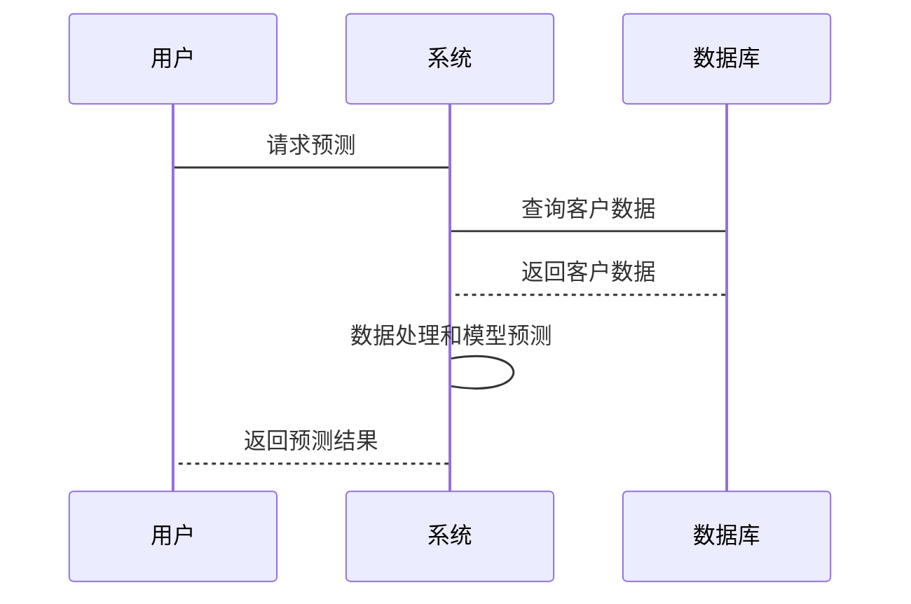

                 


# 金融产品客户生命周期价值预测

## 关键词
金融产品, 客户生命周期, 价值预测, 机器学习, 数据挖掘

## 摘要
金融产品客户生命周期价值预测是通过分析客户在不同生命周期阶段的行为和特征，预测客户在未来的价值贡献，从而帮助企业优化客户管理策略。本文将从数据收集与处理、特征工程、模型选择与实现、系统架构设计等方面详细探讨客户生命周期价值预测的实现方法，并结合实际案例，展示如何利用机器学习技术进行客户价值预测，从而为企业制定精准的营销策略和客户管理方案提供支持。

---

## 第1章: 金融产品客户生命周期价值预测的背景与意义

### 1.1 问题背景
客户是金融企业的核心资产，如何通过数据分析手段预测客户的生命周期价值，从而实现客户精准管理，是当前金融行业面临的重大挑战。客户生命周期价值预测能够帮助企业识别高价值客户，优化资源配置，降低客户流失率，提升客户满意度和忠诚度。

### 1.2 问题描述
客户生命周期价值预测的核心问题是基于客户的历史行为数据和属性数据，预测客户在未来一段时间内的价值贡献。这需要结合客户在不同生命周期阶段的行为特征和属性特征，构建数学模型，实现对客户价值的精准预测。

### 1.3 问题解决思路
通过数据挖掘和机器学习技术，结合客户在不同生命周期阶段的行为特征和属性特征，构建预测模型，实现对客户未来价值的预测。具体思路包括：
1. 数据预处理：清洗、整合和特征提取。
2. 模型选择：选择适合的机器学习算法，如线性回归、随机森林等。
3. 模型训练与验证：通过交叉验证优化模型参数，评估模型性能。
4. 模型部署与应用：将模型应用于实际业务场景，实现客户价值预测和管理。

### 1.4 核心概念结构与组成
客户生命周期价值预测的核心概念包括生命周期阶段划分、客户价值预测模型和数据特征工程。通过构建客户生命周期模型，结合客户特征数据，实现对客户未来价值的预测。

---

## 第2章: 数据收集与处理

### 2.1 数据来源与收集方法
客户数据来源主要包括交易数据、客户行为数据、客户属性数据和市场活动数据。交易数据记录了客户的交易历史和金额，客户行为数据包括客户的登录次数、点击行为等，客户属性数据包括客户的年龄、性别等基本信息，市场活动数据记录了客户参与市场活动的情况。

### 2.2 数据清洗与预处理
数据清洗是数据处理的重要步骤，主要包括处理缺失值、异常值和重复值。数据标准化和归一化是数据预处理的重要环节，能够提高模型的预测性能。此外，还需要对数据进行特征提取和降维处理，以便后续模型训练。

### 2.3 数据特征工程
特征工程是客户价值预测的关键步骤，主要包括时间序列特征提取、客户行为特征提取和客户属性特征提取。通过特征工程，能够提取出对模型预测有重要影响的特征，提高模型的预测精度。

---

## 第3章: 客户生命周期价值预测的核心概念与联系

### 3.1 生命周期阶段划分的原理
生命周期阶段划分是客户价值预测的重要基础，主要包括客户获取阶段、客户成长阶段和客户成熟阶段。每个阶段的客户行为和特征都有所不同，需要结合具体业务场景进行划分。

### 3.2 客户价值预测的数学模型
客户价值预测的数学模型包括线性回归模型、随机森林模型和神经网络模型。线性回归模型适用于线性关系的预测，随机森林模型适用于非线性关系的预测，神经网络模型适用于复杂关系的预测。

### 3.3 核心概念的ER实体关系图
```mermaid
erDiagram
    customer [客户] {
        id : integer
        name : string
        age : integer
        gender : string
        transaction_amount : float
        transaction_frequency : integer
        last_login_time : datetime
    }
    product [金融产品] {
        product_id : integer
        product_name : string
        product_type : string
        risk_level : string
    }
    lifecycle_stage [生命周期阶段] {
        stage_id : integer
        stage_name : string
        start_time : datetime
        end_time : datetime
    }
    customer -> lifecycle_stage : belongs_to
    customer -> product : owns
```

---

## 第4章: 算法原理讲解

### 4.1 线性回归模型
线性回归模型是一种经典的回归分析方法，适用于线性关系的预测。其数学模型为：
$$y = \beta_0 + \beta_1x_1 + \beta_2x_2 + \cdots + \beta_nx_n + \epsilon$$
其中，$y$ 是目标变量，$x_i$ 是自变量，$\beta_i$ 是回归系数，$\epsilon$ 是误差项。

### 4.2 随机森林模型
随机森林模型是一种基于树的集成学习方法，适用于非线性关系的预测。其核心思想是通过构建多棵决策树，并对结果进行投票或平均，提高模型的预测精度。

### 4.3 神经网络模型
神经网络模型是一种基于人工神经网络的机器学习方法，适用于复杂关系的预测。其数学模型包括输入层、隐藏层和输出层，通过反向传播算法进行参数优化。

---

## 第5章: 系统分析与架构设计

### 5.1 问题场景介绍
客户生命周期价值预测系统需要处理大量的客户数据，包括交易数据、客户行为数据和客户属性数据。系统需要能够实时处理数据，并提供客户价值预测结果。

### 5.2 系统功能设计
系统功能设计包括数据采集模块、数据处理模块、模型训练模块和预测模块。数据采集模块负责收集客户数据，数据处理模块负责数据清洗和特征提取，模型训练模块负责模型训练和优化，预测模块负责客户价值预测。

### 5.3 系统架构设计
系统架构设计采用分层架构，包括数据层、业务逻辑层和表现层。数据层负责数据存储和管理，业务逻辑层负责数据处理和模型训练，表现层负责用户交互和结果展示。

### 5.4 系统接口设计
系统接口设计包括数据接口和预测接口。数据接口用于数据的输入和输出，预测接口用于客户价值的预测和结果展示。

### 5.5 系统交互流程图


---

## 第6章: 项目实战

### 6.1 环境安装
项目实战需要安装Python、Pandas、Scikit-learn和XGBoost等工具。安装步骤如下：
1. 安装Python：`python --version`
2. 安装Pandas：`pip install pandas`
3. 安装Scikit-learn：`pip install scikit-learn`
4. 安装XGBoost：`pip install xgboost`

### 6.2 核心代码实现
以下是客户价值预测的Python代码示例：
```python
import pandas as pd
from sklearn.model_selection import train_test_split
from sklearn.ensemble import RandomForestRegressor
from sklearn.metrics import mean_squared_error

# 数据加载
data = pd.read_csv('customer_data.csv')

# 特征提取
features = data[['age', 'gender', 'transaction_amount', 'transaction_frequency']]
labels = data['customer_value']

# 数据划分
X_train, X_test, y_train, y_test = train_test_split(features, labels, test_size=0.2, random_state=42)

# 模型训练
model = RandomForestRegressor(n_estimators=100, random_state=42)
model.fit(X_train, y_train)

# 模型预测
y_pred = model.predict(X_test)

# 模型评估
 mse = mean_squared_error(y_test, y_pred)
 print(f'Mean Squared Error: {mse}')
```

### 6.3 实际案例分析
以某银行的信用卡客户为例，分析客户生命周期价值预测的实际应用。通过构建客户生命周期模型，帮助企业识别高价值客户，优化营销策略，提升客户满意度和忠诚度。

---

## 第7章: 最佳实践与总结

### 7.1 小结
客户生命周期价值预测是金融行业的重要课题，通过数据挖掘和机器学习技术，能够帮助企业实现客户价值的精准预测和管理。

### 7.2 注意事项
在实际应用中，需要注意数据质量和模型性能的优化，同时还要关注模型的可解释性和业务场景的适用性。

### 7.3 拓展阅读
建议读者进一步阅读《机器学习实战》和《数据挖掘导论》等书籍，深入了解客户生命周期价值预测的理论和实践。

---

通过本文的详细讲解，读者可以掌握客户生命周期价值预测的核心方法和技术，为企业制定精准的客户管理策略提供有力支持。

