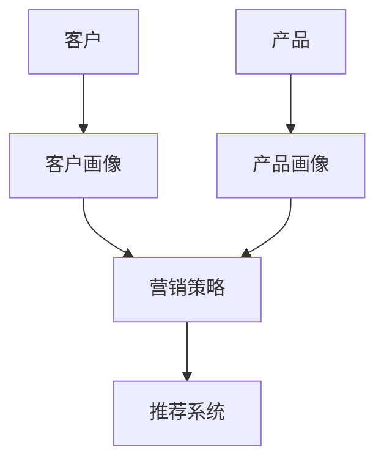
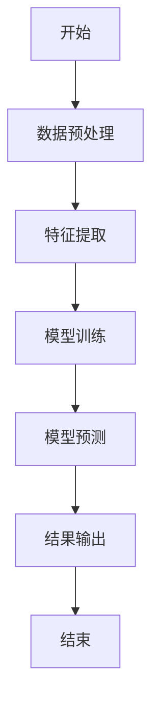

                 


# 《金融产品客户精准营销引擎》

> **关键词**：金融产品，客户精准营销，机器学习，推荐系统，系统架构

> **摘要**：  
> 本文深入探讨了金融产品客户精准营销引擎的设计与实现。从传统金融营销的痛点出发，分析了精准营销的必要性与实现路径。通过客户画像、营销策略和推荐系统的构建，结合机器学习算法和系统架构设计，提出了一个完整的解决方案。文章详细介绍了算法原理、系统架构、项目实战及最佳实践，为金融行业精准营销提供了理论与实践指导。

---

# 第一部分: 金融产品客户精准营销引擎背景与核心概念

## 第1章: 问题背景与需求分析

### 1.1 问题背景

#### 1.1.1 传统金融营销的痛点
- 传统营销方式依赖人工经验，效率低且精准度差。
- 客户需求多样，金融产品复杂，难以匹配。
- 数据孤岛问题严重，难以充分利用客户数据。

#### 1.1.2 精准营销的必要性
- 提高营销效率，降低营销成本。
- 增强客户体验，提升客户满意度和忠诚度。
- 提高金融产品销售转化率和客户生命周期价值。

#### 1.1.3 数字化转型对金融营销的影响
- 数据驱动决策成为主流。
- 人工智能和大数据技术为精准营销提供了技术支撑。
- 客户行为数据的积累和分析能力的提升推动了精准营销的发展。

### 1.2 问题描述

#### 1.2.1 客户需求的多样性
- 不同客户群体的需求差异显著，例如高净值客户与普通客户的需求差异大。
- 同一客户在不同时期的需求也会发生变化。

#### 1.2.2 金融产品的复杂性
- 金融产品种类繁多，包括理财产品、保险产品、基金、股票等。
- 每个产品都有不同的风险等级、收益预期和适合客户群体。

#### 1.2.3 营销效率的提升空间
- 传统营销方式难以快速匹配客户与产品。
- 精准营销可以减少无效营销，提高转化率。

### 1.3 问题解决思路

#### 1.3.1 数据驱动的营销策略
- 基于客户数据和行为数据，构建客户画像。
- 利用数据挖掘技术发现客户群体特征和需求偏好。

#### 1.3.2 人工智能在精准营销中的应用
- 使用机器学习算法预测客户行为和偏好。
- 利用自然语言处理技术分析客户反馈和文本数据。

#### 1.3.3 系统化解决方案的构建
- 构建客户画像系统，实现客户分群。
- 建立推荐系统，实现个性化产品推荐。
- 设计营销活动管理系统，实现精准营销活动的策划与执行。

### 1.4 精准营销引擎的边界与外延

#### 1.4.1 边界定义
- 精准营销引擎的输入是客户数据和产品数据。
- 输出是针对客户的个性化推荐和营销策略。
- 边界不包括具体的营销执行过程，例如短信发送或电话营销。

#### 1.4.2 外延与相关概念对比
- 客户画像：精准营销的核心工具，用于描述客户特征。
- 营销策略：基于客户画像制定的营销计划。
- 推荐系统：实现个性化产品推荐的技术手段。

### 1.5 核心概念结构与组成

#### 1.5.1 核心要素分析
- 客户数据：包括客户基本信息、行为数据、交易数据等。
- 产品数据：包括产品属性、风险等级、收益预期等。
- 营销策略：包括客户分群、产品推荐、营销活动策划等。

#### 1.5.2 概念关系图


---

## 第2章: 核心概念与联系

### 2.1 核心概念原理

#### 2.1.1 客户画像的构建
- 客户画像：通过数据分析技术，将客户的基本信息、行为数据、交易数据等整合起来，形成客户特征描述。
- 画像维度：包括年龄、性别、收入水平、资产规模、投资偏好等。

#### 2.1.2 营销策略的制定
- 营销策略：基于客户画像和产品特征，制定针对性的营销计划。
- 策略类型：包括客户分群、产品推荐、营销活动策划等。

#### 2.1.3 推荐系统的运行机制
- 推荐系统：通过分析客户特征和产品特征，实现个性化产品推荐。
- 推荐算法：包括基于协同过滤的推荐、基于内容的推荐、基于机器学习的推荐等。

### 2.2 核心概念对比分析

#### 2.2.1 客户画像与用户画像的对比
| 特性      | 客户画像                     | 用户画像                     |
|-----------|------------------------------|------------------------------|
| 数据来源  | 客户基本信息、交易数据、行为数据 | 用户的基本信息、行为数据     |
| 应用场景  | 金融产品推荐、营销策略制定   | 互联网产品推荐、个性化服务   |

#### 2.2.2 营销策略与销售策略的异同
| 特性      | 营销策略                     | 销售策略                     |
|-----------|------------------------------|------------------------------|
| 目标      | 提高客户转化率               | 提高销售额                   |
| 方法      | 客户分群、产品推荐           | 价格优惠、促销活动           |

#### 2.2.3 推荐系统与预测模型的关联
- 推荐系统基于预测模型的结果进行产品推荐。
- 预测模型用于预测客户对产品的兴趣和偏好。

### 2.3 ER实体关系图

```mermaid
er
  Customer客户表
  Product产品表
  Campaign营销活动表
  Interaction客户互动表
  Customer -- 关联 --> Product
  Customer -- 关联 --> Campaign
  Interaction -- 关联 --> Customer
  Interaction -- 关联 --> Product
```

---

# 第二部分: 精准营销引擎的算法原理

## 第3章: 算法原理与实现

### 3.1 算法原理

#### 3.1.1 基于机器学习的客户分类
- 使用逻辑回归或随机森林算法对客户进行分类。
- 输入：客户特征数据（如年龄、收入、资产规模）。
- 输出：客户类别（如高净值客户、风险厌恶客户）。

#### 3.1.2 基于规则的营销策略生成
- 根据客户分类结果，生成针对性的营销策略。
- 规则示例：如果客户是高净值客户，推荐高端理财产品。

#### 3.1.3 基于协同过滤的推荐系统
- 使用协同过滤算法，基于客户行为数据推荐相似产品的客户。
- 输入：客户行为数据（如购买记录、浏览记录）。
- 输出：推荐产品列表。

### 3.2 算法流程图



### 3.3 算法实现

#### 3.3.1 逻辑回归模型
```python
import numpy as np
from sklearn.linear_model import LogisticRegression

# 假设X是特征矩阵，y是目标变量
model = LogisticRegression()
model.fit(X, y)

# 预测客户类别
y_pred = model.predict(X)
```

#### 3.3.2 随机森林分类器
```python
from sklearn.ensemble import RandomForestClassifier

model = RandomForestClassifier(n_estimators=100)
model.fit(X, y)

y_pred = model.predict(X)
```

#### 3.3.3 协同过滤推荐系统
```python
from sklearn.metrics.pairwise import cosine_similarity

# 计算用户相似度矩阵
similarity_matrix = cosine_similarity(user_item_matrix)

# 推荐相似用户的高评分产品
def recommend_products(user_id):
    similar_users = np.argsort(similarity_matrix[user_id])[::-1]
    recommended_products = []
    for user in similar_users:
        if user != user_id and similarity_matrix[user_id][user] > 0.5:
            recommended_products.extend(user_item_matrix[user, :])
    return recommended_products
```

### 3.4 数学模型与公式

#### 3.4.1 逻辑回归模型
- 概率计算公式：
  $$ P(y=1|x) = \frac{1}{1 + e^{-\beta x}} $$
- 损失函数：
  $$ L = -\sum_{i=1}^{n} [y_i \ln(p_i) + (1 - y_i) \ln(1 - p_i)] $$

#### 3.4.2 协同过滤算法
- 相似度计算公式：
  $$ \text{similarity}(u, v) = \frac{\sum_{i=1}^{n} (x_{u,i} \cdot x_{v,i})}{\sqrt{\sum_{i=1}^{n} x_{u,i}^2} \cdot \sqrt{\sum_{i=1}^{n} x_{v,i}^2}}} $$

---

## 第4章: 算法实现与优化

### 4.1 算法实现

#### 4.1.1 数据预处理
- 数据清洗：处理缺失值、异常值。
- 特征工程：提取关键特征，如客户资产规模、投资偏好。

#### 4.1.2 模型训练
- 使用训练数据训练逻辑回归或随机森林模型。
- 调参：通过交叉验证选择最优模型参数。

#### 4.1.3 模型评估
- 使用测试数据评估模型性能。
- 评估指标：准确率、召回率、F1分数。

### 4.2 算法优化

#### 4.2.1 参数优化
- 使用网格搜索（Grid Search）或随机搜索（Random Search）优化模型参数。
- 示例：
  ```python
  from sklearn.model_selection import GridSearchCV

  parameters = {'n_estimators': [100, 200], 'max_depth': [None, 10, 20]}
  grid_search = GridSearchCV(RandomForestClassifier(), parameters)
  grid_search.fit(X_train, y_train)
  ```

#### 4.2.2 模型融合
- 使用集成学习方法（如投票分类器）结合多个模型的结果。
- 示例：
  ```python
  from sklearn.ensemble import VotingClassifier

  model1 = LogisticRegression()
  model2 = RandomForestClassifier()
  model3 = SVC()

  voting_model = VotingClassifier(estimators=[('lr', model1), ('rf', model2), ('svc', model3)])
  voting_model.fit(X_train, y_train)
  ```

---

## 第5章: 算法实现代码与解读

### 5.1 核心代码

#### 5.1.1 数据加载与预处理
```python
import pandas as pd
from sklearn.model_selection import train_test_split
from sklearn.preprocessing import StandardScaler

# 加载数据
data = pd.read_csv('customer_data.csv')

# 数据清洗
data.dropna(inplace=True)

# 特征提取
X = data[['age', 'income', 'assets']].values
y = data['product_preference'].values

# 数据分割
X_train, X_test, y_train, y_test = train_test_split(X, y, test_size=0.2, random_state=42)

# 特征标准化
scaler = StandardScaler()
X_train = scaler.fit_transform(X_train)
X_test = scaler.transform(X_test)
```

#### 5.1.2 模型训练与预测
```python
from sklearn.linear_model import LogisticRegression
from sklearn.metrics import accuracy_score, classification_report

# 训练模型
model = LogisticRegression()
model.fit(X_train, y_train)

# 预测
y_pred = model.predict(X_test)

# 评估
print(f'Accuracy: {accuracy_score(y_test, y_pred)}')
print(classification_report(y_test, y_pred))
```

### 5.2 代码解读与分析

#### 5.2.1 数据加载与预处理
- 数据加载：使用 Pandas 读取 CSV 文件。
- 数据清洗：删除缺失值。
- 特征提取：选择相关特征变量。
- 数据分割：将数据分为训练集和测试集。
- 特征标准化：对特征进行标准化处理，确保模型训练稳定。

#### 5.2.2 模型训练与预测
- 模型选择：使用逻辑回归模型。
- 模型训练：在训练集上训练模型。
- 模型预测：在测试集上进行预测。
- 模型评估：计算准确率和分类报告。

---

## 第6章: 算法优化与调优

### 6.1 参数调优

#### 6.1.1 使用网格搜索优化参数
```python
from sklearn.model_selection import GridSearchCV

# 定义参数网格
param_grid = {
    'C': [0.1, 1, 10],
    'penalty': ['l1', 'l2']
}

# 网格搜索
grid_search = GridSearchCV(LogisticRegression(), param_grid, cv=5)
grid_search.fit(X_train, y_train)

# 输出最佳参数
print(f'Best parameters: {grid_search.best_params_}')
```

#### 6.1.2 使用随机搜索优化参数
```python
from sklearn.model_selection import RandomizedSearchCV

# 定义参数分布
param_dist = {
    'C': [1e-3, 1e-2, 0.1, 1, 10, 100],
    'penalty': ['l1', 'l2']
}

# 随机搜索
random_search = RandomizedSearchCV(LogisticRegression(), param_dist, cv=5, n_iter=50)
random_search.fit(X_train, y_train)

# 输出最佳参数
print(f'Best parameters: {random_search.best_params_}')
```

### 6.2 模型融合与集成

#### 6.2.1 使用投票分类器集成模型
```python
from sklearn.ensemble import VotingClassifier
from sklearn.svm import SVC

# 定义多个基模型
model1 = LogisticRegression(C=10, penalty='l2')
model2 = SVC(C=1, gamma=0.1, kernel='rb

