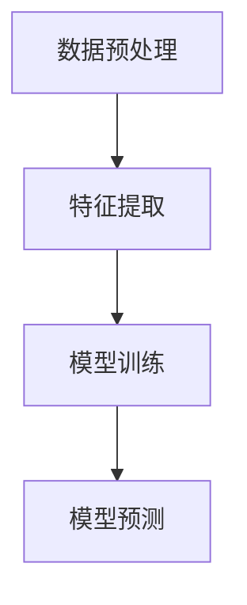

                 


# 《金融产品客户终身价值预测与提升策略》

## 关键词：
- 金融产品
- 客户终身价值（CLV）
- 数据分析
- 机器学习
- 人工智能

## 摘要：
本文深入探讨了金融产品客户终身价值（CLV）的预测与提升策略。通过数据分析、机器学习和系统设计等方法，结合实际案例，详细讲解了如何利用客户行为数据构建预测模型，并制定有效的客户价值提升策略。文章内容涵盖理论基础、算法实现、系统架构设计以及实战应用，为金融行业提供了可操作的指导。

---

## 第1章：客户终身价值（CLV）概述

### 1.1 客户终身价值的定义与重要性

客户终身价值（Customer Lifetime Value，CLV）是指一个客户在其与企业关系的整个生命周期中为企业带来的总收益。在金融产品领域，CLV不仅是客户价值的量化指标，也是制定精准营销策略的重要依据。高CLV的客户通常具有较高的忠诚度和消费频率，能够为金融机构带来长期稳定的收益。

CLV的重要性体现在以下几个方面：
1. **客户保留与获取成本优化**：通过预测客户的价值，金融机构可以优化客户获取和保留策略，降低获客成本。
2. **精准营销**：基于CLV的分析，金融机构可以制定个性化的营销策略，提升客户满意度和忠诚度。
3. **风险控制**：高CLV客户通常是优质客户，其违约风险较低，有助于金融机构优化风险管理。

### 1.2 金融产品客户分析的基础概念

#### 1.2.1 客户生命周期的概念

客户生命周期包括以下几个阶段：
1. **获取阶段**：客户首次接触并购买产品。
2. **发展阶段**：客户逐渐增加购买频率和金额。
3. **成熟阶段**：客户成为长期稳定客户，贡献大部分收益。
4. **衰退阶段**：客户逐渐减少购买，最终流失。

#### 1.2.2 客户分类与行为分析

客户可以根据其行为特征和价值分为不同的类别，例如：
- **高价值客户**：贡献高，忠诚度高。
- **中等价值客户**：贡献中等，潜力较大。
- **低价值客户**：贡献低，流失风险高。

#### 1.2.3 金融产品的特点与分类

金融产品种类繁多，包括银行存款、理财产品、保险产品、基金等。不同产品具有不同的风险、收益和客户群体特征，CLV的预测需要结合产品特点进行定制化分析。

---

## 第2章：客户价值预测的理论基础

### 2.1 数据分析与客户价值预测

#### 2.1.1 数据分析在金融产品中的应用

数据分析是客户价值预测的基础，主要包括以下步骤：
1. **数据采集**：收集客户的基本信息、交易记录、行为数据等。
2. **数据预处理**：清洗数据，处理缺失值、异常值等。
3. **特征提取**：从数据中提取有助于预测的关键特征，例如交易频率、平均交易金额等。

#### 2.1.2 数据预处理与特征提取

**数据预处理**：
- 清洗数据：去除重复记录、处理无效数据。
- 标准化：将数据标准化，使其具有可比性。

**特征提取**：
- 利用统计方法或机器学习算法提取特征，例如使用主成分分析（PCA）降维。

#### 2.1.3 数据清洗与标准化

数据清洗是确保数据分析准确性的关键步骤，包括处理缺失值、异常值和重复值。标准化则是将数据转换为统一的尺度，便于后续分析。

### 2.2 机器学习在客户价值预测中的应用

#### 2.2.1 机器学习的基本概念

机器学习是一种人工智能技术，通过训练数据模型，使其能够从数据中学习并做出预测。在客户价值预测中，常用的机器学习算法包括线性回归、随机森林、支持向量机（SVM）等。

#### 2.2.2 常见的机器学习算法介绍

- **线性回归**：用于预测连续型变量，例如客户 lifetime value。
- **随机森林**：基于决策树的集成算法，适用于分类和回归问题。
- **支持向量机（SVM）**：适用于分类问题，具有较高的准确性。

#### 2.2.3 监督学习与无监督学习在客户价值预测中的应用

- **监督学习**：用于分类和回归问题，例如根据客户特征预测其 CLV。
- **无监督学习**：用于聚类分析，例如将客户分为不同类别。

---

## 第3章：客户价值预测的数学模型

### 3.1 线性回归模型

#### 3.1.1 线性回归的基本原理

线性回归是一种统计学方法，用于建立自变量和因变量之间的线性关系。其数学公式为：

$$ y = \beta_0 + \beta_1x + \epsilon $$

其中：
- \( y \) 是因变量（客户 lifetime value）。
- \( x \) 是自变量（客户特征）。
- \( \beta_0 \) 和 \( \beta_1 \) 是回归系数。
- \( \epsilon \) 是误差项。

#### 3.1.2 线性回归的数学公式

线性回归的预测公式为：

$$ \hat{y} = \beta_0 + \beta_1x $$

通过最小二乘法，我们可以求解回归系数：

$$ \beta_1 = \frac{\sum (x_i - \bar{x})(y_i - \bar{y})}{\sum (x_i - \bar{x})^2} $$

$$ \beta_0 = \bar{y} - \beta_1 \bar{x} $$

#### 3.1.3 线性回归在客户价值预测中的应用

线性回归适用于简单的线性关系，但可能无法捕捉复杂的非线性关系。因此，在实际应用中，可能需要结合其他算法进行优化。

### 3.2 随机森林模型

#### 3.2.1 随机森林的基本原理

随机森林是一种基于决策树的集成算法，通过构建多个决策树并进行投票或平均，提高模型的准确性和鲁棒性。

#### 3.2.2 随机森林的数学公式

随机森林的预测公式为：

$$ \hat{y} = \frac{1}{n} \sum_{i=1}^{n} T_i(x) $$

其中：
- \( T_i(x) \) 是第 \( i \) 棵决策树的预测值。
- \( n \) 是决策树的数量。

#### 3.2.3 随机森林在客户价值预测中的优势

- 高准确性：通过集成多个决策树，提高了模型的预测能力。
- 鲁棒性：能够处理高维数据和噪声数据。

---

## 第4章：客户价值提升策略的系统设计

### 4.1 系统功能设计

#### 4.1.1 数据采集模块

数据采集模块负责收集客户的基本信息、交易记录和行为数据，通常通过数据库或API接口进行数据获取。

#### 4.1.2 数据分析模块

数据分析模块负责对数据进行预处理、特征提取和模型训练，输出客户价值预测结果。

#### 4.1.3 模型预测模块

模型预测模块基于训练好的模型，对新客户进行价值预测，并生成客户分组报告。

#### 4.1.4 策略执行模块

策略执行模块根据客户分组结果，制定个性化营销策略，例如优惠券发放、产品推荐等。

### 4.2 系统架构设计

#### 4.2.1 分层架构设计

分层架构将系统划分为数据层、业务逻辑层和表现层，便于模块化开发和维护。

#### 4.2.2 微服务架构设计

微服务架构将系统功能模块化，每个服务独立运行，便于扩展和维护。

#### 4.2.3 系统交互流程设计

系统交互流程包括数据采集、数据分析、模型预测和策略执行四个主要步骤。

---

## 第5章：项目实战

### 5.1 环境安装与配置

#### 5.1.1 安装Python与必要的库

安装Python和常用的机器学习库，例如NumPy、Pandas、Scikit-learn等。

#### 5.1.2 数据库的安装与配置

安装MySQL或MongoDB等数据库，并配置连接信息。

#### 5.1.3 开发环境的搭建

搭建Jupyter Notebook或PyCharm等开发环境，配置虚拟环境和依赖库。

### 5.2 核心代码实现

#### 5.2.1 数据预处理代码

```python
import pandas as pd
import numpy as np

# 加载数据
data = pd.read_csv('customer_data.csv')

# 处理缺失值
data = data.dropna()

# 标准化处理
from sklearn.preprocessing import StandardScaler
scaler = StandardScaler()
scaled_data = scaler.fit_transform(data)
```

#### 5.2.2 模型训练代码

```python
from sklearn.ensemble import RandomForestRegressor
from sklearn.metrics import mean_squared_error

# 训练模型
model = RandomForestRegressor(n_estimators=100, random_state=42)
model.fit(X_train, y_train)

# 模型评估
y_pred = model.predict(X_test)
print('均方误差:', mean_squared_error(y_test, y_pred))
```

#### 5.2.3 策略执行代码

```python
# 根据模型预测结果，将客户分为高、中、低价值客户
predicted_clv = model.predict(X)
customer_segmentation = pd.DataFrame({
    '客户ID': customer_ids,
    '预测CLV': predicted_clv
})
customer_segmentation.to_csv('customer_segmentation.csv', index=False)
```

---

## 第6章：总结与未来展望

### 6.1 本书内容回顾

- 介绍了客户终身价值（CLV）的定义和重要性。
- 探讨了数据分析和机器学习在客户价值预测中的应用。
- 展示了如何通过系统设计和实际案例实现客户价值的预测与提升。

### 6.2 未来研究方向

- **新兴技术的影响**：随着人工智能技术的不断发展，未来可能会涌现出更多高效、精准的客户价值预测方法。
- **多模态数据的应用**：结合文本、图像等多种数据源，进一步提升客户价值预测的准确性。
- **个性化策略优化**：通过动态调整策略，实时响应客户需求变化，提升客户满意度和忠诚度。

---

## 附录：工具与资源

- **附录A：常用数据处理与机器学习库**
  - NumPy、Pandas、Scikit-learn、XGBoost等。
- **附录B：代码示例与参考文献**
  - 提供完整的代码示例和相关文献引用。

---

## 图

#### 客户生命周期阶段图


#### 系统架构设计图


#### 算法流程图



---

通过以上内容，我们系统地介绍了金融产品客户终身价值预测与提升策略的理论基础、算法实现和系统设计，结合实际案例分析，为金融行业的客户价值管理提供了全面的指导。

