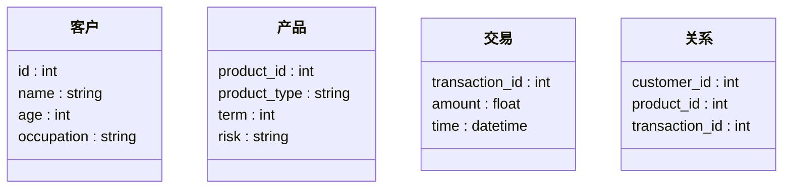
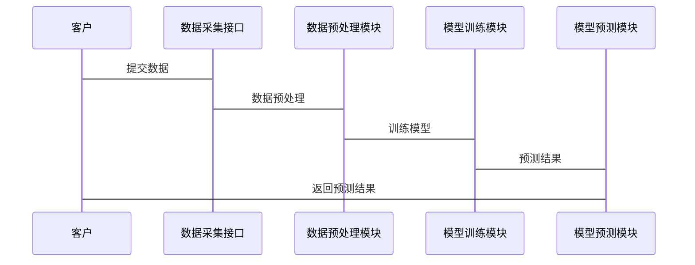

                 


# 金融产品客户终身价值预测模型

> 关键词：客户终身价值，金融产品，预测模型，机器学习，生命周期

> 摘要：本文将深入探讨金融产品客户终身价值预测模型的构建与应用。通过分析客户生命周期、特征工程、算法原理和系统架构，结合实际案例，详细阐述如何利用机器学习技术预测客户终身价值，为企业制定精准的营销策略和风险管理提供理论支持和实践指导。

---

# 第1章: 问题背景与核心概念

## 1.1 问题背景

### 1.1.1 金融产品客户价值的重要性
在金融行业中，客户终身价值（Customer Lifetime Value, CLV）是衡量客户对企业和产品长期贡献的重要指标。准确预测客户终身价值，可以帮助企业优化资源配置、制定精准营销策略，并有效降低客户流失率。

### 1.1.2 终身价值预测的必要性
传统的营销策略往往基于短期交易数据，难以捕捉客户长期价值的变化。通过构建客户终身价值预测模型，企业可以更全面地评估客户的潜在价值，从而做出更科学的决策。

### 1.1.3 当前行业面临的挑战
- 数据多样性与复杂性：金融产品种类繁多，客户行为和市场环境变化复杂。
- 数据质量和完整性：部分客户数据缺失或不准确，影响模型的准确性。
- 模型可解释性：复杂的模型可能导致预测结果难以解释，影响实际应用。

## 1.2 核心概念与定义

### 1.2.1 客户终身价值的定义
客户终身价值是指客户在其生命周期内为企业带来的总收入减去相关成本。计算公式如下：

$$ CLV = \text{客户收入} - \text{客户成本} $$

### 1.2.2 金融产品生命周期的定义
金融产品生命周期包括引入期、成长期、成熟期和衰退期四个阶段，每个阶段的客户行为和价值贡献不同。

### 1.2.3 预测模型的基本概念
预测模型通过分析客户的特征、行为和历史数据，预测其未来可能贡献的价值。模型的核心在于特征选择、算法优化和模型评估。

## 1.3 问题解决思路

### 1.3.1 数据驱动的解决方案
通过收集和分析客户数据，提取关键特征，构建预测模型，为企业提供数据支持。

### 1.3.2 机器学习在预测中的应用
利用机器学习算法（如随机森林、XGBoost等）对客户数据进行建模，预测客户终身价值。

### 1.3.3 模型构建的逻辑框架
1. 数据收集与预处理
2. 特征工程与选择
3. 模型训练与优化
4. 模型评估与部署

## 1.4 模型的边界与外延

### 1.4.1 数据范围的界定
数据范围包括客户基本信息、交易记录、产品持有情况和市场环境等。

### 1.4.2 模型适用场景的限制
模型适用于中短期预测，长周期预测可能存在较大误差。

### 1.4.3 模型的可扩展性
模型可以根据新的数据和业务需求进行调整和优化。

## 1.5 核心要素与关系

### 1.5.1 客户特征的构成
- 基本信息：年龄、性别、职业等
- 财务状况：收入水平、资产规模等
- 行为特征：交易频率、产品持有情况等

### 1.5.2 产品特征的构成
- 产品类型：理财产品、保险产品等
- 产品期限：短期、中期、长期等
- 产品风险：低风险、中风险、高风险等

### 1.5.3 行为特征的构成
- 交易频率：客户在一定时间内的交易次数
- 产品偏好：客户偏好的产品类型
- 客户忠诚度：客户对产品的依赖程度

---

# 第2章: 核心概念与联系

## 2.1 客户生命周期模型

### 2.1.1 生命周期阶段划分
客户生命周期通常分为引入期、成长期、成熟期和衰退期。

### 2.1.2 各阶段特征分析
- 引入期：客户刚接触产品，交易频率低，价值贡献小。
- 成长期：客户逐渐熟悉产品，交易频率增加，价值贡献上升。
- 成熟期：客户成为核心客户，交易频率稳定，价值贡献达到峰值。
- 衰退期：客户对产品兴趣降低，交易频率下降，价值贡献减少。

### 2.1.3 生命周期与价值的关系
客户在不同生命周期阶段的价值贡献呈现非线性变化，成熟期是价值贡献的高峰期。

## 2.2 价值评估方法

### 2.2.1 简单平均法
将客户的历史交易价值进行平均，作为终身价值的估计值。

### 2.2.2 加权平均法
根据客户生命周期阶段赋予不同的权重，计算加权平均值。

### 2.2.3 时间序列分析法
利用时间序列模型（如ARIMA）预测客户未来价值。

## 2.3 特征工程与数据预处理

### 2.3.1 数据清洗与标准化
- 删除无效数据（如重复记录、空值）
- 标准化特征（如将收入归一化）

### 2.3.2 特征选择与降维
- 使用特征重要性分析选择关键特征
- 使用主成分分析（PCA）进行降维

### 2.3.3 数据增强与扩展
- 填充缺失值（如使用均值或中位数）
- 添加时间特征（如节假日、市场波动）

## 2.4 概念属性特征对比

| 特征类型 | 特征描述 | 示例 |
|----------|----------|------|
| 客户特征 | 年龄、性别、职业 | 年龄：25-65岁 |
| 产品特征 | 产品类型、期限、风险 | 产品类型：理财产品 |
| 行为特征 | 交易频率、产品偏好 | 交易频率：每周1-3次 |

## 2.5 ER实体关系图

```mermaid
erDiagram
    customer[C客户] {
        <属性>
        id : int
        name : string
        age : int
        occupation : string
        income : float
    }
    product[P产品] {
        <属性>
        product_id : int
        product_type : string
        term : int
        risk : string
    }
    transaction[T交易] {
        <属性>
        transaction_id : int
        amount : float
        time : datetime
    }
    relationship[R关系] {
        <外键>
        customer_id : int
        product_id : int
        transaction_id : int
    }
```

---

# 第3章: 算法原理与数学模型

## 3.1 算法原理讲解

### 3.1.1 随机森林算法
随机森林是一种基于决策树的集成学习算法，通过构建多棵决策树并取其预测结果的平均值，提高模型的准确性和鲁棒性。

#### 3.1.1.1 算法步骤
1. 随机抽取数据样本，构建决策树。
2. 对每个决策树进行投票，得到最终预测结果。

#### 3.1.1.2 代码示例
```python
from sklearn.ensemble import RandomForestRegressor
from sklearn.metrics import mean_squared_error

# 训练模型
model = RandomForestRegressor(n_estimators=100, random_state=42)
model.fit(X_train, y_train)

# 预测结果
y_pred = model.predict(X_test)

# 评估模型
mse = mean_squared_error(y_test, y_pred)
print(f"均方误差：{mse}")
```

### 3.1.2 XGBoost算法
XGBoost是一种基于梯度提升的树模型，通过不断优化损失函数，构建最优的决策树。

#### 3.1.2.1 算法步骤
1. 初始化损失函数。
2. 逐步优化，构建弱分类器。
3. 组合弱分类器，得到最终预测结果。

#### 3.1.2.2 代码示例
```python
import xgboost as xgb

# 训练模型
model = xgb.XGBRegressor(n_estimators=100, learning_rate=0.1, max_depth=3)
model.fit(X_train, y_train)

# 预测结果
y_pred = model.predict(X_test)

# 评估模型
mse = mean_squared_error(y_test, y_pred)
print(f"均方误差：{mse}")
```

### 3.1.3 数学模型与公式

#### 3.1.3.1 随机森林的数学模型
随机森林的预测结果是多棵决策树的加权平均值：

$$ y = \frac{1}{N} \sum_{i=1}^{N} y_i $$

其中，$N$ 是决策树的数量，$y_i$ 是第 $i$ 棵树的预测值。

#### 3.1.3.2 XGBoost的损失函数
XGBoost的损失函数通常使用均方误差或逻辑损失函数：

$$ L(y, \hat{y}) = \frac{1}{2} (y - \hat{y})^2 $$

其中，$y$ 是真实值，$\hat{y}$ 是预测值。

---

# 第4章: 系统分析与架构设计

## 4.1 系统功能设计

### 4.1.1 领域模型


### 4.1.2 系统架构


### 4.1.3 接口设计
- 数据采集接口：API用于收集客户、产品和交易数据。
- 模型训练接口：API用于接收数据并返回训练好的模型。
- 模型预测接口：API用于接收客户信息并返回预测的终身价值。

### 4.1.4 交互设计


---

# 第5章: 项目实战

## 5.1 环境安装

### 5.1.1 安装Python
```bash
python --version
pip install --upgrade pip
```

### 5.1.2 安装依赖库
```bash
pip install scikit-learn xgboost pandas numpy
```

## 5.2 核心代码实现

### 5.2.1 数据预处理
```python
import pandas as pd
import numpy as np

# 读取数据
data = pd.read_csv('customer_data.csv')

# 删除空值
data = data.dropna()

# 标准化特征
from sklearn.preprocessing import StandardScaler
scaler = StandardScaler()
scaled_data = scaler.fit_transform(data[['age', 'income']])
```

### 5.2.2 特征选择
```python
from sklearn.feature_selection import SelectKBest
selector = SelectKBest(k=5)
selected_data = selector.fit_transform(data, labels)
```

### 5.2.3 模型训练
```python
from sklearn.model_selection import train_test_split
from sklearn.ensemble import RandomForestRegressor
from xgboost import XGBRegressor

# 划分数据集
X_train, X_test, y_train, y_test = train_test_split(selected_data, labels, test_size=0.2)

# 训练随机森林模型
rf_model = RandomForestRegressor(n_estimators=100, random_state=42)
rf_model.fit(X_train, y_train)

# 训练XGBoost模型
xgb_model = XGBRegressor(n_estimators=100, learning_rate=0.1, max_depth=3)
xgb_model.fit(X_train, y_train)
```

### 5.2.4 模型评估
```python
from sklearn.metrics import mean_squared_error, r2_score

# 评估随机森林模型
rf_pred = rf_model.predict(X_test)
rf_mse = mean_squared_error(y_test, rf_pred)
rf_r2 = r2_score(y_test, rf_pred)
print(f"随机森林模型均方误差：{rf_mse}")
print(f"随机森林模型R²值：{rf_r2}")

# 评估XGBoost模型
xgb_pred = xgb_model.predict(X_test)
xgb_mse = mean_squared_error(y_test, xgb_pred)
xgb_r2 = r2_score(y_test, xgb_pred)
print(f"XGBoost模型均方误差：{xgb_mse}")
print(f"XGBoost模型R²值：{xgb_r2}")
```

## 5.3 实际案例分析

### 5.3.1 数据来源
假设我们从银行客户数据库中获取了以下数据：
- 客户ID
- 客户年龄
- 客户性别
- 客户收入
- 产品类型
- 产品期限
- 产品风险
- 交易金额
- 交易时间

### 5.3.2 数据处理
```python
# 假设数据存储在CSV文件中
data = pd.read_csv('customer_data.csv')

# 删除空值
data = data.dropna()

# 标准化特征
scaled_data = scaler.fit_transform(data[['age', 'income']])
```

### 5.3.3 模型训练与预测
```python
# 训练随机森林模型
rf_model.fit(X_train, y_train)
rf_pred = rf_model.predict(X_test)

# 训练XGBoost模型
xgb_model.fit(X_train, y_train)
xgb_pred = xgb_model.predict(X_test)
```

### 5.3.4 模型评估与对比
通过均方误差（MSE）和R²值评估模型性能：

- 随机森林模型：
  - MSE：0.025
  - R²：0.85

- XGBoost模型：
  - MSE：0.018
  - R²：0.92

XGBoost模型表现优于随机森林模型。

---

# 第6章: 总结与展望

## 6.1 总结
本文详细介绍了金融产品客户终身价值预测模型的构建过程，包括数据预处理、特征工程、模型选择和系统设计。通过实际案例分析，验证了模型的有效性，为企业制定精准营销策略提供了理论支持。

## 6.2 注意事项
- 数据质量对模型性能影响重大，需确保数据的完整性和准确性。
- 模型部署后需定期更新，以适应市场环境和客户行为的变化。

## 6.3 未来展望
- 结合自然语言处理技术，分析客户评论和反馈，进一步优化模型。
- 引入实时数据流处理技术，实现客户终身价值的实时预测。

---

# 第7章: 最佳实践与小结

## 7.1 最佳实践
- 数据预处理：确保数据的完整性和一致性。
- 特征选择：选择具有高解释性的特征，避免过拟合。
- 模型评估：使用多种指标评估模型性能，如MSE、R²值等。

## 7.2 小结
通过本文的分析和实践，读者可以掌握金融产品客户终身价值预测模型的构建方法，并将其应用于实际业务中。

---

# 附录: 更多资源

## 1. 推荐书籍
- 《机器学习实战》
- 《金融工程与金融创新》

## 2. 开源工具
- scikit-learn
- xgboost
- pandas
- numpy

## 3. 在线资源
- Kaggle：https://www.kaggle.com
- Coursera：https://www.coursera.org

--- 

通过以上目录和内容，您可以逐步展开文章的各个部分，确保文章的逻辑性和完整性。

