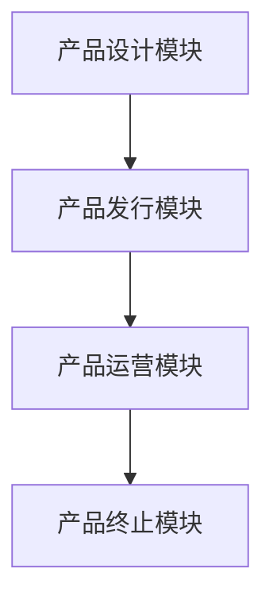
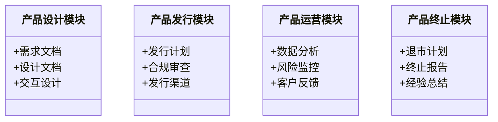
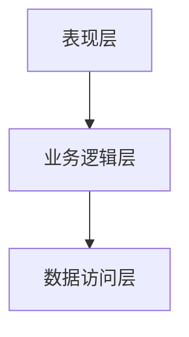

                 


# 金融产品生命周期管理平台

> 关键词：金融产品生命周期，管理平台，数字化转型，系统架构，风险管理

> 摘要：金融产品生命周期管理平台是金融行业数字化转型的重要工具，通过系统化管理产品从设计到终止的全生命周期，实现效率提升、风险控制和个性化服务。本文详细探讨了平台的核心模块、算法原理、系统架构及项目实战，为金融从业者提供实践指导。

---

## 第一章：金融产品生命周期管理平台的背景与现状

### 1.1 金融行业的数字化转型

#### 1.1.1 传统金融业务的痛点
- 传统金融业务流程复杂，产品设计、发行和运营效率低下。
- 风险管理手段单一，难以应对复杂多变的市场环境。
- 客户需求多样化，传统服务难以满足个性化要求。

#### 1.1.2 数字化转型的必要性
- 提高效率：通过自动化流程减少人工干预。
- 风险控制：利用大数据和AI技术实时监控风险。
- 用户体验：提供个性化服务提升客户满意度。

#### 1.1.3 金融产品生命周期管理的重要性
- 管理产品全生命周期，从设计到终止，确保合规性和高效性。
- 通过数据驱动决策，优化产品设计和运营策略。

### 1.2 问题背景与问题描述

#### 1.2.1 问题背景
- 金融机构在产品管理中缺乏统一平台，导致信息孤岛和数据冗余。
- 产品设计、发行和运营之间缺乏协同，效率低下。
- 风险管理滞后，难以及时应对市场变化。

#### 1.2.2 问题描述
- 产品设计缺乏标准化，导致设计周期长且容易出错。
- 发行过程复杂，合规性审查耗时，容易遗漏风险点。
- 运营阶段缺乏实时监控，难以及时发现并解决问题。

### 1.3 问题解决与平台价值

#### 1.3.1 平台的解决方案
- 提供统一平台管理产品全生命周期。
- 实现各阶段数据共享与协同工作。
- 利用AI和大数据技术提升风险控制能力。

#### 1.3.2 平台的核心价值
- 提高产品管理效率，缩短产品上市时间。
- 实时监控产品表现，降低风险。
- 通过数据分析优化产品设计，提升用户体验。

---

## 第二章：金融产品生命周期管理平台的核心概念与模块

### 2.1 核心概念

#### 2.1.1 金融产品生命周期管理平台的定义
- 一个系统化平台，管理金融产品的设计、发行、运营和终止。

#### 2.1.2 核心模块与功能
- 产品设计模块：需求分析、功能设计、文档管理。
- 产品发行模块：合规审查、发行渠道管理。
- 产品运营模块：数据分析、风险监控。
- 产品终止模块：退市流程、数据存档。

#### 2.1.3 核心概念之间的关系
- 产品设计与发行模块数据共享。
- 运营模块依赖设计和发行的数据进行分析。

### 2.2 模块关系与数据流

#### 2.2.1 模块间的关系
- 产品设计模块向发行模块提供设计数据。
- 发行模块向运营模块传递产品信息。
- 运营模块为终止模块提供终止依据。

#### 2.2.2 用Mermaid绘制的核心模块关系图



---

## 第三章：平台中的算法与数据处理技术

### 3.1 数据处理

#### 3.1.1 数据采集与清洗
- 数据来源：API接口、数据库、文件。
- 数据清洗方法：去重、填充缺失值、异常值处理。

#### 3.1.2 数据预处理
- 数据转换：格式统一、特征工程。
- 数据分割：训练集、测试集。

#### 3.1.3 数据可视化
- 使用Matplotlib绘制图表，展示数据分布和趋势。

### 3.2 算法原理

#### 3.2.1 产品风险评估算法
- 决策树算法：ID3、C4.5、CART。
- 使用Python实现决策树分类。

```python
from sklearn.tree import DecisionTreeClassifier
model = DecisionTreeClassifier()
model.fit(X_train, y_train)
```

#### 3.2.2 产品推荐算法
- 协同过滤算法：基于用户相似性或物品相似性。
- 实现协同过滤的Python代码示例。

```python
from sklearn.metrics.pairwise import cosine_similarity
similarities = cosine_similarity(X)
```

---

## 第四章：系统分析与架构设计

### 4.1 系统功能设计

#### 4.1.1 领域模型设计
- 使用Mermaid类图展示模块关系。



#### 4.1.2 系统架构设计
- 使用分层架构：表现层、业务逻辑层、数据访问层。



---

## 第五章：项目实战

### 5.1 环境安装

#### 5.1.1 安装Python和相关库
- 安装命令：`pip install numpy pandas scikit-learn`

### 5.2 核心代码实现

#### 5.2.1 产品风险评估代码
```python
import pandas as pd
from sklearn.tree import DecisionTreeClassifier

# 加载数据
data = pd.read_csv('product_risk.csv')
X = data[['feature1', 'feature2']]
y = data['risk_label']

# 训练模型
model = DecisionTreeClassifier()
model.fit(X, y)
```

#### 5.2.2 产品推荐代码
```python
from sklearn.metrics.pairwise import cosine_similarity

# 加载数据
data = pd.read_csv('product_recommendation.csv')
similarities = cosine_similarity(data)
```

### 5.3 案例分析

#### 5.3.1 风险评估案例
- 数据分析：识别高风险产品。
- 结果展示：生成风险评分报告。

#### 5.3.2 推荐系统案例
- 基于用户行为数据推荐产品。
- 实现协同过滤并展示推荐列表。

### 5.4 项目小结
- 成功实现产品风险评估和推荐系统。
- 系统架构设计合理，功能模块协同工作。

---

## 第六章：最佳实践与总结

### 6.1 最佳实践

#### 6.1.1 数据处理
- 数据清洗是关键，确保数据质量。
- 使用合适的数据可视化工具展示结果。

#### 6.1.2 算法选择
- 根据业务需求选择合适的算法。
- 调参优化提升模型性能。

#### 6.1.3 系统架构
- 分层设计提高系统的可维护性。
- 使用容器化技术部署系统。

### 6.2 小结

#### 6.2.1 总结
- 金融产品生命周期管理平台是金融行业数字化转型的重要工具。
- 通过系统化管理产品全生命周期，提升效率和用户体验。

#### 6.2.2 注意事项
- 数据安全和隐私保护是重点。
- 系统的可扩展性设计要考虑未来业务发展。

#### 6.2.3 拓展阅读
- 推荐阅读《金融风险管理》和《软件架构设计》相关书籍。

---

## 附录：常用工具与库

- Python库：pandas、numpy、scikit-learn。
- 数据可视化工具：Matplotlib、Seaborn。
- 项目管理工具：Jira、Trello。

---

以上为《金融产品生命周期管理平台》的技术博客文章目录大纲，详细内容可根据需要进一步扩展。

