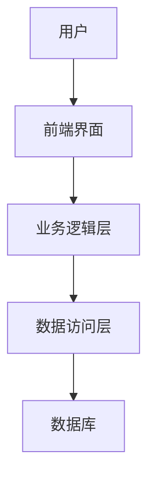
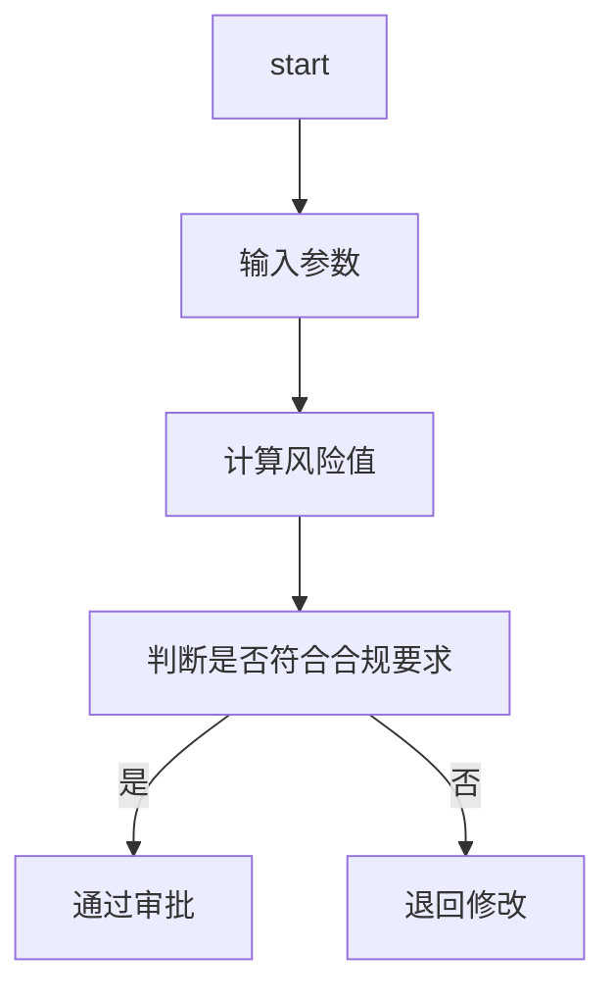
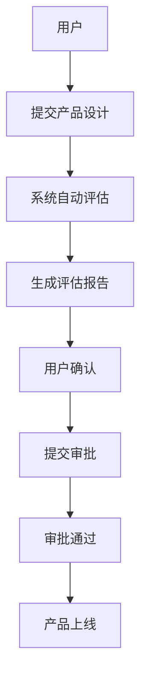

                 

# 《金融产品生命周期管理自动化系统》

---

## 关键词：
金融产品生命周期，自动化系统，金融科技，系统架构，风险管理

---

## 摘要：
金融产品生命周期管理是金融机构运营的核心环节，涵盖产品设计、审批、发行、运营和终止等多个阶段。传统的管理方式依赖人工操作，效率低下且容易出错。随着金融科技的快速发展，自动化技术的应用成为必然趋势。本文详细探讨了金融产品生命周期管理自动化系统的建设背景、核心概念、系统架构以及实现方案，结合实际案例分析了系统的功能设计和应用价值。通过本文章，读者可以全面了解如何利用自动化技术优化金融产品管理流程，提升效率和准确性。

---

## 目录大纲

---

# 第一部分：金融产品生命周期管理概述

## 第1章：金融产品生命周期的概念

### 1.1 金融产品的定义与分类
- 1.1.1 金融产品的基本定义
- 1.1.2 金融产品的分类（如银行产品、证券产品、保险产品等）
- 1.1.3 金融产品的生命周期模型

### 1.2 金融产品生命周期的阶段划分
- 1.2.1 产品设计阶段
- 1.2.2 产品审批阶段
- 1.2.3 产品发行阶段
- 1.2.4 产品运营阶段
- 1.2.5 产品终止阶段

### 1.3 金融产品生命周期管理的重要性
- 1.3.1 提高管理效率
- 1.3.2 降低运营成本
- 1.3.3 提升客户体验
- 1.3.4 风险控制与合规性

---

## 第2章：金融产品生命周期管理的挑战与解决方案

### 2.1 传统管理方式的局限性
- 2.1.1 人工操作的低效性
- 2.1.2 易出错的流程管理
- 2.1.3 缺乏实时监控和反馈机制

### 2.2 自动化管理的必要性
- 2.2.1 提升效率和准确性
- 2.2.2 实现快速响应和决策
- 2.2.3 支持复杂的金融产品创新

### 2.3 自动化系统的解决方案
- 2.3.1 全面覆盖生命周期各阶段
- 2.3.2 引入智能化技术（如AI和大数据）
- 2.3.3 实现模块化和可扩展设计

---

# 第二部分：金融产品生命周期管理的核心概念与系统架构

## 第3章：金融产品生命周期管理的核心概念

### 3.1 产品设计与审批阶段
- 3.1.1 产品需求分析与参数配置
- 3.1.2 风险评估与合规性检查
- 3.1.3 审批流程自动化

### 3.2 产品发行与运营阶段
- 3.2.1 产品上线与配置管理
- 3.2.2 运营监控与数据分析
- 3.2.3 客户行为分析与反馈

### 3.3 产品终止与清算阶段
- 3.3.1 终止条件与流程自动化
- 3.3.2 清算流程管理
- 3.3.3 数据归档与总结

---

## 第4章：金融产品生命周期管理系统的架构设计

### 4.1 系统模块划分
- 4.1.1 产品管理模块
- 4.1.2 流程管理模块
- 4.1.3 数据分析模块
- 4.1.4 用户界面模块

### 4.2 系统架构图

### 4.3 系统接口设计
- 4.3.1 API接口定义
- 4.3.2 接口调用流程
- 4.3.3 接口安全设计

---

## 第5章：系统功能设计与实现

### 5.1 产品设计与审批模块
- 5.1.1 产品参数配置
- 5.1.2 风险评估模型
- 5.1.3 审批流程自动化

### 5.2 产品发行与运营模块
- 5.2.1 产品上线配置
- 5.2.2 实时监控与预警
- 5.2.3 客户行为分析

### 5.3 产品终止与清算模块
- 5.3.1 终止条件判断
- 5.3.2 自动清算流程
- 5.3.3 数据归档管理

---

## 第6章：系统交互设计与用户体验优化

### 6.1 用户角色与权限管理
- 6.1.1 用户角色划分
- 6.1.2 权限控制
- 6.1.3 操作日志管理

### 6.2 系统交互流程
- 6.2.1 产品设计流程
- 6.2.2 产品审批流程
- 6.2.3 产品发行流程

### 6.3 用户界面设计
- 6.3.1 界面布局与交互逻辑
- 6.3.2 可视化数据展示
- 6.3.3 用户反馈机制

---

# 第三部分：系统实现与项目实战

## 第7章：项目实战：构建金融产品生命周期管理系统

### 7.1 项目背景与目标
- 7.1.1 项目背景
- 7.1.2 项目目标
- 7.1.3 项目范围

### 7.2 系统核心实现
- 7.2.1 产品设计模块实现
- 7.2.2 审批流程自动化实现
- 7.2.3 运营监控与分析实现

### 7.3 代码实现与解读
- 7.3.1 系统核心代码（例如，审批流程自动化）
- 7.3.2 代码结构与功能模块
- 7.3.3 代码实现的细节与优化

---

## 第8章：系统测试与优化

### 8.1 系统测试方案
- 8.1.1 功能测试
- 8.1.2 性能测试
- 8.1.3 安全测试

### 8.2 测试结果与优化
- 8.2.1 测试结果分析
- 8.2.2 系统优化建议
- 8.2.3 性能优化实现

---

## 第9章：系统部署与运行维护

### 9.1 系统部署方案
- 9.1.1 环境搭建
- 9.1.2 数据库部署
- 9.1.3 应用服务器部署

### 9.2 系统运行维护
- 9.2.1 日志管理
- 9.2.2 故障排查
- 9.2.3 系统升级与维护

---

# 第四部分：总结与展望

## 第10章：总结与最佳实践

### 10.1 系统建设总结
- 10.1.1 系统建设成果
- 10.1.2 项目实施经验
- 10.1.3 系统运行效果

### 10.2 最佳实践与注意事项
- 10.2.1 系统设计中的关键点
- 10.2.2 实施过程中的注意事项
- 10.2.3 运维管理中的经验教训

---

## 第11章：未来发展方向与技术趋势

### 11.1 金融科技的发展趋势
- 11.1.1 人工智能在金融产品管理中的应用
- 11.1.2 区块链技术的应用前景
- 11.1.3 大数据技术的深入应用

### 11.2 系统优化与创新
- 11.2.1 引入智能化技术
- 11.2.2 推动模块化设计
- 11.2.3 提升用户体验

---

## 附录

### 附录A：系统架构图

### 附录B：算法流程图

### 附录C：系统交互流程图

---

## 参考文献

---

通过以上目录大纲和具体内容的撰写，可以确保文章结构清晰、逻辑严谨，同时涵盖金融产品生命周期管理的各个方面，为读者提供全面的知识和实践指导。

