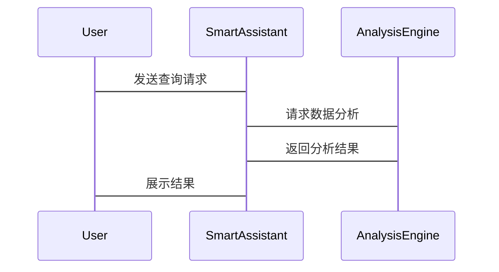

                 


# 《金融大数据分析在智能助手中的应用》

---

## 关键词：  
金融大数据分析、智能助手、自然语言处理、机器学习、时间序列分析、数据可视化、系统架构设计

---

## 摘要：  
随着金融行业的快速发展，大数据分析和人工智能技术的结合为金融行业带来了革命性的变化。智能助手作为金融领域的核心工具，通过大数据分析技术能够帮助用户快速获取信息、优化决策、提高效率。本文从金融大数据分析的核心概念、智能助手的技术原理、算法实现、系统架构设计以及项目实战等方面展开深入探讨，旨在为读者提供一个全面且系统的知识框架，帮助其理解并应用金融大数据分析在智能助手中的实际场景。

---

# 第1章: 金融大数据分析与智能助手的背景与核心概念

## 1.1 金融大数据分析的背景与意义  
### 1.1.1 金融行业数据的特点与挑战  
- 数据量大：金融行业的数据量呈现指数级增长，包括交易数据、市场数据、用户行为数据等。  
- 数据多样性：结构化数据与非结构化数据并存，例如文本、语音、图像等。  
- 数据时效性：实时性要求高，需要快速处理和分析。  
- 数据隐私性：金融数据涉及用户隐私和企业机密，安全性要求极高。  

### 1.1.2 大数据分析在金融领域的应用价值  
- 提高决策效率：通过分析历史数据，预测市场趋势，辅助投资决策。  
- 风险控制：利用大数据技术识别潜在风险，优化风险管理策略。  
- 个性化服务：基于用户行为数据，提供定制化的金融服务。  

### 1.1.3 智能助手在金融行业的潜力  
- 提供实时市场动态：通过智能助手快速获取最新的金融数据和市场分析。  
- 优化用户体验：通过自然语言处理技术，实现人机交互的便捷性。  
- 提升服务效率：智能助手可以自动化处理大量数据，减少人工干预。  

---

## 1.2 智能助手的核心功能与技术  
### 1.2.1 智能助手的基本定义与分类  
- 定义：智能助手是一种基于人工智能技术的交互工具，能够通过自然语言处理（NLP）理解和响应用户需求。  
- 分类：根据应用场景可分为金融智能助手、健康智能助手、教育智能助手等。  

### 1.2.2 智能助手的核心技术  
- 自然语言处理（NLP）：理解用户意图，解析金融文本。  
- 机器学习：基于历史数据进行模式识别和预测。  
- 数据挖掘：从海量数据中提取有价值的信息。  

### 1.2.3 金融智能助手的独特需求  
- 高准确性：金融决策需要高精度的数据分析结果。  
- 实时性：金融市场动态变化快，需要快速响应。  
- 安全性：保护用户隐私和金融数据的安全。  

---

## 1.3 金融大数据分析与智能助手的结合  
### 1.3.1 数据驱动的智能决策  
- 通过大数据分析提供实时市场洞察，辅助智能助手生成决策建议。  

### 1.3.2 智能助手在金融场景中的应用案例  
- 智能投顾：基于用户财务状况推荐投资组合。  
- 风险预警：通过数据分析识别潜在风险，提前发出预警。  
- 客户服务：通过智能对话系统为用户提供7×24小时的金融服务支持。  

### 1.3.3 未来发展趋势与挑战  
- 技术挑战：如何提高模型的准确性和实时性。  
- 数据挑战：如何处理数据隐私和数据安全问题。  
- 应用场景扩展：智能助手在更多金融领域的应用探索。  

---

## 1.4 本章小结  
本章从金融大数据分析和智能助手的基本概念出发，分析了两者在金融领域的结合方式及其应用价值，为后续章节奠定了理论基础。

---

# 第2章: 金融大数据分析的核心概念与方法

## 2.1 数据采集与处理  
### 2.1.1 金融数据的来源与分类  
- 来源：公开市场数据、用户行为数据、社交媒体数据等。  
- 分类：结构化数据（如交易数据）、非结构化数据（如新闻、评论）。  

### 2.1.2 数据清洗与预处理技术  
- 数据清洗：去除噪声数据、填补缺失值。  
- 数据标准化：统一数据格式，便于后续分析。  

### 2.1.3 数据存储与管理方案  
- 数据库选择：关系型数据库（如MySQL）和非关系型数据库（如MongoDB）。  
- 数据仓库：用于存储和管理大规模金融数据。  

---

## 2.2 数据分析方法  
### 2.2.1 描述性分析  
- 描述数据的基本特征，如均值、中位数、标准差等。  

### 2.2.2 预测性分析  
- 使用回归分析预测股票价格走势。  
- 时间序列分析：基于历史数据预测未来的市场趋势。  

### 2.2.3 实验性分析  
- A/B测试：比较不同策略的效果。  

---

## 2.3 数据可视化与解释  
### 2.3.1 数据可视化工具与技术  
- 可视化工具：Matplotlib、Seaborn、Tableau。  
- 可视化类型：折线图、柱状图、散点图等。  

### 2.3.2 数据故事的构建与传播  
- 通过可视化图表讲述数据背后的故事，帮助用户快速理解分析结果。  

### 2.3.3 可视化在金融决策中的作用  
- 帮助用户快速识别市场趋势和风险点。  

---

## 2.4 本章小结  
本章详细介绍了金融大数据分析的核心方法和技术，为后续章节的算法实现和系统设计提供了基础支持。

---

# 第3章: 智能助手的核心算法与实现

## 3.1 自然语言处理（NLP）基础  
### 3.1.1 NLP的基本概念与技术  
- 词干提取、分词、实体识别、情感分析。  

### 3.1.2 常见的NLP算法与模型  
- 词袋模型（Bag of Words）、TF-IDF、Word2Vec。  

### 3.1.3 NLP在金融文本分析中的应用  
- 金融新闻的情感分析：判断市场情绪对股价的影响。  
- 金融文本分类：将新闻文章归类为不同的金融类别。  

---

## 3.2 机器学习与深度学习  
### 3.2.1 机器学习的基本原理  
- 监督学习、无监督学习、半监督学习。  

### 3.2.2 深度学习在金融分析中的应用  
- 使用LSTM进行时间序列预测。  
- 使用神经网络进行金融数据分类。  

---

## 3.3 算法实现与优化  
### 3.3.1 时间序列分析的算法实现  
```python
import numpy as np
from sklearn.preprocessing import MinMaxScaler
from keras.models import Sequential
from keras.layers import LSTM, Dense

# 示例数据
data = np.random.random((1000, 1))
scaler = MinMaxScaler()
data_scaled = scaler.fit_transform(data)

# LSTM模型
model = Sequential()
model.add(LSTM(128, input_shape=(None, 1)))
model.add(Dense(1))
model.compile(loss='mean_squared_error', optimizer='adam')
model.fit(data_scaled, epochs=50, batch_size=32)
```

### 3.3.2 算法优化策略  
- 参数调整：优化学习率、批量大小。  
- 模型融合：结合多种算法提高预测准确率。  

---

## 3.4 本章小结  
本章重点介绍了智能助手的核心算法，包括NLP和机器学习技术，并通过具体代码示例展示了算法的实现过程。

---

# 第4章: 金融大数据分析与智能助手的系统架构设计

## 4.1 系统整体架构  
### 4.1.1 系统模块划分  
- 数据采集模块：负责数据的采集和预处理。  
- 数据分析模块：进行数据建模和预测。  
- 智能助手模块：提供用户交互和结果展示。  

### 4.1.2 数据流与交互流程  
- 数据采集 -> 数据处理 -> 数据分析 -> 结果展示。  

---

## 4.2 数据处理与分析模块  
### 4.2.1 数据采集与预处理  
- 使用Flask框架开发API接口，接收实时金融数据。  

### 4.2.2 数据分析与建模  
- 使用Pandas进行数据清洗，使用Scikit-learn进行机器学习建模。  

### 4.2.3 数据可视化与报告生成  
- 使用Plotly生成动态图表，展示分析结果。  

---

## 4.3 智能助手功能模块  
### 4.3.1 自然语言处理模块  
- 使用spaCy进行文本分词和实体识别。  

### 4.3.2 机器学习推理模块  
- 基于训练好的模型进行实时预测。  

### 4.3.3 用户交互与反馈模块  
- 提供友好的用户界面，支持语音和文本交互。  

---

## 4.4 系统接口与集成  
### 4.4.1 API设计  
- RESTful API：提供数据查询和分析结果获取接口。  

### 4.4.2 系统交互序列图  


---

## 4.5 本章小结  
本章详细描述了金融大数据分析与智能助手系统的架构设计，包括模块划分、数据流设计和系统接口。

---

# 第5章: 项目实战——基于金融大数据的智能投顾系统

## 5.1 项目背景与目标  
- 提供个性化的投资建议，帮助用户优化投资组合。  

---

## 5.2 项目核心实现  
### 5.2.1 数据采集与预处理  
```python
import pandas as pd
import requests
import json

# 示例数据接口
url = "https://api.example.com/stock_data"
response = requests.get(url)
data = json.loads(response.text)
df = pd.DataFrame(data)
```

### 5.2.2 模型训练与部署  
```python
from sklearn.model

