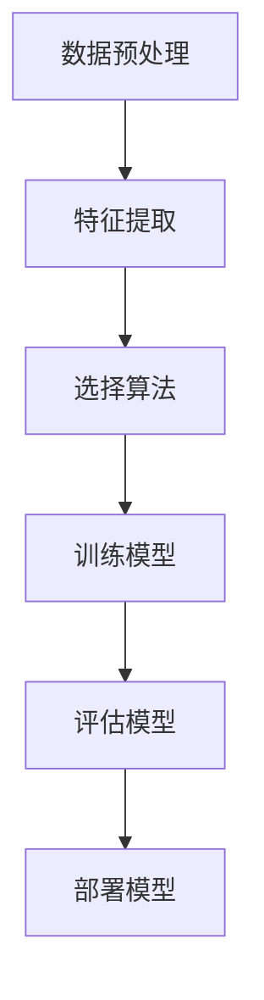
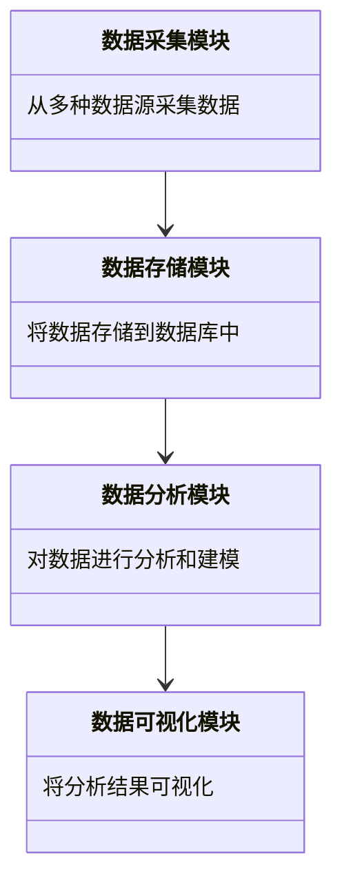
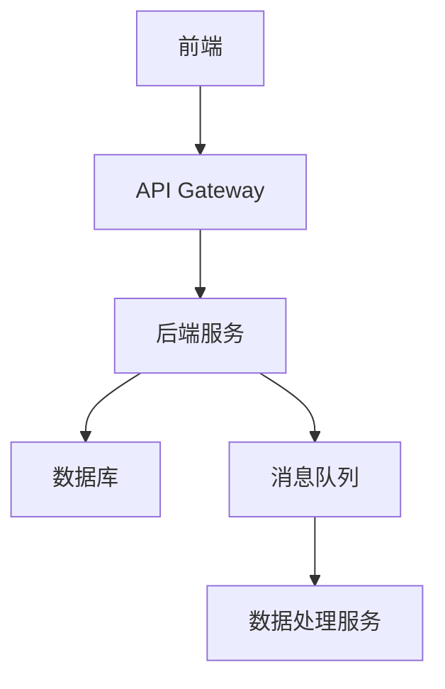
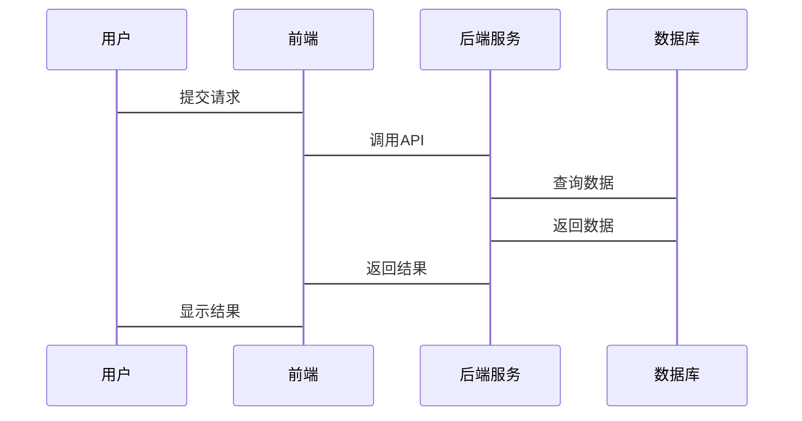

                 


# 金融大数据分析平台构建

> 关键词：金融大数据、数据分析、机器学习、系统架构、数据安全、项目实战

> 摘要：本文详细探讨了金融大数据分析平台的构建过程，从背景介绍、核心概念到算法原理、系统架构，再到项目实战和总结，全面解析了如何利用大数据技术提升金融行业的决策效率和风险管理能力。文章结合实际案例，通过清晰的逻辑和详细的代码示例，帮助读者理解并掌握金融大数据分析平台的设计与实现。

---

# 第一部分: 金融大数据分析平台的背景与概述

## 第1章: 金融大数据分析平台的背景与意义

### 1.1 金融大数据的定义与特点

#### 1.1.1 金融大数据的定义
金融大数据指的是在金融行业中产生的海量数据，包括交易数据、市场数据、客户数据、新闻数据等。这些数据具有多样性、高速性和大规模性的特点。

#### 1.1.2 金融大数据的核心特点
- **数据量大**：每天产生的交易数据、市场数据等呈指数级增长。
- **数据类型多样**：包括结构化数据（如交易记录）和非结构化数据（如新闻、社交媒体评论）。
- **数据生成速度快**：金融市场中的数据实时生成，要求快速处理和分析。

#### 1.1.3 金融大数据与传统金融数据的区别
传统的金融数据主要指结构化的交易数据，而金融大数据还包括非结构化的数据，且数据量更大、生成速度更快。

### 1.2 金融大数据分析平台的背景

#### 1.2.1 金融行业数字化转型的背景
随着互联网和移动支付的普及，金融行业的数据量急剧增加，传统的人工分析方式已无法满足需求。

#### 1.2.2 大数据技术在金融领域的应用趋势
大数据技术（如Hadoop、Spark）的应用使得金融行业能够更高效地处理和分析海量数据。

#### 1.2.3 金融大数据分析平台的必要性
金融大数据分析平台能够帮助金融机构快速提取有价值的信息，提升决策效率和风险管理能力。

### 1.3 金融大数据分析平台的应用价值

#### 1.3.1 提高金融决策的效率与准确性
通过大数据分析，金融机构可以更快地识别市场趋势和客户行为，做出更精准的决策。

#### 1.3.2 优化金融风险管理能力
大数据分析可以帮助金融机构实时监控市场风险，预测潜在的金融危机。

#### 1.3.3 支持金融创新与业务拓展
大数据分析平台为金融机构开发新的金融产品和服务提供了数据支持。

### 1.4 金融大数据分析平台的挑战与解决方案

#### 1.4.1 数据隐私与安全问题
金融数据涉及大量敏感信息，如何确保数据安全是一个重要挑战。

#### 1.4.2 数据质量与清洗的挑战
金融大数据中存在大量噪声数据和不完整数据，需要进行有效的数据清洗和预处理。

#### 1.4.3 技术架构的复杂性
金融大数据分析平台涉及多种技术（如大数据存储、分布式计算、机器学习等），构建复杂。

### 1.5 本章小结

---

# 第二部分: 金融大数据分析的核心概念与联系

## 第2章: 金融大数据分析的核心概念

### 2.1 数据采集与处理

#### 2.1.1 数据来源的多样性
金融大数据可以从多种来源获取，如交易系统、社交媒体、新闻网站等。

#### 2.1.2 数据清洗与预处理的必要性
数据清洗是确保数据分析结果准确性的关键步骤，包括去重、补全、标准化等。

#### 2.1.3 数据标准化与特征工程
数据标准化是将不同来源的数据统一到同一格式，特征工程则是通过提取特征来提升模型性能。

### 2.2 数据存储与管理

#### 2.2.1 数据库的选择与设计
根据数据类型选择合适的数据库，如关系型数据库（MySQL）和非关系型数据库（MongoDB）。

#### 2.2.2 数据仓库与数据湖的对比
数据仓库适合结构化数据的存储和分析，而数据湖适合非结构化数据的存储和分析。

#### 2.2.3 分布式存储技术的应用
分布式存储技术（如Hadoop、HBase）可以处理海量数据，提升存储效率。

### 2.3 数据分析与挖掘

#### 2.3.1 统计分析与机器学习算法
统计分析用于描述数据特征，机器学习算法用于预测和分类。

#### 2.3.2 数据可视化与仪表盘设计
数据可视化工具（如Tableau）可以帮助用户更直观地理解数据，仪表盘设计则是将多个数据源整合到一个界面中。

#### 2.3.3 预测模型的构建与评估
通过机器学习算法构建预测模型，并通过指标（如准确率、召回率）评估模型性能。

### 2.4 数据安全与隐私保护

#### 2.4.1 数据加密技术
使用加密算法对敏感数据进行加密，确保数据在传输和存储过程中的安全性。

#### 2.4.2 数据脱敏处理
对敏感数据进行脱敏处理，使其在分析过程中无法被还原为原始数据。

#### 2.4.3 合规性与数据隐私法律框架
遵循相关法律法规（如GDPR）的要求，确保数据处理的合法性。

### 2.5 本章小结

---

# 第三部分: 金融大数据分析平台的算法原理

## 第3章: 常见金融数据分析算法

### 3.1 机器学习算法

#### 3.1.1 线性回归
线性回归用于预测连续型变量，如股票价格。

$$ y = \beta_0 + \beta_1x + \epsilon $$

#### 3.1.2 逻辑回归
逻辑回归用于分类问题，如信用评分。

$$ P(y=1|x) = \frac{e^{\beta_0 + \beta_1x}}{1 + e^{\beta_0 + \beta_1x}} $$

#### 3.1.3 支持向量机（SVM）
SVM用于分类和回归问题，适用于高维数据。

### 3.2 深度学习算法

#### 3.2.1 神经网络
神经网络是一种多层的模型，用于处理复杂的非线性关系。

#### 3.2.2 长短期记忆网络（LSTM）
LSTM用于处理时间序列数据，如股票价格预测。

### 3.3 算法流程图



### 3.4 Python代码实现

```python
# 线性回归示例
import pandas as pd
import numpy as np
from sklearn.linear_model import LinearRegression

# 数据加载
data = pd.read_csv('financial_data.csv')
X = data[['feature1', 'feature2']]
y = data['target']

# 模型训练
model = LinearRegression()
model.fit(X, y)

# 预测
predictions = model.predict(X)
print('预测值:', predictions)
```

### 3.5 本章小结

---

# 第四部分: 金融大数据分析平台的系统设计

## 第4章: 金融大数据分析平台的系统架构

### 4.1 项目背景介绍

金融大数据分析平台旨在帮助金融机构快速处理和分析海量数据，提升决策效率。

### 4.2 系统功能设计

#### 4.2.1 领域模型设计


#### 4.2.2 系统架构设计


### 4.3 接口设计与交互流程

#### 4.3.1 接口设计
- 数据采集模块提供API接口，接收外部数据。
- 数据分析模块提供API接口，供前端调用分析结果。

#### 4.3.2 交互流程图


### 4.4 本章小结

---

# 第五部分: 金融大数据分析平台的项目实战

## 第5章: 项目实战与实现

### 5.1 环境搭建

#### 5.1.1 安装Python和相关库
```bash
pip install python
pip install pandas numpy scikit-learn
```

#### 5.1.2 安装Jupyter Notebook
```bash
pip install jupyter
```

### 5.2 核心功能实现

#### 5.2.1 数据采集模块
```python
import requests
import json

# 从API获取数据
data = requests.get('http://api.example.com/financial_data').text
data = json.loads(data)
```

#### 5.2.2 数据清洗与预处理
```python
import pandas as pd

df = pd.DataFrame(data)
df.dropna(inplace=True)
df['date'] = pd.to_datetime(df['date'])
```

#### 5.2.3 数据分析与建模
```python
from sklearn.model

