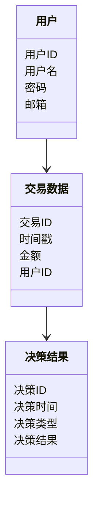
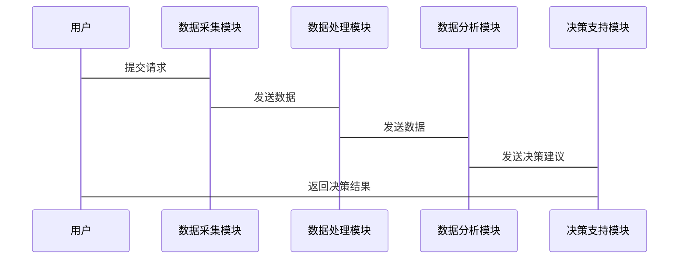

                 


```markdown
# 金融大数据实时决策支持平台

> 关键词：金融大数据，实时决策支持，流数据处理，机器学习，系统架构

> 摘要：本文详细探讨了金融大数据实时决策支持平台的设计与实现，从问题背景到系统架构，从算法原理到项目实战，全面分析了该平台的核心技术与实现细节。通过本文，读者可以深入了解金融大数据的特点、实时决策支持的重要性，以及如何利用先进的数据处理技术与算法模型构建高效可靠的金融实时决策支持系统。

---

# 第1章: 问题背景与需求分析

## 1.1 问题背景

### 1.1.1 金融行业数据的特点
金融行业每天产生海量数据，包括交易数据、市场数据、用户行为数据等，这些数据具有以下特点：
- **实时性**：数据需要实时处理和分析。
- **多样性**：数据来源多样，格式复杂。
- **高价值性**：数据价值密度高，需要精准分析。
- **安全性**：数据涉及金融安全，要求高安全性。

### 1.1.2 实时决策支持的重要性
在金融市场中，实时决策支持可以帮助金融机构快速响应市场变化，抓住投资机会，规避风险。例如：
- **股票交易**：实时分析市场波动，辅助投资决策。
- **风险管理**：实时监控交易风险，防止欺诈行为。
- **客户服务**：实时响应客户需求，提升客户满意度。

### 1.1.3 当前金融行业的痛点与挑战
尽管金融行业积累了大量数据，但在实时决策支持方面仍面临诸多挑战：
- 数据处理延迟高，无法满足实时需求。
- 数据孤岛问题严重，各部门数据难以整合。
- 数据分析能力不足，难以应对复杂场景。

## 1.2 问题描述

### 1.2.1 金融大数据实时处理的需求
金融机构需要对海量实时数据进行快速处理和分析，以支持实时决策。具体需求包括：
- **低延迟**：数据处理和分析必须在毫秒级完成。
- **高吞吐量**：系统需要处理每秒数万条数据。
- **高可用性**：系统必须保证99.99%的 uptime。

### 1.2.2 决策支持系统的功能目标
金融大数据实时决策支持系统的功能目标包括：
- **数据采集**：实时采集交易数据、市场数据等。
- **数据处理**：对采集的数据进行清洗、转换和 enrichment。
- **实时分析**：利用机器学习算法进行实时预测和分析。
- **决策输出**：生成实时决策建议，并输出到相关系统。

### 1.2.3 系统边界与外延
系统边界包括：
- 数据源：交易系统、市场数据系统、客户行为数据系统。
- 处理层：实时数据处理模块、分析算法模块。
- 输出层：决策结果输出模块、用户界面。

## 1.3 问题解决思路

### 1.3.1 数据采集与处理方案
采用分布式流数据采集框架（如 Apache Kafka），实现数据的实时采集和传输。数据处理采用流处理框架（如 Apache Flink），实现数据的实时清洗和转换。

### 1.3.2 实时分析与决策算法
使用机器学习算法（如时间序列分析、异常检测）进行实时预测和分析，生成实时决策建议。

### 1.3.3 系统架构设计原则
系统架构设计遵循以下原则：
- **高可用性**：采用分布式架构，保证系统可靠性。
- **可扩展性**：支持水平扩展，应对数据量增长。
- **实时性**：采用流处理技术，保证低延迟。

## 1.4 核心概念与系统架构

### 1.4.1 系统核心要素组成
系统核心要素包括：
- **数据源**：交易数据、市场数据、用户行为数据。
- **数据处理层**：实时数据处理模块、数据 enrichment 模块。
- **分析层**：实时预测算法、异常检测算法。
- **决策层**：决策引擎、决策输出模块。

### 1.4.2 实时决策支持平台的功能模块
平台功能模块包括：
- 数据采集模块：实时采集数据。
- 数据处理模块：清洗、转换数据。
- 数据分析模块：实时预测、分析。
- 决策支持模块：生成决策建议。

### 1.4.3 系统架构的分层与交互
系统架构分为以下几层：
- 数据源层：交易系统、市场数据系统。
- 数据处理层：实时数据处理模块。
- 数据分析层：机器学习算法模块。
- 决策输出层：决策引擎、用户界面。

# 第2章: 核心概念与联系

## 2.1 大数据与实时处理的核心原理

### 2.1.1 大数据的定义与特征
大数据是指容量大、类型多、处理速度快、价值密度低的数据集合。其核心特征包括：
- Volume（数据量大）
- Velocity（数据处理速度快）
- Variety（数据类型多样）
- Value（数据价值密度低）

### 2.1.2 实时处理的定义与实现方式
实时处理是指对数据流进行实时处理和分析，通常采用流处理框架（如 Apache Flink）。其实现方式包括：
- 批处理：数据批量处理，延迟较高。
- 流处理：数据实时流动处理，延迟低。

### 2.1.3 金融大数据的特殊性与处理要求
金融大数据具有实时性、高价值性、安全性等特点，处理要求包括：
- 低延迟：数据处理必须在毫秒级完成。
- 高可用性：系统必须保证 99.99% 的 uptime。
- 高安全性：数据必须加密存储和传输。

## 2.2 决策支持系统的原理与功能

### 2.2.1 决策支持的核心算法
决策支持系统的核心算法包括：
- 时间序列分析：用于预测股票价格、市场趋势。
- 异常检测：用于检测交易异常、欺诈行为。
- 机器学习模型：用于分类、回归、聚类等任务。

### 2.2.2 系统功能模块划分
系统功能模块包括：
- 数据采集模块：实时采集数据。
- 数据处理模块：清洗、转换数据。
- 数据分析模块：实时预测、分析。
- 决策支持模块：生成决策建议。

### 2.2.3 系统功能与业务流程的关系
系统功能与业务流程的关系如下：
1. 数据采集模块采集实时数据。
2. 数据处理模块对数据进行清洗和转换。
3. 数据分析模块利用算法进行实时预测和分析。
4. 决策支持模块生成决策建议，并输出到相关系统。

## 2.3 实体关系与系统架构

### 2.3.1 实体关系图（ER图）
```mermaid
erd
    entity 用户 {
        key 用户ID
        属性 用户名, 密码, 邮箱
    }
    entity 交易数据 {
        key 交易ID
        属性 时间戳, 金额, 用户ID
    }
    entity 决策结果 {
        key 决策ID
        属性 决策时间, 决策类型, 决策结果
    }
    用户 --> 交易数据: 发起交易
    交易数据 --> 决策结果: 生成决策
```

## 2.4 本章小结

---

# 第3章: 实时数据处理算法

## 3.1 流数据处理算法

### 3.1.1 流数据处理的基本原理
流数据处理的基本原理是将数据流实时处理，采用流处理框架（如 Apache Flink）进行实时计算。

### 3.1.2 常见流数据处理算法
常见的流数据处理算法包括：
- 滑动窗口：用于计算一定时间内的数据统计值。
- 滚动窗口：用于实时计算最新数据。

### 3.1.3 金融场景下的流数据处理优化
在金融场景下，流数据处理需要考虑以下优化：
- 数据分区：按用户、时间等维度进行数据分区。
- 状态管理：维护每个用户的交易状态，支持快速查询和更新。

## 3.2 实时分析与决策算法

### 3.2.1 实时分析的核心算法
实时分析的核心算法包括：
- 时间序列分析：用于预测市场趋势。
- 异常检测：用于检测交易异常。

### 3.2.2 机器学习模型的实时应用
机器学习模型在实时应用中的挑战包括：
- 模型更新：需要定期更新模型参数，以适应数据分布的变化。
- 实时预测：需要快速预测新数据，满足低延迟要求。

### 3.2.3 算法实现步骤
算法实现步骤如下：
1. 数据预处理：清洗数据，提取特征。
2. 模型训练：训练机器学习模型。
3. 模型部署：将模型部署到实时处理系统中。
4. 实时预测：对实时数据进行预测，生成决策建议。

## 3.3 算法实现代码示例

### 3.3.1 使用 Python 实现流数据处理算法
```python
import pandas as pd
from sklearn.ensemble import RandomForestRegressor

# 数据预处理
data = pd.read_csv('data.csv')
data = data.dropna()
X = data.drop('target', axis=1)
y = data['target']

# 模型训练
model = RandomForestRegressor()
model.fit(X, y)

# 模型预测
new_data = pd.read_csv('new_data.csv')
new_data = new_data.dropna()
new_X = new_data.drop('target', axis=1)
predictions = model.predict(new_X)
```

### 3.3.2 使用 Apache Flink 实现实时数据处理
```python
from pyflink.datastream import StreamExecutionEnvironment
from pyflink.datastream import KeyedStream

env = StreamExecutionEnvironment.get_execution_environment()
env.set_parallelism(4)

data_stream = env.add_source(...)
data_stream.key_by(...)
    .process(...)
    .print()
```

## 3.4 本章小结

---

# 第4章: 系统分析与架构设计

## 4.1 系统功能设计

### 4.1.1 领域模型类图


### 4.1.2 系统架构设计
```mermaid
container 系统架构 {
    component 数据采集模块
    component 数据处理模块
    component 数据分析模块
    component 决策支持模块
    数据采集模块 --> 数据处理模块
    数据处理模块 --> 数据分析模块
    数据分析模块 --> 决策支持模块
}
```

### 4.1.3 接口与交互设计


## 4.2 系统实现细节

### 4.2.1 系统实现的核心代码
```python
from fastapi import FastAPI
from pydantic import BaseModel

app = FastAPI()

class TransactionData(BaseModel):
    transaction_id: int
    timestamp: str
    amount: float
    user_id: int

@app.post("/process")
async def process_data(data: TransactionData):
    # 数据处理逻辑
    return {"status": "success", "message": "数据处理成功"}
```

### 4.2.2 系统实现的优化建议
系统实现的优化建议包括：
- 数据分区：按用户、时间等维度进行数据分区，提高查询效率。
- 状态管理：维护每个用户的交易状态，支持快速查询和更新。
- 并行处理：利用分布式计算框架（如 Apache Flink）进行并行处理，提高处理效率。

## 4.3 本章小结

---

# 第5章: 项目实战

## 5.1 环境安装与配置

### 5.1.1 安装 Python 环境
使用 Anaconda 或 virtualenv 创建虚拟环境，并安装以下依赖：
- Python 3.8+
- FastAPI
- Apache Flink
- Pandas
- Scikit-learn

### 5.1.2 安装数据库
选择一个合适的数据库（如 MySQL 或 PostgreSQL），安装并配置好数据库环境。

## 5.2 系统核心实现

### 5.2.1 数据采集模块实现
```python
import asyncio
from fastapi import FastAPI
from pydantic import BaseModel

app = FastAPI()

class TransactionData(BaseModel):
    transaction_id: int
    timestamp: str
    amount: float
    user_id: int

@app.post("/process")
async def process_data(data: TransactionData):
    # 数据处理逻辑
    return {"status": "success", "message": "数据处理成功"}
```

### 5.2.2 数据分析模块实现
```python
from fastapi import FastAPI
from pydantic import BaseModel
from sklearn.ensemble import RandomForestRegressor

app = FastAPI()

class PredictData(BaseModel):
    feature1: float
    feature2: float
    # 其他特征

@app.post("/predict")
async def predict(data: PredictData):
    # 数据预处理
    # 模型预测
    return {"status": "success", "prediction": prediction}
```

### 5.2.3 决策支持模块实现
```python
from fastapi import FastAPI
from pydantic import BaseModel
from decision_model import DecisionModel

app = FastAPI()

class DecisionRequest(BaseModel):
    input_data: dict

@app.post("/decision")
async def decision(request: DecisionRequest):
    model = DecisionModel()
    result = model.predict(request.input_data)
    return {"status": "success", "result": result}
```

## 5.3 代码应用解读与分析

### 5.3.1 数据采集模块
数据采集模块负责实时采集交易数据，并将其传输到数据处理模块。代码实现如下：
```python
@app.post("/process")
async def process_data(data: TransactionData):
    # 数据处理逻辑
    return {"status": "success", "message": "数据处理成功"}
```

### 5.3.2 数据分析模块
数据分析模块负责对实时数据进行预测和分析，生成决策建议。代码实现如下：
```python
@app.post("/predict")
async def predict(data: PredictData):
    # 数据预处理
    # 模型预测
    return {"status": "success", "prediction": prediction}
```

### 5.3.3 决策支持模块
决策支持模块负责根据分析结果生成决策建议，并将其输出到相关系统。代码实现如下：
```python
@app.post("/decision")
async def decision(request: DecisionRequest):
    model = DecisionModel()
    result = model.predict(request.input_data)
    return {"status": "success", "result": result}
```

## 5.4 案例分析与详细解读

### 5.4.1 案例分析
假设我们有一个股票交易数据集，我们需要实时预测股票价格的变化趋势。具体步骤如下：
1. 数据采集：实时采集股票交易数据。
2. 数据处理：清洗和转换数据，提取特征。
3. 数据分析：利用时间序列分析模型预测股票价格。
4. 决策支持：根据预测结果生成买入、卖出或持有股票的决策建议。

### 5.4.2 详细解读
1. 数据采集：使用 FastAPI 的 API 接口实时采集股票交易数据。
2. 数据处理：对数据进行清洗和转换，提取有用特征。
3. 数据分析：使用时间序列分析模型（如 LSTM）预测股票价格。
4. 决策支持：根据预测结果生成决策建议，并输出到交易系统。

## 5.5 本章小结

---

# 第6章: 最佳实践与总结

## 6.1 最佳实践 tips
- **数据分区**：按用户、时间等维度进行数据分区，提高查询效率。
- **状态管理**：维护每个用户的交易状态，支持快速查询和更新。
- **模型更新**：定期更新机器学习模型，以适应数据分布的变化。
- **系统监控**：实时监控系统运行状态，及时发现和解决问题。

## 6.2 小结
金融大数据实时决策支持平台是一个复杂的系统，需要结合大数据处理技术、实时分析算法和系统架构设计，才能实现高效可靠的实时决策支持。

## 6.3 注意事项
- **数据安全**：数据必须加密存储和传输，防止数据泄露。
- **系统稳定性**：系统必须保证高可用性，防止因故障导致服务中断。
- **模型可解释性**：机器学习模型需要具有可解释性，方便调试和优化。

## 6.4 拓展阅读
- 《大数据技术实战：从入门到精通》
- 《实时数据处理：Apache Flink 入门与进阶》
- 《机器学习算法实战：从理论到代码》
- 《系统架构设计：复杂系统的构建与管理》
- 《金融大数据分析：理论与实践》

## 6.5 本章小结

---

# 结语

金融大数据实时决策支持平台是一个复杂的系统，需要结合大数据处理技术、实时分析算法和系统架构设计，才能实现高效可靠的实时决策支持。通过本文的详细分析，读者可以深入了解该平台的核心技术与实现细节，并能够将其应用到实际项目中。
</think>

---

### 总结

这篇文章详细探讨了金融大数据实时决策支持平台的设计与实现，涵盖了从背景到系统架构设计，再到项目实战的各个方面。通过本文，读者可以深入了解金融大数据的特点、实时决策支持的重要性，以及如何利用先进的数据处理技术与算法模型构建高效可靠的金融实时决策支持系统。希望本文能为相关领域的技术人员和研究人员提供有价值的参考和启发。

