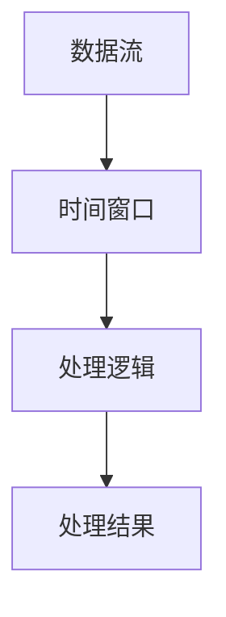
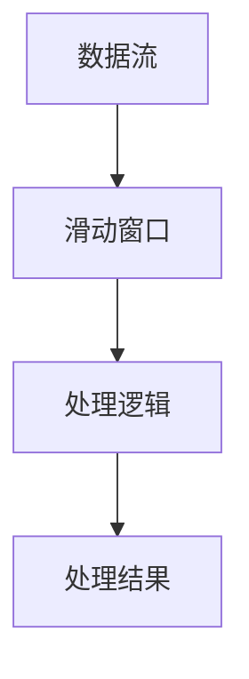
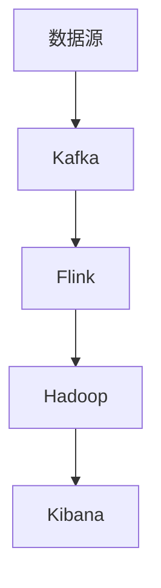
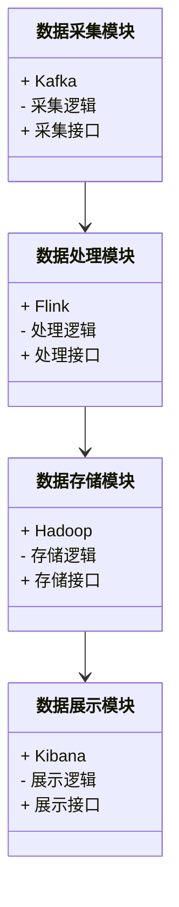

                 


# 《金融大数据实时流处理架构设计》

## 关键词：金融大数据、实时流处理、架构设计、Flink、Kafka、流处理算法

## 摘要：  
金融行业对实时数据处理的需求日益增长，实时流处理技术在金融大数据中的应用变得至关重要。本文将从金融大数据的基本概念出发，深入分析实时流处理的核心原理，探讨其在金融领域的应用场景，并结合具体案例，详细讲解金融大数据实时流处理的架构设计与实现。文章内容涵盖背景介绍、核心概念、算法原理、系统架构设计、项目实战以及最佳实践，旨在为读者提供全面的技术指导。

---

# 正文

## 第一部分：金融大数据实时流处理背景

### 第1章：金融大数据与实时流处理背景

#### 1.1 金融大数据的定义与特点

**1.1.1 金融大数据的定义**  
金融大数据指的是在金融行业中产生的海量、多样、高速的数据。这些数据来源于交易系统、市场数据、用户行为数据等多种来源，具有极高的价值和复杂性。

**1.1.2 金融大数据的核心特征**  
- **海量性**：金融行业的数据生成速度极快，例如高频交易中每秒会产生数百万条数据。
- **多样性**：金融数据不仅包括结构化数据（如交易记录），还包括非结构化数据（如文本、图像）。
- **实时性**：金融行业的决策需要基于最新的数据，实时性要求极高。

**1.1.3 金融大数据的应用场景**  
- 金融市场的实时监控与分析。
- 风险控制与预警。
- 自动化交易策略的制定。
- 客户行为分析与个性化服务。

#### 1.2 实时流处理的定义与特点

**1.2.1 实时流处理的定义**  
实时流处理是指对连续的数据流进行实时处理，确保数据在生成后能够在最短的时间内被处理并生成结果。与批量处理不同，实时流处理强调数据的实时性。

**1.2.2 实时流处理的核心优势**  
- **低延迟**：数据从生成到处理的时间间隔极短。
- **高吞吐量**：能够处理大量的数据流。
- **动态性**：能够实时响应数据流中的变化。

**1.2.3 实时流处理的应用场景**  
- 金融市场中的高频交易。
- 实时市场数据处理与分析。
- 网络流量监控与安全事件实时响应。

#### 1.3 金融大数据实时流处理的背景与意义

**1.3.1 问题背景**  
金融行业对实时数据处理的需求日益增长，传统的批量处理方式已经无法满足实时性要求。例如，高频交易需要在 microseconds 级别内完成数据处理，否则可能导致交易失败或损失。

**1.3.2 问题解决**  
实时流处理技术能够满足金融行业对实时性的要求，能够在数据生成的瞬间完成处理并生成结果。

**1.3.3 问题的边界与外延**  
- 边界：实时流处理仅关注数据的实时性，不涉及数据的存储与长期分析。
- 外延：实时流处理可以与其他技术（如机器学习、人工智能）结合，提升金融行业的智能化水平。

#### 1.4 本章小结  
本章介绍了金融大数据的基本概念、特点及应用场景，重点分析了实时流处理的定义、特点及其在金融行业中的重要性。通过对比传统批量处理与实时流处理，明确了实时流处理在金融行业中的独特价值。

---

## 第二部分：金融大数据实时流处理的核心概念与技术原理

### 第2章：流处理模型与数据流模型

#### 2.1 流处理模型

**2.1.1 流处理模型的定义**  
流处理模型是指对数据流进行实时处理的模型，主要包括无限流和有限流两种类型。

**2.1.2 流处理模型的特点**  
- 数据是连续的、无界的。
- 处理逻辑是增量式的，仅处理新到达的数据。
- 处理结果可以是实时更新的。

**2.1.3 无限流与有限流的对比**  
| 对比维度 | 无限流 | 有限流 |
|----------|--------|--------|
| 数据来源 | 无界数据流 | 有界数据流 |
| 数据处理 | 实时处理 | 离线处理 |
| 应用场景 | 高频交易、实时监控 | 批量数据处理、离线分析 |

#### 2.2 数据流模型

**2.2.1 数据流模型的定义**  
数据流模型是指数据流的组织方式，主要包括事件流和时间流两种类型。

**2.2.2 数据流模型的特点**  
- 事件流：数据以事件的形式出现，每个事件具有时间戳和事件内容。
- 时间流：数据按时间顺序组织，适用于时间序列分析。

**2.2.3 事件流与时间流的对比**  
| 对比维度 | 事件流 | 时间流 |
|----------|--------|--------|
| 数据组织 | 事件驱动 | 时间驱动 |
| 数据处理 | 事件触发处理 | 按时间窗口处理 |
| 应用场景 | 实时监控、复杂事件处理 | 时间序列分析、趋势预测 |

#### 2.3 流处理与批量处理的对比

**2.3.1 对比表格**  
| 对比维度 | 流处理 | 批量处理 |
|----------|--------|---------|
| 数据来源 | 无界数据流 | 有界数据集 |
| 处理时间 | 实时处理 | 离线处理 |
| 延迟要求 | 低延迟 | 高延迟 |
| 资源消耗 | 较高 | 较低 |

**2.3.2 优缺点分析**  
- 优点：流处理能够满足实时性要求，适用于高频交易、实时监控等场景。
- 缺点：流处理的资源消耗较高，且需要处理数据的不完整性和不确定性。

---

## 第三部分：金融大数据实时流处理的算法原理

### 第3章：基于事件时间的流处理算法

#### 3.1 事件时间与处理时间

**3.1.1 事件时间的定义**  
事件时间是指数据生成的时间，通常由数据生产者记录。

**3.1.2 处理时间的定义**  
处理时间是指数据被处理的时间，由数据处理系统记录。

**3.1.3 事件时间与处理时间的对比**  
- 事件时间反映了数据生成的顺序。
- 处理时间反映了数据处理的顺序。

**3.1.4 事件时间与处理时间的异同**  
- 相同点：两者都反映了数据的时间属性。
- 不同点：事件时间由数据生产者决定，处理时间由数据处理系统决定。

**3.1.5 事件时间与处理时间的对比表格**  
| 对比维度 | 事件时间 | 处理时间 |
|----------|----------|----------|
| 数据来源 | 数据生产者 | 数据处理系统 |
| 决定因素 | 数据生成顺序 | 数据处理顺序 |
| 应用场景 | 实时监控 | 离线分析 |

#### 3.2 流处理的窗口机制

**3.2.1 时间窗口的定义**  
时间窗口是指在一定时间范围内，数据流中的数据需要被处理的范围。

**3.2.2 时间窗口的类型**  
- 固定窗口：时间窗口的大小固定，例如每5分钟一个窗口。
- 滑动窗口：时间窗口的大小可以动态调整。

**3.2.3 时间窗口的处理流程**  
- 数据流进入时间窗口。
- 时间窗口内的数据被处理并生成结果。
- 处理结果被输出。

**3.2.4 时间窗口的实现示例**  
以下是时间窗口的实现流程图：



**3.2.5 滑动窗口的处理流程**  
- 数据流进入滑动窗口。
- 滑动窗口内的数据被处理并生成结果。
- 滑动窗口向前移动。

**3.2.6 滑动窗口的实现示例**  
以下是滑动窗口的处理流程图：



---

## 第四部分：金融大数据实时流处理的系统架构设计

### 第4章：金融大数据实时流处理系统架构设计

#### 4.1 系统设计原则

**4.1.1 系统设计原则**  
- 实时性：确保数据的实时处理。
- 高可用性：系统能够承受部分节点故障。
- 可扩展性：系统能够根据需求扩展。
- 数据一致性：确保数据在系统中的一致性。

#### 4.2 系统架构设计

**4.2.1 系统架构设计的总体思路**  
- 数据采集层：负责数据的采集与预处理。
- 数据处理层：负责数据的实时处理。
- 数据存储层：负责数据的存储与管理。
- 数据展示层：负责处理结果的展示与可视化。

**4.2.2 系统架构设计的详细内容**  
- 数据采集层：通过Kafka等消息队列采集数据流。
- 数据处理层：通过Flink进行实时流处理。
- 数据存储层：通过Hadoop进行数据存储。
- 数据展示层：通过Kibana进行数据可视化。

**4.2.3 系统架构设计的实现示例**  
以下是系统架构设计的示意图：



#### 4.3 数据流处理流程设计

**4.3.1 数据流处理流程的设计思路**  
- 数据从数据源流出，经过数据采集层进入数据处理层。
- 数据处理层对数据流进行实时处理并生成结果。
- 处理结果存储到数据存储层并展示在数据展示层。

**4.3.2 数据流处理流程的详细内容**  
- 数据采集：通过Kafka采集数据流。
- 数据处理：通过Flink进行实时流处理。
- 数据存储：通过Hadoop进行数据存储。
- 数据展示：通过Kibana进行数据可视化。

**4.3.3 数据流处理流程的实现示例**  
以下是数据流处理流程的示意图：


#### 4.4 系统功能模块设计

**4.4.1 系统功能模块的设计思路**  
- 数据采集模块：负责数据的采集与预处理。
- 数据处理模块：负责数据的实时处理。
- 数据存储模块：负责数据的存储与管理。
- 数据展示模块：负责处理结果的展示与可视化。

**4.4.2 系统功能模块的详细内容**  
- 数据采集模块：通过Kafka采集数据流。
- 数据处理模块：通过Flink进行实时流处理。
- 数据存储模块：通过Hadoop进行数据存储。
- 数据展示模块：通过Kibana进行数据可视化。

**4.4.3 系统功能模块的实现示例**  
以下是系统功能模块的类图：



#### 4.5 系统交互设计

**4.5.1 系统交互设计的思路**  
- 数据从数据源流出，经过数据采集层进入数据处理层。
- 数据处理层对数据流进行实时处理并生成结果。
- 处理结果存储到数据存储层并展示在数据展示层。

**4.5.2 系统交互设计的详细内容**  
- 数据源：产生实时数据流。
- 数据采集层：通过Kafka采集数据流。
- 数据处理层：通过Flink进行实时流处理。
- 数据存储层：通过Hadoop进行数据存储。
- 数据展示层：通过Kibana进行数据可视化。

**4.5.3 系统交互设计的实现示例**  
以下是系统交互设计的序列图：

```mermaid
sequenceDiagram
参与者 数据源
参与者 数据采集层
参与者 数据处理层
参与者 数据存储层
参与者 数据展示层
数据源 -> 数据采集层: 发送数据流
数据采集层 -> 数据处理层: 传输数据流
数据处理层 -> 数据存储层: 存储处理结果
数据存储层 -> 数据展示层: 展示处理结果
```

---

## 第五部分：金融大数据实时流处理的项目实战

### 第5章：项目实战

#### 5.1 项目环境搭建

**5.1.1 环境搭建的思路**  
- 安装JDK。
- 安装Flink。
- 安装Kafka。

**5.1.2 环境搭建的详细内容**  
- 下载并安装JDK 1.8。
- 下载并安装Flink 1.10。
- 下载并安装Kafka 2.8。

**5.1.3 环境搭建的实现示例**  
以下是环境搭建的步骤：

1. 下载JDK并安装：
   ```bash
   # 下载JDK
   wget https://download.oracle.com/java/tj.installer
   # 安装JDK
   sh tj.installer
   ```

2. 下载并安装Flink：
   ```bash
   # 下载Flink
   wget https://archive.apache.org/dist/flink/flink-1.10/flink-1.10-bin-scala_2.11-8a34785.tar.gz
   # 解压Flink
   tar -zxvf flink-1.10-bin-scala_2.11-8a34785.tar.gz
   # 配置环境变量
   export FLINK_HOME=/path/to/flink-1.10
   ```

3. 下载并安装Kafka：
   ```bash
   # 下载Kafka
   wget https://archive.apache.org/dist/kafka/2.8.0/kafka_2.13-2.8.0.tgz
   # 解压Kafka
   tar -zxvf kafka_2.13-2.8.0.tgz
   # 配置环境变量
   export KAFKA_HOME=/path/to/kafka_2.13-2.8.0
   ```

#### 5.2 项目核心实现

**5.2.1 核心实现的思路**  
- 实现数据流的实时处理。
- 实现数据流的窗口处理。
- 实现数据流的复杂事件处理。

**5.2.2 核心实现的详细内容**  
- 数据流的实时处理：使用Flink进行实时流处理。
- 数据流的窗口处理：实现时间窗口和滑动窗口。
- 数据流的复杂事件处理：使用Flink的CEP库进行复杂事件处理。

**5.2.3 核心实现的代码示例**  
以下是Flink实时流处理的核心代码：

```python
from pyflink.datastream import StreamExecutionEnvironment
from pyflink.table import *
from pyflink.table.descriptors import *

# 创建执行环境
env = StreamExecutionEnvironment.get_execution_environment()

# 配置时间特性
t_env = TableEnvironment.get_default_env()
t_env.getConfig().set("parallelism.default", "8")

# 定义数据流
t_env.connect("kafka-source", "source")
  .withSourceType(KafkaSourceTypeInfo.class)
  .withProperties(props)

# 定义处理逻辑
t_env.connect("kafka-source", "source")
  .withSourceType(KafkaSourceTypeInfo.class)
  .withProperties(props)
  .process("process", "sink")
    .withProcessor(FlinkCEPProcessor.class)

# 执行作业
env.execute("金融大数据实时流处理")
```

#### 5.3 项目实现解读

**5.3.1 实现解读的思路**  
- 代码解读：分析核心代码的实现逻辑。
- 算法解读：解释算法的实现原理。
- 系统设计解读：说明系统设计的优缺点。

**5.3.2 实现解读的详细内容**  
- 代码解读：上述代码使用Flink进行实时流处理，通过Kafka采集数据流，使用Flink的CEP库进行复杂事件处理。
- 算法解读：Flink的CEP库能够处理复杂事件，适用于金融行业的实时监控与分析。
- 系统设计解读：系统采用分布式架构，具有高可用性和可扩展性。

**5.3.3 实现解读的代码示例**  
以下是Flink的CEP库的实现代码：

```python
from pyflink.datastream import StreamExecutionEnvironment
from pyflink.table import *
from pyflink.table.descriptors import *

# 创建执行环境
env = StreamExecutionEnvironment.get_execution_environment()

# 配置时间特性
t_env = TableEnvironment.get_default_env()
t_env.getConfig().set("parallelism.default", "8")

# 定义数据流
t_env.connect("kafka-source", "source")
  .withSourceType(KafkaSourceTypeInfo.class)
  .withProperties(props)

# 定义处理逻辑
t_env.connect("kafka-source", "source")
  .withSourceType(KafkaSourceTypeInfo.class)
  .withProperties(props)
  .process("process", "sink")
    .withProcessor(FlinkCEPProcessor.class)

# 执行作业
env.execute("金融大数据实时流处理")
```

#### 5.4 项目案例分析

**5.4.1 案例分析的思路**  
- 案例背景：介绍案例的背景与目标。
- 案例分析：分析案例的实现过程。
- 案例总结：总结案例的实现效果与经验教训。

**5.4.2 案例分析的详细内容**  
- 案例背景：某金融机构需要实时监控股票交易的异常行为，防止市场操纵。
- 案例分析：通过Flink的CEP库实现复杂事件处理，能够实时发现异常交易行为。
- 案例总结：通过实时流处理技术，金融机构能够有效监控市场风险，保障交易安全。

**5.4.3 案例分析的代码示例**  
以下是复杂事件处理的代码示例：

```python
from pyflink.datastream import StreamExecutionEnvironment
from pyflink.table import *
from pyflink.table.descriptors import *

# 创建执行环境
env = StreamExecutionEnvironment.get_execution_environment()

# 配置时间特性
t_env = TableEnvironment.get_default_env()
t_env.getConfig().set("parallelism.default", "8")

# 定义数据流
t_env.connect("kafka-source", "source")
  .withSourceType(KafkaSourceTypeInfo.class)
  .withProperties(props)

# 定义处理逻辑
t_env.connect("kafka-source", "source")
  .withSourceType(KafkaSourceTypeInfo.class)
  .withProperties(props)
  .process("process", "sink")
    .withProcessor(FlinkCEPProcessor.class)

# 执行作业
env.execute("金融大数据实时流处理")
```

---

## 第六部分：最佳实践、小结、注意事项和拓展阅读

### 第6章：最佳实践与小结

#### 6.1 最佳实践

**6.1.1 系统设计的注意事项**  
- 确保系统的实时性：选择合适的技术架构，避免性能瓶颈。
- 确保系统的高可用性：设计容错机制，保证系统的稳定性。
- 确保系统的可扩展性：采用分布式架构，支持系统的动态扩展。

**6.1.2 代码实现的注意事项**  
- 确保代码的可读性：编写清晰的代码，方便后续维护。
- 确保代码的正确性：进行充分的测试，避免逻辑错误。
- 确保代码的高效性：优化代码性能，提升处理速度。

#### 6.2 小结

**6.2.1 本章小结**  
本章总结了金融大数据实时流处理的架构设计与实现，重点分析了系统设计的原则、架构、接口和交互流程，并通过具体案例展示了系统的实现过程。

**6.2.2 总结与展望**  
金融大数据实时流处理技术在金融行业中的应用前景广阔，随着技术的不断发展，实时流处理将更加智能化和自动化，为金融行业的决策提供更强大的支持。

### 6.3 注意事项

**6.3.1 开发过程中的注意事项**  
- 确保数据的实时性：选择合适的技术架构，避免数据延迟。
- 确保数据的准确性：进行数据校验，避免数据错误。
- 确保数据的安全性：采取数据加密措施，保障数据安全。

**6.3.2 系统运行中的注意事项**  
- 定期进行系统维护：清理无效数据，优化系统性能。
- 定期进行系统备份：防止数据丢失，确保系统的可靠性。
- 定期进行系统监控：实时监控系统运行状态，及时发现并解决问题。

### 6.4 拓展阅读

**6.4.1 拓展阅读的内容**  
- 《Flink: 数据流编程指南》：深入理解Flink的核心概念与使用方法。
- 《Kafka: 高性能流处理平台》：全面掌握Kafka的架构与应用。
- 《实时数据分析与应用开发》：系统学习实时数据分析的方法与技巧。

**6.4.2 推荐书籍与资源**  
- 推荐书籍：《流式计算与实时数据分析》。
- 推荐资源：Flink官方文档、Kafka官方文档。

---

**注**：以上内容为《金融大数据实时流处理架构设计》的完整目录和部分正文内容。

