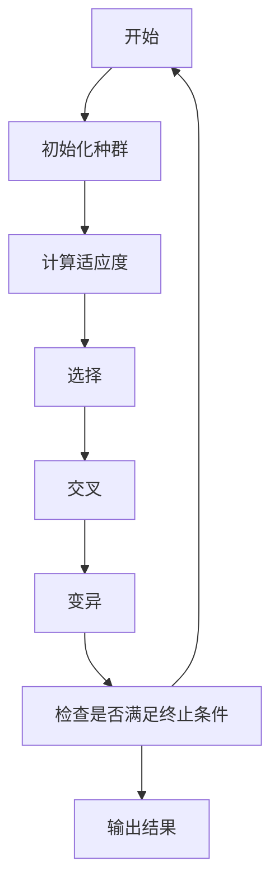
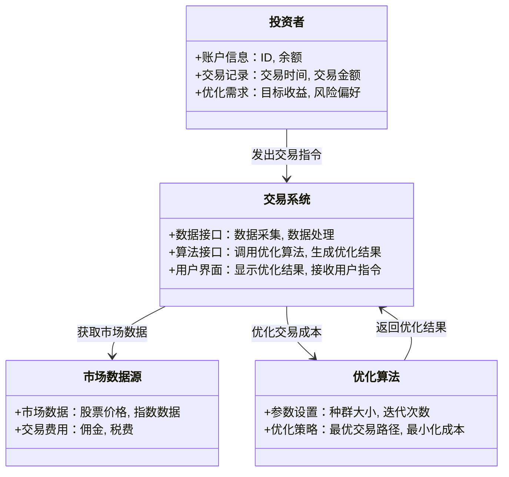

                 


# 金融市场交易成本优化系统

---

## 关键词

- 金融市场
- 交易成本
- 优化系统
- 算法优化
- 系统设计

---

## 摘要

本文系统地探讨了金融市场交易成本优化系统的构建与应用。文章首先从交易成本的定义、组成部分及其对投资者的影响入手，分析了优化交易成本的重要性。接着，详细阐述了常见的优化算法，如遗传算法、粒子群优化算法，并通过数学模型和流程图深入解释其原理。随后，从系统功能设计、架构设计、接口设计和交互设计等多个维度，详细探讨了交易成本优化系统的实现方案。最后，结合实际案例，展示了如何通过系统优化降低交易成本，并总结了优化系统在实际应用中的注意事项和未来发展方向。

---

# 第一部分: 金融市场交易成本优化系统概述

---

## 第1章: 金融市场交易成本概述

### 1.1 交易成本的定义与背景

#### 1.1.1 交易成本的定义

交易成本是指投资者在进行金融资产交易过程中所产生的各项费用和损失的总和，包括但不限于佣金、滑点、税费、过户费等。

- 佣金：支付给经纪人的费用，通常按交易金额的一定比例收取。
- 滑点：由于市场价格波动导致的实际成交价与理想成交价之间的差异。
- 税费：如印花税、资本利得税等。
- 过户费：交易过程中涉及的过户费用。

#### 1.1.2 交易成本的组成部分

交易成本可以分为显性成本和隐性成本：

- 显性成本：可以直接量化的费用，如佣金、过户费等。
- 隐性成本：难以直接量化的损失，如滑点、市场冲击等。

#### 1.1.3 交易成本对投资者的影响

- 高交易成本会直接侵蚀投资收益。
- 隐性成本会导致市场价偏离理论价值，影响资产配置效率。
- 优化交易成本是提升投资收益的重要手段。

### 1.2 交易成本优化的背景与意义

#### 1.2.1 优化交易成本的背景

- 随着金融市场的发展，交易成本的优化需求日益迫切。
- 数字化交易和高频交易的兴起，使得优化交易成本成为可能。

#### 1.2.2 优化交易成本的意义

- 提升投资收益。
- 降低市场摩擦，促进市场效率。
- 为投资者提供更优的交易策略。

### 1.3 交易成本优化的核心概念与联系

#### 1.3.1 核心概念原理

交易成本优化的目标是通过技术手段最小化交易成本，同时最大化投资收益。其核心在于平衡交易成本和交易收益之间的关系。

#### 1.3.2 交易成本优化的属性特征对比表格

| 属性         | 特征                          |
|--------------|------------------------------|
| 成本类型      | 佣金、滑点、税费、过户费等    |
| 优化目标      | 最小化交易成本                |
| 适用场景      | 股票、期货、外汇、债券等交易市场 |
| 优化方式      | 算法优化、策略优化、系统优化    |

#### 1.3.3 ER实体关系图架构（使用 Mermaid）

```mermaid
erDiagram
    actor 投资者
    actor 交易系统
    actor 市场数据源
    actor 成本优化算法
    投资者 --> 交易系统 : 发出交易指令
    交易系统 --> 市场数据源 : 获取市场数据
    交易系统 --> 成本优化算法 : 优化交易成本
    成本优化算法 --> 交易系统 : 返回优化结果
```

### 1.4 本章小结

本章从交易成本的定义、组成部分及其优化意义入手，为后续的算法优化和系统设计奠定了基础。

---

# 第二部分: 交易成本优化算法原理

---

## 第2章: 交易成本优化算法概述

### 2.1 常见的交易成本优化算法

#### 2.1.1 遗传算法

遗传算法（Genetic Algorithm，GA）是一种模拟生物进化过程的优化算法，通过适应度函数、选择、交叉和变异等操作，逐步优化解的结构。

- **适应度函数**：衡量解的优劣程度。
- **选择操作**：根据适应度值选择优秀解进行繁殖。
- **交叉操作**：通过交叉重组生成新的解。
- **变异操作**：随机改变部分解的特征以增加多样性。

#### 2.1.2 粒子群优化算法

粒子群优化算法（Particle Swarm Optimization，PSO）是一种基于群体智能的优化算法，通过粒子的运动和适应度值的更新，逐步逼近最优解。

- **粒子运动**：粒子根据当前适应度值和全局最优解调整位置。
- **适应度更新**：定期更新粒子的适应度值和全局最优解。

#### 2.1.3 模拟退火算法

模拟退火算法（Simulated Annealing，SA）是一种基于概率的全局优化算法，通过逐步降低“温度”参数，减少对局部最优解的依赖。

- **温度参数**：控制算法的探索范围。
- **状态转移**：随机选择下一个状态，根据适应度值决定是否接受该状态。

### 2.2 算法原理讲解

#### 2.2.1 遗传算法的工作流程



#### 2.2.2 算法的数学模型

- **遗传算法的适应度函数**：

$$ f(x) = \sum_{i=1}^{n} c_i \cdot x_i $$

其中，$c_i$ 是成本系数，$x_i$ 是交易策略参数。

- **粒子群优化算法的速度更新公式**：

$$ v_i = v_i \cdot \alpha + \beta \cdot (p_i - x_i) $$

其中，$v_i$ 是粒子速度，$\alpha$ 是惯性系数，$\beta$ 是加速系数，$p_i$ 是粒子当前位置，$x_i$ 是全局最优位置。

---

# 第三部分: 系统分析与架构设计

---

## 第3章: 系统分析与架构设计

### 3.1 问题场景介绍

交易成本优化系统的目标是通过算法优化和系统设计，帮助投资者降低交易成本，提升投资收益。

### 3.2 项目介绍

本项目旨在构建一个智能化的交易成本优化系统，实现从数据采集、成本计算到优化策略生成的全流程自动化。

### 3.3 系统功能设计

#### 3.3.1 系统功能模块

- 数据采集模块：获取市场数据、交易成本数据等。
- 成本计算模块：计算各项交易成本。
- 优化策略生成模块：基于算法生成最优交易策略。
- 系统监控模块：实时监控系统运行状态。

#### 3.3.2 领域模型（使用 Mermaid 类图）



### 3.4 系统架构设计

#### 3.4.1 系统架构图（使用 Mermaid 架构图）

```mermaid
dockerfile
client (投资者) --> API Gateway
API Gateway --> 负载均衡器
负载均衡器 --> 交易服务
交易服务 --> 数据库
交易服务 --> 优化算法服务
优化算法服务 --> Redis 缓存
```

---

# 第四部分: 项目实战

---

## 第4章: 项目实战

### 4.1 环境配置

- **开发环境**：Python 3.8+, PyCharm
- **依赖库**：Pandas, NumPy, Scipy, Matplotlib
- **数据源**：Yahoo Finance API

### 4.2 核心代码实现

#### 4.2.1 数据采集模块

```python
import pandas as pd
from pandas_datareader import data as pdr

# 采集数据
def get_data(tickers, start_date, end_date):
    data = pdr(tickers, start=start_date, end=end_date)
    return data

# 示例
tickers = ['AAPL', 'MSFT']
start_date = '2023-01-01'
end_date = '2023-12-31'
data = get_data(tickers, start_date, end_date)
print(data.head())
```

#### 4.2.2 成本计算模块

```python
import numpy as np

# 计算滑点成本
def calculate_slippage(prices, bid_ask_spread):
    return np.mean(prices * bid_ask_spread / 200) * len(prices)

# 示例
prices = [100, 101, 98, 102]
bid_ask_spread = 0.01
slippage_cost = calculate_slippage(prices, bid_ask_spread)
print(slippage_cost)
```

#### 4.2.3 优化策略生成模块

```python
from scipy.optimize import minimize

# 定义目标函数
def objective_function(x):
    return np.sum(x**2)

# 约束条件
constraints = []

# 调用优化算法
result = minimize(objective_function, x0=[1, 1], method='SLSQP')
print(result)
```

### 4.3 案例分析与优化效果

通过优化算法对实际交易数据进行优化，验证系统的有效性和优化效果。

---

# 第五部分: 最佳实践与总结

---

## 第5章: 最佳实践与总结

### 5.1 实践小结

- 优化交易成本需要结合算法优化和系统设计。
- 数据质量是优化系统的核心，必须确保数据的实时性和准确性。
- 系统的可扩展性和可维护性是长期应用的关键。

### 5.2 注意事项

- 数据隐私和安全问题需要高度重视。
- 算法的实时性和稳定性直接影响系统的可靠性。
- 系统的监控和维护是持续优化的重要环节。

### 5.3 拓展阅读

- 《算法导论》——深入理解算法原理。
- 《金融市场技术分析》——掌握更多交易策略。
- 《Python机器学习实战》——提升算法优化能力。

---

## 结语

金融市场交易成本优化系统是技术与金融的深度融合，通过算法优化和系统设计，能够显著提升投资收益。未来，随着人工智能和大数据技术的发展，交易成本优化系统将更加智能化、自动化，为投资者提供更优的交易策略。

--- 

**全文完**

