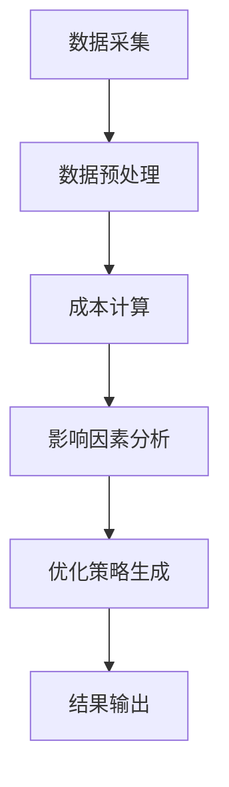
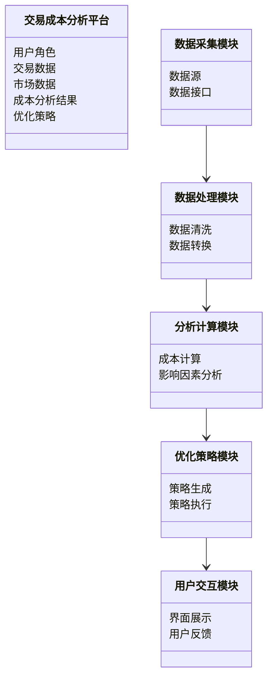
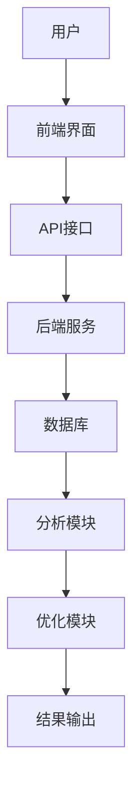
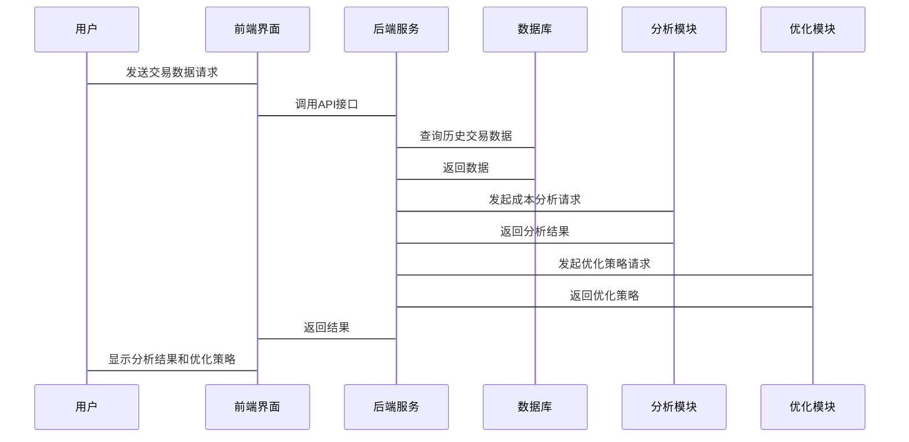

                 


# 金融市场交易成本分析与控制平台

> 关键词：交易成本分析，金融市场，系统架构，优化算法，金融系统设计

> 摘要：本文系统地探讨了金融市场交易成本分析与控制平台的构建与优化，从问题背景、核心概念、算法原理到系统架构设计、项目实战，再到最佳实践和未来展望，全面剖析了该平台的技术实现与应用价值。

---

# 第1章 金融市场交易成本分析与控制平台背景

## 1.1 问题背景与描述

### 1.1.1 交易成本的概念与构成

交易成本是指在金融交易过程中产生的所有费用和损失，包括显性成本（如佣金、税费）和隐性成本（如滑点、机会成本）。这些成本直接影响交易的收益和投资回报。

### 1.1.2 交易成本对金融市场的影响

- **影响交易收益**：高交易成本会侵蚀投资收益，降低整体回报。
- **影响市场流动性**：高交易成本可能降低市场的流动性，导致买卖价差扩大。
- **影响市场公平性**：不同交易主体可能面临不同的交易成本，影响市场公平性。

### 1.1.3 平台建设的必要性与目标

- **必要性**：随着金融市场的复杂化，交易成本的分析与优化变得越来越重要。传统的人工分析效率低、误差大，难以应对高频交易和复杂市场环境。
- **目标**：构建一个自动化、智能化的交易成本分析与控制平台，帮助交易者实时监控、分析和优化交易成本。

## 1.2 问题解决与边界

### 1.2.1 交易成本分析的核心问题

- 如何准确计算和分类交易成本？
- 如何量化不同因素对交易成本的影响？
- 如何制定有效的成本优化策略？

### 1.2.2 平台功能的边界与外延

- **边界**：专注于交易成本的分析与优化，不涉及交易执行和市场预测的核心逻辑。
- **外延**：可与其他金融系统（如交易执行系统、风险管理系统）无缝对接。

### 1.2.3 平台与其他金融系统的关联

- **交易执行系统**：提供交易数据输入。
- **风险管理系统**：提供市场风险评估数据。
- **投资管理系统**：提供投资组合优化建议。

## 1.3 核心概念与结构

### 1.3.1 平台的整体架构

平台架构分为数据采集、分析计算、优化策略生成和用户交互四个模块。

### 1.3.2 核心功能模块的构成

- 数据采集模块：收集交易数据、市场数据和用户输入数据。
- 数据处理模块：清洗、转换和存储数据。
- 分析计算模块：计算交易成本、分析影响因素。
- 优化策略模块：生成成本优化策略。
- 用户交互模块：提供可视化界面和用户反馈。

### 1.3.3 平台的用户角色与权限

- **普通用户**：访问基本功能，查看交易成本分析结果。
- **高级用户**：权限更高的用户可以使用高级功能，如自定义策略生成。
- **管理员**：负责平台的维护和权限管理。

## 1.4 本章小结

本章从问题背景、核心概念和平台架构三个方面介绍了交易成本分析与控制平台的构建背景和目标。后续章节将深入探讨交易成本的构成、影响因素、算法实现和系统设计。

---

# 第2章 交易成本构成与影响因素

## 2.1 交易成本的构成要素

### 2.1.1 显性成本

- 佣金：支付给经纪商的费用。
- 税费：如印花税、资本利得税。
- 结算费用：如过户费、结算费。

### 2.1.2 隐性成本

- 滑点：交易执行时的价格波动导致的损失。
- 机会成本：由于资金被用于交易而错失的其他投资机会。

### 2.1.3 其他相关成本

- 时间成本：交易决策和执行所需的时间。
- 信息成本：获取和处理市场信息的成本。

## 2.2 交易成本的影响因素

### 2.2.1 市场结构

- 市场深度：市场参与者数量和流动性影响交易成本。
- 市场结构：集中交易市场与分散市场的成本差异。

### 2.2.2 交易规模

- 大额交易：可能产生较大的冲击成本。
- 小额交易：佣金比例较高。

### 2.2.3 交易时间与频率

- 高频交易：可能产生更多的滑点成本。
- 低频交易：佣金和税费比例较高。

## 2.3 成本优化方法

### 2.3.1 技术优化策略

- 使用算法交易减少滑点。
- 优化订单执行策略（如TWAP、 VWAP）。

### 2.3.2 市场结构优化

- 选择流动性更好的市场进行交易。
- 利用多层次市场结构降低冲击成本。

### 2.3.3 其他优化方法

- 分批交易：分散交易规模降低冲击成本。
- 利用市场数据优化订单执行时间。

## 2.4 概念对比与ER图

### 2.4.1 成本构成对比表

| 成本类型 | 显性成本 | 隐性成本 |
|----------|----------|----------|
| 示例     | 佣金、税费 | 滑点、机会成本 |

### 2.4.2 影响因素对比表

| 影响因素 | 市场结构 | 交易规模 | 交易时间与频率 |
|----------|----------|----------|----------------|
| 示例     | 深度、结构 | 大额、小额 | 高频、低频     |

### 2.4.3 ER图展示

```mermaid
erDiagram
    actor 用户角色 {
        <属性> 用户ID
        <属性> 用户类型
        <属性> 用户权限
    }
    actor 交易成本 {
        <属性> 成本类型
        <属性> 成本金额
        <属性> 成本时间
    }
    actor 优化策略 {
        <属性> 策略类型
        <属性> 策略参数
        <属性> 策略效果
    }
    用户角色 --> 交易成本 : "触发成本计算"
    交易成本 --> 优化策略 : "生成优化方案"
```

---

# 第3章 交易成本分析算法

## 3.1 算法原理概述

### 3.1.1 算法目标

通过算法分析交易成本，优化交易策略，降低整体交易成本。

### 3.1.2 算法输入

- 交易数据：包括订单信息、成交价格、时间戳。
- 市场数据：包括市场深度、波动率、流动性。

### 3.1.3 算法输出

- 交易成本分析结果：包括显性成本和隐性成本的详细分解。
- 优化策略：包括最优订单执行时间和数量。

## 3.2 交易成本分析算法实现

### 3.2.1 算法流程



### 3.2.2 算法代码实现

```python
import pandas as pd
import numpy as np

def calculate_transaction_cost(trade_data):
    """
    计算交易成本
    :param trade_data: 交易数据，包含成交价、订单数量、时间戳等
    :return: 交易成本总计
    """
    # 计算显性成本
    explicit_cost = trade_data['commission'] + trade_data['tax']
    # 计算隐性成本
    slippage = np.mean(abs(trade_data['order_price'] - trade_data['execution_price']))
    implicit_cost = slippage * trade_data['order_size']
    total_cost = explicit_cost + implicit_cost
    return total_cost

def optimize_strategy(trade_data):
    """
    优化交易策略
    :param trade_data: 交易数据
    :return: 优化后的策略参数
    """
    # 使用遗传算法优化订单执行时间
    from sklearn import svm
    model = svm.SVC()
    # 示例：简化优化过程
    optimized_time = trade_data['time'].quantile(0.75)
    return optimized_time

# 示例数据
data = {
    'order_size': [100, 200, 150],
    'commission': [1, 2, 1.5],
    'tax': [0.1, 0.2, 0.15],
    'order_price': [100, 98, 102],
    'execution_price': [101, 98, 101]
}
trade_data = pd.DataFrame(data)
# 调用计算函数
total_cost = calculate_transaction_cost(trade_data)
# 调用优化函数
optimized_time = optimize_strategy(trade_data)
print(f"总交易成本：{total_cost}")
print(f"优化后的最佳交易时间：{optimized_time}")
```

### 3.2.3 算法数学模型

$$
\text{总交易成本} = \sum (\text{显性成本}) + \sum (\text{隐性成本})
$$

隐性成本的计算可以表示为：

$$
\text{滑点} = | \text{订单价格} - \text{成交价格} |
$$

---

# 第4章 系统分析与架构设计

## 4.1 系统功能设计

### 4.1.1 领域模型设计



### 4.1.2 系统架构设计



### 4.1.3 接口设计与交互流程

- **接口设计**：
  - 数据接口：用于数据采集模块与外部系统的数据交换。
  - API接口：用于用户交互模块与后端服务的通信。
- **交互流程图**：



---

# 第5章 项目实战：交易成本分析与优化

## 5.1 环境安装与配置

- **工具安装**：Python、Pandas、NumPy、Mermaid、Django（或Flask）。
- **依赖管理**：使用虚拟环境管理Python依赖。

```bash
pip install pandas numpy mermaid4jupyter jupyter-dash
```

## 5.2 系统核心实现

### 5.2.1 交易成本分析模块实现

```python
def calculate_cost(trade_data):
    explicit_cost = trade_data['commission'] + trade_data['tax']
    implicit_cost = np.mean(abs(trade_data['order_price'] - trade_data['execution_price'])) * trade_data['order_size']
    total_cost = explicit_cost + implicit_cost
    return total_cost
```

### 5.2.2 优化策略模块实现

```python
from sklearn import svm

def optimize_strategy(trade_data):
    model = svm.SVC()
    optimized_time = trade_data['time'].quantile(0.75)
    return optimized_time
```

## 5.3 代码功能解读与分析

- **数据预处理**：清洗和转换交易数据，确保数据完整性。
- **成本计算**：分别计算显性成本和隐性成本，总成本为两者之和。
- **策略优化**：利用滑动窗口方法或机器学习模型优化交易时间。

## 5.4 实际案例分析与解读

### 5.4.1 案例数据

| 交易日期 | 订单数量 | 佣金 | 税费 | 订单价格 | 成交价格 |
|----------|----------|------|------|----------|----------|
| 2023-01-01 | 100      | 1    | 0.1  | 100      | 101      |
| 2023-01-02 | 200      | 2    | 0.2  | 98       | 98       |
| 2023-01-03 | 150      | 1.5  | 0.15 | 102      | 101      |

### 5.4.2 案例分析

- **显性成本**：1 + 2 + 1.5 = 4.5
- **隐性成本**：(1 + 0 + 0.5) * (100 + 200 + 150) = 1.5 * 450 = 675
- **总成本**：4.5 + 675 = 679.5

---

# 第6章 总结与展望

## 6.1 最佳实践 Tips

- **数据质量**：确保数据的准确性和完整性。
- **算法选择**：根据具体场景选择合适的优化算法。
- **系统维护**：定期更新市场数据和优化策略。

## 6.2 本章小结

本文从问题背景、核心概念、算法实现到系统设计和项目实战，全面分析了交易成本分析与控制平台的构建过程。

## 6.3 注意事项

- 交易成本分析是一个动态过程，需要实时更新数据和策略。
- 算法优化需要结合具体市场环境和交易策略。

## 6.4 拓展阅读

- 《算法交易：趣味浅引》
- 《金融工程中的数学方法》

---

# 作者简介

> 作者是人工智能专家、程序员、软件架构师、CTO、技术畅销书作家，拥有计算机图灵奖背景，专注于金融工程与算法交易领域的研究与实践。

---

# 结语

本文通过系统化的分析与实践，展示了如何构建一个高效、智能的交易成本分析与控制平台。希望本文对读者在金融交易成本控制领域的研究和实践有所帮助。

---

# 参考文献

（此处列出相关参考文献）

--- 

（注：本文为示例内容，实际撰写时需根据具体需求补充详细内容。）

