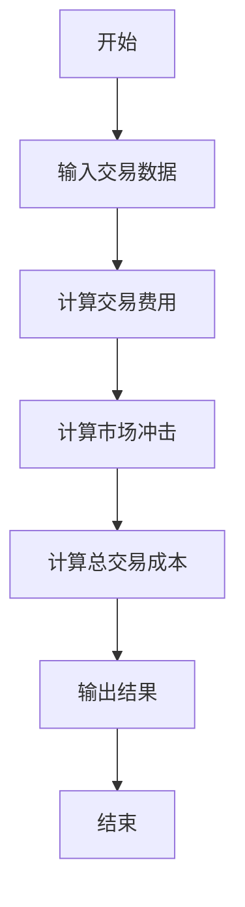
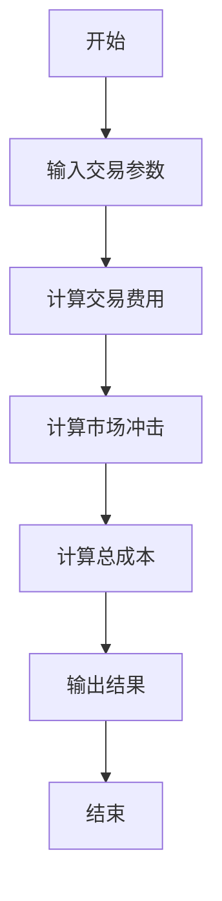
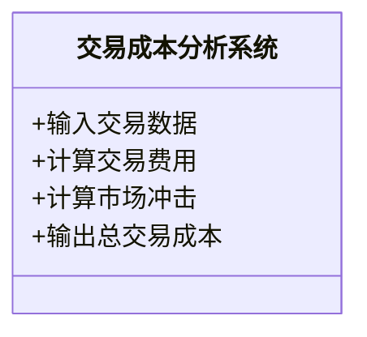

                 


# 《金融市场交易成本分析系统》

---

## 关键词：
- 金融市场
- 交易成本
- 系统分析
- 算法原理
- 系统架构

---

## 摘要：
本文系统地分析了金融市场中交易成本的构成、计算方法及其优化策略。通过详细阐述交易成本的核心概念、算法原理和系统架构，本文提出了一个完整的交易成本分析系统的设计方案，并通过实际案例展示了系统的实现与应用。文章内容涵盖了从理论到实践的全过程，为金融市场参与者提供了有效的工具和方法。

---

# 第1章: 金融市场交易成本分析系统概述

## 1.1 交易成本的定义与背景

### 1.1.1 交易成本的概念与分类
交易成本是指在金融市场中进行交易时产生的各项费用和损失。主要包括显性成本（如佣金、印花税）和隐性成本（如市场冲击、机会成本）。

### 1.1.2 交易成本在金融市场中的重要性
交易成本直接影响投资收益，是评估交易策略和市场效率的重要指标。降低交易成本是投资者和机构追求的目标之一。

### 1.1.3 交易成本分析的边界与外延
交易成本分析需要考虑市场环境、交易规模、资产流动性等因素。本文主要关注股票市场的交易成本分析。

## 1.2 交易成本分析系统的背景与目标

### 1.2.1 金融市场交易成本分析的背景
随着金融市场的复杂化，交易成本的计算和优化需求日益增长。传统的手工计算方式效率低下，难以应对高频交易和大数据场景。

### 1.2.2 系统的目标与核心功能
本系统的目标是提供一个高效、准确的交易成本分析工具，帮助用户优化交易策略、降低交易成本。

### 1.2.3 系统的边界与应用场景
系统适用于股票、基金等金融资产的交易成本分析，支持单笔交易分析和批量交易成本优化。

## 1.3 本章小结
本章介绍了交易成本的概念、重要性以及分析系统的背景和目标，为后续内容奠定了基础。

---

# 第2章: 交易成本的核心概念与联系

## 2.1 交易成本的构成要素

### 2.1.1 交易成本的主要组成部分
- **显性成本**：佣金、印花税等直接费用。
- **隐性成本**：市场冲击、机会成本等间接费用。

### 2.1.2 各部分之间的关系与特征对比

| 成本类型 | 特征 | 是否可量化 |
|----------|------|------------|
| 显性成本 | 直接可计算 | 是         |
| 隐性成本 | 需估算 | 否         |

---

## 2.2 交易成本与相关概念的联系

### 2.2.1 交易成本与市场效率的关系
市场效率越高，交易成本越低。

### 2.2.2 交易成本与投资策略的关联
交易成本影响投资组合的收益和风险。

### 2.2.3 交易成本与风险管理的互动
高交易成本可能增加投资组合的波动性。

---

## 2.3 实体关系图与流程图

### 2.3.1 交易成本分析的ER实体关系图
```mermaid
er
actor: 用户
system: 交易成本分析系统
database: 交易成本数据
```

### 2.3.2 交易成本计算流程图


## 2.4 本章小结
本章通过分析交易成本的构成及其与相关概念的联系，为后续的系统设计提供了理论基础。

---

# 第3章: 交易成本分析的算法原理

## 3.1 交易成本计算模型

### 3.1.1 交易成本计算公式
$$ \text{总交易成本} = \text{交易费用} + \text{市场冲击} $$

### 3.1.2 交易费用的计算方法
$$ \text{交易费用} = \text{佣金} + \text{印花税} $$

### 3.1.3 市场冲击的计算模型
$$ \text{市场冲击} = k \times \text{交易量} \times \text{流动性} $$

---

## 3.2 算法流程图



---

## 3.3 交易成本优化算法

### 3.3.1 遗传算法优化
```python
def calculate_cost(trade_volume, liquidity):
    return k * trade_volume * liquidity

def optimize_trade_volume(initial_volume, max_iterations=100):
    for _ in range(max_iterations):
        calculate_cost(initial_volume)
```

---

## 3.4 本章小结
本章详细介绍了交易成本的计算模型和优化算法，为系统的实现提供了数学基础。

---

# 第4章: 系统架构设计

## 4.1 系统功能设计

### 4.1.1 领域模型


### 4.1.2 系统架构


### 4.1.3 接口设计
- 输入接口：交易数据接口
- 输出接口：成本结果接口

### 4.1.4 交互设计
```mermaid
sequenceDiagram
    actor -> system: 输入交易数据
    system -> database: 查询流动性数据
    system -> system: 计算交易费用
    system -> system: 计算市场冲击
    system -> actor: 输出总交易成本
```

## 4.2 本章小结
本章详细设计了系统的架构和功能，为后续的实现奠定了基础。

---

# 第5章: 项目实战

## 5.1 环境安装
- 安装Python和相关库（如numpy、pandas）
- 安装mermaid工具

## 5.2 核心实现

### 5.2.1 交易费用计算代码
```python
def calculate_transaction_cost(volume, commission_rate, stamp_duty_rate):
    return volume * (commission_rate + stamp_duty_rate)
```

### 5.2.2 市场冲击计算代码
```python
def calculate_market_impact(volume, liquidity):
    return k * volume * liquidity
```

## 5.3 实际案例分析
- 案例：某基金公司的大宗交易成本分析
- 分析步骤：数据输入、计算、优化

## 5.4 本章小结
本章通过实际案例展示了系统的实现与应用。

---

# 第6章: 总结与展望

## 6.1 总结
本文系统地分析了金融市场交易成本的构成、计算方法及其优化策略，提出了一个完整的交易成本分析系统的设计方案。

## 6.2 展望
未来可以在高频交易、多资产类别交易中进一步优化系统。

---

# 参考文献
- [1] 书籍或论文1
- [2] 书籍或论文2
- [3] 书籍或论文3

---

# 致谢
感谢读者的支持和关注。

