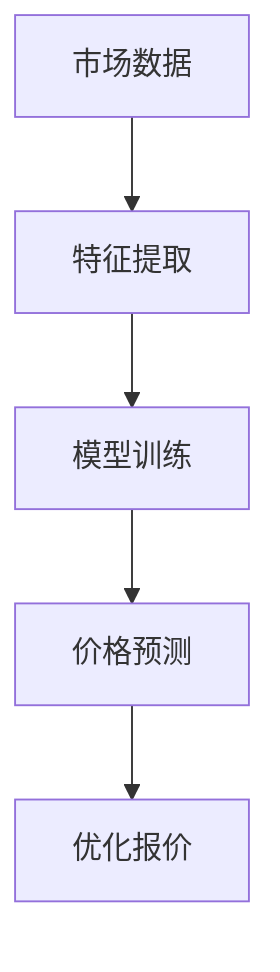

                 


# 金融市场做市商策略优化

> 关键词：金融市场，做市商，策略优化，数学模型，系统架构，算法原理

> 摘要：本文详细探讨了金融市场中做市商策略优化的核心概念、数学模型、系统架构和实际应用。通过分析做市商的角色、策略优化的背景、算法原理以及系统设计，本文为读者提供了从理论到实践的全面指导，帮助做市商在复杂多变的市场环境中实现高效和盈利的交易策略。

---

## 第一部分: 金融市场做市商策略优化基础

### 第1章: 做市商的基本概念与角色

#### 1.1 做市商的定义与功能

做市商（Market Maker）是指在金融市场中主动提供买卖报价，维护市场流动性的参与者。他们的主要功能包括：

- **提供流动性**：通过主动报价，确保市场在任何时间都有买卖机会，减少买卖双方的交易摩擦。
- **价格发现**：通过竞争性报价，做市商帮助确定资产的公允价格。
- **风险管理**：通过动态调整报价和头寸，做市商在承担风险的同时，确保市场的稳定性。

**ER实体关系图**：

```mermaid
er
actor 做市商 {
  性质: 实体
}
actor 投资者 {
  性质: 实体
}
actor 市场 {
  性质: 实体
}
做市商 --> 市场: 提供买卖报价
投资者 --> 市场: 下达订单
市场 --> 做市商: 反馈订单成交情况
```

---

### 第2章: 做市商策略优化的背景与挑战

#### 2.1 金融市场的发展与做市商的演变

随着金融市场的电子化和自动化，做市商的角色和策略也在不断演变。传统的做市商依赖于手动报价和交易，而现代做市商则利用高频交易算法和大数据分析，实时调整报价和头寸。

**对比分析表**：

| **传统做市商** | **现代做市商** |
|----------------|----------------|
| 报价方式 | 手动/电子化报价 | 高频算法报价 |
| 数据来源 | 市场深度和有限数据 | 实时大数据和机器学习 |
| 风险管理 | 基于历史数据分析 | 基于实时市场动态 |

#### 2.2 现代做市商面临的挑战

- **市场波动性**：高频交易和算法交易加剧了市场的波动性，增加了做市商的风险。
- **竞争加剧**：更多的机构加入做市商行列，导致市场竞争激烈，利润空间缩小。
- **技术与数据**：需要处理大量实时数据，并依赖先进的技术架构来支持高频交易。

---

### 第3章: 做市商策略优化的核心概念与联系

#### 3.1 核心概念原理

做市商的策略优化涉及多个核心概念，包括定价模型、市场微观结构和风险管理。

**定价模型**：

定价模型是做市商的核心工具，用于确定资产的买卖价格。常见的定价模型包括统计套利模型和机器学习模型。

- **统计套利模型**：基于历史数据分析，寻找价格偏离合理区间的机会。
- **机器学习模型**：利用算法学习市场规律，预测未来价格走势。

**市场微观结构**：

市场微观结构理论帮助做市商理解订单流和市场深度的变化，从而优化报价策略。

**风险管理**：

风险管理是做市商策略优化的重要组成部分，包括VaR（Value at Risk）和压力测试等方法。

---

### 第4章: 做市商策略优化的数学模型与算法原理

#### 4.1 做市商定价模型的数学表达

定价模型通常基于统计套利和机器学习算法。以下是一个简单的统计套利模型示例：



**统计套利模型**：

统计套利模型通过分析资产的短期价格波动，寻找套利机会。常用的方法包括均值回归和动量策略。

- **均值回归**：假设价格会回归到历史平均值，做市商可以在价格偏离平均值时进行交易。
- **动量策略**：利用价格的动量效应，即近期价格走势影响未来价格。

**机器学习模型**：

机器学习模型，如支持向量机（SVM）和随机森林（Random Forest），可以用于预测市场走势。

---

### 第5章: 做市商策略优化的系统分析与架构设计

#### 5.1 系统设计概述

做市商的交易系统通常包括以下几个模块：

- **数据采集**：实时采集市场数据和订单流。
- **算法引擎**：执行定价模型和交易策略。
- **风险管理**：监控和管理交易风险。
- **订单管理系统**：管理订单的生命周期。

**系统架构图**：


---

### 第6章: 做市商策略优化的项目实战

#### 6.1 项目环境与工具安装

为了实现做市商策略优化，需要以下环境和工具：

- **编程语言**：Python、Java
- **数据源**：金融数据API（如 Bloomberg、Reuters）
- **工具**：Jupyter Notebook、IDE（如IntelliJ IDEA）

#### 6.2 核心算法实现

以下是基于统计套利的定价模型的Python代码示例：

```python
import numpy as np
import pandas as pd
from sklearn.svm import SVR

# 数据预处理
data = pd.read_csv('market_data.csv')
features = data[['bid', 'ask', 'volume']]
target = data['mid_price']

# 训练模型
model = SVR()
model.fit(features, target)

# 预测价格
new_features = np.array([[current_bid, current_ask, current_volume]])
predicted_price = model.predict(new_features)
```

#### 6.3 实际案例分析

通过分析实际市场数据，可以验证定价模型的有效性。例如，在某个时间段内，模型预测的价格与实际价格的偏差较小，说明模型具有较高的准确性。

---

## 第四部分: 总结与展望

### 总结

本文详细探讨了金融市场中做市商策略优化的核心概念、数学模型、系统架构和实际应用。通过理论与实践相结合的方式，为读者提供了从基础到高级的全面指导。

### 展望

随着人工智能和大数据技术的不断发展，做市商的策略优化将更加依赖于先进的算法和系统架构。未来的研究可以进一步探索如何结合区块链技术和分布式计算，提升做市商的交易效率和风险管理能力。

---

通过本文的分析，读者可以全面理解金融市场做市商策略优化的复杂性和重要性，为实际应用提供有价值的参考。

