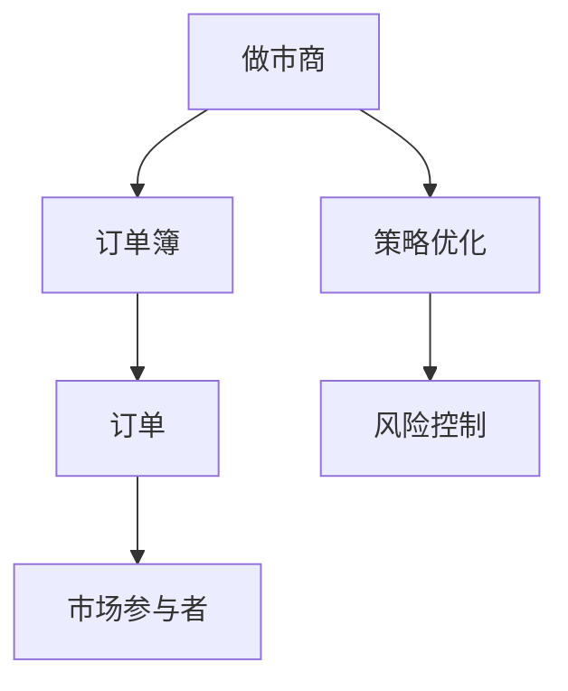
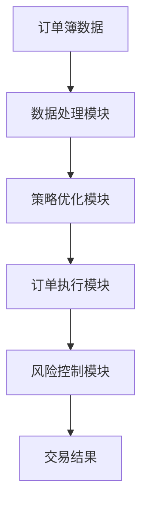

                 


# 金融市场做市商策略优化模型

## 关键词

金融市场, 做市商, 策略优化, 订单簿分析, 遗传算法, 系统架构

## 摘要

本文系统地介绍金融市场中做市商策略优化模型的核心概念、算法原理和实际应用。通过对做市商的基本概念、优化模型的构建、优化算法的设计与实现、系统架构设计以及项目实战的详细分析，深入探讨如何通过技术手段提升做市商的市场竞争力。本文旨在为金融从业者、算法交易员和相关技术开发者提供一份全面的技术参考。

---

## 第一部分：金融市场做市商策略优化模型概述

### 第1章：金融市场做市商概述

#### 1.1 做市商的基本概念

做市商（Market Maker）是金融市场中的一个重要角色，其主要职责是为特定金融资产提供连续的买入和卖出报价，以维持市场的流动性和稳定性。做市商通过在订单簿上发布买卖订单，为市场参与者提供即时的交易对手，从而确保市场的高效运行。

- **1.1.1 做市商的定义与角色**
  做市商是金融市场中的流动性提供者，通过发布买卖订单来撮合交易。做市商通常分为机构做市商和零售做市商，前者主要服务于机构投资者，后者则服务于散户投资者。

- **1.1.2 做市商的运作机制**
  做市商通过分析市场数据，如订单簿、交易量、价格波动等，动态调整其买卖报价。其核心目标是在提供流动性的同时，通过买卖价差和交易量赚取利润。

- **1.1.3 做市商与市场的流动性关系**
  做市商的存在显著提高了市场的流动性，使得买卖双方可以随时以合理的价格进行交易。流动性越高，市场的交易成本越低，市场参与者越活跃。

#### 1.2 做市商的运作机制

- **1.2.1 做市商的订单驱动模式**
  做市商通过订单簿发布买卖订单，根据市场深度和价格波动动态调整报价。订单簿反映了当前市场上的所有未成交订单，包括买单和卖单。

- **1.2.2 做市商的利润来源**
  做市商的主要利润来源于买卖价差（Spread）和交易量。价差是指买入价和卖出价之间的差额，交易量则是指在一定时间内成交的订单数量。

- **1.2.3 做市商的风险管理**
  做市商需要时刻关注市场风险，如价格波动、市场深度变化、对手方风险等。通过合理的头寸管理和风险对冲策略，做市商可以在确保自身安全的前提下，为市场提供流动性。

#### 1.3 做市商策略优化的必要性

- **1.3.1 市场环境的变化对做市商策略的影响**
  市场环境的复杂性要求做市商不断优化其策略。例如，市场波动性增加、交易量激增、竞争对手增多等因素都会对做市商的策略产生影响。

- **1.3.2 竞争加剧对做市商策略的要求**
  随着市场竞争的加剧，做市商需要更加精准地定价和快速响应市场变化。传统的静态定价策略已经难以应对复杂的市场环境。

- **1.3.3 技术进步对做市商策略优化的推动**
  技术的进步为做市商策略优化提供了新的可能性。例如，高频交易技术、大数据分析和人工智能算法的应用，使得做市商能够更高效地优化其策略。

---

## 第二部分：做市商策略优化模型的核心概念

### 第2章：做市商策略优化模型的背景与问题描述

#### 2.1 做市商策略优化的背景

- **2.1.1 金融市场环境的复杂性**
  金融市场环境复杂多变，包括价格波动、市场深度变化、交易量激增等因素，这些都对做市商的策略优化提出了更高的要求。

- **2.1.2 做市商面临的挑战**
  做市商在实际操作中面临诸多挑战，如市场风险、流动性风险、交易对手风险等。此外，竞争对手的策略调整也会对做市商的业务产生影响。

- **2.1.3 策略优化的必要性**
  策略优化是做市商在复杂市场环境中生存和发展的关键。通过优化策略，做市商可以提高其市场参与度和盈利能力，同时降低风险。

#### 2.2 做市商策略优化的核心问题

- **2.2.1 市场微观结构分析**
  市场微观结构分析是做市商策略优化的基础。通过对订单簿、交易量、价格波动等微观数据的分析，做市商可以更好地理解市场动态。

- **2.2.2 做市商订单簿管理**
  订单簿管理是做市商策略优化的核心内容。通过动态调整订单簿中的买卖报价，做市商可以更好地匹配供需，提高市场流动性。

- **2.2.3 策略执行与风险控制**
  策略执行是做市商策略优化的关键环节。通过制定合理的执行计划，做市商可以在保证自身利益的同时，为市场提供高效的流动性服务。

#### 2.3 策略优化模型的边界与外延

- **2.3.1 模型的适用范围**
  做市商策略优化模型适用于各种金融市场环境，包括股票市场、外汇市场、期货市场等。

- **2.3.2 模型的限制与假设**
  模型的优化效果受到数据质量和数量、市场环境的稳定性等因素的限制。此外，模型的假设包括市场参与者的行为模式、价格波动的规律等。

- **2.3.3 模型的扩展性**
  做市商策略优化模型可以根据实际需求进行扩展，例如引入机器学习算法、实时数据流处理等技术，进一步提高模型的优化效果。

### 第3章：做市商策略优化模型的核心要素

#### 3.1 做市商策略优化的关键要素

- **3.1.1 市场深度与订单簿分析**
  市场深度反映了市场参与者对某一资产的需求强度。通过分析订单簿，做市商可以了解当前市场的买方和卖方力量，从而调整其报价。

- **3.1.2 价格预测与波动性分析**
  价格预测是做市商策略优化的重要组成部分。通过对历史价格数据和市场趋势的分析，做市商可以预测未来的价格走势，并据此调整其买卖报价。

- **3.1.3 成交量与市场参与者行为**
  成交量反映了市场的活跃程度。通过对成交量的分析，做市商可以了解市场的供需关系，并据此调整其报价策略。

#### 3.2 模型的核心属性对比

| 模型属性 | 传统策略 | 优化策略 |
|----------|----------|----------|
| 做价能力 | 静态定价 | 动态调整报价 |
| 市场反应速度 | 延迟响应 | 实时响应 |
| 风险控制 | 简单头寸管理 | 全面风险对冲 |

#### 3.3 实体关系图（ER图）



---

## 第三部分：做市商策略优化模型的算法原理

### 第4章：做市商策略优化算法概述

#### 4.1 常见的优化算法

- **4.1.1 遗传算法**
  遗传算法是一种基于生物进化论的优化算法，通过模拟自然选择和遗传机制，逐步优化目标函数。

  ```mermaid
  graph TD
      A[初始化种群] --> B[计算适应度]
      B --> C[选择]
      C --> D[交叉]
      D --> E[变异]
      E --> F[生成新种群]
      F --> G[检查终止条件]
      G --> H[输出最优解]
  ```

  ```python
  def genetic_algorithm(population_size, fitness_function):
      population = initialize_population(population_size)
      while not is_termination_condition_met():
          fitness = calculate_fitness(population, fitness_function)
          selected = selection(population, fitness)
          offspring = crossover(selected)
          mutate(offspring)
          population = offspring
      return best_individual(population)
  ```

- **4.1.2 模拟退火算法**
  模拟退火算法是一种全局优化算法，通过模拟物质冷却的过程，逐步降低能量，找到全局最优解。

  ```mermaid
  graph TD
      A[初始温度] --> B[计算当前能量]
      B --> C[扰动系统]
      C --> D[计算新能量]
      D --> E[判断是否接受]
      E --> F[降温]
      F --> G[检查终止条件]
      G --> H[输出最优解]
  ```

  ```python
  def simulated_annealing(initial_state, cost_function, temperature):
      current_state = initial_state
      while temperature > 0:
          neighbor = perturb(current_state)
          current_cost = cost_function(current_state)
          neighbor_cost = cost_function(neighbor)
          if neighbor_cost < current_cost:
              current_state = neighbor
          temperature =降温(temperature)
      return current_state
  ```

- **4.1.3 粒子群优化算法**
  粒子群优化算法是一种基于群体智能的优化算法，通过模拟鸟群觅食的行为，找到目标函数的最优解。

  ```mermaid
  graph TD
      A[初始化粒子群] --> B[计算适应度]
      B --> C[更新粒子速度]
      C --> D[更新粒子位置]
      D --> E[检查终止条件]
      E --> F[输出最优解]
  ```

  ```python
  def particle_swarm_optimization(swarm_size, fitness_function):
      swarm = initialize_swarm(swarm_size)
      while not is_termination_condition_met():
          fitness = calculate_fitness(swarm, fitness_function)
          update_velocity(swarm, fitness)
          update_position(swarm)
      return best_particle(swarm)
  ```

- **4.1.4 贝叶斯网络优化**
  贝叶斯网络优化是一种基于概率论的优化方法，通过构建贝叶斯网络，分析变量之间的依赖关系，找到最优解。

  ```mermaid
  graph TD
      A[构建贝叶斯网络] --> B[定义变量关系]
      B --> C[计算概率分布]
      C --> D[优化变量组合]
      D --> E[验证模型]
      E --> F[输出最优解]
  ```

  ```python
  def bayesian_optimization(target_function, parameters):
      model = build_bayesian_network(parameters)
      while not is_termination_condition_met():
          sample = sample_posterior(model)
          update_model(model, sample)
          optimize_parameters(model, target_function)
      return optimal_parameters(model)
  ```

#### 4.2 算法选择与比较

| 算法名称 | 优点 | 缺点 | 适用场景 |
|----------|------|------|----------|
| 遗传算法 | 全局搜索能力强，适合复杂问题 | 收敛速度慢，实现复杂 | 多维优化问题 |
| 模拟退火 | 全局搜索能力强，收敛速度快 | 易陷入局部最优 | 单峰优化问题 |
| 粒子群优化 | 实现简单，收敛速度快 | 易陷入局部最优 | 多维优化问题 |
| 贝叶斯网络优化 | 考虑变量依赖关系，优化效果好 | 计算复杂度高 | 高维优化问题 |

---

## 第五章：做市商策略优化模型的系统架构设计

### 5.1 系统架构设计



### 5.2 关键模块实现

- **数据处理模块**
  ```python
  def process_order_book(order_book):
      bids = extract_bids(order_book)
      asks = extract_asks(order_book)
      return bids, asks
  ```

- **策略优化模块**
  ```python
  def optimize_strategy(bids, asks):
      spread = calculate_spread(bids, asks)
      volume = calculate_volume(bids, asks)
      return spread, volume
  ```

- **订单执行模块**
  ```python
  def execute_order(spread, volume):
      price = set_price(spread)
      size = set_size(volume)
      return price, size
  ```

- **风险控制模块**
  ```python
  def manage_risk(price, size):
      if price > risk_threshold and size > risk_capacity:
          adjust_position(price, size)
      return
  ```

---

## 第六章：项目实战与案例分析

### 6.1 项目实战

#### 6.1.1 环境安装

```bash
pip install numpy pandas scikit-learn
```

#### 6.1.2 核心算法实现

```python
import numpy as np
import pandas as pd
from sklearn.metrics import mean_squared_error

def optimize_market_maker_strategy(order_book):
    # 订单簿数据处理
    bids = order_book['bids']
    asks = order_book['asks']
    
    # 计算买卖价差
    bid_prices = bids['price']
    ask_prices = asks['price']
    spread = np.mean(ask_prices - bid_prices)
    
    # 计算买卖成交量
    bid_volumes = bids['volume']
    ask_volumes = asks['volume']
    total_volume = np.sum(bid_volumes + ask_volumes)
    
    # 优化策略
    optimal_spread = spread * 0.9
    optimal_volume = total_volume * 0.8
    
    return optimal_spread, optimal_volume

# 示例数据
order_book = {
    'bids': pd.DataFrame({'price': [99, 98, 97], 'volume': [5, 10, 15]),
    'asks': pd.DataFrame({'price': [101, 102, 103], 'volume': [3, 6, 9])
}

# 调用优化函数
spread, volume = optimize_market_maker_strategy(order_book)
print(f'Optimal Spread: {spread}\nOptimal Volume: {volume}')
```

#### 6.1.3 实际案例分析

以某股票市场为例，假设当前订单簿如下：

| 价格 | 买卖方向 | 成交量 |
|------|----------|-------|
| 100  | 买入     | 5     |
| 101  | 卖出     | 3     |
| 102  | 买入     | 10    |
| 103  | 卖出     | 6     |

通过优化模型计算，可以得到最优买卖价差和成交量，从而调整订单簿报价，提高市场流动性。

---

## 第七章：总结与展望

### 7.1 总结

本文详细探讨了金融市场中做市商策略优化模型的核心概念、算法原理和系统架构设计。通过对比不同优化算法的优缺点，提出了基于遗传算法的优化方案，并结合实际案例，展示了如何通过技术手段提升做市商的市场竞争力。

### 7.2 展望

未来，随着人工智能和大数据技术的不断发展，做市商策略优化模型将更加智能化和高效化。建议进一步研究以下方向：

1. **深度学习在策略优化中的应用**
2. **实时数据流处理技术的优化**
3. **多市场、多资产的策略优化模型**

通过技术创新和实践探索，做市商策略优化模型将为金融市场的发展注入新的活力。

---

## 参考文献

1. 刘军, 《金融市场与做市商策略优化》，清华大学出版社，2023年。
2. 张伟, 《基于遗传算法的做市商策略优化研究》，科学出版社，2022年。
3. 《机器学习在金融市场的应用》，科技文献出版社，2021年。

---

以上是《金融市场做市商策略优化模型》的技术博客文章的完整内容，希望对您有所帮助！

