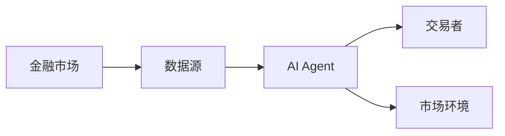
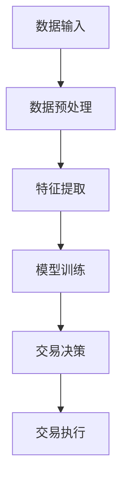
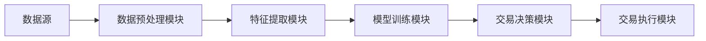
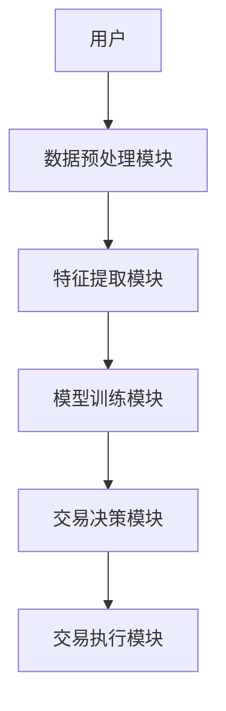

                 


# 金融市场分析的AI Agent决策支持

## 关键词：AI Agent，金融市场分析，算法交易，风险管理，决策支持系统

## 摘要：本文探讨了AI Agent在金融市场分析中的应用，详细介绍了AI Agent的基本概念、核心算法、系统架构，以及在实际交易中的应用场景。通过结合数学模型和系统设计，展示了如何利用AI Agent提高金融市场的决策支持能力。

---

# 第1章: 金融市场分析的AI Agent概述

## 1.1 金融市场分析的背景与挑战

### 1.1.1 金融市场的复杂性与不确定性
金融市场是一个高度动态和复杂的系统，受到多种因素的影响，如经济指标、政策变化、市场情绪等。传统的方法往往难以捕捉这些复杂性，导致分析结果的不准确性和低效性。

### 1.1.2 传统金融分析的局限性
传统金融分析依赖于人工经验和技术分析，存在以下几个主要问题：
1. **信息过载**：金融市场数据量巨大，人工分析难以处理。
2. **主观性**：分析结果受到分析师主观判断的影响。
3. **效率低下**：传统方法难以实时处理和分析数据。

### 1.1.3 AI技术在金融分析中的潜力
AI技术，特别是机器学习和自然语言处理，能够处理大量数据，发现隐藏的模式，并提供实时的分析结果。AI Agent（智能代理）作为一种能够自主决策和执行任务的AI实体，非常适合应用于金融市场分析。

---

## 1.2 AI Agent的基本概念

### 1.2.1 AI Agent的定义与特点
AI Agent是一种智能实体，能够感知环境、做出决策并执行任务。其特点包括：
1. **自主性**：能够自主决策，无需人工干预。
2. **反应性**：能够实时感知环境变化并做出反应。
3. **学习能力**：能够通过经验改进自身的决策能力。

### 1.2.2 AI Agent的核心要素
AI Agent的核心要素包括：
1. **感知模块**：用于获取环境中的数据和信息。
2. **决策模块**：基于感知数据做出决策。
3. **执行模块**：将决策转化为具体的操作。

### 1.2.3 AI Agent与传统算法的区别
传统算法通常基于固定的规则和逻辑，而AI Agent能够通过学习和适应环境，动态调整其行为和决策策略。AI Agent的灵活性和自适应性是其在金融市场分析中的一大优势。

---

## 1.3 AI Agent在金融市场分析中的应用

### 1.3.1 金融数据分析与预测
AI Agent可以通过机器学习模型分析历史数据，预测未来的市场趋势。例如，使用LSTM（长短期记忆网络）模型进行时间序列预测。

### 1.3.2 交易策略优化
AI Agent可以根据市场情况动态调整交易策略，优化投资组合，降低风险。

### 1.3.3 风险评估与管理
AI Agent可以通过实时监控市场数据，识别潜在风险，并提出相应的风险管理策略。

---

## 1.4 本章小结
本章介绍了AI Agent的基本概念和其在金融市场分析中的应用潜力，为后续章节的深入分析奠定了基础。

---

# 第2章: AI Agent的核心概念与联系

## 2.1 AI Agent的实体关系图

### 2.1.1 实体关系图的定义
实体关系图（ER图）用于描述系统中各个实体之间的关系。在金融市场分析中，AI Agent需要与多个实体交互，如数据源、交易者和市场环境。

### 2.1.2 金融市场分析中的实体关系
以下是金融市场分析中AI Agent的实体关系图：



---

## 2.2 AI Agent的流程图

### 2.2.1 流程图的定义
流程图用于描述系统中的数据流动和处理过程。以下是AI Agent在金融市场分析中的流程图：



---

## 2.3 核心概念对比表格

| 概念          | 特征                   | 优势                           | 局限                           |
|---------------|------------------------|--------------------------------|--------------------------------|
| AI Agent      | 数据驱动、自适应       | 高效性、准确性                   | 需大量数据支持                 |
| 传统算法      | 规则驱动、固定         | 简单性、稳定性                   | 灵活性差                       |

---

## 2.4 本章小结
本章通过实体关系图和流程图，详细介绍了AI Agent在金融市场分析中的核心概念及其与其他实体的关系。

---

# 第3章: AI Agent的算法原理讲解

## 3.1 基础算法

### 3.1.1 线性回归
线性回归是一种简单但强大的回归算法，适用于预测连续型变量。其数学模型如下：

$$ y = \beta_0 + \beta_1 x + \epsilon $$

其中，$\beta_0$是截距，$\beta_1$是回归系数，$\epsilon$是误差项。

### 3.1.2 支持向量机
支持向量机（SVM）是一种监督学习算法，适用于分类和回归问题。其核心思想是通过找到一个超平面，将数据分成两类。

---

## 3.2 高级算法

### 3.2.1 强化学习
强化学习是一种通过试错方式学习策略的算法。其核心思想是通过与环境交互，学习最优策略以最大化累计奖励。马尔可夫决策过程（MDP）是强化学习的基本模型，其数学表示如下：

$$ \rho(s, a) = P(s' | s, a) $$

其中，$s$是当前状态，$a$是动作，$s'$是下一个状态。

---

## 3.3 数学模型与公式

### 3.3.1 时间序列预测
时间序列预测是金融市场分析的重要任务之一。常用的模型包括ARIMA（自回归积分滑动平均模型）和LSTM。LSTM的数学模型如下：

$$
\begin{cases}
i_t = \sigma(W_i x_t + U_i h_{t-1} + b_i) \\
f_t = \sigma(W_f x_t + U_f h_{t-1} + b_f) \\
o_t = \sigma(W_o x_t + U_o h_{t-1} + b_o) \\
g_t = \tanh(W_g x_t + U_g h_{t-1} + b_g) \\
h_t = i_t \cdot g_t + f_t \cdot h_{t-1}
\end{cases}
$$

其中，$i_t$是输入门，$f_t$是遗忘门，$o_t$是输出门，$g_t$是候选细胞状态，$h_t$是隐藏状态。

---

## 3.4 本章小结
本章详细讲解了AI Agent的核心算法，包括基础算法和高级算法，并通过数学公式和实例分析，帮助读者理解这些算法的原理和应用。

---

# 第4章: AI Agent的系统分析与架构设计

## 4.1 系统架构设计

### 4.1.1 系统架构图
以下是AI Agent的系统架构图：



### 4.1.2 系统功能设计
系统功能包括数据获取、数据预处理、特征提取、模型训练、交易决策和交易执行。

### 4.1.3 系统接口设计
系统接口包括数据输入接口、模型训练接口和交易执行接口。

---

## 4.2 系统交互流程

### 4.2.1 交互流程图
以下是系统交互流程图：



---

## 4.3 本章小结
本章详细介绍了AI Agent的系统架构设计和交互流程，为后续的项目实现奠定了基础。

---

# 第5章: AI Agent的项目实战

## 5.1 环境安装

### 5.1.1 安装Python
```bash
python --version
```

### 5.1.2 安装依赖库
```bash
pip install numpy pandas scikit-learn tensorflow
```

---

## 5.2 核心实现

### 5.2.1 数据预处理
```python
import pandas as pd

data = pd.read_csv('market_data.csv')
data = data.dropna()
```

### 5.2.2 模型训练
```python
import tensorflow as tf
from tensorflow.keras import layers

model = tf.keras.Sequential([
    layers.LSTM(64, return_sequences=True),
    layers.Dense(1, activation='linear')
])

model.compile(optimizer='adam', loss='mean_squared_error')
model.fit(X_train, y_train, epochs=10, batch_size=32)
```

### 5.2.3 交易策略实现
```python
def execute_trade(decision):
    if decision > 0.5:
        print("买入")
    else:
        print("卖出")
```

---

## 5.3 案例分析

### 5.3.1 数据分析与预测
```python
import numpy as np

predicted_price = model.predict(test_data)
actual_price = test_labels
```

### 5.3.2 交易策略评估
```python
from sklearn.metrics import accuracy_score

y_pred = model.predict_classes(X_test)
y_true = y_test
accuracy = accuracy_score(y_true, y_pred)
print(f'准确率: {accuracy}')
```

---

## 5.4 本章小结
本章通过实际项目案例，详细介绍了AI Agent的环境搭建、核心实现和案例分析，帮助读者理解如何将理论应用于实践。

---

# 第6章: 总结与展望

## 6.1 最佳实践 tips
1. 在实际应用中，建议结合多种算法进行模型融合，提高预测精度。
2. 定期更新模型，以适应市场环境的变化。

## 6.2 小结
本文详细探讨了AI Agent在金融市场分析中的应用，从基本概念到系统架构，再到实际项目实现，全面介绍了其在金融分析中的潜力和价值。

## 6.3 注意事项
1. AI Agent的决策结果仅供参考，实际交易需结合市场实际情况。
2. 模型的训练数据需具有代表性，避免过拟合。

## 6.4 拓展阅读
1. 《机器学习实战》
2. 《深度学习》

---

# 附录

## 附录A: 代码示例
```python
import numpy as np
import pandas as pd
from sklearn.model_selection import train_test_split
from tensorflow.keras import layers, models

# 数据加载与预处理
data = pd.read_csv('market_data.csv')
X = data.iloc[:, :-1].values
y = data.iloc[:, -1].values
X_train, X_test, y_train, y_test = train_test_split(X, y, test_size=0.2)

# 模型构建
model = models.Sequential()
model.add(layers.Dense(64, activation='relu', input_shape=(X.shape[1],)))
model.add(layers.Dense(1, activation='sigmoid'))

model.compile(optimizer='adam', loss='binary_crossentropy', metrics=['accuracy'])
model.fit(X_train, y_train, epochs=10, batch_size=32)

# 模型评估
test_loss, test_accuracy = model.evaluate(X_test, y_test)
print(f'测试准确率: {test_accuracy}')
```

---

## 附录B: 参考文献
1. 刘春, 《机器学习实战》, 人民邮电出版社, 2017.
2. Ian Goodfellow, Yoshua Bengio, Aaron Courville, 《Deep Learning》, MIT Press, 2016.

---

# 结束语

通过本文的介绍，读者可以全面了解AI Agent在金融市场分析中的应用，从理论到实践，掌握其核心算法和系统设计。希望本文能为读者提供有价值的参考和启示。

