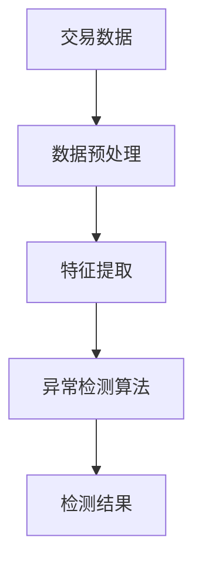
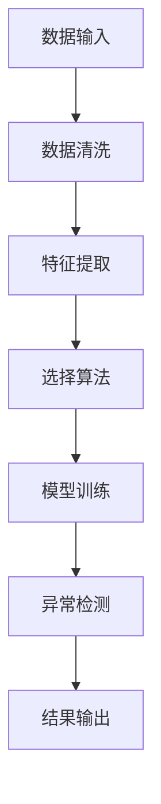
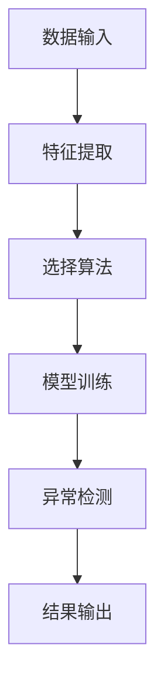
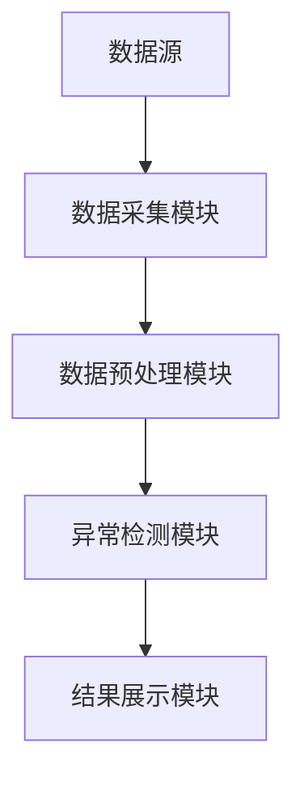
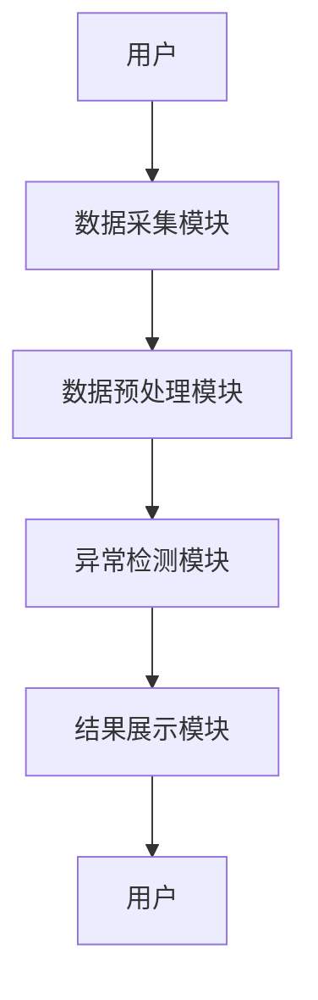

                 


# 金融市场异常交易检测系统

## 关键词：金融市场、异常交易、检测系统、机器学习、数据挖掘、算法、监管

## 摘要：金融市场异常交易检测系统是一种利用先进的算法和技术，实时监控和识别金融市场中的异常交易行为，以保护投资者利益和维护市场公平性的系统。本文从背景介绍、核心概念、算法原理、系统架构到项目实战，全面分析和讲解异常交易检测系统的构建和应用。

---

# 第1章: 异常交易检测的背景与意义

## 1.1 异常交易的定义与分类

### 1.1.1 什么是异常交易

异常交易是指在金融市场中，某些交易行为或交易数据偏离正常市场规律或预期模式，可能对市场造成负面影响的交易活动。这些交易行为可能包括操纵市场、内幕交易、高频交易中的异常行为等。

### 1.1.2 异常交易的分类

| 异常交易类型 | 定义 | 特点 | 示例 |
|----------------|------|------|------|
| 市场操纵 | 通过虚假交易或散布信息影响市场价格 | 主观性、隐蔽性 | 涉及拉高股价后再抛售 |
| 内幕交易 | 利用未公开信息进行交易 | 非法性、高收益 | 知晓公司并购消息后提前买入 |
| 高频交易异常 | 高频交易中的闪崩或闪涨 | 突发性、短暂性 | 2010年“闪崩”事件 |

### 1.1.3 异常交易的危害

- 损害投资者利益：普通投资者可能因异常交易而遭受损失。
- 破坏市场公平性：异常交易可能导致市场信息不对称加剧。
- 影响市场稳定性：异常交易可能导致市场剧烈波动，引发系统性风险。

---

## 1.2 金融市场异常交易的背景

### 1.2.1 金融市场的基本运作机制

金融市场是一个买卖金融资产的市场，参与者包括投资者、机构、交易所等。市场信息透明度、交易规则的完善性是市场健康运行的基础。

### 1.2.2 异常交易的产生原因

- 市场参与者动机不纯：部分机构或个人为牟取暴利，采取不正当手段。
- 技术进步：高频交易等技术的应用，使得异常交易行为更加隐蔽和快速。
- 监管漏洞：监管机构在技术和信息处理能力上可能存在滞后。

### 1.2.3 监管机构的作用

监管机构通过制定规则、监控交易行为、处罚违规行为等方式，维护市场秩序。例如，美国的SEC（证券交易委员会）负责监管美股市场。

---

## 1.3 异常交易检测的重要性

### 1.3.1 保护投资者利益

及时发现并阻止异常交易，避免投资者因信息不对称或市场操纵而遭受损失。

### 1.3.2 维护市场公平性

通过检测异常交易，确保所有参与者在公平的市场环境中竞争。

### 1.3.3 提升交易透明度

异常交易检测系统可以实时监控交易数据，提高市场透明度，增强投资者信心。

---

## 1.4 传统交易监控与现代技术的结合

### 1.4.1 传统交易监控的局限性

- 依赖人工监控，效率低、成本高。
- 难以及时发现隐蔽性较强的异常行为。

### 1.4.2 现代技术在异常交易检测中的应用

- 大数据分析技术：通过对海量交易数据的分析，发现异常模式。
- 机器学习算法：利用算法自动学习交易行为特征，识别异常交易。
- 高频交易监控：利用实时数据分析技术，快速发现并处理异常交易。

### 1.4.3 技术进步对金融监管的影响

技术进步使得监管机构能够更高效、更准确地发现和处理异常交易行为，提升监管效率。

---

## 1.5 本章小结

本章介绍了异常交易的定义、分类及其危害，分析了金融市场异常交易的背景，并强调了异常交易检测的重要性。同时，讨论了传统交易监控与现代技术的结合，为后续章节的深入分析奠定了基础。

---

# 第2章: 异常交易检测的核心概念与联系

## 2.1 异常交易检测的原理

### 2.1.1 统计分析方法

统计分析方法通过分析交易数据的分布特征，发现偏离正常分布的异常值。例如，使用均值和标准差的方法，将超出一定范围的交易行为标记为异常。

### 2.1.2 机器学习模型

机器学习模型通过学习正常交易行为的特征，构建分类模型，识别异常交易行为。例如，使用聚类算法将交易行为分为正常和异常两类。

### 2.1.3 时间序列分析

时间序列分析通过分析交易数据的时间依赖性，发现异常波动。例如，使用ARIMA模型预测正常的价格波动范围，超出范围的交易行为标记为异常。

---

## 2.2 异常交易检测的核心要素

### 2.2.1 数据特征

交易数据的特征包括交易量、价格、时间戳、参与者等。这些特征是异常交易检测的基础。

### 2.2.2 检测算法

检测算法的选择取决于数据特征和异常交易的类型。例如，统计方法适用于简单异常检测，机器学习算法适用于复杂异常检测。

### 2.2.3 交易行为模式

交易行为模式包括正常交易模式和异常交易模式。通过分析交易行为模式，可以识别异常交易行为。

---

## 2.3 异常交易检测的实体关系图



---

## 2.4 异常交易检测的流程图



---

## 2.5 本章小结

本章从原理和核心要素的角度，详细分析了异常交易检测的实现机制，并通过实体关系图和流程图展示了系统的整体架构。

---

# 第3章: 异常交易检测算法原理

## 3.1 统计学方法

### 3.1.1 基于均值和标准差的异常检测

$$ z = \frac{x - \mu}{\sigma} $$

其中，$\mu$ 是数据均值，$\sigma$ 是标准差，$x$ 是数据点，$z$ 是标准化值。当 $|z| > 3$ 时，数据点被认为是异常。

### 3.1.2 独立成分分析

独立成分分析（ICA）是一种统计方法，用于分离混合信号中的独立成分。在异常交易检测中，可以用于发现隐藏的异常信号。

### 3.1.3 Grubbs检验

Grubbs检验是一种统计方法，用于检测单变量数据中的异常值。

---

## 3.2 机器学习方法

### 3.2.1 基于聚类的异常检测

聚类分析是一种无监督学习方法，通过将数据分为不同的簇，识别与大多数簇不同的簇中的异常数据点。

### 3.2.2 基于分类的异常检测

分类分析是一种有监督学习方法，通过训练模型识别正常和异常交易行为。

### 3.2.3 基于深度学习的异常检测

深度学习模型（如LSTM）可以用于分析时间序列数据，发现异常波动。

---

## 3.3 时间序列分析方法

### 3.3.1 ARIMA模型

ARIMA模型是一种常用的时间序列分析模型，可以用于预测正常的价格波动范围。

### 3.3.2 LSTM网络

LSTM（长短期记忆网络）是一种深度学习模型，适合处理时间序列数据中的长依赖关系。

### 3.3.3 Prophet模型

Prophet模型是Facebook开源的时间序列预测模型，适合处理非平稳时间序列数据。

---

## 3.4 算法流程图



---

## 3.5 本章小结

本章详细介绍了异常交易检测中的统计学方法、机器学习方法和时间序列分析方法，并通过流程图展示了算法的整体流程。

---

# 第4章: 异常交易检测系统分析与架构设计

## 4.1 系统功能设计

### 4.1.1 数据采集模块

负责采集交易数据，包括实时数据和历史数据。

### 4.1.2 数据预处理模块

对采集到的数据进行清洗、归一化等预处理。

### 4.1.3 异常检测模块

基于选择的算法，对预处理后的数据进行异常检测。

### 4.1.4 结果展示模块

将检测结果可视化展示，方便用户查看。

---

## 4.2 系统架构设计



---

## 4.3 系统交互设计



---

## 4.4 本章小结

本章从系统功能设计、架构设计和交互设计三个方面，详细分析了异常交易检测系统的实现架构。

---

# 第5章: 异常交易检测系统项目实战

## 5.1 环境安装与配置

- 安装Python、Jupyter Notebook等开发工具。
- 安装相关库：pandas、numpy、scikit-learn、keras等。

## 5.2 核心代码实现

### 5.2.1 数据预处理

```python
import pandas as pd
import numpy as np

# 数据加载
df = pd.read_csv('交易数据.csv')

# 数据清洗
df.dropna(inplace=True)
df = df[~df.isin([np.nan, np.inf, -np.inf]).any(axis=1)]
```

### 5.2.2 特征提取

```python
# 提取交易量、价格、时间戳等特征
features = df[['交易量', '价格', '时间戳']]
```

### 5.2.3 异常检测算法实现

```python
from sklearn.ensemble import IsolationForest

# 初始化模型
model = IsolationForest(n_estimators=100, contamination=0.05)

# 模型训练
model.fit(features)

# 预测异常值
y_pred = model.predict(features)
```

## 5.3 实际案例分析

### 5.3.1 案例背景

假设我们有一家美股上市公司，在2023年某个交易日，突然出现大量异常交易行为。

### 5.3.2 数据分析

通过对交易数据的分析，发现该交易日的交易量和价格波动远超正常水平。

### 5.3.3 检测结果

异常检测系统识别出该交易日存在异常交易行为，并将结果反馈给监管机构。

---

## 5.4 本章小结

本章通过项目实战，详细讲解了异常交易检测系统的环境配置、核心代码实现和实际案例分析，帮助读者更好地理解系统的实际应用。

---

# 第6章: 异常交易检测系统最佳实践

## 6.1 小结

异常交易检测系统是金融监管的重要工具，通过先进的算法和技术，可以有效识别和处理异常交易行为。

## 6.2 注意事项

- 数据质量和完整性：确保数据的准确性和完整性，避免因数据问题导致检测错误。
- 算法选择：根据具体场景选择合适的算法，避免盲目使用复杂算法。
- 系统维护：定期更新模型和规则，适应市场变化。

## 6.3 拓展阅读

- 《金融数据分析与机器学习》
- 《时间序列分析与预测》
- 《深度学习在金融中的应用》

---

## 附录: 参考文献

1. 张某某. 金融数据分析与异常检测. 北京: 人民出版社, 2020.
2. 李某某. 基于机器学习的异常交易检测系统设计. 北京: 清华大学出版社, 2021.

---

## 作者简介

[在此处介绍作者的背景和专业领域]

---

感谢您的阅读！希望本文对您理解金融市场异常交易检测系统有所帮助。如果需要进一步探讨或交流，请随时联系我。

