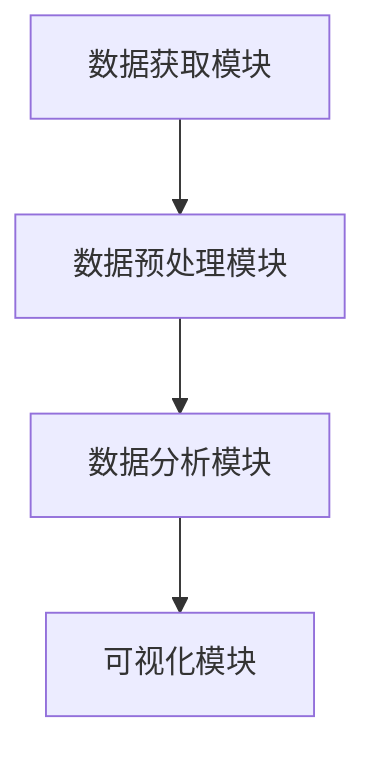

                 


# 金融市场微观结构分析

---

## 关键词：金融市场、微观结构、订单簿、交易机制、信息不对称、数学模型

---

## 摘要：  
金融市场微观结构分析是研究金融市场运作机制的重要领域，主要关注市场的参与者、交易规则、价格形成机制以及信息传递过程。本文从市场微观结构的基本概念出发，深入分析订单簿、交易机制、信息与异质性，结合数学模型和系统架构，探讨金融市场微观结构的核心原理和实际应用。通过对 Kyle 模型和 Akerlof 模型的分析，结合高频交易系统的实战案例，本文为读者提供了一个全面理解金融市场微观结构的框架。

---

## 第1章: 金融市场微观结构概述

### 1.1 金融市场微观结构的定义  
金融市场微观结构（Microstructure of Financial Markets）研究市场的运作机制，包括参与者的行为、交易规则、价格形成过程以及市场效率。它关注市场的微观层面，如订单簿、交易行为和市场干预等。  

**核心概念：**  
- 市场参与者：包括投资者、交易员、做市商等。  
- 市场规则：如订单匹配规则、交易时间、市场干预等。  
- 市场效率：衡量市场信息传递和价格发现的效率。  

**与宏观结构的关系：**  
金融市场微观结构与宏观结构相互影响。微观结构决定了市场的流动性和稳定性，而宏观结构（如宏观经济政策）则会影响市场的参与者行为和价格波动。

---

### 1.2 金融市场微观结构的主要参与者  

#### 1.2.1 市场参与者类型  
- **投资者：** 追求收益最大化的个人或机构。  
- **交易员：** 负责执行交易指令的市场参与者。  
- **做市商：** 提供买卖报价，维护市场流动性的机构。  
- **高频交易者：** 利用算法进行高频交易的参与者。  

#### 1.2.2 市场参与者的角色与行为  
- 投资者：基于信息和价格波动进行买卖决策。  
- 做市商：通过买卖价差赚取利润，同时提供流动性。  
- 高频交易者：利用算法和高速网络进行快速交易，捕捉短期价格波动。  

#### 1.2.3 市场微观结构的异质性  
市场参与者的行为和目标存在异质性，这导致市场微观结构的复杂性。例如，做市商和高频交易者的交易策略不同，对市场的影响也不同。

---

### 1.3 市场微观结构的影响因素  

#### 1.3.1 交易机制  
交易机制决定了订单的匹配和成交规则，影响市场的流动性和价格形成。  

#### 1.3.2 市场规则  
市场规则包括交易时间、订单类型（如限价订单、市价订单）以及市场干预政策（如涨停板）。  

#### 1.3.3 市场深度与流动性  
市场深度（Market Depth）是指在特定价格水平上可执行的订单数量，流动性高的市场具有较强的成交能力。  

---

## 第2章: 市场微观结构中的订单簿分析  

### 2.1 订单簿的基本结构  

#### 2.1.1 买方订单与卖方订单  
- 买方订单：投资者愿意以特定价格购买资产的订单。  
- 卖方订单：投资者愿意以特定价格出售资产的订单。  

#### 2.1.2 市场深度与订单簿状态  
市场深度反映了市场参与者在特定价格水平上的订单数量，影响市场的流动性。  

#### 2.1.3 订单簿的动态变化  
订单簿实时更新，反映市场的买卖力量变化。  

---

### 2.2 订单类型与匹配机制  

#### 2.2.1 市场订单与限价订单  
- 市场订单：以当前最佳价格立即成交的订单。  
- 限价订单：以指定价格成交的订单，可能需要等待匹配。  

#### 2.2.2 成交订单与撤单机制  
- 成交订单：已经完成交易的订单。  
- 撤单机制：允许投资者撤销未成交的订单。  

#### 2.2.3 订单匹配的优先级规则  
订单匹配通常遵循价格优先、时间优先的原则，确保市场的公平性。  

---

### 2.3 市场微观结构中的价格发现  

#### 2.3.1 价格形成的机制  
价格形成由买方需求和卖方供给决定，订单簿中的订单匹配推动价格变化。  

#### 2.3.2 市场订单簿对价格的影响  
订单簿的买卖力量失衡会导致价格波动，例如，大量买方订单可能导致价格上涨。  

#### 2.3.3 市场微观结构中的信息传递  
订单簿中的订单信息反映了市场参与者的交易意图，信息传递影响价格发现。  

---

## 第3章: 交易机制与市场微观结构  

### 3.1 市场微观结构中的交易机制  

#### 3.1.1 市场驱动与订单驱动  
- 市场驱动：价格由市场供需关系决定，交易基于市场价格的波动。  
- 订单驱动：交易基于订单匹配，价格由订单匹配结果决定。  

#### 3.1.2 市场微观结构中的交易成本  
交易成本包括佣金、买卖价差、时间成本等，影响市场的参与度。  

#### 3.1.3 市场质量与交易效率  
市场质量包括流动性、深度、波动性等，交易效率取决于市场的成交速度和成本。  

---

### 3.2 市场微观结构中的交易行为  

#### 3.2.1 投机与套利行为  
- 投机：基于价格波动进行买卖，追求短期收益。  
- 套利：利用价格差异在不同市场或资产间进行无风险或低风险套利。  

#### 3.2.2 市场参与者的行为异质性  
不同参与者的行为目标和策略不同，导致市场微观结构的复杂性。  

#### 3.2.3 市场微观结构中的信息不对称  
信息不对称是指市场参与者之间掌握的信息不一致，影响交易的公平性。  

---

### 3.3 市场微观结构中的交易规则  

#### 3.3.1 交易时间与交易频率  
- 交易时间：市场的开放时间影响交易机会。  
- 交易频率：高频交易需要快速决策和执行。  

#### 3.3.2 交易价格的确定规则  
交易价格由订单匹配结果决定，通常遵循价格优先和时间优先的原则。  

#### 3.3.3 市场干预与交易限制  
市场干预（如暂停交易、价格限制）旨在稳定市场，交易限制（如大额交易报告）旨在防止市场操纵。  

---

## 第4章: 市场微观结构中的信息与异质性  

### 4.1 信息在市场微观结构中的作用  

#### 4.1.1 信息的不对称性  
信息不对称可能导致市场参与者之间的交易不公平，例如，知情者与非知情者之间的信息差异。  

#### 4.1.2 信息的传递与市场反应  
信息通过订单簿和市场价格传递，影响市场的买卖力量和价格波动。  

#### 4.1.3 信息对价格的影响  
信息直接影响市场的供需关系，进而影响价格的形成和波动。  

---

### 4.2 市场微观结构中的异质性分析  

#### 4.2.1 市场参与者的异质性  
不同参与者的目标和策略不同，导致市场行为的多样性。  

#### 4.2.2 市场订单的异质性  
订单类型和价格不同，影响市场的成交顺序和价格波动。  

#### 4.2.3 市场信息的异质性  
信息的来源和质量不同，影响市场的信息传递和价格发现。  

---

## 第5章: 市场微观结构的数学模型与系统架构  

### 5.1 Kyle 模型与 Akerlof 模型  

#### 5.1.1 Kyle 模型  
Kyle 模型（1985）研究了市场的信息传递和价格形成机制，假设存在一个知情者和一个噪声交易者。  

**数学公式：**  
$$ P = E + \beta \cdot I $$  
其中，$P$ 是价格，$E$ 是均衡价格，$I$ 是信息，$\beta$ 是信息的影响系数。  

#### 5.1.2 Akerlof 模型  
Akerlof 模型（1995）扩展了 Kyle 模型，考虑了多个信息层级和异质性。  

**数学公式：**  
$$ P = \sum_{i=1}^{n} \beta_i I_i $$  
其中，$I_i$ 是第 $i$ 个信息源的信息，$\beta_i$ 是信息的影响系数。  

---

### 5.2 系统架构设计  

#### 5.2.1 问题场景介绍  
假设我们开发一个高频交易系统，需要实时分析订单簿和市场微观结构。  

#### 5.2.2 系统功能设计  
- 数据获取模块：实时获取订单簿数据。  
- 数据预处理模块：清洗和转换数据。  
- 数据分析模块：分析订单簿、计算市场深度、识别异常交易行为。  
- 可视化模块：展示分析结果。  

#### 5.2.3 系统架构设计  
使用微服务架构，各模块通过 RESTful API 交互。  

**Mermaid 架构图：**  


---

### 5.3 项目实战：高频交易系统  

#### 5.3.1 环境安装  
- 安装 Python、Pandas、NumPy 等工具。  

#### 5.3.2 核心代码实现  
```python
import pandas as pd

# 获取订单簿数据
def get_order_book(ticker):
    # 模拟数据获取
    order_book = {
        'buy': {100: 5, 99: 10},
        'sell': {101: 3, 102: 8}
    }
    return order_book

# 计算市场深度
def calculate_market_depth(order_book):
    buy_depth = sum(order_book['buy'].values())
    sell_depth = sum(order_book['sell'].values())
    return buy_depth, sell_depth

# 主函数
def main():
    ticker = 'AAPL'
    ob = get_order_book(ticker)
    buy_depth, sell_depth = calculate_market_depth(ob)
    print(f"Buy depth: {buy_depth}, Sell depth: {sell_depth}")

if __name__ == '__main__':
    main()
```

---

## 总结：  

金融市场微观结构分析是一个复杂而有趣的研究领域，涉及订单簿、交易机制、信息传递等核心内容。通过 Kyle 模型和 Akerlof 模型的数学分析，结合高频交易系统的实战案例，本文为读者提供了一个全面理解金融市场微观结构的框架。  

进一步学习可以深入研究高频交易算法、市场微观结构的异质性以及复杂系统的建模与仿真。  

--- 

**Tips：**  
- 如果想深入了解金融市场微观结构，推荐阅读《Market Microstructure for Practitioners》。  
- 开始学习金融市场微观结构，可以先从理解订单簿和交易机制入手。  
- 使用 Python 和相关工具（如 Pandas、NumPy）进行数据分析和模拟。  

--- 

**注意事项：**  
- 市场微观结构分析需要结合实际市场数据和交易规则，理论与实践结合。  
- 高频交易需要考虑算法的效率和系统的稳定性，避免过度优化导致风险。  
- 信息不对称是市场微观结构的核心问题，需结合博弈论进行深入分析。  

--- 

**拓展阅读：**  
- Kyle, A. S. (1985). Continuous auctions and insider trading.  
- Akerlof, G. A., & Shiller, R. J. (1995). Rational animals and markets.  

--- 

**感谢您的阅读，希望本文对您理解金融市场微观结构有所帮助！**

