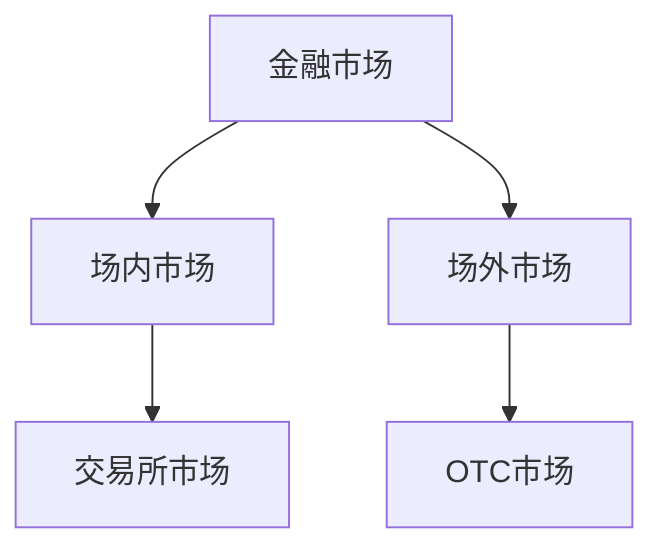
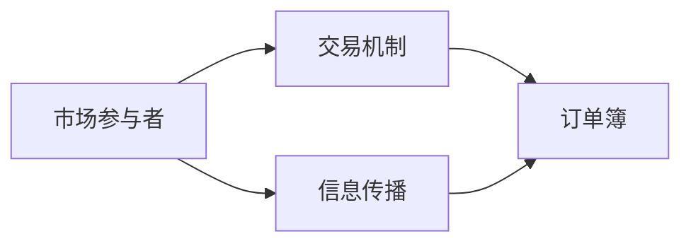
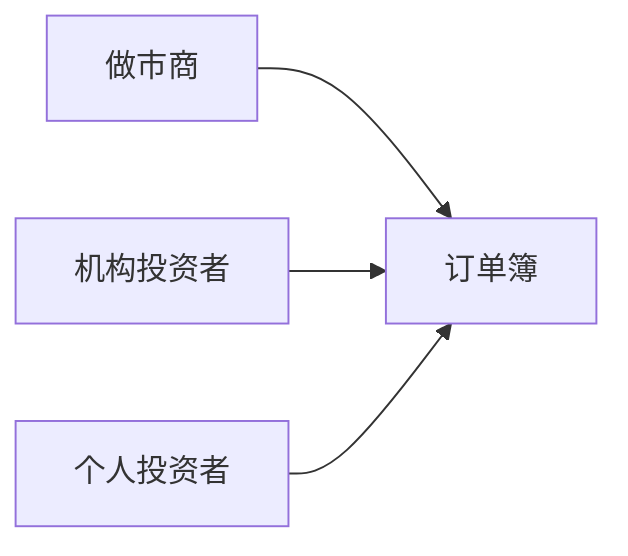
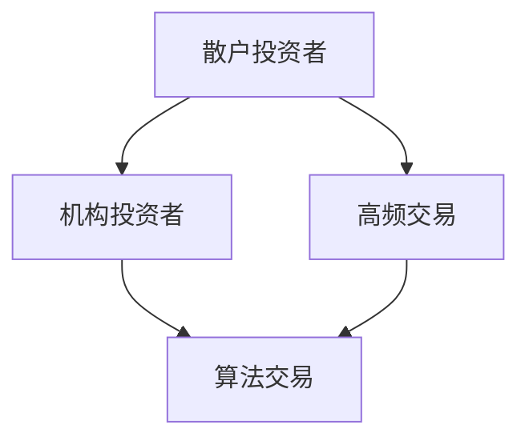
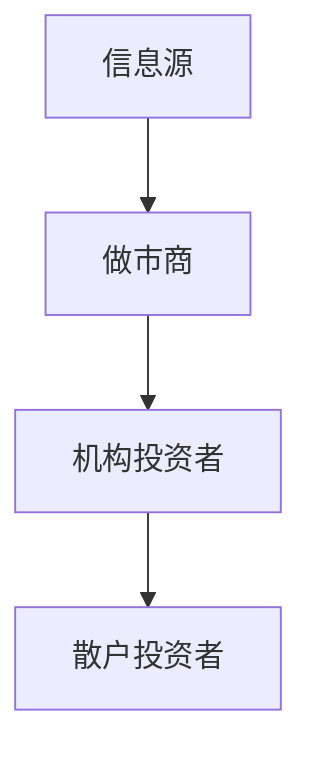
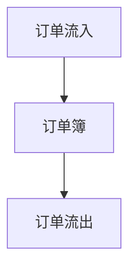
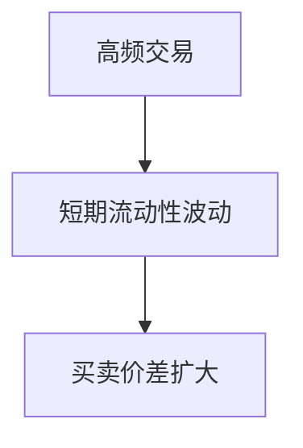
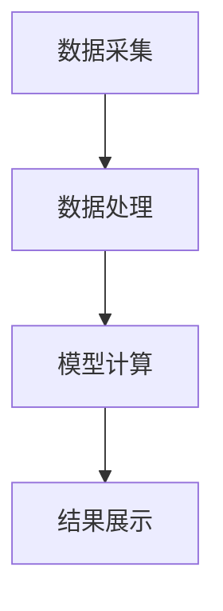
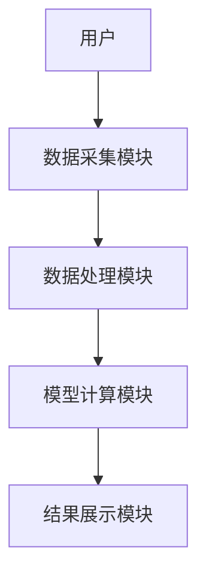

                 


---

# 金融市场微观结构变化对流动性影响分析

## 关键词：金融市场，微观结构，流动性，市场参与者，交易机制，价格波动

## 摘要：  
金融市场微观结构的变化对市场流动性有着深远的影响。本文通过分析市场参与者行为、交易机制和信息传播方式的变化，探讨这些变化如何影响市场的流动性。通过理论模型和实证分析，本文揭示了流动性与市场微观结构之间的复杂关系，并提出了优化市场结构以提升流动性的策略。

---

# 第1章: 金融市场微观结构与流动性概述

## 1.1 金融市场微观结构的基本概念

### 1.1.1 金融市场的定义与分类  
金融市场是指资金供需双方通过交易金融资产进行交换的场所。根据市场的组织形式和交易机制，金融市场可以分为场内市场和场外市场；根据交易标的，可以分为股票市场、债券市场和外汇市场等。

**图表：金融市场分类的树状图**  


### 1.1.2 微观结构的定义与特征  
微观结构是指金融市场的内在运作机制，包括市场参与者、交易规则和信息传播方式等。其特征包括：  
1. **多层次性**：市场参与者包括机构投资者、个人投资者、做市商等。  
2. **动态性**：市场结构会随着参与者行为和监管政策的变化而调整。  
3. **复杂性**：不同市场参与者的行为相互影响，形成复杂的网络关系。  

**图表：金融市场微观结构的概念结构图**  


### 1.1.3 流动性的定义与度量方法  
流动性是指资产能够迅速以合理价格转化为现金的能力。常用的流动性指标包括：  
- **订单簿深度**：衡量市场在给定价格下的订单量。  
- **买卖价差**：买卖报价之间的差异，反映交易成本。  
- **成交量与价差比率（VWAP）**：衡量交易执行效率。  

**公式：**  
$$ \text{买卖价差} = \text{最佳买入价} - \text{最佳卖出价} $$  

## 1.2 金融市场微观结构的核心要素  

### 1.2.1 市场参与者分析  
市场参与者包括：  
1. **做市商**：提供流动性，撮合交易。  
2. **机构投资者**：通过算法交易影响市场价格。  
3. **个人投资者**：散户投资者，提供小额流动性。  

**图表：市场参与者的实体关系图**  


### 1.2.2 市场交易机制与规则  
交易机制包括：  
1. **订单驱动市场**：基于订单匹配进行交易。  
2. **拍卖市场**：定期或不定期进行价格发现。  
3. **做市商制度**：由做市商提供连续的买卖报价。  

**图表：不同市场结构的对比表格**  

| 市场结构       | 特点                          | 优点                     | 缺点                     |
|----------------|-------------------------------|--------------------------|--------------------------|
| 订单驱动市场     | 实时订单匹配，价格动态调整   | 高效，透明               | 易受市场深度影响         |
| 拍卖市场         | 定期拍卖，价格发现           | 公平，降低操纵风险       | 低效，流动性不足         |
| 做市商制度       | 做市商提供连续报价           | 稳定性高，流动性好       | 做市商利润依赖于买卖价差 |

### 1.2.3 市场信息与价格形成机制  
市场信息包括：  
1. **订单簿信息**：当前订单状态，反映市场深度。  
2. **成交信息**：交易记录，反映市场活跃度。  
3. **市场情绪**：投资者情绪影响价格波动。  

**公式：**  
$$ \text{订单簿深度} = \sum (\text{订单数量} \times \text{价格}) $$  

## 1.3 本章小结  
本章介绍了金融市场微观结构的核心概念，包括市场参与者、交易机制和信息传播方式，并分析了这些要素如何共同作用于市场的流动性。通过对比不同市场结构的特点，读者可以更好地理解流动性在金融市场中的重要性。

---

# 第2章: 微观结构变化对流动性的影响关系

## 2.1 市场微观结构变化的类型  

### 2.1.1 市场参与者结构变化  
随着机构投资者的增加，高频交易和算法交易逐渐成为主流，这改变了市场的流动性结构。  

**图表：市场参与者结构变化的流程图**  


### 2.1.2 市场交易机制的演变  
从传统的订单驱动市场到引入做市商制度，交易机制的变化直接影响市场的流动性。  

**公式：**  
$$ \text{做市商利润} = \sum (\text{买卖价差}) $$  

### 2.1.3 市场信息传播方式的改变  
信息技术的发展使得信息传播速度加快，但同时也可能导致信息过载，影响市场流动性。  

**图表：信息传播路径的流程图**  


## 2.2 微观结构变化对流动性的影响路径  

### 2.2.1 市场深度与流动性的关系  
市场深度增加可以降低买卖价差，提高流动性。  

**公式：**  
$$ \text{流动性} = \frac{\text{订单簿深度}}{\text{买卖价差}} $$  

### 2.2.2 市场广度与流动性的关系  
市场广度扩大可以吸引更多的参与者，进一步提升流动性。  

### 2.2.3 市场微观结构对价格波动的影响  
微观结构变化会影响价格波动，从而间接影响流动性。  

**公式：**  
$$ \text{价格波动} = \sum (\text{订单流}) \times \text{市场深度} $$  

## 2.3 本章小结  
本章分析了市场微观结构变化的类型及其对流动性的影响路径，强调了市场参与者结构、交易机制和信息传播方式对流动性的重要影响。

---

# 第3章: 影响流动性的主要因素分析

## 3.1 市场深度对流动性的影响  

### 3.1.1 市场深度的定义与测量  
市场深度是指在某一价格水平上可成交的数量。  

**公式：**  
$$ \text{市场深度} = \sum (\text{订单数量} \times \text{价格}) $$  

### 3.1.2 市场深度与订单簿分析  
订单簿深度的变化直接影响市场的流动性。  

**图表：订单簿深度变化的流程图**  


### 3.1.3 市场深度变化对流动性的影响  
市场深度增加可以降低买卖价差，提高流动性。  

## 3.2 市场参与者行为对流动性的影响  

### 3.2.1 投资者行为分析  
投资者行为包括理性行为和非理性行为，影响市场的流动性。  

### 3.2.2 市场参与者策略对流动性的冲击  
高频交易和算法交易可能导致短期流动性波动。  

**图表：高频交易对流动性的冲击流程图**  


### 3.2.3 不同参与者对流动性影响的差异  
机构投资者通常提供长期流动性，而散户投资者提供短期流动性。  

## 3.3 市场微观结构设计对流动性的影响  

### 3.3.1 市场规则的设计原则  
市场规则应尽量减少信息不对称，提高市场效率。  

### 3.3.2 市场规则变化对流动性的影响  
引入新的交易机制可能会改变市场的流动性结构。  

### 3.3.3 市场结构优化对流动性的作用  
优化市场结构可以提高市场的流动性和稳定性。  

**公式：**  
$$ \text{流动性稳定性} = \frac{\text{市场深度}}{\text{价格波动}} $$  

## 3.4 本章小结  
本章分析了影响流动性的主要因素，包括市场深度、市场参与者行为和市场微观结构设计，并探讨了这些因素如何共同作用于市场流动性。

---

# 第4章: 流动性影响的理论模型与数学分析

## 4.1 流动性影响的理论模型  

### 4.1.1 Stoll模型  
Stoll模型通过分析订单流和市场深度，预测流动性。  

**公式：**  
$$ \text{流动性冲击} = \frac{\text{订单流}}{\text{市场深度}} $$  

### 4.1.2 Glosten-Milgrom模型  
Glosten-Milgrom模型通过分析买卖价差和订单流，预测流动性。  

**公式：**  
$$ \text{流动性} = \frac{\text{订单流}}{\text{买卖价差}} $$  

## 4.2 算法原理与数学分析  

### 4.2.1 流动性冲击的计算  
流动性冲击是指市场订单流对市场价格的影响。  

**公式：**  
$$ \text{流动性冲击} = \sum (\text{订单流}) \times \text{价格敏感性} $$  

### 4.2.2 流动性与价格波动的关系  
流动性增加可以降低价格波动。  

**公式：**  
$$ \text{价格波动} = \frac{\text{流动性冲击}}{\text{市场深度}} $$  

## 4.3 本章小结  
本章介绍了Stoll模型和Glosten-Milgrom模型，并通过数学公式分析了流动性冲击的计算方法，以及流动性与价格波动的关系。

---

# 第5章: 市场流动性变化的实证分析

## 5.1 数据收集与整理  

### 5.1.1 数据来源  
数据来源包括交易所的订单簿数据和成交数据。  

### 5.1.2 数据清洗  
清洗数据中的异常值和缺失值。  

### 5.1.3 数据预处理  
对数据进行标准化和归一化处理。  

## 5.2 实证分析与结果解读  

### 5.2.1 流动性变化的分析  
通过分析买卖价差和订单簿深度的变化，评估流动性。  

### 5.2.2 不同市场结构下的流动性表现  
对比订单驱动市场和做市商制度下的流动性表现。  

### 5.2.3 实证结果与理论模型的对比  
验证理论模型的准确性。  

## 5.3 本章小结  
本章通过实证分析，验证了理论模型的有效性，并揭示了市场结构变化对流动性的影响。

---

# 第6章: 风险管理与优化策略

## 6.1 风险管理框架  

### 6.1.1 流动性风险的定义与度量  
流动性风险是指资产无法迅速以合理价格变现的风险。  

### 6.1.2 风险监测指标  
常用的流动性风险监测指标包括：  
- **流动比率**：流动资产与流动负债的比率。  
- **速动比率**：流动资产减去存货与流动负债的比率。  

### 6.1.3 风险应对措施  
包括增加市场深度、优化市场结构和加强监管。  

## 6.2 市场微观结构优化策略  

### 6.2.1 市场参与者结构优化  
引入更多机构投资者，提高市场深度。  

### 6.2.2 交易机制优化  
优化订单匹配算法，降低买卖价差。  

### 6.2.3 信息传播优化  
提高信息透明度，减少信息不对称。  

## 6.3 本章小结  
本章提出了流动性风险管理框架，并探讨了市场微观结构优化策略，以提高市场的流动性和稳定性。

---

# 第7章: 系统分析与架构设计

## 7.1 问题场景介绍  

### 7.1.1 问题背景  
金融市场微观结构变化对流动性的影响是一个复杂的系统问题。  

### 7.1.2 项目介绍  
本项目旨在分析市场结构变化对流动性的影响，并提出优化策略。  

## 7.2 系统功能设计  

### 7.2.1 领域模型  
**图表：领域模型的类图**  


### 7.2.2 系统架构设计  
**图表：系统架构的流程图**  


## 7.3 系统接口设计  

### 7.3.1 数据接口  
数据接口用于采集市场数据和交易数据。  

### 7.3.2 模型接口  
模型接口用于调用流动性分析模型。  

### 7.3.3 展示接口  
展示接口用于结果显示和可视化。  

## 7.4 系统交互设计  

### 7.4.1 交互流程  
1. 数据采集模块采集市场数据。  
2. 数据处理模块清洗和预处理数据。  
3. 模型计算模块调用流动性分析模型。  
4. 结果展示模块显示分析结果。  

**图表：系统交互流程的序列图**  


## 7.5 本章小结  
本章通过系统分析与架构设计，提出了一个完整的流动性分析系统框架，为后续的实现提供了基础。

---

# 第8章: 项目实战

## 8.1 环境安装  

### 8.1.1 安装Python  
```bash
pip install python
```

### 8.1.2 安装数据分析库  
```bash
pip install pandas numpy
```

## 8.2 核心实现  

### 8.2.1 数据处理代码  
```python
import pandas as pd
import numpy as np

# 读取数据
data = pd.read_csv('market_data.csv')

# 数据清洗
data.dropna()
data = data.drop_duplicates()

# 数据预处理
data = (data - data.mean()) / data.std()
```

### 8.2.2 模型实现代码  
```python
def calculate_liquidity_shock(order_flow, market_depth):
    return order_flow / market_depth

# 计算流动性冲击
order_flow = data['order_flow']
market_depth = data['market_depth']
liq_shock = calculate_liquidity_shock(order_flow, market_depth)
```

## 8.3 实际案例分析  

### 8.3.1 案例背景  
分析某股票市场的流动性变化。  

### 8.3.2 数据分析与结果展示  
绘制买卖价差和订单簿深度的对比图。  

### 8.3.3 结果解读  
解释模型计算结果，提出优化建议。  

## 8.4 本章小结  
本章通过项目实战，展示了如何利用Python和数据分析库实现流动性分析，并提出了具体的优化策略。

---

# 第9章: 总结与展望

## 9.1 总结  

### 9.1.1 核心观点回顾  
市场微观结构变化对流动性有深远影响。  

### 9.1.2 研究结论  
优化市场结构可以提高流动性。  

## 9.2 展望  

### 9.2.1 未来研究方向  
进一步研究高频交易对流动性的影响。  

### 9.2.2 应用前景  
流动性分析在金融监管和投资决策中具有重要应用价值。  

## 9.3 最佳实践 tips  

### 9.3.1 数据收集注意事项  
确保数据的准确性和完整性。  

### 9.3.2 模型优化建议  
结合实际情况，优化模型参数。  

### 9.3.3 风险管理建议  
制定有效的流动性风险管理策略。  

## 9.4 本章小结  
本章总结了全文的主要观点，并展望了未来的研究方向，同时给出了最佳实践建议。

---

# 结语

金融市场微观结构变化对流动性的影响是一个复杂而重要的问题。通过本文的分析，读者可以更好地理解市场结构变化对流动性的影响，并能够应用这些知识解决实际问题。未来的研究可以进一步深入，探索更多市场结构变化对流动性的影响机制。

--- 

**注：由于篇幅限制，上述内容为部分章节内容，完整文章需要按照上述大纲逐章详细撰写。**

