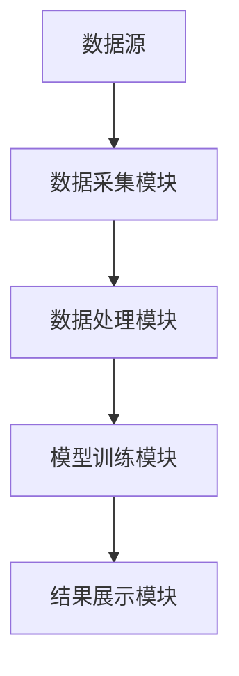
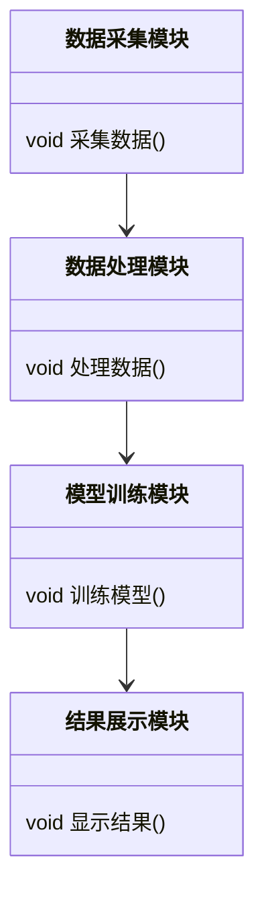

                 


# 金融市场微观结构变化预测模型

> **关键词**：金融市场、微观结构、预测模型、大数据、机器学习

> **摘要**：金融市场微观结构的变化对市场行为和价格波动有着重要影响。本文通过分析金融市场微观结构的核心概念、数据特征、预测模型的算法原理，以及系统架构设计，详细探讨如何构建有效的预测模型。文章结合实际案例，介绍模型的应用和优化方法，并总结了模型在金融领域的最佳实践和未来发展方向。

---

# 第一章: 金融市场微观结构概述

## 1.1 金融市场的基本概念

### 1.1.1 金融市场的定义与分类

金融市场的定义，主要分类（股票市场、债券市场、外汇市场等），以及各市场的特点。

### 1.1.2 微观结构的定义与特点

微观结构的定义，包括订单簿、市场深度、交易参与者等核心要素。

### 1.1.3 微观结构与宏观市场的关系

微观结构如何影响宏观市场的波动，两者之间的相互作用。

## 1.2 微观结构变化的定义与表现

### 1.2.1 微观结构变化的定义

市场深度、订单簿变化、交易量波动等微观层面的变化。

### 1.2.2 微观结构变化的表现形式

包括订单簿变化、交易量突变、价格冲击等。

### 1.2.3 微观结构变化对市场的影响

对市场流动性和价格波动的影响。

## 1.3 预测模型的必要性与挑战

### 1.3.1 预测模型的必要性

帮助交易员和投资者提前识别市场风险，优化投资策略。

### 1.3.2 预测模型的挑战

数据噪声多、非线性关系复杂、市场参与者行为的不确定性。

### 1.3.3 预测模型的发展现状

现有模型的优缺点，以及当前研究的热点。

## 1.4 本章小结

---

# 第二章: 金融市场微观结构变化的数据特征

## 2.1 数据特征的提取与分析

### 2.1.1 时间序列数据的特征

包括趋势、周期性、随机性等。

### 2.1.2 市场深度与订单簿数据

订单簿数据的结构化处理，买卖价差、订单量等指标。

### 2.1.3 成交量与价格变化的关系

成交量变化对价格波动的预测作用。

## 2.2 数据预处理与特征工程

### 2.2.1 数据清洗与标准化

处理缺失值、异常值，标准化数据。

### 2.2.2 特征选择与降维

使用PCA等方法进行特征降维，提高模型效率。

### 2.2.3 时间序列数据的滑动窗口处理

构造滑动窗口特征，如过去n分钟的平均成交量。

## 2.3 数据特征与模型输入的关系

### 2.3.1 特征与预测目标的关联性分析

通过相关性分析确定哪些特征对预测目标影响较大。

### 2.3.2 特征的重要性排序

使用特征重要性评分方法，如随机森林特征重要性。

### 2.3.3 数据特征对模型性能的影响

不同特征组合对模型准确率的影响。

## 2.4 本章小结

---

# 第三章: 常见预测模型与算法原理

## 3.1 时间序列预测模型

### 3.1.1 ARIMA模型

#### ARIMA模型的原理

使用差分方程和移动平均过程建模，适用于线性时间序列数据。

#### ARIMA模型的参数估计

通过极大似然估计法确定模型参数。

#### ARIMA模型的应用案例

股票价格预测案例，代码示例。

### 3.1.2 LSTM模型

#### LSTM模型的原理

长短期记忆网络的结构，解决传统RNN的梯度消失问题。

#### LSTM模型的结构与训练过程

包括输入层、LSTM层、全连接层和输出层。

#### LSTM模型在时间序列预测中的优势

捕捉长期依赖关系，适用于非线性时间序列数据。

### 3.1.3 其他时间序列预测模型

包括Prophet模型和GARCH模型，及其适用场景。

## 3.2 机器学习模型

### 3.2.1 随机森林模型

#### 随机森林模型的原理

基于决策树的集成学习方法，适用于多特征数据。

#### 随机森林模型的特征重要性分析

帮助理解哪些特征对预测目标影响较大。

### 3.2.2 支持向量机模型

#### 支持向量机模型的原理

通过构建超平面将数据分成不同类别，适用于分类和回归问题。

### 3.2.3 XGBoost模型

#### XGBoost模型的原理

梯度提升树模型，优化传统Boosting算法的计算效率。

## 3.3 深度学习模型

### 3.3.1 卷积神经网络（CNN）

#### CNN在时间序列数据中的应用

使用一维卷积层提取局部特征，适用于高频交易数据。

### 3.3.2 Transformer模型

#### Transformer模型的原理

基于自注意力机制，适用于捕捉全局依赖关系。

## 3.4 模型选择与比较

### 3.4.1 不同模型的优缺点对比

包括计算效率、模型复杂度、预测精度等方面的比较。

### 3.4.2 模型选择的策略

根据数据特征和预测目标选择合适的模型。

## 3.5 本章小结

---

# 第四章: 金融市场微观结构变化预测模型的系统架构

## 4.1 系统功能模块划分

### 4.1.1 数据采集模块

从金融数据源获取实时数据，包括股票、期货等市场数据。

### 4.1.2 数据处理模块

清洗、转换和特征提取，为后续模型训练提供干净的数据。

### 4.1.3 模型训练模块

选择合适的模型，进行参数调优和训练。

### 4.1.4 结果展示模块

将预测结果可视化，便于用户理解和分析。

## 4.2 系统架构设计

### 4.2.1 数据流图

从数据源到结果展示的整个数据流设计。

### 4.2.2 系统架构图

使用mermaid绘制系统的模块架构图。

## 4.3 系统接口设计

### 4.3.1 数据接口

与数据源对接的接口设计，如API接口。

### 4.3.2 模型接口

模型的输入输出接口设计，便于与其他系统集成。

## 4.4 系统交互设计

### 4.4.1 用户与系统的交互流程

用户输入数据，系统处理并返回预测结果。

### 4.4.2 系统内部的交互流程

数据处理模块与模型训练模块的交互。

## 4.5 本章小结

---

# 第五章: 项目实战——股票价格预测

## 5.1 环境安装与配置

### 5.1.1 安装Python环境

包括安装Python、Jupyter Notebook等工具。

### 5.1.2 安装必要的库

如pandas、numpy、scikit-learn、keras等。

## 5.2 数据采集与预处理

### 5.2.1 数据采集

从Yahoo Finance获取股票数据。

### 5.2.2 数据清洗

处理缺失值和异常值。

### 5.2.3 特征提取

构造技术指标，如MA、MACD等。

## 5.3 模型训练与优化

### 5.3.1 选择模型

基于实验结果选择最优模型。

### 5.3.2 参数调优

使用网格搜索或随机搜索优化模型参数。

## 5.4 模型预测与结果分析

### 5.4.1 预测结果可视化

绘制实际价格与预测价格的对比图。

### 5.4.2 模型性能评估

计算均方误差（MSE）、平均绝对误差（MAE）等指标。

## 5.5 本章小结

---

# 第六章: 最佳实践与总结

## 6.1 最佳实践

### 6.1.1 数据预处理的重要性

强调数据清洗和特征工程对模型性能的影响。

### 6.1.2 模型选择与调优的策略

如何根据数据特点选择模型，以及如何进行有效的参数调优。

### 6.1.3 系统架构的可扩展性

设计模块化架构，便于后续功能扩展。

## 6.2 模型的局限性与改进方向

### 6.2.1 当前模型的局限性

如无法捕捉某些复杂市场行为，模型的泛化能力有限。

### 6.2.2 未来改进方向

结合多模态数据，引入强化学习等技术。

## 6.3 小结

总结全文，强调金融市场微观结构变化预测模型的重要性和应用前景。

---

# 第七章: 扩展阅读与参考资料

## 7.1 相关书籍

推荐几本经典的金融数据分析和机器学习书籍。

## 7.2 学术论文

介绍几篇关于金融市场预测的经典论文。

## 7.3 在线资源

推荐一些有用的在线资源和工具，如QuantInstinet、TradingView等。

---

# 参考文献

（此处列出全文引用的文献资料）

---

# 附录: 代码示例

## 附录A: 时间序列预测模型代码

### A.1 ARIMA模型代码

```python
from statsmodels.tsa.arima_model import ARIMA
import pandas as pd
import numpy as np

# 假设我们有一个时间序列数据集df，其中包含'price'列
# 创建ARIMA模型
model = ARIMA(df['price'], order=(5, 1, 0))
model_fit = model.fit()

# 预测未来的价格
future_forecast = model_fit.forecast(steps=10)
print(future_forecast)
```

### A.2 LSTM模型代码

```python
import keras
from keras.models import Sequential
from keras.layers import LSTM, Dense

# 假设我们有一个时间序列数据集X_train和y_train
model = Sequential()
model.add(LSTM(50, input_shape=(timesteps, features)))
model.add(Dense(1))
model.compile(loss='mean_squared_error', optimizer='adam')
model.fit(X_train, y_train, epochs=100, batch_size=32)
```

## 附录B: 机器学习模型代码

### B.1 随机森林模型代码

```python
from sklearn.ensemble import RandomForestRegressor

# 假设我们有一个特征矩阵X和目标向量y
model = RandomForestRegressor(n_estimators=100, random_state=42)
model.fit(X, y)

# 预测结果
y_pred = model.predict(X_test)
```

### B.2 XGBoost模型代码

```python
import xgboost as xgb

# 假设我们有一个DMatrix数据集
dtrain = xgb.DMatrix(X_train, label=y_train)
params = {'n_estimators': 100, 'learning_rate': 0.1, 'max_depth': 6}
model = xgb.train(params, dtrain)

# 预测结果
dtest = xgb.DMatrix(X_test)
y_pred = model.predict(dtest)
```

## 附录C: 系统架构设计图

### C.1 数据流图



### C.2 系统架构图



---

# 结语

金融市场微观结构变化预测模型是一个复杂而重要的领域，本文通过系统的分析和实践，为读者提供了一个全面的视角。希望读者能通过本文，掌握如何构建和优化这样的模型，并在实际应用中取得良好的效果。

