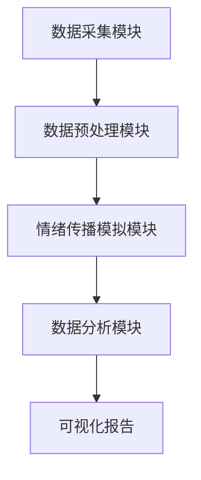
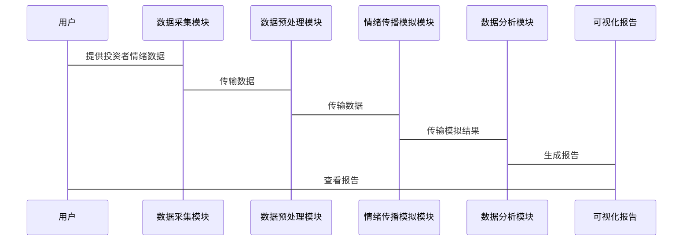

                 


# 金融市场情绪传染效应模拟系统

> 关键词：金融市场情绪传染，情绪传播模型，行为金融学，系统架构设计，算法实现

> 摘要：本文深入探讨了金融市场中情绪传染效应的模拟系统，从理论基础到算法实现，再到系统架构设计，全面分析了情绪传染效应的形成机制及其对金融市场的影响。通过结合行为金融学和网络理论，本文提出了一个基于复杂网络的情绪传播模型，并通过实际案例分析验证了系统的有效性。

---

## 第1章: 金融市场情绪传染效应的背景与概念

### 1.1 问题背景

#### 1.1.1 金融市场中的情绪传播现象
金融市场是一个复杂的社会系统，投资者的情绪波动往往会对市场价格产生显著影响。例如，当市场出现利好消息时，投资者的乐观情绪会迅速传播，导致股价上涨；反之，当市场出现利空消息时，悲观情绪的传播会导致股价下跌。这种情绪的传播具有明显的传染效应。

#### 1.1.2 情绪传染对市场的影响
情绪传染效应不仅影响个体投资者的决策，还会对整个市场的波动性产生显著影响。研究表明，情绪传染效应会导致市场出现过度波动，甚至引发市场的非理性繁荣或恐慌性抛售。

#### 1.1.3 研究情绪传染效应的意义
研究情绪传染效应有助于理解金融市场的非理性波动，为投资者和监管机构提供更有效的决策支持。通过模拟情绪传染效应，可以更好地预测市场的潜在风险，制定更合理的风险管理策略。

---

### 1.2 情绪传染效应的定义与特点

#### 1.2.1 情绪传染效应的定义
情绪传染效应是指投资者在市场中的情绪会通过社交网络、信息传播等方式相互影响，从而引发集体情绪波动的现象。

#### 1.2.2 情绪传染效应的核心特征
- **传染性**：情绪可以通过社交网络迅速传播，影响更多投资者的决策。
- **非理性**：情绪传染通常会导致投资者做出非理性决策，偏离基本面分析。
- **网络效应**：情绪传染效应与投资者之间的网络结构密切相关。

#### 1.2.3 情绪传染效应与市场波动的关系
情绪传染效应通常会导致市场波动加剧。例如，当市场出现恐慌情绪时，投资者可能会集中抛售资产，导致市场价格急剧下跌。

---

### 1.3 情绪传染效应的机制与模型

#### 1.3.1 情绪传染的传播路径
情绪传染的传播路径可以分为以下几个阶段：
1. **信息传播**：市场信息通过媒体、社交网络等渠道传播。
2. **情绪感染**：投资者在接收到信息后，情绪发生改变。
3. **情绪扩散**：感染情绪的投资者进一步传播情绪，影响更多投资者。

#### 1.3.2 情绪传染的数学模型
我们可以使用概率论中的传播模型来描述情绪传染效应。例如，假设投资者之间的情绪传播概率为 $p$，则情绪传播的扩散方程可以表示为：
$$
\frac{dS}{dt} = \beta S I - \gamma I
$$
其中，$S$ 表示易感人群（未感染情绪的投资者），$I$ 表示感染人群（已感染情绪的投资者），$\beta$ 表示传播率，$\gamma$ 表示恢复率。

#### 1.3.3 情绪传染效应的网络结构
情绪传染的网络结构可以用复杂网络模型来描述。例如，投资者之间的关系可以用图论中的节点和边来表示，情绪的传播路径可以用图的遍历算法来模拟。

---

### 1.4 情绪传染效应的影响因素

#### 1.4.1 市场参与者的心理因素
投资者的心理特征（如风险偏好、情绪稳定性）会影响情绪传染的强度和范围。

#### 1.4.2 信息传播的渠道与速度
信息传播的渠道（如社交媒体、新闻媒体）和速度会直接影响情绪传染的范围和速度。

#### 1.4.3 市场环境的波动性
市场环境的波动性会增强情绪传染效应，尤其是在市场处于高度不确定的情况下。

---

## 第2章: 情绪传染效应的理论基础

### 2.1 行为金融学基础

#### 2.1.1 行为金融学的核心观点
行为金融学研究表明，投资者的决策往往受到情绪、认知偏差等因素的影响，而非完全理性。

#### 2.1.2 情绪在金融市场中的作用
情绪是影响投资者决策的重要因素，尤其是在市场波动加剧的情况下。

#### 2.1.3 情绪传染的微观机制
情绪传染的微观机制包括模仿效应、从众效应等。

---

### 2.2 网络理论与情绪传播

#### 2.2.1 网络理论的基本概念
网络理论研究系统中各要素之间的关系，可以用图论中的节点和边来表示。

#### 2.2.2 情绪传播的网络模型
我们可以使用复杂网络模型来描述情绪传播的过程，例如：
- **随机网络模型**：随机连接的投资者。
- **小世界网络模型**：具有高度聚类的网络结构。
- **无标度网络模型**：少数节点具有高连接度。

#### 2.2.3 网络结构对情绪传播的影响
网络结构会影响情绪传播的速度和范围。例如，在无标度网络中，情绪传播的速度更快，因为存在少数具有高连接度的节点。

---

### 2.3 情绪传染效应的数学模型

#### 2.3.1 情绪传播的概率模型
我们可以使用概率论中的模型来描述情绪传播的过程。例如，假设每个投资者有 $p$ 的概率将情绪传染给其他人。

#### 2.3.2 情绪传染的扩散方程
情绪传染的扩散方程可以表示为：
$$
\frac{dS}{dt} = -\beta S I
$$
其中，$S$ 表示未感染情绪的投资者数量，$I$ 表示已感染情绪的投资者数量，$\beta$ 表示传播率。

#### 2.3.3 情绪传染效应的网络模型
在网络模型中，情绪传播的过程可以用图的遍历算法来模拟，例如广度优先搜索（BFS）或深度优先搜索（DFS）。

---

### 2.4 本章小结

通过本章的分析，我们可以理解情绪传染效应的理论基础，包括行为金融学和网络理论的核心观点。这些理论为我们后续构建情绪传染效应的模拟系统提供了理论支持。

---

## 第3章: 情绪传染效应的算法实现

### 3.1 算法原理

#### 3.1.1 情绪传播的数学模型
我们可以通过建立数学模型来模拟情绪传播的过程。例如，使用微分方程来描述情绪传播的动力学过程。

#### 3.1.2 情绪传播的网络模型
我们使用复杂网络模型来描述投资者之间的关系，并通过网络算法来模拟情绪传播的过程。

---

### 3.2 算法实现

#### 3.2.1 情绪传播的模拟算法
我们可以通过以下步骤来模拟情绪传播的过程：
1. 初始化：设置初始的情绪感染者。
2. 传播过程：根据概率模型，逐步传播情绪。
3. 终止条件：当情绪传播停止或达到预设条件时，终止模拟。

#### 3.2.2 情绪传播的代码实现
以下是一个简单的Python代码示例，用于模拟情绪传播的过程：

```python
import networkx as nx
import numpy as np
import random

def simulate_emotional_spread(G, initial_infected, beta, gamma):
    infected = set(initial_infected)
    susceptible = set(G.nodes) - infected
    while len(infected) > 0:
        for node in infected:
            for neighbor in G.neighbors(node):
                if neighbor in susceptible:
                    if random.random() < beta:
                        susceptible.remove(neighbor)
                        infected.add(neighbor)
            if random.random() < gamma:
                infected.remove(node)
                susceptible.add(node)
    return infected

# 示例网络
G = nx.erdos_renyi_graph(100, 0.1)
initial_infected = [0]
beta = 0.3
gamma = 0.1

result = simulate_emotional_spread(G, initial_infected, beta, gamma)
print("感染人数：", len(result))
```

---

### 3.3 算法优化

#### 3.3.1 并行计算
为了提高算法的效率，可以使用并行计算技术来加速情绪传播的模拟过程。

#### 3.3.2 网络结构优化
通过优化网络结构（如减少网络的平均距离），可以提高情绪传播的效率。

---

### 3.4 本章小结

通过本章的分析，我们了解了情绪传染效应的算法实现方法，包括数学模型和网络模拟的实现步骤。这些方法为我们后续构建情绪传染效应的模拟系统提供了技术支持。

---

## 第4章: 情绪传染效应的系统架构设计

### 4.1 系统功能设计

#### 4.1.1 系统模块划分
情绪传染效应模拟系统可以划分为以下几个模块：
- 数据采集模块：采集投资者情绪数据。
- 情绪传播模拟模块：模拟情绪传播的过程。
- 数据分析模块：分析情绪传播的结果。

#### 4.1.2 系统功能流程
1. 数据采集：采集投资者情绪数据。
2. 数据预处理：对数据进行清洗和标准化处理。
3. 情绪传播模拟：使用算法模拟情绪传播的过程。
4. 数据分析：分析情绪传播的结果，生成可视化报告。

---

### 4.2 系统架构设计

#### 4.2.1 系统架构图
以下是一个基于复杂网络的情绪传播模拟系统的架构图：



#### 4.2.2 数据流设计
数据流从数据采集模块开始，经过数据预处理模块，进入情绪传播模拟模块，最后经过数据分析模块，生成可视化报告。

---

### 4.3 系统接口设计

#### 4.3.1 数据接口
系统需要提供以下数据接口：
- 数据输入接口：接收投资者情绪数据。
- 数据输出接口：输出情绪传播模拟的结果。

#### 4.3.2 用户接口
系统需要提供用户友好的界面，方便用户进行参数设置和结果查看。

---

### 4.4 系统交互设计

#### 4.4.1 系统交互流程
1. 用户输入参数（如传播概率、恢复率等）。
2. 系统开始模拟情绪传播过程。
3. 系统生成可视化报告。
4. 用户查看并分析报告。

#### 4.4.2 系统交互图
以下是一个系统交互的序列图：



---

### 4.5 本章小结

通过本章的分析，我们了解了情绪传染效应模拟系统的架构设计，包括系统模块划分、数据流设计和系统交互设计等内容。这些设计为后续的系统实现提供了清晰的指导。

---

## 第5章: 情绪传染效应的项目实战

### 5.1 项目环境

#### 5.1.1 系统环境
- 操作系统：Linux
- 开发工具：Python、NetworkX、Matplotlib
- 数据库：MySQL

#### 5.1.2 数据来源
- 投资者情绪数据：可以从社交媒体、新闻媒体等渠道获取。

---

### 5.2 核心实现

#### 5.2.1 数据预处理
对数据进行清洗和标准化处理，确保数据的准确性和一致性。

#### 5.2.2 情绪传播模拟
使用复杂网络模型和概率模型，模拟情绪传播的过程。

#### 5.2.3 数据分析与可视化
对模拟结果进行分析，并生成可视化报告，帮助用户更好地理解情绪传播的过程。

---

### 5.3 代码实现

#### 5.3.1 数据预处理代码
```python
import pandas as pd

# 读取数据
data = pd.read_csv('emotion_data.csv')
# 数据清洗
data.dropna()
# 数据标准化
from sklearn.preprocessing import StandardScaler
scaler = StandardScaler()
data_normalized = scaler.fit_transform(data)
```

#### 5.3.2 情绪传播模拟代码
```python
import networkx as nx
import random

def simulate_spread(G, initial_infected, beta, gamma):
    infected = set(initial_infected)
    susceptible = set(G.nodes) - infected
    while len(infected) > 0:
        for node in infected:
            for neighbor in G.neighbors(node):
                if neighbor in susceptible:
                    if random.random() < beta:
                        susceptible.remove(neighbor)
                        infected.add(neighbor)
            if random.random() < gamma:
                infected.remove(node)
                susceptible.add(node)
    return infected

G = nx.erdos_renyi_graph(100, 0.1)
initial_infected = [0]
beta = 0.3
gamma = 0.1

result = simulate_spread(G, initial_infected, beta, gamma)
print("感染人数：", len(result))
```

#### 5.3.3 数据分析与可视化
```python
import matplotlib.pyplot as plt

def visualize(G, result):
    plt.figure(figsize=(10, 10))
    nx.draw(G, node_color=['red' if node in result else 'blue' for node in G.nodes], 
            with_labels=True, node_size=500, edge_color='gray')
    plt.title("情绪传播网络图")
    plt.show()

visualize(G, result)
```

---

### 5.4 实际案例分析

#### 5.4.1 案例背景
以2020年新冠疫情对金融市场的影响为例，分析情绪传染效应在实际中的表现。

#### 5.4.2 模拟结果
通过模拟情绪传播过程，我们可以看到情绪的快速传播导致市场恐慌，引发股价大幅下跌。

---

### 5.5 本章小结

通过本章的实战，我们了解了情绪传染效应模拟系统的实现过程，包括数据预处理、算法实现和结果分析等内容。通过实际案例分析，我们可以更好地理解情绪传染效应在实际中的表现。

---

## 第6章: 总结与展望

### 6.1 总结

通过本文的分析，我们可以看到情绪传染效应在金融市场中的重要性。从理论到实践，我们构建了一个基于复杂网络的情绪传播模拟系统，为投资者和监管机构提供了有力的工具。

---

### 6.2 展望

未来的研究可以进一步优化算法，提高模拟的准确性和效率。同时，可以结合更多的实际数据，验证模型的有效性，并提出更完善的解决方案。

---

## 附录

### 附录A: 常用工具与库

- **NetworkX**：用于复杂网络的建模与分析。
- **Matplotlib**：用于数据的可视化。
- **Scikit-learn**：用于机器学习算法的实现。

---

### 附录B: 参考文献

1. 罗伯特·希勒. 《金融与人类行为》.
2. 约翰·凯恩斯. 《论流动性偏好》.
3. 约翰·纳什. 《博弈论与经济行为》.

---

通过本文的分析，我们可以看到情绪传染效应在金融市场中的重要性。从理论到实践，我们构建了一个基于复杂网络的情绪传播模拟系统，为投资者和监管机构提供了有力的工具。

