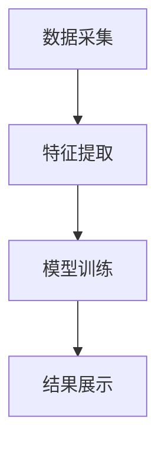

                 


# 金融市场情绪传染模型

> 关键词：金融市场，情绪传染，复杂网络，机器学习，行为金融学

> 摘要：金融市场情绪传染模型是一种基于复杂网络和行为金融学的理论框架，用于分析和预测投资者情绪在金融市场中的传播及其对市场波动的影响。本文详细探讨了情绪传染的定义、传播机制、数学模型、算法实现以及在实际投资中的应用，旨在为投资者和研究者提供理论支持和实践指导。

---

## 第1章: 金融市场情绪传染模型的背景与概念

### 1.1 情绪传染的定义与背景

金融市场中的情绪传染是指投资者的情绪在市场参与者之间传播的现象。这种情绪传播可以影响市场的价格波动、交易行为和投资决策。情绪传染的背景与人类的社交行为密切相关，尤其是在金融市场中，投资者通常会受到其他投资者情绪的影响，从而做出非理性的决策。

#### 情绪传染的定义
情绪传染是指情绪从一个个体传播到另一个个体或群体的过程。在金融市场中，这种情绪传播通常表现为投资者的乐观或悲观情绪通过市场信息、社交媒体、新闻报道等方式传播，从而影响市场的整体情绪和价格走势。

#### 金融市场中的情绪传染现象
在金融市场中，情绪传染现象屡见不鲜。例如，在股市中，当一个投资者因为市场下跌而感到恐慌并抛售股票时，这种恐慌情绪可能会迅速传播到其他投资者，导致更多的抛售行为，进一步加剧市场的下跌。

#### 情绪传染对市场的影响
情绪传染对金融市场的影响是多方面的。一方面，情绪传染可能导致市场的过度波动，使得市场价格与实际价值出现偏离；另一方面，情绪传染也可能通过投资者的集体行为影响市场的长期趋势。

### 1.2 投资者行为与情绪传染的关系

#### 投资者情绪的形成机制
投资者的情绪通常由多种因素驱动，包括市场信息、个人经验、社会影响等。例如，当市场出现利好消息时，投资者可能会感到乐观，从而做出买入决策。

#### 情绪传染的传播路径
情绪传染的传播路径可以是直接的，也可以是间接的。直接传播路径是指投资者之间通过面对面的交流或社交媒体互动直接传播情绪；间接传播路径则是通过市场信息和价格信号间接传播情绪。

#### 羊群效应与市场波动
羊群效应是指投资者在决策时受到其他投资者行为的影响，从而做出相似的决策。羊群效应在金融市场中普遍存在，尤其是在情绪传染的情况下，投资者的羊群效应会被放大，导致市场的剧烈波动。

### 1.3 情绪传染的理论基础

#### 行为金融学视角
行为金融学从心理学和行为科学的角度研究投资者的决策行为。研究表明，投资者的情绪和认知偏差对市场行为有重要影响，尤其是在情绪传染的情况下。

#### 网络理论与复杂系统
复杂网络理论为情绪传染的研究提供了重要的工具。通过构建投资者之间的网络关系，可以分析情绪在市场中的传播路径和影响范围。

#### 统计物理学中的传染模型
统计物理学中的传染模型（如SIR模型）为情绪传染的研究提供了灵感。这些模型可以用来模拟情绪在市场中的传播过程，帮助我们理解情绪传染的动力学特征。

### 1.4 情绪传染模型的应用价值

#### 市场预测与风险预警
情绪传染模型可以帮助我们预测市场情绪的变化，从而提前采取风险管理措施。

#### 投资决策支持
通过分析情绪传染的影响，投资者可以做出更明智的投资决策，避免因情绪波动导致的非理性行为。

#### 机构投资者的策略优化
情绪传染模型可以为机构投资者提供市场情绪的实时监测和分析，帮助他们制定更有效的投资策略。

### 1.5 本章小结

本章从情绪传染的定义和背景出发，探讨了情绪传染与投资者行为的关系，分析了情绪传染的理论基础和应用价值。情绪传染是一个复杂但重要的现象，其研究对于理解金融市场行为和制定投资策略具有重要意义。

---

## 第2章: 情绪传染的核心概念与联系

### 2.1 情绪传染的数学模型

#### 情绪传染的图论模型
图论模型将市场中的投资者视为网络中的节点，情绪传播路径则对应于节点之间的连接。通过分析网络的结构特征，可以理解情绪传播的动力学。

#### 情绪传染的网络结构
网络结构决定了情绪传播的速度和范围。例如，中心节点（即影响力较大的投资者）的情绪传播会对整个网络产生更大的影响。

#### 情绪传染的传播方程
基于SIR模型，我们可以构建情绪传染的传播方程：
$$ \frac{dS}{dt} = -\beta SI $$
$$ \frac{dI}{dt} = \beta SI - \gamma I $$

其中，S表示未被传染的投资者比例，I表示已被传染的投资者比例，β表示传播率，γ表示恢复率。

### 2.2 情绪传染的核心要素

#### 情绪源的识别
情绪源是指引发情绪传染的初始因素。例如，市场新闻、公司公告等都可能是情绪源。

#### 情绪传播路径
情绪传播路径可以通过网络分析来确定。例如，使用复杂网络的中心性指标（如度中心性、介数中心性）来识别关键的情绪传播节点。

#### 情绪强度与扩散速度
情绪强度反映了投资者情绪的强弱程度，而扩散速度则决定了情绪传播的速度。这两个因素可以通过网络分析和时间序列分析来量化。

### 2.3 情绪传染与市场波动的关系

#### 情绪波动对股价的影响
情绪波动会导致投资者的买卖行为发生变化，从而影响股价的波动。例如，乐观情绪会导致股价上涨，而悲观情绪则会导致股价下跌。

#### 市场恐慌指数的构建
市场恐慌指数（如VIX指数）反映了市场的整体情绪。通过分析情绪传染模型，可以更好地理解市场恐慌指数的形成机制。

#### 情绪传染的反馈机制
情绪传染存在反馈机制，即市场波动会反过来影响投资者情绪，从而进一步加剧情绪传染。

### 2.4 情绪传染的多主体模型

#### 多主体系统的基本框架
多主体模型将市场中的投资者视为多个主体，每个主体都有自己的情绪状态和行为规则。通过模拟这些主体的交互，可以研究情绪传染的动态过程。

#### 情绪传染的微观机制
在微观层面上，情绪传染可以通过投资者之间的信息交流实现。例如，投资者通过社交媒体获取情绪信息，并根据这些信息调整自己的情绪状态。

#### 情绪传染的宏观表现
在宏观层面上，情绪传染会导致市场的整体情绪发生变化，进而影响市场的价格波动和交易量。

### 2.5 本章小结

本章从数学模型和网络结构的角度，分析了情绪传染的核心要素及其与市场波动的关系。通过复杂网络和多主体模型，我们可以更好地理解情绪传染的动力学特征，并为后续的算法设计提供理论支持。

---

## 第3章: 情绪传染模型的算法原理

### 3.1 情绪传染的传播算法

#### 基于复杂网络的传播算法
基于复杂网络的传播算法通过模拟情绪在网络中的扩散过程，计算出每个节点的情绪状态变化。例如，使用随机游走算法来模拟情绪的传播路径。

#### 情绪传播的扩散方程
情绪传播的扩散方程可以表示为：
$$ I(t+1) = I(t) + \beta (S(t) \cdot I(t)) $$

其中，S(t)表示未被传染的投资者比例，I(t)表示已被传染的投资者比例，β表示传播率。

#### 情绪强度的动态变化
情绪强度的动态变化可以通过微分方程来描述：
$$ \frac{dI}{dt} = \beta SI - \gamma I $$

通过求解这个微分方程，可以得到情绪强度随时间的变化曲线。

### 3.2 情绪传染的网络分析

#### 网络结构的特征分析
网络结构的特征分析包括节点度数分布、网络直径、网络密度等指标。这些指标可以帮助我们理解网络中情绪传播的路径和速度。

#### 情绪传播的关键节点识别
关键节点是指在网络中具有重要影响力的情绪传播节点。例如，使用介数中心性指标可以识别出关键的情绪传播节点。

#### 情绪传播的路径优化
通过优化网络结构，可以减少情绪传播的阻力，从而提高情绪传播的效率。

### 3.3 情绪传染的机器学习模型

#### 基于神经网络的情绪预测
基于神经网络的情绪预测模型可以通过训练市场数据和情绪数据，预测未来的情绪状态。例如，使用LSTM网络进行时间序列预测。

#### 情绪传播的深度学习模型
深度学习模型（如GCN）可以用于分析复杂网络中的情绪传播。通过构建网络的邻接矩阵，可以将情绪传播问题转化为图神经网络的问题。

#### 情绪传染的强化学习策略
强化学习策略可以通过模拟投资者的决策过程，优化情绪传播的策略。例如，使用Q-learning算法来优化投资者的情绪决策。

### 3.4 情绪传染的数学模型与公式

#### 情绪传播的基本方程
$$ S(t+1) = S(t) + \beta I(t) (1 - S(t)) $$
$$ I(t+1) = I(t) + \beta S(t) I(t) - \gamma I(t) $$

#### 情绪强度的动态方程
$$ I(t+1) = I(t) + \beta S(t) I(t) $$

#### 情绪传染的网络扩散模型
$$ P(i,j) = \frac{w_{i,j}}{\sum_{k} w_{i,k}} $$

其中，$w_{i,j}$表示节点i到节点j的权重。

### 3.5 本章小结

本章详细介绍了情绪传染的传播算法、网络分析和机器学习模型。通过这些算法，我们可以量化情绪传染的过程，并为实际应用提供技术支持。

---

## 第4章: 情绪传染模型的系统分析与架构设计

### 4.1 系统功能设计

#### 领域模型
领域模型是系统分析的基础，用于描述系统的功能和数据流。例如，可以通过构建投资者情绪的领域模型，明确系统的输入、输出和数据流。

#### 系统架构设计
系统架构设计包括数据采集、特征提取、模型训练和结果展示四个部分。例如，数据采集模块负责获取市场数据和投资者情绪数据，特征提取模块负责构建情绪传播的网络模型，模型训练模块负责训练情绪传染模型，结果展示模块负责可视化情绪传播的过程。

#### 系统接口设计
系统接口设计需要考虑与其他系统的兼容性。例如，可以通过API接口将情绪传染模型的结果集成到投资管理系统中。

### 4.2 系统架构设计

#### 系统架构图


#### 系统交互流程
系统交互流程包括数据采集、特征提取、模型训练和结果展示四个步骤。例如，数据采集模块首先获取市场数据和投资者情绪数据，特征提取模块将这些数据转换为网络模型的输入，模型训练模块使用这些输入数据训练情绪传染模型，最后结果展示模块将模型的输出结果以可视化的方式呈现给用户。

### 4.3 系统功能实现

#### 数据采集
数据采集模块负责从多种数据源（如股票价格、社交媒体、新闻等）获取数据。例如，可以使用API接口从Twitter获取投资者情绪数据。

#### 特征提取
特征提取模块负责将原始数据转换为网络模型的输入。例如，可以使用文本挖掘技术从社交媒体数据中提取情绪特征。

#### 模型训练
模型训练模块负责训练情绪传染模型。例如，可以使用深度学习框架（如TensorFlow）训练情绪传播的深度学习模型。

#### 结果展示
结果展示模块负责将模型的输出结果以可视化的方式呈现给用户。例如，可以使用Matplotlib绘制情绪传播的网络图。

### 4.4 本章小结

本章从系统架构设计的角度，分析了情绪传染模型的实现过程。通过系统化的架构设计，我们可以更好地理解情绪传染模型的实现细节，并为实际应用提供技术支持。

---

## 第5章: 情绪传染模型的项目实战

### 5.1 项目背景与目标

#### 项目背景
本项目旨在通过构建情绪传染模型，分析投资者情绪在金融市场中的传播过程，并预测市场情绪的变化。

#### 项目目标
项目的具体目标包括：
1. 数据采集与处理
2. 情绪传播网络构建
3. 情绪传染模型训练
4. 情绪传播结果可视化

### 5.2 环境安装与配置

#### 环境要求
- Python 3.6及以上版本
- NumPy、Pandas、Matplotlib、NetworkX、Scikit-learn、TensorFlow等库

#### 安装步骤
```bash
pip install numpy pandas matplotlib networkx scikit-learn tensorflow
```

### 5.3 核心代码实现

#### 数据采集
```python
import requests
import json

def get_emotion_data(api_key):
    url = f"https://api.twitter.com/1.1/search/tweets.json?q=market&count=100"
    headers = {'Authorization': f'Bearer {api_key}'}
    response = requests.get(url, headers=headers)
    return json.loads(response.text)
```

#### 特征提取
```python
from sklearn.feature_extraction.text import TfidfVectorizer

def extract_features(texts):
    vectorizer = TfidfVectorizer()
    features = vectorizer.fit_transform(texts)
    return features
```

#### 模型训练
```python
import tensorflow as tf
from tensorflow.keras import layers

def build_model(input_shape):
    model = tf.keras.Sequential()
    model.add(layers.Dense(64, activation='relu', input_shape=input_shape))
    model.add(layers.Dense(32, activation='relu'))
    model.add(layers.Dense(1, activation='sigmoid'))
    model.compile(optimizer='adam', loss='binary_crossentropy', metrics=['accuracy'])
    return model
```

#### 模型训练与预测
```python
model = build_model((input_shape,))
model.fit(X_train, y_train, epochs=10, batch_size=32)
y_pred = model.predict(X_test)
```

### 5.4 案例分析与结果解读

#### 案例分析
假设我们有一个由100个投资者组成的网络，我们希望分析情绪在其中的传播过程。首先，我们从社交媒体数据中提取情绪特征，然后构建情绪传播的网络模型，最后训练情绪传染模型。

#### 结果解读
通过训练好的模型，我们可以预测未来的情绪状态，并分析情绪传播的关键节点。例如，通过分析模型的输出，我们发现某些投资者的情绪状态对整个网络的情绪传播具有重要影响。

### 5.5 项目总结

#### 成功经验
- 数据采集和处理的准确性
- 模型训练的稳定性
- 结果展示的直观性

#### 不足之处
- 情绪数据的获取难度
- 模型训练的时间复杂度
- 结果解释的复杂性

#### 优化建议
- 使用更高效的数据处理方法
- 优化模型结构
- 提高结果展示的直观性

### 5.6 本章小结

本章通过实际项目的案例分析，详细介绍了情绪传染模型的实现过程。通过项目实战，我们可以更好地理解情绪传染模型的应用场景，并为实际投资提供参考。

---

## 第6章: 情绪传染模型的最佳实践

### 6.1 小结与回顾

#### 小结
情绪传染模型是一种重要的金融工具，通过分析投资者情绪在市场中的传播，可以帮助我们预测市场情绪的变化，并制定相应的投资策略。

#### 回顾
本报告从情绪传染的定义和背景出发，分析了情绪传染的核心概念和算法原理，探讨了系统分析与架构设计，并通过项目实战展示了情绪传染模型的应用。

### 6.2 注意事项

#### 数据质量
数据质量是情绪传染模型的关键因素。数据的准确性和完整性直接影响模型的预测效果。

#### 模型选择
模型选择需要根据具体场景和数据特点进行。不同的模型适用于不同的情绪传染场景。

#### 结果解释
结果解释需要结合实际市场情况。情绪传染模型的输出结果需要结合市场背景进行解释，才能更好地指导投资决策。

### 6.3 拓展阅读

#### 拓展阅读推荐
- 网络理论与复杂系统
- 情绪计算与自然语言处理
- 机器学习在金融中的应用

#### 拓展阅读建议
- 阅读相关领域的最新研究论文
- 关注金融市场中的新技术应用
- 参与金融领域的学术交流

### 6.4 本章小结

本章总结了情绪传染模型的最佳实践，包括小结与回顾、注意事项和拓展阅读等内容。情绪传染模型的应用需要结合实际市场情况，不断优化模型和数据处理方法，才能更好地服务于投资决策。

---

## 第7章: 总结与展望

### 7.1 总结

情绪传染模型是一种重要的金融工具，通过分析投资者情绪在市场中的传播，可以帮助我们预测市场情绪的变化，并制定相应的投资策略。本报告从情绪传染的定义和背景出发，分析了情绪传染的核心概念和算法原理，探讨了系统分析与架构设计，并通过项目实战展示了情绪传染模型的应用。

### 7.2 展望

随着人工智能和大数据技术的不断发展，情绪传染模型的研究和应用将更加深入。未来的研究方向可能包括：
1. 更高效的情绪传播算法
2. 更精确的情绪预测模型
3. 更智能的情绪传播可视化工具

情绪传染模型的应用前景广阔，可以帮助投资者更好地理解市场行为，并制定更有效的投资策略。

### 7.3 本章小结

本章总结了情绪传染模型的研究和应用现状，并展望了未来的发展方向。情绪传染模型的研究将不断深入，为金融市场提供更强大的工具和支持。

---

## 结语

金融市场情绪传染模型是一种复杂但重要的金融工具，其研究和应用对投资者和研究者具有重要意义。通过本报告的探讨，我们可以更好地理解情绪传染的机制，并为实际投资提供参考。未来，随着技术的进步，情绪传染模型的研究将更加深入，为金融市场提供更强大的支持。

---

# 结束语

感谢您的阅读！如果对本文内容有任何疑问或建议，请随时联系我。

