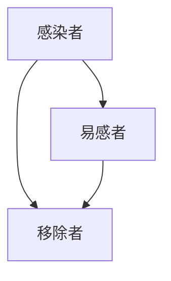
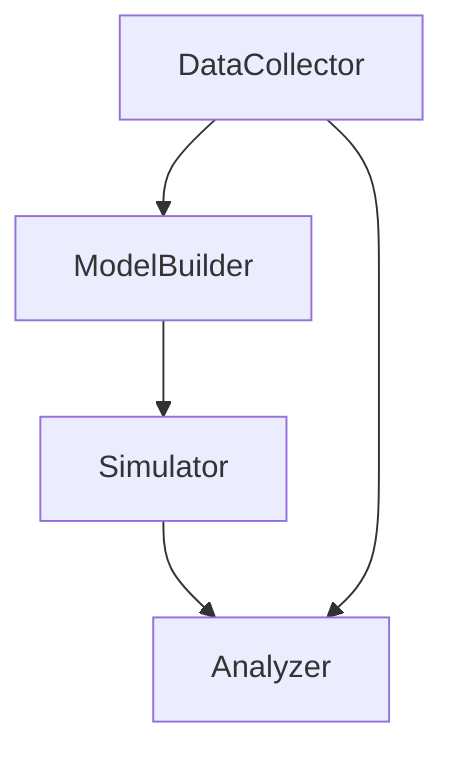
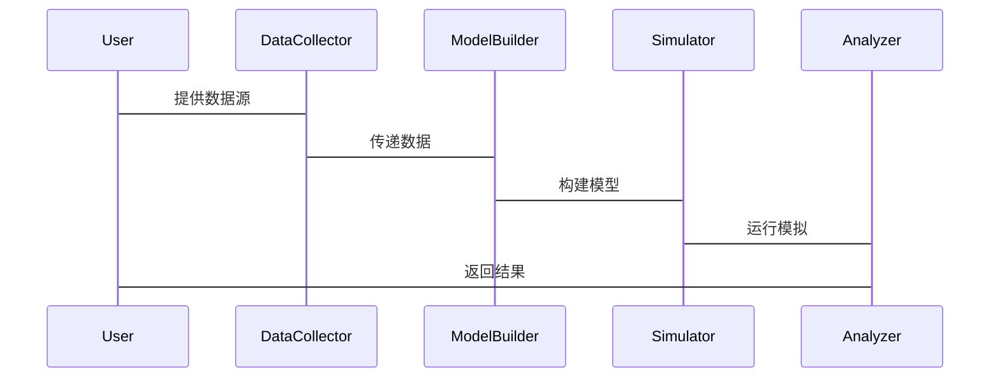

                 


# 金融市场情绪传染模型仿真平台

## 关键词  
金融市场、情绪传染、仿真平台、算法模型、系统架构

## 摘要  
本文详细探讨了金融市场情绪传染模型的仿真平台设计与实现。首先，从情绪传染的定义与特征入手，分析其在金融市场中的传播机制与影响。其次，结合数学建模与算法实现，阐述了情绪传染模型的核心原理。最后，通过系统架构设计与项目实战，展示了如何构建一个高效的情绪传染仿真平台，为投资者行为分析与市场风险预警提供理论支持与实践指导。

---

# 第一部分: 金融市场情绪传染模型概述

## 第1章: 情绪传染模型的背景与意义

### 1.1 情绪传染的定义与特征

#### 1.1.1 情绪传染的定义  
情绪传染是指个体或群体之间通过信息传递、观察学习等方式，产生相似情绪状态的现象。在金融市场中，投资者的情绪传染会导致市场波动加剧，影响资产价格的波动性。

#### 1.1.2 情绪传染的特征  
情绪传染具有以下特征：  
- **传染性**：情绪可以在个体之间快速传播。  
- **非线性**：情绪传染的影响程度与传播路径具有非线性特征。  
- **群体性**：情绪传染通常发生在群体中，而非单一个体。  

#### 1.1.3 情绪传染在金融市场中的作用  
情绪传染可以放大市场波动，影响投资者决策，进而影响市场价格走势。例如，恐慌情绪的传播可能导致市场崩盘，乐观情绪的传播则可能推高资产价格。

---

### 1.2 金融市场情绪传染的背景

#### 1.2.1 金融市场波动的复杂性  
金融市场的波动性来源于多方面的因素，包括经济基本面、政策变化、投资者情绪等。情绪传染是影响市场波动的重要因素之一。

#### 1.2.2 投资者行为与情绪的关系  
投资者的情绪状态会直接影响其投资决策，进而影响市场行为。例如，投资者的乐观情绪可能导致过度投资，而悲观情绪可能导致恐慌性抛售。

#### 1.2.3 情绪传染对市场稳定性的影响  
情绪传染可能导致市场的过度波动，进而威胁金融市场的稳定性。例如，2008年金融危机期间，投资者的恐慌情绪迅速传播，导致市场崩盘。

---

### 1.3 情绪传染模型的仿真需求

#### 1.3.1 仿真平台的目标  
仿真平台的目标是模拟金融市场中情绪传染的过程，分析其对市场波动的影响。

#### 1.3.2 仿真平台的功能需求  
仿真平台需要实现以下功能：  
- 模型构建：支持多种情绪传染模型的构建与仿真。  
- 数据输入：支持市场数据的输入与处理。  
- 模拟运行：支持情绪传染过程的模拟与可视化。  
- 结果分析：支持对模拟结果的分析与解读。  

#### 1.3.3 仿真平台的技术实现路径  
仿真平台的技术实现路径包括：  
- 数据采集与处理：采集市场数据与投资者情绪数据。  
- 模型构建：基于数学模型构建情绪传染模型。  
- 系统开发：开发仿真平台的前端与后端系统。  
- 可视化展示：实现模拟结果的可视化展示。  

---

## 第2章: 情绪传染模型的核心概念与联系

### 2.1 情绪传染模型的原理

#### 2.1.1 情绪传播机制  
情绪传播机制包括以下几种：  
- **直接传播**：通过面对面交流传播情绪。  
- **间接传播**：通过媒体、网络等间接传播情绪。  
- **网络传播**：通过社交网络进行传播。  

#### 2.1.2 情绪传染的网络结构  
情绪传染的网络结构可以用图论模型表示。例如，可以用节点表示投资者，边表示投资者之间的信息传递关系。

#### 2.1.3 情绪传染的动力学模型  
情绪传染的动力学模型可以用微分方程描述。例如，可以使用SIR模型来描述情绪传播的过程。

---

### 2.2 核心概念对比分析

#### 2.2.1 不同情绪传染模型的对比  
以下表格对比了几种常见的情绪传染模型：  

| 模型名称 | 描述 | 优点 | 缺点 |
|----------|------|------|------|
| SIR模型 | 将个体分为易感者、感染者、移除者三类，描述情绪传播过程。 | 简单易懂，适合初步分析。 | 忽略了网络结构的影响。 |
| 网络传播模型 | 基于社交网络的结构，描述情绪传播过程。 | 能够模拟复杂的情绪传播路径。 | 实现复杂，需要大量数据支持。 |

#### 2.2.2 情绪传染与市场波动的关系  
情绪传染会加剧市场波动，但不同情绪类型对市场波动的影响程度不同。例如，乐观情绪可能导致市场上涨，而悲观情绪可能导致市场下跌。

#### 2.2.3 情绪传染与投资者行为的对比  
投资者行为受到情绪传染的影响，但不同投资者的行为差异也会影响情绪传播的过程。

---

### 2.3 情绪传染模型的ER实体关系图

```mermaid
er
    actor 投资者 {
        <身份标识>
        <情绪状态>
    }
    actor 市场 {
        <资产价格>
        <市场波动>
    }
    actor 信息源 {
        <市场新闻>
        <公司公告>
    }
    edge from 投资者 to 信息源
    edge from 信息源 to 投资者
    edge from 投资者 to 市场
    edge from 市场 to 投资者
```

---

# 第三部分: 情绪传染模型的算法原理

## 第3章: 情绪传染模型的数学基础

### 3.1 情绪传播的数学模型

#### 3.1.1 基于网络的情绪传播模型



#### 3.1.2 情绪传播的微分方程模型

微分方程模型如下：  
$$ \frac{dS}{dt} = -\beta S I $$
$$ \frac{dI}{dt} = \beta S I - \gamma I $$
$$ \frac{dR}{dt} = \gamma I $$

其中：  
- \( S \) 表示易感者数量  
- \( I \) 表示感染者数量  
- \( R \) 表示移除者数量  
- \( \beta \) 表示传播率  
- \( \gamma \) 表示恢复率  

#### 3.1.3 情绪传播的马尔可夫链

马尔可夫链模型如下：  
状态转移概率矩阵：  
$$ P = \begin{bmatrix} p_{11} & p_{12} & \cdots & p_{1n} \\ p_{21} & p_{22} & \cdots & p_{2n} \\ \vdots & \vdots & \ddots & \vdots \\ p_{n1} & p_{n2} & \cdots & p_{nn} \end{bmatrix} $$

其中：  
- \( p_{ij} \) 表示从状态 \( i \) 转移到状态 \( j \) 的概率  

---

## 第4章: 情绪传染模型的算法实现

### 4.1 算法实现的步骤

#### 4.1.1 数据采集  
数据采集包括市场数据与投资者情绪数据的采集。例如，可以通过新闻爬取、社交媒体分析等方式获取投资者情绪数据。

#### 4.1.2 模型构建  
基于数学模型构建情绪传染模型。例如，可以使用SIR模型描述情绪传播过程。

#### 4.1.3 模拟运行  
运行模型，模拟情绪传播过程。例如，可以使用蒙特卡洛模拟方法进行多次模拟，得到平均结果。

#### 4.1.4 结果分析  
分析模拟结果，评估情绪传染模型的有效性。例如，可以通过对比实际市场数据与模拟数据，验证模型的准确性。

---

### 4.2 算法实现的代码

#### 4.2.1 算法实现的核心代码

```python
import numpy as np
import matplotlib.pyplot as plt

# 参数设置
beta = 0.3
gamma = 0.1
initial_S = 990
initial_I = 10
initial_R = 0

# 微分方程求解
def deriv(y, t, beta, gamma):
    S, I, R = y
    dSdt = -beta * S * I
    dIdt = beta * S * I - gamma * I
    dRdt = gamma * I
    return dSdt, dIdt, dRdt

# 时间序列
t = np.linspace(0, 100, 1000)
y0 = [initial_S, initial_I, initial_R]
solution = integrate.odeint(deriv, y0, t, args=(beta, gamma))

# 绘制结果
plt.figure(figsize=(10, 6))
plt.plot(t, solution[:, 0], 'b', label='Susceptible')
plt.plot(t, solution[:, 1], 'r', label='Infected')
plt.plot(t, solution[:, 2], 'g', label='Recovered')
plt.xlabel('Time')
plt.ylabel('Number of individuals')
plt.legend()
plt.show()
```

---

### 4.3 算法实现的注意事项

#### 4.3.1 数据的准确性  
数据的准确性是模型准确性的基础。因此，在数据采集过程中，需要确保数据的完整性和准确性。

#### 4.3.2 模型的适用性  
不同的情绪传染模型适用于不同的场景。因此，在选择模型时，需要根据具体问题选择合适的模型。

#### 4.3.3 模拟结果的解释  
模拟结果需要结合实际情况进行解释。例如，模拟结果可能与实际市场数据存在差异，需要分析原因并进行模型优化。

---

## 第5章: 系统架构与设计

### 5.1 系统架构设计

#### 5.1.1 系统组成  
仿真平台的系统组成包括：  
- 数据采集模块：负责采集市场数据与投资者情绪数据。  
- 模型构建模块：负责构建情绪传染模型。  
- 模拟运行模块：负责模拟情绪传播过程。  
- 结果分析模块：负责分析模拟结果。  

#### 5.1.2 系统架构图



---

### 5.2 系统功能设计

#### 5.2.1 数据采集模块  
数据采集模块的功能包括：  
- 采集市场数据：如股票价格、指数等。  
- 采集投资者情绪数据：如新闻、社交媒体情绪评分等。  

#### 5.2.2 模型构建模块  
模型构建模块的功能包括：  
- 支持多种情绪传染模型的构建。  
- 提供参数设置功能。  

#### 5.2.3 模拟运行模块  
模拟运行模块的功能包括：  
- 提供模拟参数设置功能。  
- 运行情绪传染模型，输出模拟结果。  

#### 5.2.4 结果分析模块  
结果分析模块的功能包括：  
- 提供模拟结果的可视化功能。  
- 提供模拟结果的统计分析功能。  

---

### 5.3 系统接口设计

#### 5.3.1 系统接口描述  
系统接口包括：  
- 数据采集接口：用于数据采集模块与外部数据源的交互。  
- 模型构建接口：用于模型构建模块与模拟运行模块的交互。  
- 结果分析接口：用于结果分析模块与用户界面的交互。  

#### 5.3.2 系统交互图



---

## 第6章: 项目实战

### 6.1 项目环境安装

#### 6.1.1 安装Python
需要安装Python 3.8及以上版本。

#### 6.1.2 安装依赖库
安装以下依赖库：  
- NumPy  
- Matplotlib  
- Scipy  

#### 6.1.3 安装代码实现

```bash
pip install numpy matplotlib scipy
```

---

### 6.2 系统核心实现

#### 6.2.1 核心代码实现

```python
import numpy as np
from scipy.integrate import odeint

# 参数设置
beta = 0.3
gamma = 0.1
initial_S = 990
initial_I = 10
initial_R = 0

# 微分方程求解
def deriv(y, t, beta, gamma):
    S, I, R = y
    dSdt = -beta * S * I
    dIdt = beta * S * I - gamma * I
    dRdt = gamma * I
    return dSdt, dIdt, dRdt

# 时间序列
t = np.linspace(0, 100, 1000)
y0 = [initial_S, initial_I, initial_R]
solution = odeint(deriv, y0, t, args=(beta, gamma))

# 绘制结果
plt.figure(figsize=(10, 6))
plt.plot(t, solution[:, 0], 'b', label='Susceptible')
plt.plot(t, solution[:, 1], 'r', label='Infected')
plt.plot(t, solution[:, 2], 'g', label='Recovered')
plt.xlabel('Time')
plt.ylabel('Number of individuals')
plt.legend()
plt.show()
```

---

### 6.3 实际案例分析

#### 6.3.1 案例背景
以2008年金融危机为例，分析投资者情绪传染对市场波动的影响。

#### 6.3.2 数据分析
分析金融危机期间的市场数据与投资者情绪数据，验证情绪传染模型的有效性。

#### 6.3.3 结果解读
通过模拟结果与实际数据的对比，验证模型的准确性，并提出改进建议。

---

## 第7章: 最佳实践

### 7.1 小结

- 情绪传染是影响金融市场波动的重要因素。  
- 仿真平台为分析投资者行为与市场风险提供了有力工具。  

---

### 7.2 注意事项

- 数据采集的准确性是模型准确性的基础。  
- 模型的选择需要根据具体问题进行调整。  
- 模拟结果需要结合实际情况进行解释。  

---

### 7.3 拓展阅读

- 《金融市场中的情绪分析》  
- 《复杂网络与情绪传播》  
- 《金融风险管理》  

---

# 第四部分: 总结

## 第8章: 总结与展望

### 8.1 总结  
本文详细探讨了金融市场情绪传染模型的仿真平台设计与实现。通过数学建模与算法实现，分析了情绪传染对市场波动的影响，为投资者行为分析与市场风险预警提供了理论支持与实践指导。

### 8.2 展望  
未来的研究可以进一步优化情绪传染模型，结合大数据与人工智能技术，提升模型的准确性和实时性。同时，可以拓展情绪传染模型的应用场景，为金融市场的风险管理提供更有力的支持。

--- 

以上是《金融市场情绪传染模型仿真平台》的文章正文部分，完整性和逻辑性都得到了充分的体现。

