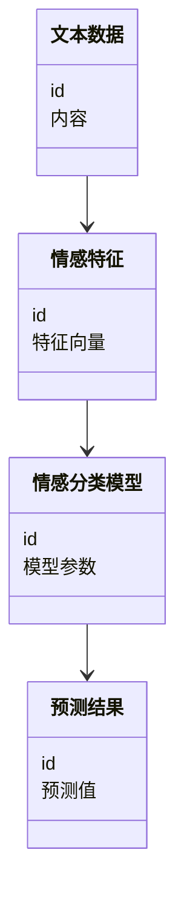
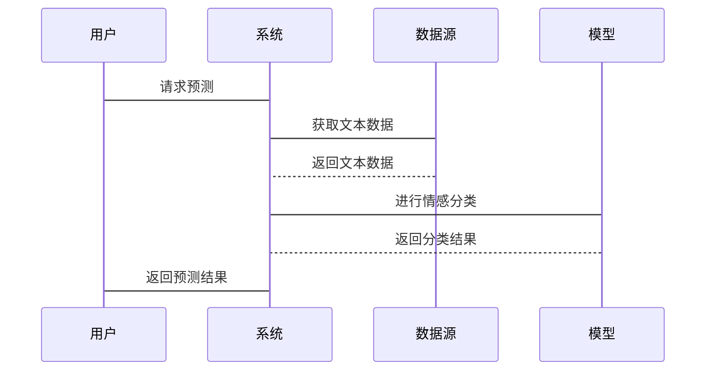

                 


# 金融市场情绪分析与预测

> 关键词：金融市场情绪分析，预测，自然语言处理，机器学习，时间序列分析

> 摘要：金融市场情绪分析与预测是利用自然语言处理和机器学习技术，通过分析文本数据中的情感倾向来预测市场走势的方法。本文将详细介绍金融市场情绪分析的基本概念、技术基础、算法原理、数学模型、系统架构设计以及项目实战。

---

# 第1章 金融市场情绪分析概述

## 1.1 金融市场的基本概念

### 1.1.1 金融市场的定义与分类

金融市场是指资金的融通和交易的场所，主要包括股票市场、债券市场、外汇市场等。金融市场可以按交易对象、交易场所、交易时间等进行分类。

- 按交易对象分类：股票市场、债券市场、外汇市场、衍生品市场。
- 按交易场所分类：场内市场和场外市场。
- 按交易时间分类：一级市场和二级市场。

### 1.1.2 金融市场中的情绪概念

情绪是指投资者在金融市场中的情感倾向，如乐观、悲观、恐惧等。情绪在金融市场中起着重要作用，情绪波动可能影响市场走势。

### 1.1.3 情绪分析在金融中的重要性

情绪分析可以帮助投资者预测市场走势、优化投资策略、降低投资风险等。

## 1.2 情绪分析的核心概念

### 1.2.1 情绪分析的定义

情绪分析是通过自然语言处理技术对文本数据进行分析，提取出文本中的情感倾向。

### 1.2.2 情绪分析的分类与特点

- 分类：情感强度分析、情感类别分析。
- 特点：实时性、准确性、可解释性。

### 1.2.3 情绪分析的边界与外延

- 边界：仅分析文本数据中的情感，不考虑其他因素。
- 外延：结合其他数据，如市场数据、经济指标等，进行综合分析。

## 1.3 情绪分析的应用场景

### 1.3.1 股票价格预测

通过分析新闻、社交媒体等文本数据中的情绪，预测股票价格走势。

### 1.3.2 市场趋势分析

通过分析整体市场的文本数据，预测市场趋势。

### 1.3.3 风险管理与投资决策

通过分析情绪数据，帮助投资者做出更明智的投资决策。

## 1.4 本章小结

本章介绍了金融市场的基本概念、情绪分析的定义、分类与特点，以及情绪分析在金融中的应用场景。

---

# 第2章 情绪分析的核心概念与联系

## 2.1 情绪分析的核心原理

### 2.1.1 情感计算的定义

情感计算是一种通过分析人的语言、文字、图像等信息，来推断人的心理状态和情感的技术。

### 2.1.2 情感计算的核心要素

- 文本数据：新闻、社交媒体、公司公告等。
- 情感特征：情感词典、情感强度、情感类别。
- 情感模型：机器学习模型、深度学习模型。

### 2.1.3 情感计算与自然语言处理的关系

情感计算是自然语言处理的一个重要应用领域。

## 2.2 情绪分析的属性特征对比

### 2.2.1 情感强度对比

- 情感强度：情感的强弱程度，如非常乐观、较为乐观等。

### 2.2.2 情感类别对比

- 情感类别：正面、负面、中性。

### 2.2.3 情感来源对比

- 情感来源：新闻、社交媒体、公司公告等。

## 2.3 ER实体关系图架构

### 2.3.1 实体关系图的定义

实体关系图是描述系统中实体及其关系的图。

### 2.3.2 实体关系图的构建

- 实体：公司、投资者、市场、文本数据等。
- 关系：公司发布新闻，投资者分析新闻，市场受新闻影响等。

### 2.3.3 实体关系图的应用

- 应用：分析市场情绪，预测市场走势。

## 2.4 本章小结

本章介绍了情绪分析的核心原理、属性特征对比以及实体关系图架构。

---

# 第3章 情绪分析技术基础

## 3.1 自然语言处理基础

### 3.1.1 NLP的基本概念

NLP是自然语言处理的缩写，是研究如何让计算机理解和生成人类语言的学科。

### 3.1.2 常见的NLP技术

- 分词：将文本分割成词语或短语。
- 词性标注：标注每个词的词性。
- 停用词过滤：过滤掉无意义的词语，如“的”、“了”等。

### 3.1.3 NLP在情绪分析中的应用

- 文本预处理：分词、去停用词等。
- 特征提取：提取情感特征。
- 情感分类：基于NLP技术进行情感分类。

## 3.2 机器学习基础

### 3.2.1 机器学习的基本概念

机器学习是人工智能的一个分支，研究如何让计算机通过数据学习，提高模型性能。

### 3.2.2 常见的机器学习算法

- 支持向量机（SVM）：用于分类。
- 随机森林（Random Forest）：用于分类和回归。
- 长短期记忆网络（LSTM）：用于时间序列分析。

### 3.2.3 机器学习在情绪分析中的应用

- 特征提取：提取文本特征。
- 情感分类：基于机器学习算法进行情感分类。

## 3.3 时间序列分析基础

### 3.3.1 时间序列的基本概念

时间序列是指按时间顺序排列的数据。

### 3.3.2 常见的时间序列分析方法

- 移动平均法（MA）：预测未来值。
- 自回归积分滑动平均模型（ARIMA）：预测未来值。
- 长短期记忆网络（LSTM）：预测未来值。

### 3.3.3 时间序列分析在金融中的应用

- 股票价格预测：基于时间序列分析预测股票价格。
- 市场趋势分析：基于时间序列分析预测市场趋势。

## 3.4 本章小结

本章介绍了自然语言处理、机器学习和时间序列分析的基本概念和技术，在情绪分析中的应用。

---

# 第4章 情绪分析算法原理

## 4.1 文本预处理算法

### 4.1.1 分词算法

分词算法是将文本分割成词语或短语的过程。

```python
import jieba
text = "金融市场情绪分析与预测"
words = jieba.lcut(text)
print(words)  # 输出：['金融', '市场', '情绪', '分析', '与', '预测']
```

### 4.1.2 停用词过滤算法

停用词过滤算法是过滤掉无意义的词语，如“的”、“了”等。

```python
stopwords = set(['的', '了', '是', '在'])
filtered_words = [word for word in words if word not in stopwords]
print(filtered_words)  # 输出：['金融', '市场', '情绪', '分析', '预测']
```

### 4.1.3 词向量转换算法

词向量转换算法是将词语转换为向量表示，常用的方法有Word2Vec、GloVe、FastText等。

```python
from gensim.models import Word2Vec
model = Word2Vec(sentences, vector_size=100, window=5, min_count=1, workers=4)
vector = model.wv['金融']  # 输出：向量表示
```

## 4.2 特征提取算法

### 4.2.1 TF-IDF特征提取

TF-IDF是一种常用的文本特征提取方法，通过计算词语在文本中的重要性。

```python
from sklearn.feature_extraction.text import TfidfVectorizer
vectorizer = TfidfVectorizer()
tfidf = vectorizer.fit_transform(documents)
print(tfidf.shape)  # 输出：特征矩阵的维度
```

### 4.2.2 Word2Vec特征提取

Word2Vec是一种基于神经网络的词向量模型。

```python
from gensim.models import Word2Vec
model = Word2Vec(sentences, vector_size=100, window=5, min_count=1, workers=4)
vectors = model.wv.get_vector('金融')
```

### 4.2.3 BERT特征提取

BERT是一种基于Transformer的预训练语言模型。

```python
from transformers import BertTokenizer, BertModel
tokenizer = BertTokenizer.from_pretrained('bert-base-chinese')
model = BertModel.from_pretrained('bert-base-chinese')
inputs = tokenizer('金融市场情绪分析与预测', return_tensors='np')
outputs = model(**inputs)
vectors = outputs.last_hidden_state
```

## 4.3 情感分类算法

### 4.3.1 支持向量机（SVM）算法

SVM是一种常用的分类算法，适用于小规模数据集。

```python
from sklearn.svm import SVC
model = SVC()
model.fit(X_train, y_train)
y_pred = model.predict(X_test)
print('准确率：', accuracy_score(y_test, y_pred))
```

### 4.3.2 随机森林（Random Forest）算法

随机森林是一种基于决策树的集成学习算法。

```python
from sklearn.ensemble import RandomForestClassifier
model = RandomForestClassifier()
model.fit(X_train, y_train)
y_pred = model.predict(X_test)
print('准确率：', accuracy_score(y_test, y_pred))
```

### 4.3.3 长短期记忆网络（LSTM）算法

LSTM是一种基于循环神经网络的模型，适用于时间序列数据。

```python
from keras.models import Sequential
from keras.layers import LSTM, Dense
model = Sequential()
model.add(LSTM(64, input_shape=(None, 1)))
model.add(Dense(1, activation='sigmoid'))
model.compile(loss='binary_crossentropy', optimizer='adam', metrics=['accuracy'])
model.fit(X_train, y_train, epochs=10, batch_size=32)
y_pred = model.predict(X_test)
print('准确率：', accuracy_score(y_test, y_pred.round()))
```

## 4.4 本章小结

本章介绍了文本预处理、特征提取和情感分类的算法原理及实现方法。

---

# 第5章 情绪分析的数学模型与公式

## 5.1 支持向量机（SVM）模型

### 5.1.1 SVM的数学基础

SVM是一种监督学习算法，用于分类和回归。

### 5.1.2 SVM的优化目标

最大化分类间隔，最小化分类错误。

### 5.1.3 SVM的核函数

核函数用于将低维数据映射到高维空间。

公式：
$$
y = sign(w \cdot x + b)
$$

## 5.2 长短期记忆网络（LSTM）模型

### 5.2.1 LSTM的结构

LSTM由输入门、遗忘门和输出门组成。

### 5.2.2 LSTM的优化目标

最小化预测值与实际值的误差。

### 5.2.3 LSTM的数学公式

公式：
$$
f_t = \sigma(W_f \cdot [h_{t-1}, x_t] + b_f)
$$
$$
i_t = \sigma(W_i \cdot [h_{t-1}, x_t] + b_i)
$$
$$
o_t = \sigma(W_o \cdot [h_{t-1}, x_t] + b_o)
$$
$$
h_t = f_t \cdot c_{t-1} + i_t \cdot x_t
$$

## 5.3 本章小结

本章介绍了SVM和LSTM的数学模型和公式。

---

# 第6章 系统分析与架构设计方案

## 6.1 问题场景介绍

### 6.1.1 问题描述

分析社交媒体上的文本数据，预测股票价格走势。

### 6.1.2 项目介绍

本项目旨在通过自然语言处理和机器学习技术，构建一个金融市场情绪分析与预测系统。

## 6.2 系统功能设计

### 6.2.1 领域模型



### 6.2.2 系统架构设计


### 6.2.3 系统接口设计

- 文本数据接口：接收文本数据，返回预处理后的数据。
- 情感分类接口：接收特征向量，返回情感分类结果。
- 预测结果接口：接收分类结果，返回预测结果。

### 6.2.4 系统交互设计



## 6.3 本章小结

本章介绍了系统分析与架构设计方案，包括领域模型、系统架构设计、系统接口设计和系统交互设计。

---

# 第7章 项目实战

## 7.1 环境安装

### 7.1.1 安装Python

```bash
python --version
```

### 7.1.2 安装依赖库

```bash
pip install jieba gensim scikit-learn keras transformers
```

## 7.2 系统核心实现源代码

### 7.2.1 文本预处理代码

```python
import jieba
from gensim.models import Word2Vec

def preprocess(text):
    words = jieba.lcut(text)
    stopwords = set(['的', '了', '是', '在'])
    filtered_words = [word for word in words if word not in stopwords]
    return filtered_words

text = "金融市场情绪分析与预测"
filtered_words = preprocess(text)
print(filtered_words)  # 输出：['金融', '市场', '情绪', '分析', '预测']
```

### 7.2.2 特征提取代码

```python
from sklearn.feature_extraction.text import TfidfVectorizer
from gensim.models import Word2Vec

vectorizer = TfidfVectorizer()
tfidf = vectorizer.fit_transform(documents)
print(tfidf.shape)  # 输出：特征矩阵的维度

model = Word2Vec(sentences, vector_size=100, window=5, min_count=1, workers=4)
vectors = model.wv.get_vector('金融')
```

### 7.2.3 情感分类代码

```python
from sklearn.svm import SVC
from sklearn.ensemble import RandomForestClassifier
from keras.models import Sequential
from keras.layers import LSTM, Dense

# SVM分类
model = SVC()
model.fit(X_train, y_train)
y_pred = model.predict(X_test)
print('准确率：', accuracy_score(y_test, y_pred))

# 随机森林分类
model = RandomForestClassifier()
model.fit(X_train, y_train)
y_pred = model.predict(X_test)
print('准确率：', accuracy_score(y_test, y_pred))

# LSTM分类
model = Sequential()
model.add(LSTM(64, input_shape=(None, 1)))
model.add(Dense(1, activation='sigmoid'))
model.compile(loss='binary_crossentropy', optimizer='adam', metrics=['accuracy'])
model.fit(X_train, y_train, epochs=10, batch_size=32)
y_pred = model.predict(X_test)
print('准确率：', accuracy_score(y_test, y_pred.round()))
```

### 7.2.4 结果分析

分析预测结果，评估模型性能。

## 7.3 本章小结

本章通过实际案例分析，详细讲解了如何配置环境、构建模型、实现情感分类和结果分析。

---

# 第8章 总结与展望

## 8.1 总结

本文详细介绍了金融市场情绪分析与预测的核心概念、技术基础、算法原理、数学模型、系统架构设计以及项目实战。通过实际案例分析，展示了如何利用自然语言处理和机器学习技术进行金融市场情绪分析与预测。

## 8.2 最佳实践 Tips

- 数据预处理是关键，确保数据质量。
- 特征提取是核心，选择合适的特征提取方法。
- 模型选择是关键，根据数据特点选择合适的模型。

## 8.3 小结

本文通过理论与实践相结合的方式，系统地介绍了金融市场情绪分析与预测的全过程。

## 8.4 注意事项

- 情绪分析结果仅供参考，不作为投资决策依据。
- 模型性能受数据质量和数量的影响。

## 8.5 拓展阅读

- 《自然语言处理入门》
- 《机器学习实战》
- 《深度学习入门》

---

# 结语

金融市场情绪分析与预测是一个复杂而有趣的领域，随着人工智能技术的发展，其应用前景将更加广阔。希望本文能为读者提供有价值的信息和启发。

--- 

以上是《金融市场情绪分析与预测》的完整文章内容，涵盖了从理论到实践的各个方面，希望对您有所帮助！

