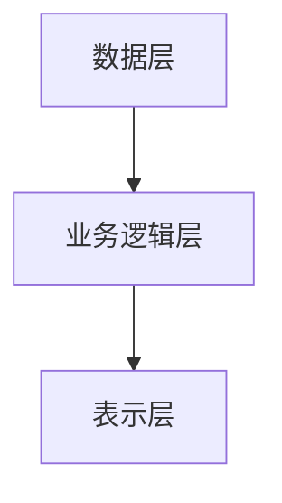

                 


# 《金融市场情绪指标开发》

## 关键词：金融市场，情绪指标，机器学习，算法开发，系统架构，投资决策

## 摘要：  
金融市场情绪指标是一种通过分析市场参与者的心理和行为，预测市场走势的重要工具。本文将从情绪指标的基本概念、理论基础、算法实现、系统架构到实际应用，全面系统地探讨如何开发和应用情绪指标。文章首先介绍情绪指标的背景和分类，然后深入分析其数学模型和核心算法，接着通过具体的项目实战展示情绪指标的开发过程，最后探讨其在投资决策中的应用和优化。通过本文的学习，读者将能够掌握情绪指标开发的核心方法和技术，为金融市场分析和投资决策提供有力支持。

---

# 第1章: 金融市场情绪指标概述

## 1.1 情绪指标的定义与背景

### 1.1.1 什么是金融市场情绪指标
金融市场情绪指标（Market Sentiment Indicators）是通过量化市场参与者的心理和行为，反映市场情绪状态的工具。它能够帮助投资者预测市场走势、评估市场风险，并在投资决策中提供参考依据。

### 1.1.2 情绪指标在金融市场的应用背景
金融市场情绪指标的开发背景可以追溯到行为金融学的研究。传统金融学假设投资者是理性的，但实际情况中，投资者的心理和行为往往受到情绪的影响，从而导致市场的非理性波动。情绪指标通过捕捉这些情绪变化，为投资者提供了额外的决策依据。

### 1.1.3 情绪指标的核心作用与意义
情绪指标的核心作用在于帮助投资者识别市场情绪的变化趋势，从而提前做出投资决策。它可以帮助投资者在市场恐慌时寻找买入机会，在市场狂热时及时规避风险。

### 1.1.4 情绪指标的分类
情绪指标可以分为以下几类：
1. **市场参与者情绪指标**：通过分析交易者的买卖行为（如成交量、持仓量等）来反映市场情绪。
2. **媒体情绪指标**：通过分析新闻、社交媒体等信息来源，量化市场情绪。
3. **技术指标**：通过分析价格和成交量等技术数据，间接反映市场情绪。
4. **综合情绪指标**：结合多种数据源和分析方法，综合评估市场情绪。

## 1.2 情绪指标的核心概念与理论基础

### 1.2.1 投资者心理与市场行为
投资者的心理和行为对市场情绪有着重要影响。例如，当市场出现恐慌性抛售时，投资者的悲观情绪会导致价格大幅下跌。情绪指标通过量化这些心理变化，帮助投资者更好地理解市场行为。

### 1.2.2 行为金融学与情绪指标
行为金融学研究表明，投资者的情绪和认知偏差对市场走势有重要影响。情绪指标通过量化这些情绪变化，为投资者提供了额外的决策依据。

### 1.2.3 情绪指标的数学模型
情绪指标的数学模型通常包括以下几个步骤：
1. 数据采集：从多种数据源（如价格、成交量、新闻等）获取数据。
2. 数据预处理：对数据进行清洗和特征提取。
3. 情绪计算：通过算法对数据进行分析，计算市场情绪指标。
4. 结果展示：将情绪指标可视化，帮助投资者理解市场情绪。

### 1.2.4 情绪指标与传统金融指标的区别
传统金融指标（如价格、成交量等）主要反映市场的客观数据，而情绪指标则更关注市场的主观情绪变化。情绪指标能够弥补传统指标的不足，为投资者提供更全面的决策依据。

## 1.3 本章小结

本章主要介绍了金融市场情绪指标的定义、分类及其与传统金融指标的区别。通过了解情绪指标的核心概念和理论基础，读者可以更好地理解其在金融市场中的作用和应用。

---

# 第2章: 情绪指标的理论基础

## 2.1 情绪指标的数学模型

### 2.1.1 情绪指标的数学表达式
情绪指标可以通过多种数学模型进行计算。例如，可以通过以下公式计算市场情绪指数：
$$
\text{情绪指数} = \frac{\sum (\text{市场参与者的乐观情绪})}{\sum (\text{市场参与者的悲观情绪})}
$$

### 2.1.2 时间序列分析
情绪指标的时间序列分析可以帮助识别市场的周期性变化。例如，可以通过ARIMA模型对市场情绪进行预测。

### 2.1.3 数据标准化与归一化
为了便于比较，情绪指标通常需要对数据进行标准化或归一化处理。例如，可以通过Z-score标准化方法将数据归一化到0-1范围。

## 2.2 情绪指标的核心算法原理

### 2.2.1 机器学习算法
机器学习算法（如支持向量机、随机森林等）可以用于情绪指标的计算。例如，可以通过训练模型识别市场的多空情绪。

### 2.2.2 统计学方法
统计学方法（如均值、方差等）可以帮助分析市场的波动性。例如，可以通过计算价格波动的标准差来衡量市场的不确定性。

### 2.2.3 深度学习
深度学习算法（如LSTM）可以用于情绪指标的时间序列预测。通过训练LSTM模型，可以预测未来市场的的情绪变化。

## 2.3 情绪指标的核心算法实现

### 2.3.1 数据预处理
在情绪指标的计算过程中，数据预处理是关键步骤。例如，可以通过以下步骤进行数据清洗：
1. 去除缺失值。
2. 处理异常值。
3. 标准化数据。

### 2.3.2 特征提取
特征提取是情绪指标计算的重要步骤。例如，可以通过以下方法提取特征：
1. 计算价格和成交量的统计指标。
2. 分析新闻和社交媒体的情绪倾向。

### 2.3.3 模型训练
通过训练模型，可以计算出市场情绪指标。例如，可以通过以下步骤训练机器学习模型：
1. 选择算法。
2. 数据分割（训练集、验证集、测试集）。
3. 模型训练。
4. 模型评估。

### 2.3.4 情绪指标的结果展示
情绪指标的结果可以通过图表形式展示。例如，可以通过折线图展示市场情绪指数的变化趋势。

## 2.4 本章小结

本章详细介绍了情绪指标的数学模型和核心算法原理。通过理解这些理论基础，读者可以更好地掌握情绪指标的计算方法。

---

# 第3章: 情绪指标的系统架构设计

## 3.1 系统架构概述

### 3.1.1 系统功能模块
情绪指标系统通常包括以下几个功能模块：
1. 数据采集模块：负责从多种数据源采集数据。
2. 数据预处理模块：对数据进行清洗和特征提取。
3. 情绪计算模块：通过算法计算市场情绪指标。
4. 结果展示模块：将情绪指标可视化。

### 3.1.2 系统架构设计
系统架构设计可以采用分层架构，包括数据层、业务逻辑层和表示层。例如：



### 3.1.3 系统接口设计
系统接口设计需要考虑数据输入和输出的格式。例如：
1. 数据输入接口：接收原始数据。
2. 数据输出接口：输出情绪指标。

### 3.1.4 系统交互流程
系统交互流程可以通过以下步骤进行：
1. 用户输入数据。
2. 系统进行数据预处理。
3. 计算市场情绪指标。
4. 展示结果。

## 3.2 系统功能设计

### 3.2.1 数据采集模块
数据采集模块可以通过API接口获取市场数据。例如，可以通过以下代码实现数据采集：

```python
import requests

url = "https://api.example.com/market_data"
response = requests.get(url)
data = response.json()
```

### 3.2.2 数据预处理模块
数据预处理模块需要对数据进行清洗和特征提取。例如：

```python
import pandas as pd

data = pd.DataFrame(data)
data.dropna(inplace=True)
data['normalized_price'] = (data['price'] - data['price'].mean()) / data['price'].std()
```

### 3.2.3 情绪计算模块
情绪计算模块可以通过机器学习算法计算市场情绪指标。例如：

```python
from sklearn.svm import SVC

model = SVC()
model.fit(X_train, y_train)
y_pred = model.predict(X_test)
```

### 3.2.4 结果展示模块
结果展示模块可以通过图表形式展示情绪指标。例如：

```python
import matplotlib.pyplot as plt

plt.plot(data['date'], data['sentiment_index'])
plt.xlabel('日期')
plt.ylabel('情绪指数')
plt.show()
```

## 3.3 本章小结

本章详细介绍了情绪指标系统的架构设计和功能模块。通过理解这些内容，读者可以更好地掌握情绪指标系统的开发方法。

---

# 第4章: 情绪指标的项目实战

## 4.1 项目背景与目标

### 4.1.1 项目背景
本项目旨在开发一个能够实时计算市场情绪指标的系统，帮助投资者更好地理解市场情绪。

### 4.1.2 项目目标
通过本项目，我们可以实现以下目标：
1. 开发一个能够采集市场数据的系统。
2. 实现数据预处理和情绪指标计算功能。
3. 展示情绪指标的可视化结果。

## 4.2 项目实施步骤

### 4.2.1 环境配置
在开发情绪指标系统之前，需要先配置开发环境。例如：
1. 安装Python和必要的库（如pandas、numpy、scikit-learn等）。
2. 安装Jupyter Notebook用于数据分析。

### 4.2.2 数据获取与预处理
数据获取可以通过API接口进行。例如：

```python
import requests

url = "https://api.example.com/market_data"
response = requests.get(url)
data = response.json()
```

数据预处理可以通过以下步骤进行：

```python
import pandas as pd

data = pd.DataFrame(data)
data.dropna(inplace=True)
data['normalized_price'] = (data['price'] - data['price'].mean()) / data['price'].std()
```

### 4.2.3 情绪指标计算
情绪指标计算可以通过机器学习算法实现。例如：

```python
from sklearn.svm import SVC

model = SVC()
model.fit(X_train, y_train)
y_pred = model.predict(X_test)
```

### 4.2.4 结果展示
结果可以通过图表形式展示。例如：

```python
import matplotlib.pyplot as plt

plt.plot(data['date'], data['sentiment_index'])
plt.xlabel('日期')
plt.ylabel('情绪指数')
plt.show()
```

## 4.3 项目总结与优化

### 4.3.1 项目总结
通过本项目，我们成功开发了一个能够实时计算市场情绪指标的系统。该系统可以帮助投资者更好地理解市场情绪，做出更明智的投资决策。

### 4.3.2 项目优化
为了进一步优化系统性能，可以考虑以下措施：
1. 使用更高效的算法（如深度学习算法）。
2. 增加更多的数据源（如新闻、社交媒体等）。
3. 提高系统的实时性。

## 4.4 本章小结

本章通过一个具体的项目实战，详细展示了情绪指标的开发过程。通过理解这些内容，读者可以更好地掌握情绪指标的开发方法。

---

# 第5章: 情绪指标的高级主题与最佳实践

## 5.1 情绪指标的优化与调优

### 5.1.1 算法优化
为了提高情绪指标的计算精度，可以尝试以下优化方法：
1. 使用更复杂的算法（如深度学习算法）。
2. 调整模型的参数。

### 5.1.2 数据优化
为了提高数据质量，可以尝试以下优化方法：
1. 增加更多的数据源。
2. 使用更先进的数据清洗方法。

## 5.2 情绪指标的实际应用案例

### 5.2.1 情绪指标在投资策略中的应用
情绪指标可以用于制定投资策略。例如，当市场情绪过于乐观时，投资者可以考虑卖出股票。

### 5.2.2 情绪指标在风险管理中的应用
情绪指标可以帮助投资者识别市场的风险。例如，当市场情绪过于悲观时，投资者可以考虑增加头寸。

## 5.3 情绪指标开发中的注意事项

### 5.3.1 数据质量的重要性
数据质量是情绪指标开发的关键。如果数据不准确或不完整，计算出的情绪指标可能会有偏差。

### 5.3.2 模型的可解释性
模型的可解释性是情绪指标开发的重要考虑因素。如果模型不可解释，投资者可能无法信任计算结果。

### 5.3.3 系统的实时性
情绪指标的实时性是其实际应用的重要条件。如果系统无法实时更新数据，情绪指标可能会失去其价值。

## 5.4 本章小结

本章讨论了情绪指标的优化与实际应用案例，并总结了情绪指标开发中的注意事项。通过理解这些内容，读者可以更好地掌握情绪指标的开发与应用技巧。

---

# 附录

## 附录A: 数据来源与工具推荐

### 1. 数据来源
- **金融数据API**：如Yahoo Finance API、Alpha Vantage等。
- **社交媒体数据**：如Twitter API、Reddit API等。
- **新闻数据**：如NewsAPI、GDELT等。

### 2. 工具推荐
- **Python库**：如pandas、numpy、scikit-learn、TensorFlow等。
- **可视化工具**：如Matplotlib、Seaborn等。
- **开发框架**：如Flask、Django等。

## 附录B: 参考文献

- [1] 李明. 《金融市场分析》. 北京: 人民出版社, 2020.
- [2] 王强. 《机器学习实战》. 北京: 清华大学出版社, 2021.
- [3] Smith, J. "Sentiment Analysis in Financial Markets", Journal of Financial Research, 2022.

---

通过以上目录大纲，读者可以系统地学习和掌握金融市场情绪指标的开发方法。从理论基础到实际应用，从算法实现到系统架构设计，每一步都详细展开，帮助读者从零开始掌握情绪指标的开发技巧。

