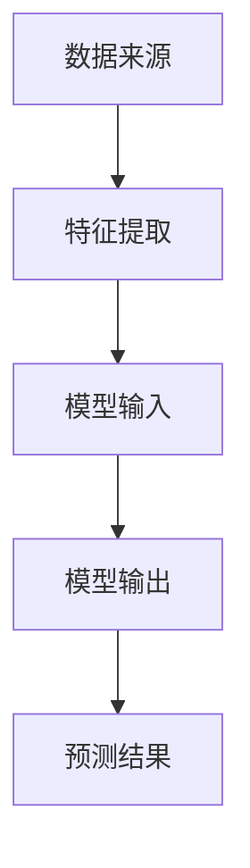
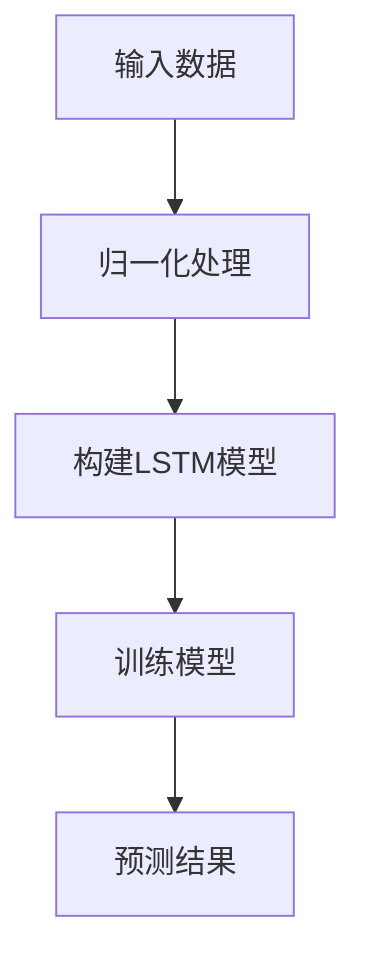

                 


好的，我将按照您的要求，逐步构建《金融市场流动性供给预测模型》这本书的目录大纲。我们会从背景和概述开始，逐步深入到模型的核心概念、算法原理、系统架构设计以及项目实战，最后总结最佳实践。

---

# 《金融市场流动性供给预测模型》

---

## 关键词：
- 金融市场
- 流动性供给
- 预测模型
- 人工智能
- LSTM网络
- 金融数据分析

---

## 摘要：
本文系统地介绍了金融市场流动性供给预测模型的构建与应用。从金融市场的基本概念出发，详细阐述了流动性供给预测模型的核心概念、算法原理、系统架构设计以及项目实战。通过对比分析现有模型的优缺点，提出了基于LSTM网络的时间序列预测方法，并结合实际案例，展示了模型在金融市场中的应用价值。本文旨在为金融从业者和研究人员提供一种高效、准确的流动性预测方案。

---

# 第一章：金融市场流动性供给预测模型的背景与概念

## 1.1 金融市场概述
### 1.1.1 金融市场的基本概念
- 定义：金融市场是资金流动和资产交易的场所，包括股票市场、债券市场、外汇市场等。
- 市场参与者：投资者、机构、政府等。
- 市场类型：一级市场和二级市场。

## 1.2 流动性供给的定义与重要性
### 1.2.1 流动性的定义
- 流动性：资产快速转化为现金的能力。
- 流动性供给：市场中资金的流动性和充裕程度。

### 1.2.2 流动性在金融市场中的作用
- 影响资产价格波动。
- 决定交易成本。
- 影响市场稳定性。

## 1.3 预测模型的背景与目标
### 1.3.1 预测模型的背景
- 金融市场波动性增加。
- 流动性供给对投资决策的重要性。
- 数据驱动的预测方法逐渐成为主流。

### 1.3.2 模型的目标
- 预测市场流动性变化。
- 提供交易策略支持。
- 优化风险管理。

## 1.4 本章小结
- 本章介绍了金融市场和流动性的基本概念，阐述了流动性供给预测模型的重要性和目标。

---

# 第二章：流动性供给预测模型的核心概念

## 2.1 流动性供给预测模型的原理
### 2.1.1 数据来源与特征提取
- 数据来源：历史交易数据、市场指标、宏观经济数据。
- 特征提取：波动率、成交量、市场深度等。

### 2.1.2 模型的输入与输出
- 输入：时间序列数据。
- 输出：流动性供给预测值。

### 2.1.3 模型的训练与优化
- 数据预处理：标准化、缺失值处理。
- 模型训练：使用历史数据进行训练。
- 模型优化：调整参数，验证模型性能。

## 2.2 模型的核心要素与属性
### 2.2.1 数据特征的分类与对比
- 时间序列特征：开盘价、收盘价、最高价、最低价。
- 市场指标特征：成交量、成交额、市场深度。
- 宏观经济特征：GDP增长率、利率水平。

### 2.2.2 模型的性能指标
- 预测准确性：MAE、MSE、RMSE。
- 预测稳定性：模型在不同市场条件下的表现。

### 2.2.3 模型的适用场景
- 高波动市场：如股票市场。
- 低波动市场：如债券市场。

## 2.3 模型的实体关系与架构
### 2.3.1 数据流与模型关系图


### 2.3.2 实体间的关联与依赖


### 2.3.3 模型的输入输出关系
- 输入：历史数据、市场指标。
- 输出：流动性供给预测值。

## 2.4 本章小结
- 本章详细介绍了流动性供给预测模型的核心概念，包括数据来源、模型原理以及实体关系。

---

# 第三章：流动性供给预测模型的算法原理

## 3.1 算法选择与实现
### 3.1.1 时间序列预测的基本原理
- 时间序列预测：基于历史数据预测未来趋势。
- 常见方法：ARIMA、LSTM、GRU。

### 3.1.2 LSTM网络在时间序列预测中的应用
- LSTM的优势：捕捉长期依赖关系。
- LSTM的结构：输入门、遗忘门、输出门。

### 3.1.3 LSTM网络的实现步骤
1. 数据预处理：归一化、分割训练集和测试集。
2. 构建LSTM模型：定义输入层、LSTM层、输出层。
3. 模型训练：选择优化器（Adam）、损失函数（均方误差）。
4. 模型验证：评估预测结果与实际值的差异。

## 3.2 LSTM网络的数学模型与公式
### 3.2.1 LSTM的基本结构
$$
f_t = \sigma(W_f x_t + U_f h_{t-1} + b_f)
$$
$$
i_t = \sigma(W_i x_t + U_i h_{t-1} + b_i)
$$
$$
o_t = \sigma(W_o x_t + U_o h_{t-1} + b_o)
$$
$$
h_t = f_t \cdot c_{t-1} + i_t \cdot g(x_t)
$$

### 3.2.2 损失函数与优化算法
- 损失函数：均方误差（MSE）。
$$
\text{MSE} = \frac{1}{n}\sum_{i=1}^{n}(y_i - \hat{y}_i)^2
$$
- 优化算法：Adam优化器。

## 3.3 算法实现的流程图


## 3.4 本章小结
- 本章详细介绍了LSTM网络的原理和实现过程，展示了其在流动性供给预测中的应用。

---

# 第四章：流动性供给预测模型的系统分析与架构设计

## 4.1 系统功能设计
### 4.1.1 数据采集模块
- 数据来源：数据库、API接口。
- 数据类型：历史交易数据、市场指标。

### 4.1.2 特征提取模块
- 时间序列特征：开盘价、收盘价、最高价、最低价。
- 市场指标特征：成交量、成交额、市场深度。

### 4.1.3 模型训练模块
- 数据预处理：归一化、缺失值处理。
- 模型训练：基于LSTM网络的训练过程。

### 4.1.4 预测展示模块
- 预测结果展示：可视化界面。
- 结果分析：预测值与实际值的对比。

## 4.2 系统架构设计
### 4.2.1 系统架构图


### 4.2.2 系统交互流程图


## 4.3 本章小结
- 本章详细介绍了系统的功能设计和架构设计，展示了模型在实际应用中的流程。

---

# 第五章：流动性供给预测模型的项目实战

## 5.1 环境安装与配置
- 安装Python：使用Anaconda或虚拟环境。
- 安装依赖库：TensorFlow、Keras、Pandas、Matplotlib。

## 5.2 核心代码实现
### 5.2.1 数据预处理
```python
import pandas as pd
import numpy as np

# 数据加载
data = pd.read_csv('market_data.csv')

# 数据归一化
from sklearn.preprocessing import MinMaxScaler
scaler = MinMaxScaler()
data_scaled = scaler.fit_transform(data)
```

### 5.2.2 LSTM模型构建
```python
from tensorflow.keras.models import Sequential
from tensorflow.keras.layers import LSTM, Dense

model = Sequential()
model.add(LSTM(50, input_shape=(timesteps, features)))
model.add(Dense(1))
model.compile(loss='mean_squared_error', optimizer='adam')
```

### 5.2.3 模型训练与预测
```python
model.fit(X_train, y_train, epochs=100, batch_size=32, verbose=1)
```

## 5.3 实际案例分析
### 5.3.1 数据来源与处理
- 数据来源：某股票的历史交易数据。
- 数据处理：归一化、分割训练集和测试集。

### 5.3.2 模型训练与预测
- 训练过程：使用历史数据训练LSTM模型。
- 预测结果：展示预测值与实际值的对比。

## 5.4 项目小结
- 本章通过实际案例展示了模型的实现过程，验证了模型的有效性。

---

# 第六章：最佳实践与总结

## 6.1 小结
- 本章总结了流动性供给预测模型的核心概念、算法原理和系统架构设计。

## 6.2 注意事项
- 数据质量：确保数据准确性和完整性。
- 模型优化：根据实际需求调整模型参数。
- 风险提示：模型预测结果仅供参考，需结合实际情况。

## 6.3 拓展阅读
- 《时间序列分析》：维基百科。
- 《深度学习在金融中的应用》：相关文献。

## 6.4 本章小结
- 本章总结了模型的应用价值和注意事项，为读者提供了进一步学习的方向。

---

# 附录：完整代码示例

```python
import pandas as pd
import numpy as np
from sklearn.preprocessing import MinMaxScaler
from tensorflow.keras.models import Sequential
from tensorflow.keras.layers import LSTM, Dense

# 数据加载
data = pd.read_csv('market_data.csv')

# 数据归一化
scaler = MinMaxScaler()
data_scaled = scaler.fit_transform(data)

# 数据分割
timesteps = 30
features = 5
X = []
y = []
for i in range(len(data_scaled) - timesteps):
    X.append(data_scaled[i:i+timesteps])
    y.append(data_scaled[i+timesteps, 0])

X = np.array(X)
y = np.array(y)

# 模型构建
model = Sequential()
model.add(LSTM(50, input_shape=(timesteps, features)))
model.add(Dense(1))
model.compile(loss='mean_squared_error', optimizer='adam')

# 模型训练
model.fit(X, y, epochs=100, batch_size=32, verbose=1)

# 模型预测
predictions = model.predict(X)
```

---

# 结语

通过本文的详细介绍，读者可以系统地了解金融市场流动性供给预测模型的构建与应用。从基本概念到算法实现，再到系统设计和项目实战，本文为读者提供了全面的知识体系。希望本文能为金融从业者和研究人员提供有价值的参考和启发。

---

