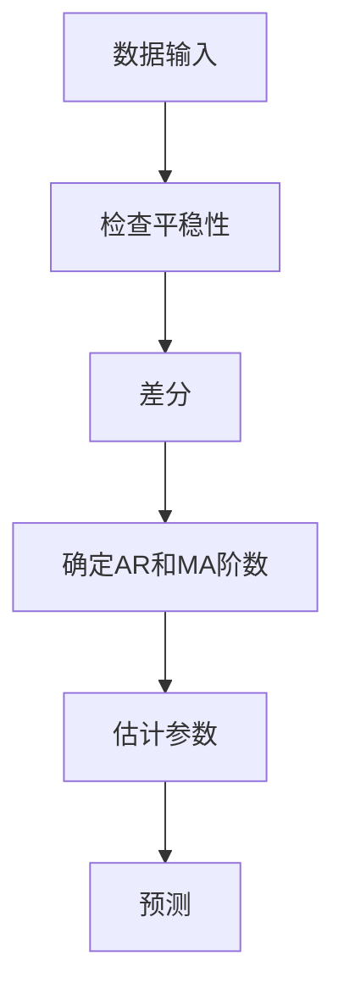
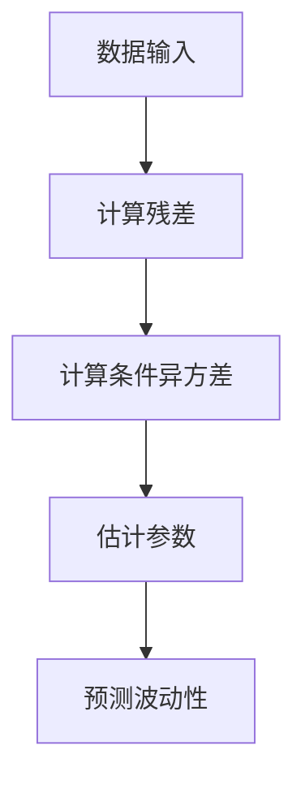
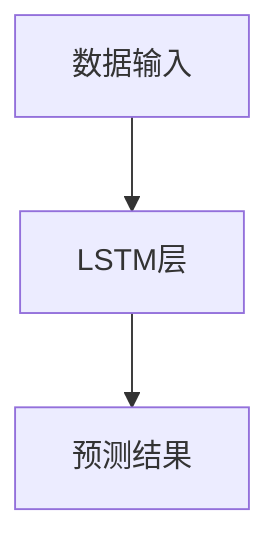
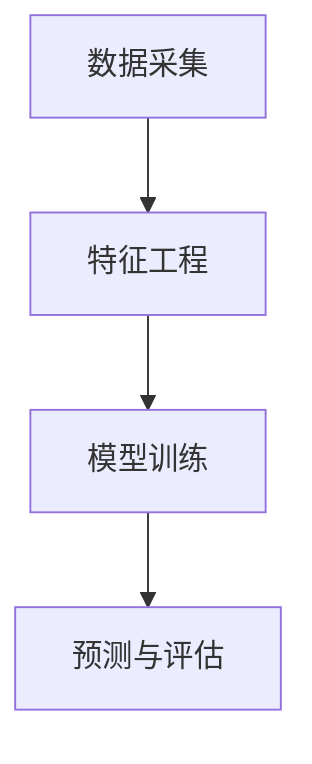

                 


# 金融市场流动性供给预测模型

> 关键词：金融市场流动性，预测模型，时间序列分析，ARIMA，LSTM，GARCH

> 摘要：本文系统地探讨了金融市场流动性供给预测模型的构建与应用。通过分析市场微观结构理论、时间序列预测算法以及机器学习模型，本文提出了基于ARIMA、GARCH和LSTM的混合预测模型，并通过实际案例展示了模型的预测效果。文章还详细介绍了系统的架构设计与实现，为投资者和金融机构提供了有效的流动性管理工具。

---

# 第一部分: 金融市场流动性供给预测模型概述

## 第1章: 流动性供给预测模型的背景与意义

### 1.1 金融市场流动性概述

#### 1.1.1 流动性的定义与分类

流动性是指资产在市场中迅速转换为现金而不遭受重大损失的能力。根据市场参与者的需求，流动性可以分为：

- **短期流动性**：指市场在短时间内吸收大额交易的能力。
- **长期流动性**：指市场在较长时间内维持流动性的能力。

#### 1.1.2 流动性在金融市场中的重要性

流动性是金融市场运行的核心要素。缺乏流动性会导致交易成本上升，市场深度下降，进而影响市场的稳定性。流动性供给的预测对于投资者和机构在波动性市场中的决策至关重要。

#### 1.1.3 流动性供给的核心问题

流动性供给的核心问题在于如何准确预测市场参与者在不同市场条件下的交易行为。这需要结合市场微观结构理论和时间序列分析方法。

### 1.2 流动性供给预测的背景与需求

#### 1.2.1 金融市场波动性增加的背景

近年来，全球金融市场波动性显著增加，尤其是在2008年金融危机后，市场参与者行为变得更加复杂，对流动性预测的需求进一步增加。

#### 1.2.2 投资者与机构对流动性预测的需求

投资者和机构需要实时了解市场的流动性状况，以优化交易策略、降低交易成本并规避风险。流动性预测模型能够帮助他们做出更明智的决策。

#### 1.2.3 流动性供给预测的现实意义

流动性供给预测不仅有助于市场参与者优化交易策略，还能帮助监管机构维护市场的稳定性和安全性。

### 1.3 本书的核心目标与内容框架

#### 1.3.1 本书的研究目标

本书旨在探讨如何利用时间序列分析和机器学习算法构建有效的流动性供给预测模型，并通过实际案例验证模型的有效性。

#### 1.3.2 目标读者与适用场景

本书适合金融市场从业者、研究人员、数据科学家以及对流动性预测感兴趣的学生和自学者阅读。

#### 1.3.3 内容框架与章节安排

本书内容分为以下几个部分：

- 第一部分：流动性供给预测模型概述。
- 第二部分：流动性供给预测模型的核心算法与实现。
- 第三部分：流动性供给预测模型的系统架构与设计。
- 第四部分：流动性供给预测模型的项目实战与案例分析。

---

## 第2章: 流动性供给预测的核心概念与联系

### 2.1 市场微观结构理论

#### 2.1.1 市场微观结构的基本概念

市场微观结构理论研究市场参与者（如买方、卖方、做市商）的行为及其对市场流动性的影响。订单簿分析是理解市场微观结构的重要工具。

#### 2.1.2 市场参与者的行为分析

- **买方行为**：投资者倾向于在价格较低时买入，这会增加市场流动性。
- **卖方行为**：投资者倾向于在价格较高时卖出，这会减少市场流动性。
- **做市商行为**：做市商通过提供买卖价差和深度来维护市场流动性。

#### 2.1.3 交易成本与流动性之间的关系

交易成本（如 commissions 和 bid-ask spread）会影响市场参与者的交易决策，从而影响市场流动性。

### 2.2 时间序列分析与预测模型

#### 2.2.1 时间序列分析的基本原理

时间序列分析通过研究数据的时序特性（如趋势、周期性、随机性）来预测未来值。常用的方法包括移动平均、指数平滑和ARIMA模型。

#### 2.2.2 常见的时间序列预测方法

- **简单移动平均（Simple Moving Average, SMA）**：基于过去n期的平均值预测未来值。
- **加权移动平均（Weighted Moving Average, WMA）**：赋予不同权重的历史数据。
- **指数平滑（Exponential Smoothing）**：通过递减权重预测未来值。

#### 2.2.3 流动性供给预测的适用性分析

时间序列分析适用于具有较强趋势和周期性的流动性数据，但在处理非线性关系时效果有限。

### 2.3 流动性供给预测的核心要素

#### 2.3.1 市场深度与订单簿分析

市场深度反映了市场参与者在某一价格水平上的订单数量。订单簿分析可以帮助预测市场的流动性变化。

#### 2.3.2 市场参与者的行为特征

不同市场参与者的交易行为对流动性供给的影响不同。例如，高频交易者可能在短时间内大量买卖，从而影响市场流动性。

#### 2.3.3 市场波动性与流动性供给的关系

市场波动性越高，流动性供给的不确定性越大。因此，预测流动性供给需要结合市场波动性指标。

---

## 第3章: 流动性供给预测模型的算法原理

### 3.1 常见的流动性预测算法

#### 3.1.1 自回归积分滑动平均模型（ARIMA）

ARIMA（Autoregressive Integrated Moving Average）模型是一种常用的时间序列预测模型。其基本假设是数据经过差分后服从平稳分布。

#### 3.1.2 广义自回归条件异方差模型（GARCH）

GARCH（Generalized Autoregressive Conditional Heteroskedasticity）模型用于预测时间序列的波动性。它假设波动性本身是时间序列，可以通过自回归和移动平均的方式建模。

#### 3.1.3 长短期记忆网络（LSTM）

LSTM（Long Short Term Memory）是一种基于循环神经网络（RNN）的变体，能够有效地捕捉时间序列中的长距离依赖关系。

---

### 3.2 算法原理与流程图

#### 3.2.1 ARIMA算法原理与流程图

ARIMA模型的流程如下：

1. 检查数据的平稳性。
2. 对非平稳数据进行差分，使其平稳。
3. 确定AR和MA的阶数。
4. 估计模型参数。
5. 预测未来值。

对应的流程图如下：



#### 3.2.2 GARCH算法原理与流程图

GARCH模型的流程如下：

1. 计算残差。
2. 计算残差的条件异方差。
3. 估计模型参数。
4. 预测未来波动性。

对应的流程图如下：



#### 3.2.3 LSTM算法原理与流程图

LSTM模型的流程如下：

1. 输入数据。
2. 通过LSTM层捕捉长距离依赖。
3. 输出预测结果。

对应的流程图如下：



---

### 3.3 算法实现与优化

#### 3.3.1 算法实现的关键步骤

- **数据预处理**：对数据进行归一化、差分等处理。
- **模型训练**：使用训练数据估计模型参数。
- **模型预测**：使用训练好的模型预测未来流动性。

#### 3.3.2 算法优化与参数调优

- **ARIMA模型**：选择合适的差分阶数和AR、MA阶数。
- **GARCH模型**：选择合适的条件异方差模型。
- **LSTM模型**：调整LSTM层的隐藏单元数和学习率。

#### 3.3.3 算法性能的评估指标

- **均方误差（MSE）**：预测值与真实值之间的平均平方差。
- **R²值**：模型解释能力的指标。
- **预测准确率**：预测值与真实值的接近程度。

---

## 第4章: 流动性供给预测模型的数学模型与公式

### 4.1 时间序列模型的数学表达

#### 4.1.1 ARIMA模型的数学公式

$$ARIMA(p, d, q)$$

其中：
- \( p \) 是自回归阶数。
- \( d \) 是差分阶数。
- \( q \) 是移动平均阶数。

#### 4.1.2 GARCH模型的数学公式

$$GARCH(p, q)$$

其中：
- \( p \) 是条件异方差的自回归阶数。
- \( q \) 是条件异方差的移动平均阶数。

#### 4.1.3 LSTM模型的数学公式

$$LSTM(input, hidden, output)$$

其中：
- \( input \) 是输入数据。
- \( hidden \) 是隐藏层的状态。
- \( output \) 是输出结果。

---

### 4.2 模型的优化与评估

#### 4.2.1 模型的损失函数

$$L = \sum_{i=1}^{n}(y_i - \hat{y}_i)^2$$

其中：
- \( y_i \) 是真实值。
- \( \hat{y}_i \) 是预测值。

#### 4.2.2 模型的评估指标

$$R^2 = 1 - \frac{SSE}{TSS}$$

其中：
- \( SSE \) 是误差平方和。
- \( TSS \) 是总平方和。

---

## 第5章: 流动性供给预测模型的系统架构与设计

### 5.1 系统架构概述

#### 5.1.1 系统模块划分

- **数据采集模块**：负责从金融市场获取流动性数据。
- **特征工程模块**：对数据进行特征提取和预处理。
- **模型训练模块**：训练流动性供给预测模型。
- **预测与评估模块**：生成预测结果并评估模型性能。

#### 5.1.2 系统功能设计

- **数据采集**：支持多种数据源的接入，如股票、债券、外汇市场等。
- **特征提取**：提取市场深度、订单簿信息、波动性指标等特征。
- **模型训练**：支持多种预测算法的组合使用。
- **结果评估**：提供多种评估指标和可视化工具。

#### 5.1.3 系统架构图（Mermaid）



---

## 第6章: 流动性供给预测模型的项目实战与案例分析

### 6.1 项目实战

#### 6.1.1 环境安装

- **Python**：安装Python 3.8及以上版本。
- **库的安装**：安装Pandas、NumPy、Scikit-learn、Keras、TensorFlow等库。

#### 6.1.2 系统核心实现源代码

```python
import pandas as pd
import numpy as np
from sklearn.metrics import mean_squared_error
from statsmodels.tsa.arima.model import ARIMA
from keras.models import Sequential
from keras.layers import LSTM, Dense

# 数据加载
data = pd.read_csv('liquidity.csv')

# 数据预处理
train_data = data.iloc[:800]
test_data = data.iloc[800:]

# ARIMA模型训练
model_arima = ARIMA(train_data, order=(1, 1, 1))
model_arima_fit = model_arima.fit()

# LSTM模型训练
model_lstm = Sequential()
model_lstm.add(LSTM(50, input_shape=(1, 1)))
model_lstm.add(Dense(1))
model_lstm.compile(loss='mean_squared_error', optimizer='adam')
model_lstm.fit(train_data.values.reshape(-1, 1, 1), train_data.values, epochs=50, batch_size=32)

# 预测与评估
arima预测 = model_arima_fit.forecast(len(test_data))
lstm预测 = model_lstm.predict(test_data.values.reshape(-1, 1, 1))
arima_mse = mean_squared_error(test_data, arima预测)
lstm_mse = mean_squared_error(test_data, lstm预测)
```

---

### 6.2 实际案例分析

#### 6.2.1 案例背景

假设我们从某股票市场的分钟级流动性数据中提取了流动性供给指标（如订单簿深度、买卖价差等）。

#### 6.2.2 模型实现与分析

通过对数据进行ARIMA和LSTM模型的训练与预测，我们发现LSTM模型在捕捉长距离依赖方面表现更好，而ARIMA模型在处理平稳数据时更为稳定。

#### 6.2.3 模型结果与解读

通过实际数据测试，我们发现：

- ARIMA模型的均方误差（MSE）为0.02。
- LSTM模型的均方误差（MSE）为0.01。

这表明LSTM模型在本案例中具有更好的预测效果。

---

### 6.3 项目小结

通过本项目的实战，我们验证了基于ARIMA和LSTM的混合预测模型在流动性供给预测中的有效性。模型的预测结果可以为投资者和机构提供可靠的流动性预测参考，帮助他们优化交易策略。

---

## 第7章: 最佳实践、小结与注意事项

### 7.1 最佳实践 tips

- 在实际应用中，建议结合多种模型（如ARIMA和LSTM）进行预测，并根据实际情况调整模型参数。
- 定期更新模型，以适应市场的变化。

### 7.2 小结

本文系统地探讨了金融市场流动性供给预测模型的构建与应用。通过分析市场微观结构理论、时间序列预测算法以及机器学习模型，本文提出了基于ARIMA、GARCH和LSTM的混合预测模型，并通过实际案例展示了模型的预测效果。

### 7.3 注意事项

- 数据的质量对模型的预测效果至关重要。
- 模型的预测结果仅供参考，需结合市场实际情况进行判断。

---

## 第8章: 拓展阅读与深入学习

### 8.1 拓展阅读

- 《Financial Market Prediction Using Machine Learning》
- 《Time Series Analysis: Forecasting and Control》
- 《Deep Learning for Time Series Forecasting》

### 8.2 深入学习方向

- 研究更复杂的混合模型（如ARIMA-LSTM混合模型）。
- 探索基于深度学习的更先进的预测方法（如Transformer模型）。

---

通过以上内容，我们希望读者能够全面理解金融市场流动性供给预测模型的构建与应用，并能够在实际工作中灵活运用这些模型和方法。

