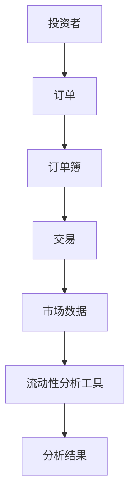

                 


# 金融市场流动性分析工具

> 关键词：金融市场流动性分析、算法交易、交易系统设计、数据处理、系统架构

> 摘要：金融市场流动性分析是理解市场行为和风险的关键工具。本文将从基础概念出发，详细讲解流动性分析的核心算法、系统架构设计以及实际项目实现，帮助读者掌握从理论到实践的完整流程。

---

# 第一部分: 金融市场流动性分析工具概述

# 第1章: 金融市场流动性概述

## 1.1 金融市场的基本概念

### 1.1.1 金融市场的定义与功能
金融市场是资金流动和资产交易的场所，主要功能包括价格发现、资产配置和风险管理。理解金融市场的基本运作机制是流动性分析的基础。

### 1.1.2 金融市场的参与者与交易机制
参与者包括投资者、机构、交易所和监管机构。交易机制涉及订单匹配、撮合算法和市场深度等概念。

### 1.1.3 流动性在金融市场中的重要性
流动性决定了资产的买卖难易程度，直接影响市场参与者的决策和市场整体稳定性。

---

## 1.2 金融市场流动性分析的基本概念

### 1.2.1 流动性的定义与衡量标准
流动性是指资产在短时间内以合理价格买卖的能力。衡量标准包括买卖价差、交易量和市场深度。

### 1.2.2 流动性分析的必要性与应用场景
流动性分析帮助交易员和投资者优化交易策略、降低交易成本并管理市场风险。

### 1.2.3 流动性与市场风险的关系
流动性不足可能导致价格波动加剧，增加市场风险。流动性分析是风险管理的重要组成部分。

---

## 1.3 本书的核心目标与内容框架

### 1.3.1 本书的研究范围与目标
本书旨在通过理论与实践结合，帮助读者掌握金融市场流动性分析的核心方法和技术。

### 1.3.2 目录结构与内容概览
- 第一部分：基础概念与理论
- 第二部分：核心算法与数学模型
- 第三部分：系统架构设计
- 第四部分：项目实战与案例分析

### 1.3.3 学习本书的预期收获
通过学习，读者能够掌握流动性分析的工具和方法，能够独立设计和实现流动性分析系统。

---

# 第二部分: 金融市场流动性分析的核心概念

# 第2章: 金融市场流动性分析的核心概念与联系

## 2.1 金融市场流动性分析的原理

### 2.1.1 流动性分析的理论基础
流动性分析基于市场微观结构理论，研究买卖订单、市场深度和交易行为对流动性的影响。

### 2.1.2 流动性分析的关键指标
- 买卖价差：$Spread = Bid Price - Ask Price$
- 市场深度：衡量订单簿中未成交的订单总量
- 交易量：单位时间内成交的资产数量

### 2.1.3 流动性分析的数学模型
常用模型包括：
- 马尔可夫链模型：描述价格变化的随机过程
- 均值回归模型：$$ R_t = \alpha + \beta R_{t-1} + \epsilon_t $$

---

## 2.2 核心概念的属性特征对比

### 2.2.1 流动性与波动性的对比分析
| 特性 | 流动性 | 波动性 |
|------|--------|--------|
| 定义 | 资产买卖的难易程度 | 价格短期变化的剧烈程度 |
| 影响 | 降低交易成本 | 增加市场不确定性 |

### 2.2.2 市场深度与流动性的关系
市场深度越深，流动性越好，交易成本越低。

### 2.2.3 买卖价差对流动性的影响
买卖价差是衡量流动性的重要指标，价差越小，流动性越好。

---

## 2.3 ER实体关系图与概念架构



---

# 第三部分: 金融市场流动性分析的算法原理

# 第3章: 流动性分析算法原理

## 3.1 常见的流动性分析算法

### 3.1.1 均值回归算法
均值回归算法假设价格会回归到均值，适用于预测未来价格走势。

### 3.1.2 动量策略算法
动量策略基于价格动量效应，通过动量指标（如RSI）进行交易决策。

### 3.1.3 马尔可夫链模型
马尔可夫链模型用于描述价格状态的转移概率。

---

## 3.2 算法原理的数学模型

### 3.2.1 均值回归模型
$$ R_t = \alpha + \beta R_{t-1} + \epsilon_t $$

### 3.2.2 动量策略模型


---

## 3.3 算法实现与代码示例

### 3.3.1 环境安装与配置
安装必要的库：
```bash
pip install pandas numpy matplotlib
```

### 3.3.2 核心算法实现
```python
import pandas as pd
import numpy as np

def calculate_momentum(prices, window=20):
    return prices.rolling(window).mean()
```

---

# 第四部分: 金融市场流动性分析的系统架构

# 第4章: 流动性分析系统的架构设计

## 4.1 系统功能设计

### 4.1.1 数据采集模块
负责从数据源获取实时市场数据。

### 4.1.2 数据处理模块
对数据进行清洗、标准化和特征提取。

### 4.1.3 分析模块
应用算法模型进行流动性分析并生成结果。

### 4.1.4 可视化模块
将分析结果可视化，便于用户理解和决策。

---

## 4.2 系统架构图


---

## 4.3 系统接口设计

### 4.3.1 数据接口
定义数据格式和接口协议，确保数据流畅传输。

### 4.3.2 交易接口
实现交易指令的发送和执行。

---

## 4.4 系统交互流程


---

# 第五部分: 金融市场流动性分析工具的项目实战

# 第5章: 项目实战与案例分析

## 5.1 项目背景与目标

### 5.1.1 项目背景
本项目旨在设计并实现一个基于流动性分析的交易系统。

### 5.1.2 项目目标
通过分析市场流动性，优化交易策略，降低交易成本。

---

## 5.2 核心代码实现

### 5.2.1 环境安装
安装必要的库：
```bash
pip install pandas numpy matplotlib yfinance
```

### 5.2.2 核心代码实现
```python
import pandas as pd
import numpy as np
import yfinance as yf

# 下载数据
data = yf.download('AAPL', start='2023-01-01', end='2023-12-31')

# 计算流动性指标
data['Volume'] = data['Volume'].shift(1)
data['Spread'] = data['Ask'] - data['Bid']

# 可视化
data[['Close', 'Volume']].plot()
plt.show()
```

---

## 5.3 案例分析与解读

### 5.3.1 数据分析
分析AAPL股票的交易量和价差，观察市场流动性变化。

### 5.3.2 结果解读
高交易量和低价差表明流动性较好，交易成本较低。

---

## 5.4 项目总结与优化

### 5.4.1 项目小结
本项目实现了基于流动性分析的交易系统，能够实时监控市场流动性。

### 5.4.2 优化方向
未来可以进一步优化算法，引入更多流动性指标和机器学习模型。

---

# 第六部分: 金融市场流动性分析工具的最佳实践

# 第6章: 总结与展望

## 6.1 核心内容回顾

### 6.1.1 本书的核心知识点
- 金融市场流动性分析的基本概念
- 核心算法与数学模型
- 系统架构设计与实现

## 6.2 未来挑战与趋势

### 6.2.1 未来挑战
- 数据量的增加
- 算法的复杂性
- 系统的实时性要求

### 6.2.2 未来趋势
- 大数据与AI技术的结合
- 流动性分析工具的自动化

---

## 6.3 最佳实践 tips

### 6.3.1 学习建议
- 理论与实践相结合
- 多关注行业动态和技术发展

### 6.3.2 实际应用中的注意事项
- 数据质量的重要性
- 算法的可解释性
- 系统的稳定性与安全性

---

# 结语

通过系统学习和实践，读者可以掌握金融市场流动性分析的核心工具和技术，为实际工作和研究提供有力支持。希望本书能够帮助读者在金融市场分析领域取得更大的进步。

