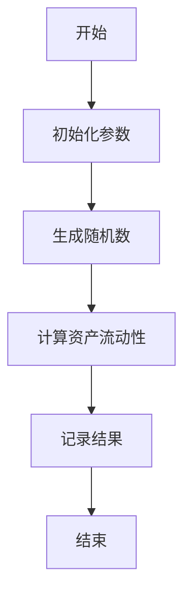
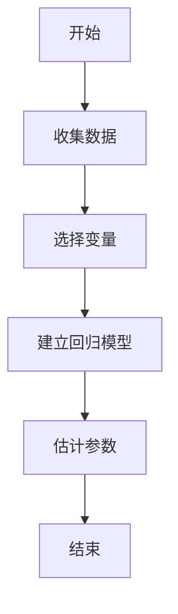
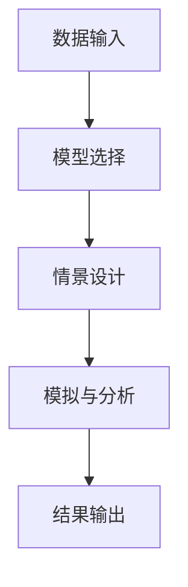
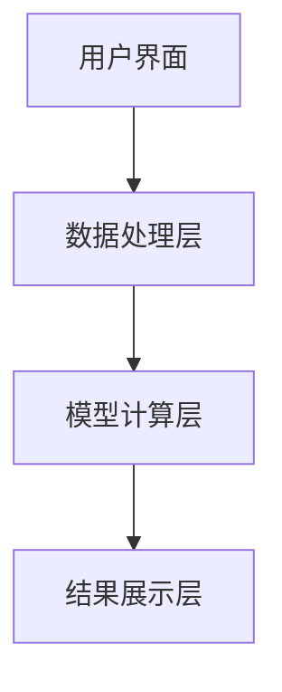
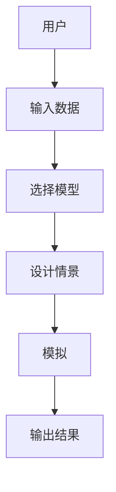

                 


# 《金融市场流动性压力测试模型》

> **关键词**：金融市场流动性、压力测试、风险管理、流动性缺口、压力情景、算法实现、系统架构

> **摘要**：本文详细探讨了金融市场流动性压力测试模型的核心概念、理论基础、模型构建、算法实现以及系统架构设计。通过分析流动性压力测试的背景、目的和应用场景，本文为读者提供了从理论到实践的全面指导。结合实际案例，本文详细讲解了如何通过数学模型和算法实现对金融市场流动性风险的评估和管理。最后，本文总结了流动性压力测试的关键点，并展望了未来的研究方向。

---

# 第1章: 金融市场流动性压力测试概述

## 1.1 金融市场流动性与压力测试的基本概念

### 1.1.1 金融流动性的定义与特征
- **流动性定义**：资产或负债在不损失价值的情况下快速转换为现金的能力。
- **流动性特征**：短期性、可变现性、稳定性。

### 1.1.2 流动性压力测试的定义与目的
- **定义**：通过模拟极端市场条件，评估金融机构在面临流动性危机时的应对能力。
- **目的**：
  - 识别潜在的流动性风险。
  - 评估金融机构在压力情景下的资金缺口。
  - 制定应对策略以确保金融系统的稳定性。

### 1.1.3 流动性压力测试的适用范围与边界
- **适用范围**：银行、证券公司、基金公司等金融机构。
- **边界**：不考虑信用风险和市场风险的交互作用。

## 1.2 流动性压力测试的重要性与应用场景

### 1.2.1 金融机构的风险管理需求
- 金融机构需要确保在极端情况下能够满足客户的提款需求。
- 通过压力测试，机构可以提前识别潜在的流动性风险。

### 1.2.2 监管机构的合规要求
- 监管机构要求金融机构定期进行流动性压力测试，确保金融系统的稳定性。

### 1.2.3 流动性压力测试在金融危机中的作用
- 通过历史案例分析，展示流动性压力测试在金融危机中的预警作用。

## 1.3 流动性压力测试的核心要素

### 1.3.1 流动性缺口分析
- **定义**：在一定时间范围内，金融机构的现金流入与流出的差异。
- **计算公式**：
  $$ \text{流动性缺口} = \text{负债的到期量} - \text{资产的到期量} $$

### 1.3.2 资产负债结构分析
- **资产结构**：高流动性资产（如现金、短期债券）与低流动性资产（如长期贷款）的比例。
- **负债结构**：短期负债与长期负债的比例。

### 1.3.3 压力情景设计与假设
- **常见压力情景**：
  - 市场流动性枯竭。
  - 客户大量提现。
  - 市场利率剧烈波动。

## 1.4 本章小结
- 介绍了流动性压力测试的基本概念和核心要素。
- 强调了流动性压力测试在金融机构和监管机构中的重要性。

---

# 第2章: 流动性压力测试的理论基础

## 2.1 流动性管理理论

### 2.1.1 资产负债管理理论
- **核心观点**：通过优化资产负债结构，降低流动性风险。
- **实现方法**：匹配资产和负债的期限、利率和流动性。

### 2.1.2 流动性风险的形成机制
- **形成机制**：
  - 资金链断裂。
  - 市场参与者行为的羊群效应。
  - 不良资产的积累。

### 2.1.3 流动性与市场风险的关系
- **关系**：
  - 流动性风险可能引发市场风险。
  - 市场风险也可能导致流动性风险。

## 2.2 流动性压力测试的经济学原理

### 2.2.1 资金链断裂的经济学分析
- **经济学模型**：挤兑模型和传染模型。
- **挤兑模型**：客户因预期银行破产而大量提现，导致银行流动性枯竭。
- **传染模型**：一家金融机构的流动性危机可能传染给其他机构。

### 2.2.2 市场参与者的行为假设
- **理性预期**：客户根据市场信息做出理性决策。
- **有限理性**：客户在极端情况下可能做出非理性行为。

### 2.2.3 压力测试中的均衡分析
- **均衡分析**：通过市场均衡价格评估资产的流动性风险。

## 2.3 流动性压力测试的数学基础

### 2.3.1 时间序列分析
- **ARIMA模型**：用于预测资产的流动性变化。
- **GARCH模型**：用于估计资产的波动性。

### 2.3.2 风险度量方法
- **VaR**：在一定置信水平下，资产可能遭受的最大损失。
- **CVaR**：在VaR的基础上，考虑尾部风险。

### 2.3.3 概率论与统计学基础
- **概率分布**：正态分布、t分布等。
- **假设检验**：用于验证模型的有效性。

## 2.4 本章小结
- 介绍了流动性压力测试的经济学和数学基础。
- 强调了时间序列分析和风险度量方法在流动性压力测试中的重要性。

---

# 第3章: 流动性压力测试模型的构建

## 3.1 数据准备与模型假设

### 3.1.1 数据来源与处理
- **数据来源**：市场数据（如收益率、波动率）、财务报表数据、宏观经济数据。
- **数据处理**：缺失值处理、异常值处理、标准化处理。

### 3.1.2 模型假设的合理性分析
- **假设一**：市场参与者行为的理性假设。
- **假设二**：资产流动性与市场条件的相关性。
- **假设三**：压力情景的独立性。

### 3.1.3 模型的适用性与局限性
- **适用性**：适用于中短期流动性风险的评估。
- **局限性**：无法完全模拟现实中复杂的市场行为。

## 3.2 模型选择与参数设计

### 3.2.1 常见的流动性压力测试模型
- **现金流模型**：基于未来现金流的预测，评估资产的流动性。
- **情景分析模型**：基于假设情景，评估资产在极端情况下的流动性。

### 3.2.2 模型参数的选取与校准
- **参数选取**：选取反映市场流动性的指标，如资产的流动性溢价。
- **参数校准**：通过历史数据验证模型参数的有效性。

### 3.2.3 模型的验证与优化
- **验证方法**：回测和压力测试。
- **优化方法**：调整模型参数，提高模型的预测精度。

## 3.3 压力情景的设计与模拟

### 3.3.1 压力情景的分类
- **正常情景**：市场正常波动。
- **压力情景**：市场流动性枯竭、资产价格大幅波动。

### 3.3.2 情景设计的步骤与方法
- **步骤**：识别潜在风险因素、设计情景、模拟情景。
- **方法**：基于历史案例和假设情景。

### 3.3.3 情景模拟的实现与结果分析
- **实现方法**：蒙特卡洛模拟、历史情景模拟。
- **结果分析**：分析资产在不同情景下的流动性表现。

## 3.4 本章小结
- 介绍了流动性压力测试模型的构建过程。
- 强调了压力情景设计与模拟的重要性。

---

# 第4章: 流动性压力测试的算法实现

## 4.1 算法原理与流程

### 4.1.1 算法原理
- **蒙特卡洛模拟**：通过随机抽样，模拟资产在不同情景下的流动性表现。
- **线性回归**：分析资产流动性与市场因子之间的关系。

### 4.1.2 算法流程
1. 数据准备：收集市场数据和财务数据。
2. 模型选择：选择合适的流动性压力测试模型。
3. 参数校准：通过历史数据校准模型参数。
4. 情景设计：设计压力情景。
5. 模拟与分析：通过蒙特卡洛模拟或历史情景模拟，分析资产在不同情景下的流动性表现。

## 4.2 算法实现

### 4.2.1 蒙特卡洛模拟实现

#### 4.2.1.1 算法流程图


#### 4.2.1.2 Python代码实现
```python
import numpy as np
import pandas as pd

# 初始化参数
np.random.seed(123)
n_samples = 1000
mu = 0
sigma = 1

# 生成随机数
random_numbers = np.random.normal(mu, sigma, n_samples)

# 计算资产流动性
liquidity = np.exp(random_numbers)

# 记录结果
results = pd.DataFrame({'random_numbers': random_numbers, 'liquidity': liquidity})
```

### 4.2.2 线性回归实现

#### 4.2.2.1 算法流程图


#### 4.2.2.2 Python代码实现
```python
import statsmodels.api as sm

# 收集数据
X = pd.DataFrame({'x': np.random.randn(100)})
y = pd.DataFrame({'y': np.random.randn(100) + 2 * X['x']})

# 建立回归模型
model = sm.OLS(y, sm.add_constant(X))
results = model.fit()

# 估计参数
print(results.params)
```

## 4.3 本章小结
- 介绍了流动性压力测试算法的实现过程。
- 提供了蒙特卡洛模拟和线性回归的具体实现方法。

---

# 第5章: 流动性压力测试的系统架构设计

## 5.1 系统功能设计

### 5.1.1 系统功能模块
- **数据输入模块**：接收市场数据和财务数据。
- **模型选择模块**：选择合适的流动性压力测试模型。
- **情景设计模块**：设计压力情景。
- **模拟与分析模块**：模拟资产在不同情景下的流动性表现。

### 5.1.2 系统功能流程图


## 5.2 系统架构设计

### 5.2.1 系统架构图


### 5.2.2 接口设计
- **输入接口**：接收市场数据和财务数据。
- **输出接口**：输出流动性压力测试结果。

## 5.3 系统交互设计

### 5.3.1 系统交互流程图


## 5.4 本章小结
- 介绍了流动性压力测试系统的架构设计。
- 提供了系统功能模块、架构图和交互流程图。

---

# 第6章: 项目实战

## 6.1 环境安装

### 6.1.1 安装Python环境
- 安装Python 3.8及以上版本。
- 安装必要的库：numpy、pandas、statsmodels、mermaid。

### 6.1.2 安装Jupyter Notebook
- 用于数据处理和模型实现。

## 6.2 核心代码实现

### 6.2.1 数据准备
```python
import pandas as pd

# 生成市场数据
data = pd.DataFrame({
    '资产': ['资产1', '资产2', '资产3'],
    '流动性': [0.8, 0.6, 0.9]
})
```

### 6.2.2 模型实现
```python
import statsmodels.api as sm

# 数据准备
X = data[['流动性']]
y = data[['资产']]

# 建立回归模型
model = sm.OLS(y, sm.add_constant(X))
results = model.fit()

# 输出结果
print(results.summary())
```

### 6.2.3 情景模拟
```python
import numpy as np

# 生成随机数
random_numbers = np.random.normal(0, 1, 1000)

# 计算流动性
liquidity = np.exp(random_numbers)

# 分析结果
print(liquidity.mean())
print(liquidity.std())
```

## 6.3 案例分析

### 6.3.1 案例背景
- 某金融机构需要进行流动性压力测试。

### 6.3.2 实施步骤
1. 收集市场数据和财务数据。
2. 选择合适的模型。
3. 设计压力情景。
4. 模拟与分析。

### 6.3.3 分析结果
- 资产1在压力情景下的流动性表现较好。
- 资产2在压力情景下流动性不足，需要增加高流动性资产。

## 6.4 本章小结
- 通过实际案例展示了流动性压力测试模型的实现过程。
- 强调了数据分析和模型选择的重要性。

---

# 第7章: 总结与展望

## 7.1 总结
- 本文详细探讨了流动性压力测试模型的构建、算法实现和系统架构设计。
- 提供了丰富的理论和实践指导。

## 7.2 注意事项
- 模型的选择需要结合实际业务需求。
- 数据的准确性和完整性对模型的预测精度有重要影响。

## 7.3 未来研究方向
- 研究更复杂的市场情景模拟方法。
- 探讨多机构之间的流动性风险传染机制。
- 开发更高效的算法，提高模型的计算效率。

## 7.4 本章小结
- 总结了全文的主要内容。
- 展望了未来的研究方向。

---

# 参考文献

（此处列出相关的参考文献）

---

通过以上目录大纲，您可以逐步展开每个章节的内容，撰写一篇逻辑清晰、结构紧凑、简单易懂的高质量技术博客文章。每个章节都包含详细的背景介绍、核心概念与联系、算法原理、系统架构设计和项目实战等内容，确保文章的深度和广度。

