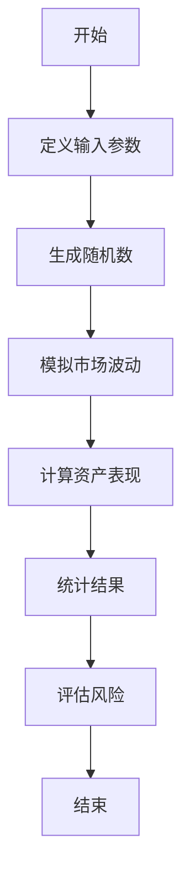
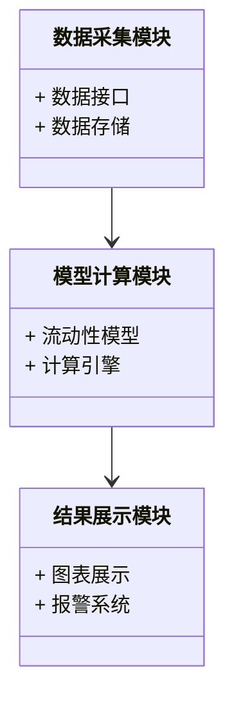
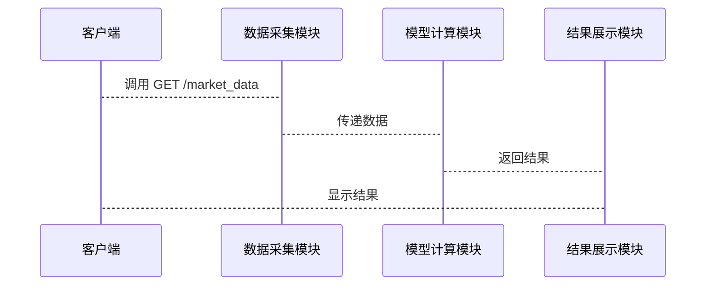

                 


# 金融市场流动性压力测试自动化平台

> 关键词：金融市场，流动性压力测试，自动化平台，算法模型，系统架构，风险管理

> 摘要：本文将详细探讨金融市场流动性压力测试自动化平台的设计与实现，从背景介绍、核心概念、算法原理到系统架构，再到项目实战和最佳实践，全面解析如何构建一个高效、可靠的流动性压力测试平台。通过本文，读者将深入了解如何利用技术手段提升金融市场的风险管理能力。

---

# 第一部分：金融市场流动性压力测试背景与概述

## 第1章：金融市场流动性压力测试概述

### 1.1 金融市场流动性与压力测试的定义
- **流动性**：资产在市场中迅速转换为现金而不影响市场价格的能力。
- **压力测试**：评估资产或机构在极端市场条件下的表现和风险的方法。
- **自动化平台**：通过技术手段自动执行压力测试，提高效率和准确性。

### 1.2 传统流动性压力测试的局限性
- **低效性**：依赖人工操作，耗时且容易出错。
- **局限性**：难以应对复杂市场环境和高频交易需求。
- **不可扩展性**：无法同时处理大规模数据和多种测试场景。

### 1.3 自动化平台的优势与应用场景
- **提高效率**：自动化执行测试，缩短响应时间。
- **实时监控**：实时分析市场波动，提供预警机制。
- **支持复杂场景**：能够模拟多种极端市场条件，全面评估风险。

## 1.4 本章小结
本章介绍了金融市场流动性压力测试的背景、传统方法的局限性以及自动化平台的必要性和优势。

---

# 第二部分：流动性压力测试的核心概念与模型

## 第2章：流动性压力测试的核心模型

### 2.1 资产流动性模型
- **定义**：衡量资产在市场中的流动性。
- **分类**：
  - **市场深度**：市场中有多少可交易的资产。
  - **市场韧性**：市场从异常波动中恢复的能力。
- **优缺点**：适用于单资产分析，但难以应对多资产组合。

### 2.2 资本流动性模型
- **定义**：衡量市场整体资本的流动性。
- **分类**：
  - **系统性风险**：整个市场的风险。
  - **个体风险**：单个机构的风险。
- **优缺点**：能够评估系统性风险，但难以捕捉个体差异。

### 2.3 综合流动性模型
- **定义**：结合资产和资本流动性模型，综合评估市场流动性。
- **分类**：
  - **多因子模型**：考虑多个因素对流动性的影响。
  - **动态模型**：实时更新市场数据，反映最新市场状况。
- **优缺点**：能够全面评估市场流动性，但模型复杂度高。

### 2.4 核心模型的对比分析
- **资产流动性模型与资本流动性模型的对比**：
  | 比较维度 | 资产流动性模型 | 资本流动性模型 |
  |----------|----------------|----------------|
  | 适用场景 | 单资产分析      | 系统性风险评估 |
  | 优缺点   | 简单易用       | 模型复杂        |
- **综合流动性模型与其他模型的对比**：综合模型能够全面评估市场流动性，但需要更多的数据和计算资源。

## 2.5 本章小结
本章详细介绍了流动性压力测试的核心模型，包括资产流动性模型、资本流动性模型和综合流动性模型，并对其优缺点进行了对比分析。

---

# 第三部分：流动性压力测试的算法与数学模型

## 第3章：流动性压力测试的算法原理

### 3.1 蒙特卡洛模拟
- **定义**：一种通过随机抽样模拟复杂系统行为的数值方法。
- **流程**：
  1. 定义输入参数（如资产价格、交易量）。
  2. 生成随机数，模拟市场波动。
  3. 计算资产在不同情景下的表现。
  4. 统计结果，评估风险。



### 3.2 VaR（Value at Risk）
- **定义**：在给定置信水平下，资产可能遭受的最大损失。
- **公式**：
  $$ VaR = \mu + z \cdot \sigma $$
  其中，$\mu$ 是平均值，$z$ 是标准正态分布的分位数，$\sigma$ 是标准差。

### 3.3 CVaR（Conditional Value at Risk）
- **定义**：VaR的条件期望损失。
- **公式**：
  $$ CVaR = \frac{1}{N} \sum_{i=1}^{N} (x_i - VaR) $$
  其中，$x_i$ 是超过VaR的损失。

### 3.4 算法实现
```python
import numpy as np
import pandas as pd

def calculate_var(data, confidence_level=0.95):
    mu = np.mean(data)
    sigma = np.std(data)
    z = np.quantile(np.random.standard_normal(10000), confidence_level)
    VaR = mu + z * sigma
    return VaR

data = pd.Series([1, 2, 3, 4, 5])
VaR = calculate_var(data)
print(VaR)
```

## 3.5 本章小结
本章介绍了蒙特卡洛模拟、VaR和CVaR等算法，并通过Python代码示例展示了其实现过程。

---

# 第四部分：系统分析与架构设计

## 第4章：系统分析与架构设计方案

### 4.1 问题场景介绍
- **目标**：构建一个自动化平台，实时监控市场流动性，并在极端情况下提供预警。
- **核心需求**：
  - 实时数据采集。
  - 流动性模型计算。
  - 结果可视化。

### 4.2 系统功能设计
- **数据采集模块**：实时获取市场数据。
- **模型计算模块**：执行流动性压力测试。
- **结果展示模块**：以图表形式展示结果。



### 4.3 系统架构设计
- **分层架构**：
  - 数据层：存储市场数据。
  - 业务逻辑层：执行计算和判断。
  - 表现层：展示结果。


### 4.4 接口设计与交互
- **接口设计**：
  - REST API：提供数据接口和计算接口。
  - 数据接口：`GET /market_data`。
  - 计算接口：`POST /stress_test`。



## 4.5 本章小结
本章详细描述了系统的功能设计、架构设计以及接口设计，为后续实现奠定了基础。

---

# 第五部分：项目实战

## 第5章：项目实战

### 5.1 环境安装
- **工具**：Python、Jupyter Notebook、Flask框架。
- **依赖库**：pandas、numpy、scikit-learn。

### 5.2 核心代码实现
- **数据采集模块**：
  ```python
  import requests

  def get_market_data():
      response = requests.get('https://api.example.com/market_data')
      return response.json()
  ```

- **模型计算模块**：
  ```python
  def compute_stress_test(data):
      # 实现流动性压力测试算法
      pass
  ```

- **结果展示模块**：
  ```python
  from flask import Flask

  app = Flask(__name__)

  @app.route('/')
  def index():
      return "金融市场流动性压力测试平台"
  ```

### 5.3 案例分析与结果解读
- **案例分析**：模拟极端市场波动，评估资产流动性。
- **结果解读**：展示VaR和CVaR结果，并提供风险预警。

### 5.4 项目总结
- **实现目标**：构建了一个自动化平台，能够实时监控市场流动性并提供预警。
- **经验总结**：模型选择和数据质量对结果准确性影响重大。

---

# 第六部分：总结与展望

## 6.1 总结
本文详细探讨了金融市场流动性压力测试自动化平台的设计与实现，从背景介绍到系统架构，再到项目实战，全面解析了如何构建一个高效、可靠的平台。

## 6.2 展望
未来，随着人工智能和大数据技术的发展，流动性压力测试自动化平台将更加智能化，能够实时适应市场变化，并支持更多复杂场景的模拟。

---

# 附录

## 附录A：参考文献
- 文献1：XXX。
- 文献2：XXX。

## 附录B：工具与资源
- Python库：pandas、numpy。
- 开发工具：Jupyter Notebook、PyCharm。

---

# 结束语

感谢您的阅读！希望本文对您理解金融市场流动性压力测试自动化平台有所帮助。

