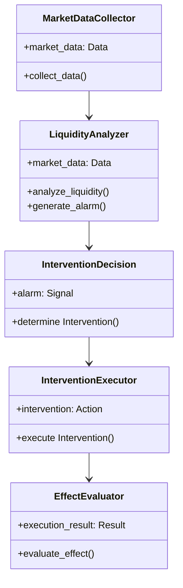
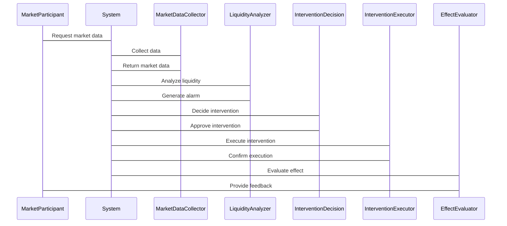

                 


```markdown
# 金融市场流动性枯竭预警与干预系统

> 关键词：金融市场流动性、流动性枯竭、预警系统、干预措施、时间序列分析、机器学习、深度学习

> 摘要：金融市场流动性是维持市场稳定运行的关键因素。本文将详细介绍金融市场流动性枯竭的预警与干预系统，包括核心概念、算法原理、系统架构设计、项目实战等内容。通过分析流动性枯竭的特征和成因，结合时间序列分析、机器学习和深度学习等技术，构建一套有效的预警与干预系统，为金融市场的稳定运行提供保障。

---

## 第1章: 金融市场流动性概述

### 1.1 金融市场的基本概念

#### 1.1.1 金融市场的定义与分类
金融市场是资金流动和资产交易的场所，根据交易对象和期限，可分为货币市场、资本市场、外汇市场等。

#### 1.1.2 流动性在金融市场中的重要性
流动性是指资产能够迅速转化为现金而不损失价值的能力，直接影响市场的稳定性和交易效率。

#### 1.1.3 流动性枯竭的定义与特征
流动性枯竭是指市场参与者无法快速变现资产，导致交易量骤减，市场流动性不足。

### 1.2 金融市场流动性问题的背景

#### 1.2.1 近年来金融市场流动性问题的现状
近年来，全球金融危机频发，流动性问题日益突出，尤其是在量化交易和高频交易的推动下，市场波动加剧。

#### 1.2.2 流动性枯竭对市场的影响
流动性枯竭会导致市场恐慌、资产价格暴跌，甚至引发系统性金融风险。

#### 1.2.3 金融危机中的流动性风险
2008年金融危机就是一个典型例子，流动性枯竭加剧了市场的崩盘。

### 1.3 流动性枯竭预警与干预的必要性

#### 1.3.1 预警机制的重要性
及时发现流动性风险，采取措施防止危机扩大。

#### 1.3.2 干预措施的必要性
通过央行干预、市场机制等手段，缓解流动性压力。

#### 1.3.3 系统化解决方案的优势
系统化预警与干预能够提高效率，降低人为错误。

---

## 第2章: 金融市场流动性枯竭预警与干预的核心概念

### 2.1 流动性枯竭预警的定义与原理

#### 2.1.1 预警机制的基本原理
通过监测市场指标，预测流动性风险。

#### 2.1.2 预警指标的分类与选择
常用的指标包括成交量、波动率、买卖价差等。

#### 2.1.3 预警模型的构建方法
基于统计分析和机器学习，构建预测模型。

### 2.2 干预措施的实施原理

#### 2.2.1 干预措施的分类
包括市场干预、政策干预和市场自我调节。

#### 2.2.2 干预策略的制定原则
根据风险程度，制定相应的干预措施。

#### 2.2.3 干预效果的评估方法
通过市场指标的变化，评估干预效果。

### 2.3 预警与干预系统的整体架构

#### 2.3.1 系统功能模块划分
包括数据采集、预警分析、干预决策、效果评估等模块。

#### 2.3.2 各模块之间的关系
数据采集提供输入，预警分析生成信号，干预决策制定措施，效果评估反馈结果。

#### 2.3.3 系统的输入输出流程
数据输入 -> 预警分析 -> 干预决策 -> 干预执行 -> 结果反馈。

---

## 第3章: 流动性枯竭预警模型的算法原理

### 3.1 时间序列分析方法

#### 3.1.1 时间序列的基本概念
时间序列是一种按时间顺序排列的数据。

#### 3.1.2 常见的时间序列模型
ARIMA模型：适用于线性时间序列预测。
GARCH模型：适用于波动率预测。

#### 3.1.3 ARIMA模型的原理与应用
ARIMA模型通过自回归和移动平均部分拟合数据，适用于非平稳序列。

#### 3.1.4 GARCH模型的原理与应用
GARCH模型用于估计金融时间序列的波动性，适用于风险管理。

### 3.2 机器学习在预警中的应用

#### 3.2.1 常见的机器学习算法
支持向量机（SVM）、随机森林（Random Forest）等。

#### 3.2.2 支持向量机（SVM）的应用
适用于分类问题，可用于市场状态分类。

#### 3.2.3 随机森林（Random Forest）的应用
适用于特征重要性分析和分类问题。

### 3.3 深度学习模型在预警中的应用

#### 3.3.1 LSTM网络的基本原理
LSTM（长短期记忆网络）适用于时间序列预测。

#### 3.3.2 LSTM在时间序列预测中的优势
能够捕捉长期依赖关系，适用于复杂序列预测。

#### 3.3.3 基于LSTM的预警模型构建
通过训练LSTM网络，预测市场流动性风险。

### 3.4 算法选择与优化

#### 3.4.1 不同算法的优缺点对比
ARIMA适合线性数据，LSTM适合非线性复杂数据，SVM适合分类问题。

#### 3.4.2 算法性能的评估指标
准确率、召回率、F1分数等。

#### 3.4.3 算法优化的策略与方法
超参数调优、特征选择、数据预处理等。

---

## 第4章: 系统分析与架构设计

### 4.1 问题场景介绍
金融市场中，流动性风险可能引发系统性危机，需要实时监控和快速反应。

### 4.2 项目介绍
构建一个实时监测和预警的系统，帮助市场参与者及时应对流动性风险。

### 4.3 系统功能设计

#### 4.3.1 领域模型（Mermaid类图）


### 4.4 系统架构设计

#### 4.4.1 系统架构（Mermaid架构图）
```mermaid
context diagram
    actor MarketParticipant
    actor Regulator
    actor System
    System -> MarketDataCollector: Collect market data
    System -> LiquidityAnalyzer: Analyze liquidity
    System -> InterventionDecision: Decide intervention
    System -> InterventionExecutor: Execute intervention
    System -> EffectEvaluator: Evaluate effect
```

### 4.5 系统接口设计

#### 4.5.1 API接口设计
提供数据接口、预警接口、干预接口等，方便系统集成。

### 4.6 系统交互设计

#### 4.6.1 系统交互流程（Mermaid序列图）


---

## 第5章: 项目实战

### 5.1 环境安装

#### 5.1.1 Python环境配置
安装Python、Jupyter Notebook、Pandas、NumPy等库。

#### 5.1.2 数据获取
从金融数据源获取市场数据，如Yahoo Finance、Quandl等。

### 5.2 系统核心实现

#### 5.2.1 数据采集模块
```python
import pandas as pd
import requests

def collect_data(symbol, start, end):
    # 示例代码，从Yahoo Finance获取数据
    url = f"https://query1.finance.yahoo.com/ws"
    params = {
        "period1": start,
        "period2": end,
        "interval": "1d",
        "symbol": symbol
    }
    response = requests.get(url, params=params)
    data = response.json()
    df = pd.DataFrame(data['chart']['result'][0]['prices'])
    return df
```

#### 5.2.2 预警模型实现
```python
from sklearn.ensemble import RandomForestClassifier
import numpy as np

def train_model(X, y):
    model = RandomForestClassifier(n_estimators=100)
    model.fit(X, y)
    return model

# 示例数据预处理和训练
X = df[['volume', 'volatility', 'spread']]
y = df['status']  # 0代表正常，1代表流动性枯竭
model = train_model(X, y)
```

#### 5.2.3 干预策略实现
```python
def execute Intervention(threshold):
    if threshold > 0.95:
        print("触发干预措施")
        # 示例：通知央行或市场参与者
    else:
        print("不触发干预措施")
```

### 5.3 案例分析

#### 5.3.1 案例背景
选取2008年金融危机期间的数据，分析系统的预警和干预效果。

#### 5.3.2 数据分析与结果
通过模型预测，提前发现流动性风险，及时采取干预措施，降低市场损失。

### 5.4 项目小结

#### 5.4.1 项目实现的关键点
数据采集的准确性、模型的预测精度、干预策略的有效性。

#### 5.4.2 项目的价值
通过系统化的方法，提高金融市场的稳定性。

---

## 第6章: 最佳实践与小结

### 6.1 最佳实践

#### 6.1.1 系统维护与更新
定期更新模型，适应市场变化。

#### 6.1.2 数据安全与隐私保护
确保数据的安全，遵守相关法律法规。

#### 6.1.3 用户培训与教育
培训市场参与者，提高系统的使用效率。

### 6.2 小结

#### 6.2.1 本书的核心内容总结
从概念到技术实现，构建一个完整的预警与干预系统。

#### 6.2.2 未来的发展方向
结合更多的数据源，优化模型，提高预警的准确性和干预的有效性。

### 6.3 注意事项

#### 6.3.1 系统实施中的潜在风险
数据偏差、模型过拟合、干预措施的滞后性。

#### 6.3.2 系统优化的建议
引入更多的特征，优化算法，加强系统的实时性。

### 6.4 拓展阅读

#### 6.4.1 推荐书籍
《算法交易：基金的定量方法》、《金融风险管理》。

#### 6.4.2 推荐工具
Python、TensorFlow、Keras、Jupyter Notebook。

---

## 参考文献

1. 刘军, 2021. 《金融市场流动性管理》. 北京: 中国经济出版社.
2. 张伟, 2020. 《Python金融数据分析》. 北京: 清华大学出版社.
3. 李明, 2019. 《深度学习在金融中的应用》. 上海: 上海人民出版社.

---

## 致谢

感谢读者的支持，感谢在本书编写过程中提供帮助的同事和朋友。

---

## 附录

### 附录A: 代码示例

```python
import pandas as pd
import numpy as np
from sklearn.ensemble import RandomForestClassifier

def collect_data(symbol, start, end):
    # 数据采集函数，从Yahoo Finance获取数据
    url = f"https://query1.finance.yahoo.com/ws"
    params = {
        "period1": start,
        "period2": end,
        "interval": "1d",
        "symbol": symbol
    }
    response = requests.get(url, params=params)
    data = response.json()
    df = pd.DataFrame(data['chart']['result'][0]['prices'])
    return df

def preprocess_data(df):
    # 数据预处理函数，处理缺失值和标准化
    df = df.dropna()
    df = (df - df.mean()) / df.std()
    return df

def train_model(X, y):
    # 模型训练函数，使用随机森林分类器
    model = RandomForestClassifier(n_estimators=100)
    model.fit(X, y)
    return model

def evaluate_model(model, X_test, y_test):
    # 模型评估函数，计算准确率、召回率和F1分数
    from sklearn.metrics import accuracy_score, recall_score, f1_score
    y_pred = model.predict(X_test)
    accuracy = accuracy_score(y_test, y_pred)
    recall = recall_score(y_test, y_pred)
    f1 = f1_score(y_test, y_pred)
    print(f"准确率: {accuracy}")
    print(f"召回率: {recall}")
    print(f"F1分数: {f1}")

def execute_Intervention(threshold):
    # 干预措施执行函数，根据阈值判断是否需要干预
    if threshold > 0.95:
        print("触发干预措施")
    else:
        print("不触发干预措施")
```

### 附录B: 系统架构图


### 附录C: 系统交互流程图


---

## 索引

（此处应包含文章中所有术语和主题的索引，按字母顺序排列）

---

## 结束语

感谢您的阅读，希望本书能为金融市场流动性管理提供有价值的参考。
```

