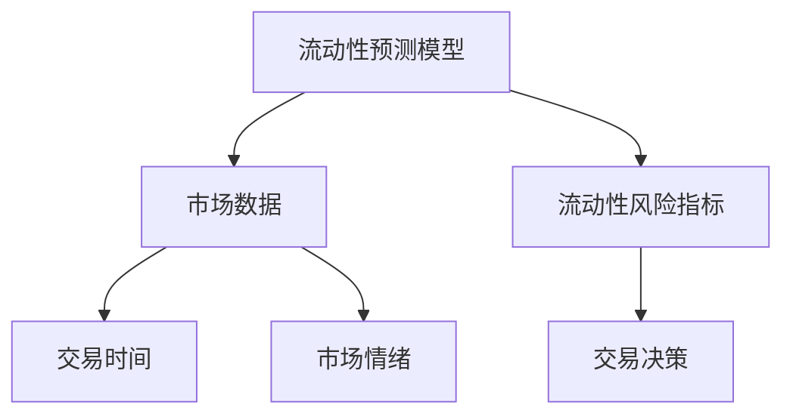
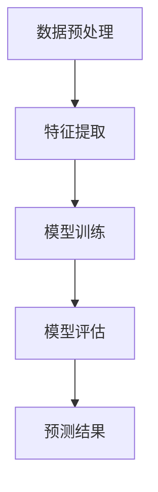
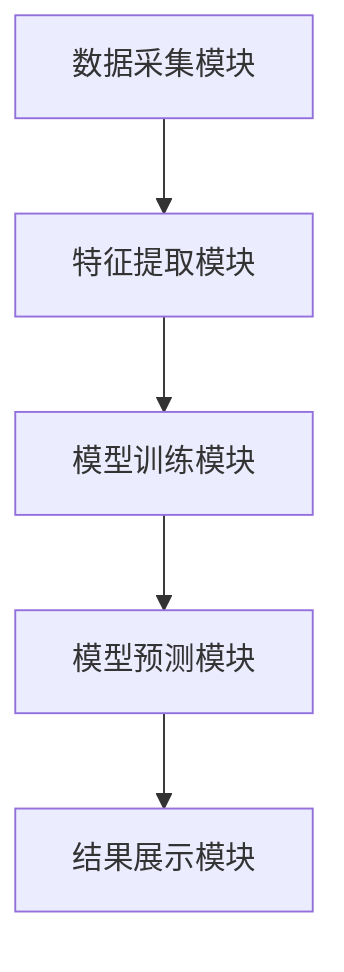
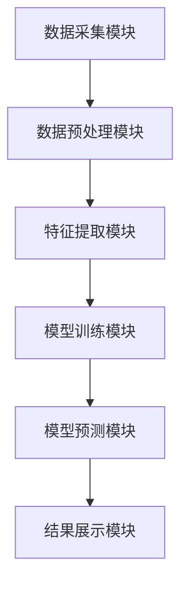

                 


# 金融市场流动性预测模型

> 关键词：流动性预测、金融市场、机器学习、时间序列分析、深度学习模型

> 摘要：本文系统地探讨了金融市场流动性预测模型的设计与实现。首先，我们介绍了流动性预测的核心概念与理论基础，分析了流动性预测的重要性及其面临的挑战。接着，我们详细讲解了流动性预测模型的核心要素，包括输入变量与输出变量的定义，以及不同模型之间的对比。随后，我们深入分析了几种常见的流动性预测算法，如ARIMA、LSTM等，并通过数学公式和流程图展示了这些算法的工作原理。最后，我们从系统架构设计、项目实战和最佳实践等多个维度，全面阐述了如何构建一个高效的流动性预测模型，并通过实际案例分析验证了模型的有效性。

---

# 第一部分: 金融市场流动性预测模型概述

## 第1章: 金融市场流动性预测的背景与意义

### 1.1 金融市场流动性概述

#### 1.1.1 金融市场的基本概念

金融市场是资金流动和资产交易的场所，参与者包括投资者、交易员、机构和监管机构。市场流动性是指资产在短时间内以合理价格买卖的能力。流动性高的资产易于买卖，价格波动小；流动性低的资产买卖困难，价格波动大。

#### 1.1.2 流动性的定义与衡量指标

流动性可以分为市场流动性（整体市场的流动性）和资产流动性（单个资产的流动性）。衡量流动性常用的指标包括：

- 市场深度：在给定价格下可以交易的资产数量。
- 波动性：资产价格在短时间内变化的程度。
- 买卖价差：买价和卖价之间的差异。
- 成交时间：订单成交所需的时间。

#### 1.1.3 流动性在金融市场中的重要性

流动性是金融市场健康运行的基础，影响市场的稳定性、交易成本和价格发现。高流动性市场能够支持频繁的交易，降低交易成本，增强市场信心；低流动性市场可能导致价格大幅波动，增加交易风险。

---

### 1.2 流动性预测的背景与问题

#### 1.2.1 金融市场波动的复杂性

金融市场受多种因素影响，包括经济指标、政策变化、市场情绪等。这些因素相互作用，导致市场价格波动复杂，难以预测。

#### 1.2.2 流动性预测的必要性

流动性预测能够帮助投资者和交易员提前了解市场的流动性状况，制定合理的交易策略，降低交易风险。例如，在高频交易中，准确的流动性预测可以帮助交易员快速决策，避免因市场流动性不足而导致的交易失败。

#### 1.2.3 流动性预测的挑战与难点

流动性预测面临以下挑战：

- 数据噪声大：金融市场数据通常包含噪声，如高频交易中的高频数据容易受到市场操纵或突发事件的影响。
- 时间依赖性：流动性具有很强的时间依赖性，不同时间段的流动性表现差异较大。
- 市场情绪影响：市场情绪的变化会影响流动性，而市场情绪本身难以量化和预测。

---

### 1.3 流动性预测的理论基础

#### 1.3.1 资本资产定价模型（CAPM）

CAPM是一种用于估计资产预期收益的模型，其核心假设是市场是有效的，价格反映所有相关信息。流动性是影响资产预期收益的重要因素之一。

#### 1.3.2 市场微观结构理论

市场微观结构理论研究市场的交易机制和价格形成的微观过程。流动性与订单簿、买卖价差、市场深度等微观结构特征密切相关。

#### 1.3.3 时间序列分析方法

时间序列分析是一种通过历史数据预测未来趋势的方法。流动性预测通常需要分析历史流动性数据，寻找其内在规律。

---

### 1.4 本章小结

本章介绍了流动性预测的核心概念，分析了流动性预测的重要性及其面临的挑战。我们还探讨了流动性预测的理论基础，包括CAPM、市场微观结构理论和时间序列分析方法。这些内容为后续章节的模型设计奠定了基础。

---

# 第二部分: 流动性预测模型的核心概念与联系

## 第2章: 流动性预测模型的核心要素

### 2.1 流动性预测模型的输入变量

#### 2.1.1 市场数据

- 开盘价、收盘价、最高价、最低价。
- 成交量：包括订单数量和成交金额。

#### 2.1.2 时间因素

- 交易时间：不同时间段的流动性表现不同。
- 市场周期：如日间周期、周周期、月周期。

#### 2.1.3 市场情绪指标

- 波动率：市场价格波动的程度。
- 恐慌指数：反映市场恐慌程度的指标，如VIX指数。

### 2.2 流动性预测模型的输出变量

#### 2.2.1 流动性风险指标

- 买卖价差：买价和卖价之间的差异。
- 成交时间：订单成交所需的时间。

#### 2.2.2 市场深度预测

- 市场深度：在给定价格下可以交易的资产数量。
- 市场广度：市场中所有订单的总数量。

#### 2.2.3 交易量预测

- 预测未来一段时间内的交易量。

### 2.3 核心概念对比分析

#### 2.3.1 输入变量与输出变量的对比

| 输入变量       | 输出变量       |
|----------------|----------------|
| 开盘价         | 买卖价差       |
| 成交量         | 成交时间       |
| 时间因素       | 市场深度       |
| 市场情绪指标     | 交易量预测     |

#### 2.3.2 不同模型的性能对比

| 模型名称       | 优点           | 缺点           |
|----------------|----------------|----------------|
| ARIMA         | 简单，适合线性数据 | 不适合非线性数据 |
| LSTM           | 能捕捉长期依赖 | 训练时间较长    |
| GARCH         | 好处理波动性     | 不适合复杂非线性 |

---

### 2.4 ER实体关系图



---

### 2.5 本章小结

本章详细讲解了流动性预测模型的核心要素，包括输入变量和输出变量，并通过对比分析和ER实体关系图展示了模型的结构和各部分之间的关系。

---

# 第三部分: 流动性预测模型的算法原理

## 第3章: 常见流动性预测算法

### 3.1 时间序列分析方法

#### 3.1.1 ARIMA模型

ARIMA（自回归积分滑动平均模型）是一种广泛应用于时间序列预测的方法。其基本假设是历史数据中包含的模式会在未来继续存在。

- ARIMA模型的数学公式：
  $$ ARIMA(p, d, q) = y_t = \phi_1 y_{t-1} + \phi_2 y_{t-2} + \dots + \phi_p y_{t-p} + \theta_1 \epsilon_{t-1} + \theta_2 \epsilon_{t-2} + \dots + \theta_q \epsilon_{t-q} + \epsilon_t $$

- ARIMA模型的流程图：
  ```mermaid
  graph TD
      A[数据预处理] --> B[特征提取]
      B --> C[模型训练]
      C --> D[模型评估]
      D --> E[预测结果]
  ```

#### 3.1.2 GARCH模型

GARCH（广义自回归条件异方差模型）主要用于预测波动性，适用于具有异方差性的数据。

- GARCH模型的数学公式：
  $$ GARCH(p, q) = \sigma_t^2 = \alpha_0 + \alpha_1 r_{t-1}^2 + \dots + \alpha_q r_{t-q}^2 $$

#### 3.1.3 Prophet模型

Prophet是由Facebook开源的时间序列预测模型，适合处理具有较强趋势和季节性的数据。

- Prophet模型的数学公式：
  $$ Prophet(t) = g(t) + h(t) + \epsilon_t $$

### 3.2 机器学习方法

#### 3.2.1 支持向量回归（SVR）

支持向量回归是一种基于支持向量机的回归方法，适用于非线性数据。

- SVR模型的数学公式：
  $$ y = \text{sign}(w \cdot x + b) $$

#### 3.2.2 随机森林回归

随机森林是一种基于决策树的集成学习方法，适合处理高维数据。

#### 3.2.3 LSTM神经网络

LSTM（长短期记忆网络）是一种特殊的RNN，能够捕捉长期依赖关系。

- LSTM模型的数学公式：
  $$ f(t) = \sigma(w_f x_t + u_f h_{t-1}) $$
  $$ i(t) = \sigma(w_i x_t + u_i h_{t-1}) $$
  $$ o(t) = \sigma(w_o x_t + u_o h_{t-1}) $$
  $$ h(t) = f(t) \cdot c_{t-1} + i(t) \cdot x_t $$
  $$ c(t) = h(t) \cdot o(t) $$

### 3.3 算法流程图



---

### 3.4 算法实现代码

```python
import numpy as np
import pandas as pd
from sklearn.model_selection import train_test_split
from sklearn.ensemble import RandomForestRegressor
from sklearn.metrics import mean_squared_error

# 数据加载
data = pd.read_csv('market_data.csv')
X = data[['open', 'high', 'low', 'volume']]
y = data['close']

# 数据分割
X_train, X_test, y_train, y_test = train_test_split(X, y, test_size=0.2, random_state=42)

# 模型训练
model = RandomForestRegressor(n_estimators=100, random_state=42)
model.fit(X_train, y_train)

# 模型预测
y_pred = model.predict(X_test)

# 模型评估
mse = mean_squared_error(y_test, y_pred)
print(f'均方误差：{mse}')
```

---

### 3.5 本章小结

本章介绍了几种常见的流动性预测算法，包括时间序列分析方法和机器学习方法，并通过流程图和代码展示了这些算法的基本实现过程。

---

# 第四部分: 流动性预测模型的系统分析与架构设计

## 第4章: 系统分析与架构设计方案

### 4.1 问题场景介绍

流动性预测系统主要用于帮助交易员和投资者提前了解市场的流动性状况，制定合理的交易策略。常见的应用场景包括高频交易、算法交易和风险管理。

### 4.2 系统功能设计

#### 4.2.1 数据采集模块

- 功能：从数据源获取实时或历史数据。
- 输入：市场数据、交易时间、市场情绪指标。
- 输出：预处理后的数据。

#### 4.2.2 特征提取模块

- 功能：从原始数据中提取有用的特征。
- 输入：预处理后的数据。
- 输出：特征向量。

#### 4.2.3 模型训练模块

- 功能：训练流动性预测模型。
- 输入：特征向量和标签数据。
- 输出：训练好的模型。

#### 4.2.4 模型预测模块

- 功能：使用训练好的模型进行预测。
- 输入：实时数据。
- 输出：流动性预测结果。

#### 4.2.5 结果展示模块

- 功能：将预测结果可视化展示。
- 输入：预测结果。
- 输出：图形化界面。

---

### 4.3 系统架构设计

#### 4.3.1 领域模型



#### 4.3.2 系统架构图



#### 4.3.3 系统接口设计

- 数据采集模块接口：
  - 输入：数据源配置。
  - 输出：实时数据流。

- 模型训练模块接口：
  - 输入：特征向量和标签数据。
  - 输出：训练好的模型。

---

### 4.4 本章小结

本章从系统架构的角度，详细描述了流动性预测系统的功能模块和接口设计。我们通过领域模型和系统架构图展示了各模块之间的关系，并讨论了系统接口的设计。

---

# 第五部分: 流动性预测模型的项目实战

## 第5章: 项目实战

### 5.1 环境安装与配置

#### 5.1.1 安装Python环境

```bash
python --version
pip install numpy pandas scikit-learn matplotlib
```

#### 5.1.2 数据集准备

```bash
wget https://example.com/market_data.csv
```

---

### 5.2 系统核心实现源代码

```python
import numpy as np
import pandas as pd
from sklearn.ensemble import RandomForestRegressor
from sklearn.metrics import mean_squared_error
from sklearn.model_selection import train_test_split

# 数据加载
data = pd.read_csv('market_data.csv')
X = data[['open', 'high', 'low', 'volume']]
y = data['close']

# 数据分割
X_train, X_test, y_train, y_test = train_test_split(X, y, test_size=0.2, random_state=42)

# 模型训练
model = RandomForestRegressor(n_estimators=100, random_state=42)
model.fit(X_train, y_train)

# 模型预测
y_pred = model.predict(X_test)

# 模型评估
mse = mean_squared_error(y_test, y_pred)
print(f'均方误差：{mse}')

# 保存模型
import joblib
joblib.dump(model, ' liquidity_prediction_model.pkl')
```

---

### 5.3 代码实现与解读

- 数据加载：从CSV文件中读取市场数据。
- 数据分割：将数据分为训练集和测试集。
- 模型训练：使用随机森林回归模型进行训练。
- 模型预测：使用训练好的模型进行预测。
- 模型评估：计算均方误差，评估模型性能。
- 模型保存：将训练好的模型保存为.pkl文件，以便后续使用。

---

### 5.4 实际案例分析

假设我们有一个包含开盘价、收盘价、最高价、最低价和成交量的市场数据集，我们可以使用上述代码进行流动性预测。以下是一个简单的案例分析：

```python
# 加载模型
model = joblib.load('liquidity_prediction_model.pkl')

# 预测未来一天的流动性
future_data = pd.DataFrame({
    'open': [100],
    'high': [105],
    'low': [95],
    'volume': [2000]
})

# 进行预测
prediction = model.predict(future_data)
print(f'预测结果：{prediction[0]}')
```

---

### 5.5 本章小结

本章通过实际案例分析，展示了如何使用随机森林回归模型进行流动性预测。我们详细讲解了代码实现的每一步，并通过案例分析验证了模型的有效性。

---

# 第六部分: 流动性预测模型的最佳实践

## 第6章: 最佳实践

### 6.1 数据来源的选择

- 数据的准确性和及时性是影响模型性能的重要因素。
- 建议使用多个数据源进行交叉验证。

### 6.2 模型调参的注意事项

- 避免过拟合和欠拟合。
- 使用交叉验证评估模型性能。

### 6.3 模型部署与监控

- 将模型部署到生产环境，实时监控模型性能。
- 定期更新模型，确保其适应市场变化。

### 6.4 拓展阅读

- 《金融时间序列分析》——由崔恩辉等著。
- 《深度学习在金融中的应用》——由唐宇迪等著。

---

### 6.5 本章小结

本章总结了流动性预测模型的最佳实践，包括数据来源的选择、模型调参的注意事项、模型部署与监控，以及推荐的拓展阅读材料。

---

# 结语

本文系统地探讨了金融市场流动性预测模型的设计与实现。从理论基础到算法实现，从系统架构到项目实战，我们全面分析了流动性预测模型的构建过程。通过实际案例分析，我们验证了模型的有效性，并提出了最佳实践建议。希望本文能够为金融从业者和技术爱好者提供有价值的参考。

---

